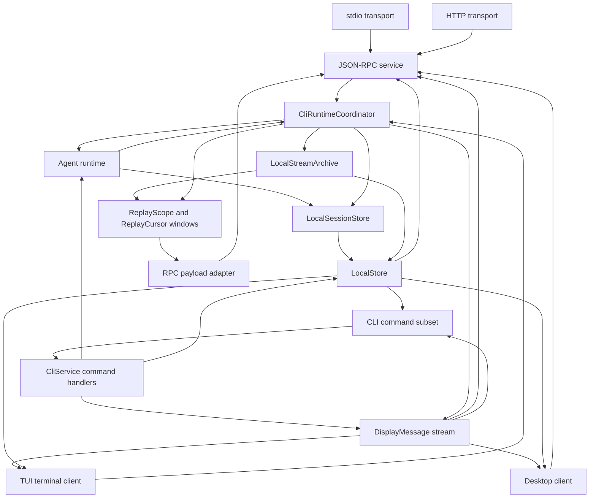
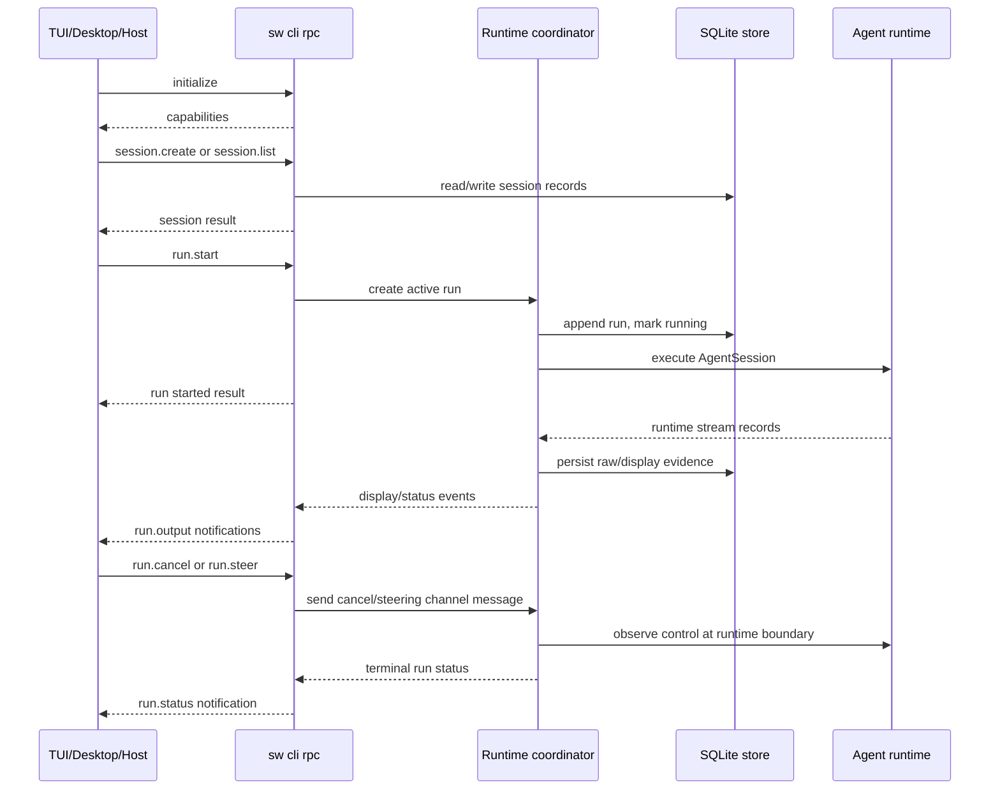
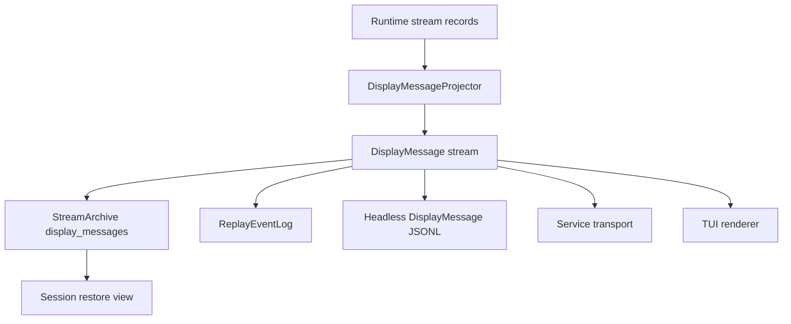

# CLI Product

The CLI Product is the first product surface for Starweaver durable execution. It makes the SDK self-hosting path concrete: a local user can run an agent, stream display-protocol events through stdio, persist display messages for session restore, and later attach richer renderers such as TUI or service-backed clients to the same event feed.

## Product Direction

Prioritize the CLI as the bootstrap product for Starweaver:

- headless agent runs through stdio
- shared configuration rooted at `~/.starweaver/config.toml`
- client UI state rooted at `~/.starweaver/tui` and `~/.starweaver/desktop`
- Starweaver JSON-RPC host protocol with stdio and HTTP local management and execution transports
- CLI commands as a shell-friendly subset over the same runtime/service handlers
- TUI as the terminal client over the runtime surface
- Desktop as the desktop client over the runtime surface
- display-protocol-first rendering
- persisted `DisplayMessage` records as the session restore source
- TUI renderers, Desktop renderers, and CLI JSONL over the same Starweaver `DisplayMessage` stream
- protocol adapters for Starweaver/AGUI event projection
- launcher-based command dispatch through `starweaver`
- short alias through `sw`
- GitHub release based install and update flow

## Command Model

Starweaver ships CLI launcher binaries:

| Binary           | Role                                                                          |
| ---------------- | ----------------------------------------------------------------------------- |
| `starweaver`     | launcher that dispatches `starweaver {command}` to the active command surface |
| `sw`             | short alias pointing to `starweaver`                                          |
| `starweaver-cli` | local agent CLI product surface                                               |
| `starweaver-rpc` | standalone JSON-RPC host process                                              |
| `starweaver-*`   | future command families loaded by the launcher convention                     |

Launcher examples:

```bash
sw
sw --help
sw -p "summarize this repository"
sw run "summarize this repository"
sw session list --output json
starweaver version
starweaver doctor
starweaver update
starweaver update cli
starweaver update --dry-run
starweaver update --force
starweaver cli -p "summarize this repository"
starweaver rpc stdio
starweaver cli rpc
starweaver cli session show <session-id>
starweaver cli session replay <session-id> --output display-jsonl
```

Dispatch rule:

```text
sw <known-cli-command> [args...] -> starweaver-cli <known-cli-command> [args...]
starweaver <unknown-command> [args...] -> exec starweaver-<unknown-command> [args...]
```

The launcher prints help when run without arguments. Built-in commands include `help`, `version`, `doctor`, and `update`. Prompt flags and known CLI commands dispatch directly to the local CLI product, so `sw -p "hello"` and `sw session list` are shortcuts for `sw cli -p "hello"` and `sw cli session list`. Unknown command families retain the external binary convention; the launcher resolves command binaries from the install directory first, then `PATH`.

## Install and Update Semantics

GitHub Release assets are component-scoped. Current release artifacts provide the CLI component.

| Component | Archive prefix                  | Installed binaries                                     | Update command                                                        |
| --------- | ------------------------------- | ------------------------------------------------------ | --------------------------------------------------------------------- |
| CLI       | `starweaver-cli-<tag>-<target>` | `starweaver`, `starweaver-cli`, `sw`, `starweaver-rpc` | `starweaver update`, `starweaver update cli`, `starweaver cli update` |

The installer reads `STARWEAVER_COMPONENTS` as a comma-separated component list. Default installs use `cli`. CLI update commands invoke the installer with `STARWEAVER_COMPONENTS=cli`.

The launcher update path checks the current CLI package version before installing. For `latest`, it compares against the selected GitHub release for the same repository override used by the installer and returns `status=up-to-date` when the selected release is not newer. For pinned `STARWEAVER_VERSION` installs, it skips only when the pinned version matches the current package version so explicit rollbacks still work. `--force` and `STARWEAVER_UPDATE_FORCE=1` bypass the skip check.

The launcher update path downloads `scripts/install.sh`, runs it through `sh` with environment variables passed through `Command::env`, and avoids shell interpolation for real updates. Dry-run output may render a shell command for copy/paste diagnostics and must shell-quote paths.

## Current Implementation Status

Current landed CLI foundations:

- `clap` command surface, launcher dispatch, `sw` alias, installer/update paths, diagnostics, setup templates, auth status/logout, profile and catalog commands
- headless prompt runs, local SQLite sessions/runs, display JSONL replay, approval/deferred commands, resume, trim, current-session pointer, and retained TUI renderer
- config parser for global/project roots, model profiles, selected environment values, tools/MCP metadata, skill/subagent directories, and unmapped metadata
- global config bootstrap under `~/.starweaver`, including `skills`, `subagents`, `tui`, and `desktop` state directories
- TUI state/render/terminal modules, active-run steering, `/help`, `/clear`, `/cost`, `/model`, `/goal`, shell passthrough, streamed tool-call rendering, process-level provider session affinity, and model choice persistence under `~/.starweaver/tui/state.json`
- JSON-RPC stdio/HTTP service with `initialize`, `shutdown`, `profile.*`, `model.*`, `config.get`, `diagnostics.get`, session management, `stream.replay`, stdio live `stream.subscribe` / `stream.unsubscribe`, non-blocking `run.start`, blocking `run.prompt`, product-shaped replay aliases, `run.await`, cancellation, steering, approvals, and deferred calls
- shared RPC protocol helpers in `starweaver-rpc-core` for JSON-RPC frame parsing, request validation, request/error envelopes, replay cursor parsing, replay results, and stream payload projection
- partial worktree parsing and run metadata support

Current implementation shape for headless execution:

- one-shot `run_prompt` renders stored `DisplayMessage` records after run completion
- RPC and TUI active runs share `CliRuntimeCoordinator`, which owns active-run registration, live display projection, raw runtime forwarding for TUI, native replay-event subscriptions, cancellation senders, and steering senders
- RPC owns protocol payload projection: the coordinator publishes scoped Starweaver replay events, while RPC maps those events to AGUI or native `DisplayMessage` payloads at the transport edge
- `LocalStore` persists sessions, runs, raw stream records, display messages, approvals, deferred calls, context state, environment state, checkpoints, replay snapshots, and current-session state; `LocalSessionStore` and `LocalStreamArchive` adapt that store to the shared `SessionStore` and `StreamArchive` contracts while exposing persisted display output as `ReplayScope` / `ReplayCursor` windows during storage convergence

Primary postponed migration gaps:

- normalized JSON output for CLI management subsets
- live stdout streaming for one-shot headless output
- deeper TUI session/task/HITL/media workflows
- startup asset seeding and config import
- shell environment isolation, shell review, media config, browser config, and OAuth refresh settings
- worktree flag semantics and session-folder import/export

## Headless CLI Mode

Headless mode is the default automation path. It runs an agent from a prompt and writes a replayable event stream to stdio.

Primary forms:

```bash
sw -p "write a short project summary"
sw --prompt "write a short project summary"
sw -p "continue from here" --session <session-id>
sw -p "continue the last session" --continue
sw run -p "write a short project summary"
sw run --session <session-id> -p "continue from here"
sw session replay <session-id> --run <run-id>
```

Session selection rules for `-p/--prompt`:

| Flag                  | Behavior                                                                             |
| --------------------- | ------------------------------------------------------------------------------------ |
| `--session <id>`      | load the selected session and append a new run with the provided prompt              |
| `--continue`          | load the most recent active or resumable session from the selected store             |
| `--new-session`       | create a fresh session even when project defaults point to an existing one           |
| `--run <run-id>`      | select the restore source run inside the selected session before appending a new run |
| `--branch-from <run>` | create a continuation run from a historical run snapshot inside the selected session |

Headless output modes:

| Mode            | Flag                               | Output contract                                                                    |
| --------------- | ---------------------------------- | ---------------------------------------------------------------------------------- |
| `display-jsonl` | default / `--output display-jsonl` | one Starweaver `DisplayMessage` JSON object per line                               |
| `agui-jsonl`    | `--output agui-jsonl`              | Starweaver/AGUI top-level event objects mapped from `DisplayMessage`               |
| `json`          | `--output json`                    | final run summary with session id, run id, status, output preview, and cursor refs |
| `silent`        | `--output silent`                  | persist session/display records and print compact final status                     |

`display-jsonl` is the Starweaver-native automation format for live output. `json` is the compact command-result format for hosts that only need the final run summary. `DisplayMessage` is the durable Starweaver wire event used by CLI output, replay archives, and restore views. `agui-jsonl` is the adapter format for consumers that expect Starweaver/AGUI top-level event objects.

The Starweaver JSON-RPC host protocol is the complete local host-control API. The CLI product exposes it through stdio and HTTP transport modes. CLI commands are the shell-friendly subset over the same service handlers. TUI is a terminal client over the same in-process runtime coordinator and local store, while Desktop applications can use the JSON-RPC host protocol as a desktop client.

Model choice is client state. `~/.starweaver/config.toml` defines shared model profiles and provider settings, while `~/.starweaver/tui/state.json` and `~/.starweaver/desktop/state.json` store the selected profile for each frontend. Headless CLI runs can still pass `--profile`; RPC `run.start` can pass an explicit `profile`/`modelProfile` or fall back to the selected profile for the supplied `client`.

## Session Affinity and Durable Sessions

The CLI separates durable local sessions from provider-routing affinity:

- Durable local session ids identify persisted `SessionStore` records, display replay, restore snapshots, approvals, deferred tools, and current-session pointers.
- Request metadata uses `starweaver.durable_session_id`, `starweaver.durable_run_id`, `cli.session_id`, and `cli.run_id` for durable trace/session correlation. Provider routing affinity is not inferred from these durable metadata keys; it must flow through `AgentContext.session_id` and typed provider settings.
- `AgentContext.session_id` is the logical provider-affinity source consumed by runtime request building.
- TUI creates a process-level `session_affinity_id` at startup and passes it through run metadata as `starweaver.session_affinity_id` for each run.
- TUI `/clear`, durable session selection, and snapshot restore do not mutate `session_affinity_id`; they affect local transcript/history state only.
- Headless CLI runs set `AgentContext.session_id` from explicit `starweaver.session_affinity_id` metadata when present. If no explicit affinity exists and no restored context affinity exists, the durable session id is used only as the runtime context affinity, not as generic provider HTTP metadata.
- Provider-specific routing is resolved through typed `ModelSettings` overlays: OpenAI prompt-cache keys, Codex OAuth session/thread headers, and opt-in Gateway `x-session-id`.

## JSON-RPC CLI Adapter

The target host-control wire contract is `06-json-rpc-host-protocol.md`. This section records how the current local product exposes standalone, CLI, stdio, and HTTP adapters and how they are wired into the CLI runtime.

The local adapter is a JSON-RPC 2.0 service with stdio and HTTP transport modes:

```bash
starweaver rpc stdio
starweaver-rpc stdio
starweaver-rpc http --host 127.0.0.1 --port 8765
starweaver cli rpc
starweaver-cli rpc
starweaver-cli rpc stdio
starweaver-cli rpc http --host 127.0.0.1 --port 8765
```

The standalone `starweaver-rpc` process owns its argv parser and starts one transport mode through the shared RPC server API. `starweaver-cli rpc` exposes the same server for CLI-managed installs and launcher compatibility. Stdio sends JSON-RPC requests on stdin, receives responses and notifications on stdout, and reads diagnostics from stderr. HTTP accepts JSON-RPC request/response calls at `POST /rpc`; live server notifications remain a stdio and future long-connection profile concern. Both transports use the same local config, profiles, tool policy, workspace binding, client state directories, runtime coordinator, and durable SQLite store as CLI commands.

Local state roots:

| Path                               | Owner                     | Purpose                                                                                        |
| ---------------------------------- | ------------------------- | ---------------------------------------------------------------------------------------------- |
| `~/.starweaver/config.toml`        | shared CLI/runtime config | default profile, provider settings, config-backed model profiles, output/HITL defaults         |
| `~/.starweaver/tools.toml`         | shared CLI/runtime config | tool policy metadata                                                                           |
| `~/.starweaver/mcp.json`           | shared CLI/runtime config | MCP server metadata                                                                            |
| `~/.starweaver/skills`             | shared catalog            | global skill definitions                                                                       |
| `~/.starweaver/subagents`          | shared catalog            | global subagent definitions                                                                    |
| `~/.starweaver/tui/state.json`     | TUI client                | selected profile and durable terminal UI state; process-level affinity is generated at startup |
| `~/.starweaver/desktop/state.json` | Desktop client            | selected profile and future desktop UI state                                                   |
| `.starweaver/config.toml`          | project config            | workspace-specific environment, trim, provider, and profile overrides                          |
| `.starweaver/state.json`           | project runtime state     | current session pointer                                                                        |

The target protocol treats JSON-RPC as the semantic protocol and stdio/HTTP as transport profiles. The current CLI adapter is the first local server implementation:

| Surface        | Role                       | Coverage                                                                                                                                        |
| -------------- | -------------------------- | ----------------------------------------------------------------------------------------------------------------------------------------------- |
| JSON-RPC stdio | local runtime API          | session management, run lifecycle, live notifications, cancellation, steering, approvals, deferred calls, replay, profiles, config, diagnostics |
| JSON-RPC HTTP  | local request/response API | session management, run lifecycle, cancellation, steering, approvals, deferred calls, replay, profiles, config, diagnostics                     |
| CLI commands   | shell-friendly subset      | scripted prompt runs, session listing/show/replay, approval/deferred decisions, diagnostics, setup, config, update                              |
| TUI            | terminal client            | interactive renderer and controls backed by the same runtime coordinator and display stream                                                     |
| Desktop        | desktop client             | graphical renderer and controls backed by the same runtime coordinator and display stream                                                       |

Current stdio framing:

- UTF-8 JSON-RPC 2.0 messages are newline-delimited; each line is one complete JSON object.
- stdout is reserved for protocol frames.
- stderr carries human-readable diagnostics, tracing setup messages, and crash reports.
- requests use standard `id`, `method`, and `params` fields.
- responses use standard `result` or `error` fields.
- notifications carry live stream events and have no `id` field.
- protocol version is returned by `initialize` and stored as a date-like string such as `2026-06-08`.

Current HTTP framing:

- `POST /rpc` carries one JSON-RPC 2.0 request object as the HTTP request body.
- Successful JSON-RPC responses use HTTP `200 OK` with an `application/json` body.
- JSON-RPC notifications without response ids use HTTP `204 No Content`.
- `GET /health` and `GET /healthz` return a lightweight health response.
- HTTP `shutdown` returns a JSON-RPC response, then stops the local HTTP accept loop.
- The unary HTTP endpoint does not stream live server notifications; HTTP clients use `run.await`, `run.status`, or `stream.replay` for progress.

The target host protocol standardizes protocol identity, features, typed params/results, structured errors, idempotency, stream subscriptions, and event projections in `06-json-rpc-host-protocol.md`.

Runtime topology:



Lifecycle:



Current implemented RPC methods:

The current CLI adapter implements canonical stream replay and subscription methods and still exposes product-shaped replay aliases while the router split continues.

| Method                | Purpose                                                                                     | Primary params                                                                             | Result                                                                   |
| --------------------- | ------------------------------------------------------------------------------------------- | ------------------------------------------------------------------------------------------ | ------------------------------------------------------------------------ |
| `initialize`          | handshake and capability discovery                                                          | `clientInfo`, optional `workspaceRoot`                                                     | `protocolVersion`, `serverInfo`, `capabilities`, selected config summary |
| `shutdown`            | graceful server shutdown                                                                    | optional `timeoutMs`                                                                       | terminal status                                                          |
| `session.create`      | create a durable local session                                                              | `profile`, `title`, `metadata`, optional `workspaceRoot`                                   | session summary                                                          |
| `session.list`        | list sessions                                                                               | `profile`, `workspace`, `status`, `limit`                                                  | session summaries                                                        |
| `session.get`         | load one session and recent runs                                                            | `sessionId`, `runs`                                                                        | session summary plus run summaries                                       |
| `session.current.get` | read current project session pointer                                                        | empty params                                                                               | current session id or null                                               |
| `session.current.set` | update current project session pointer                                                      | `sessionId`                                                                                | updated pointer                                                          |
| `session.delete`      | delete a session and retained evidence                                                      | `sessionId`                                                                                | deletion summary                                                         |
| `session.replay`      | replay persisted display messages                                                           | `sessionId`, optional `runId`, optional `cursor` or `after`                                | display messages, replay events, latest cursor, and next sequence        |
| `session.output`      | replay session output and live-tail when the transport supports notifications               | `sessionId`, optional `runId`, optional `cursor` or `after`, optional `payloadFormat`      | output events plus active subscription state                             |
| `stream.replay`       | replay persisted stream output                                                              | `sessionId`, optional `runId`, optional `cursor` or `after`                                | replay events, display messages, latest cursor, and next sequence        |
| `stream.subscribe`    | replay then subscribe to active stream output on notification-capable transports            | `sessionId`, optional `runId`, optional `cursor` or `after`, optional `subscriptionId`     | subscription id, output events, active subscription state                |
| `stream.unsubscribe`  | cancel an active stream subscription                                                        | `subscriptionId`                                                                           | unsubscribe acknowledgement                                              |
| `run.start`           | append and start a non-blocking agent run                                                   | `prompt`, session selection, `profile`/`modelProfile`, `client`, `hitl`, streaming options | `sessionId`, `runId`, `status`, `payloadFormat`                          |
| `run.prompt`          | append and run a blocking prompt                                                            | `prompt`, session selection, `profile`/`modelProfile`, `client`, `hitl`                    | compact final JSON run summary                                           |
| `run.attach`          | replay then live-tail an active or historical run when the transport supports notifications | `sessionId`, `runId`, optional `cursor` or `after`, optional `payloadFormat`               | output events plus active subscription state                             |
| `run.status`          | inspect one run                                                                             | `sessionId`, `runId`                                                                       | run summary                                                              |
| `run.cancel`          | request cancellation for an active run                                                      | `runId`, optional `reason`                                                                 | cancellation acknowledgement                                             |
| `run.steer`           | enqueue steering text for an active run                                                     | `runId`, `text`, optional `steeringId`                                                     | steering acknowledgement                                                 |
| `session.steer`       | enqueue steering text for the active run in a session                                       | `sessionId`, `text`, optional `steeringId`                                                 | steering acknowledgement with resolved `runId`                           |
| `run.await`           | wait for terminal status                                                                    | `sessionId`, `runId`, optional `timeoutMs`                                                 | terminal run summary                                                     |
| `approval.list`       | list approval records                                                                       | optional `sessionId`, optional `runId`                                                     | approval records                                                         |
| `approval.decide`     | approve or deny a pending approval                                                          | `approvalId`, `status`, optional `reason`                                                  | updated approval record                                                  |
| `deferred.list`       | list deferred tool calls                                                                    | optional `sessionId`, optional `runId`                                                     | deferred records                                                         |
| `deferred.complete`   | complete a deferred tool call                                                               | `deferredId`, JSON `result`                                                                | updated deferred record                                                  |
| `deferred.fail`       | fail a deferred tool call                                                                   | `deferredId`, `error`                                                                      | updated deferred record                                                  |
| `profile.list`        | list available profiles                                                                     | optional `client`                                                                          | profile summaries plus current client selection                          |
| `profile.get`         | load one profile                                                                            | `name`                                                                                     | profile details safe for clients                                         |
| `model.list`          | list model profiles for a client                                                            | optional `client` (`tui` or `desktop`)                                                     | profile summaries plus current selected profile                          |
| `model.current`       | read selected model profile for a client                                                    | optional `client`                                                                          | `selectedProfile`, `modelId`, client scope                               |
| `model.select`        | persist selected model profile for a client                                                 | `client`, `profile`                                                                        | updated selected profile and model id                                    |
| `config.get`          | read selected resolved config values                                                        | `key` or `keys`                                                                            | key/value map                                                            |
| `diagnostics.get`     | read runtime diagnostics                                                                    | optional sections                                                                          | diagnostics object                                                       |

Run session selection mirrors existing CLI flags:

| RPC field          | CLI equivalent           | Behavior                                                   |
| ------------------ | ------------------------ | ---------------------------------------------------------- |
| `sessionId`        | `--session <id>`         | append a run to the selected session                       |
| `continueLatest`   | `--continue`             | use the current project session, then latest local session |
| `newSession`       | `--new-session`          | create a fresh session before appending the run            |
| `restoreFromRunId` | `--run <run-id>`         | restore from a selected run before appending the run       |
| `branchFromRunId`  | `--branch-from <run-id>` | branch from a historical run snapshot                      |

Run model selection priority:

| Source                                                  | Scope                 | Priority | Notes                                                                           |
| ------------------------------------------------------- | --------------------- | -------- | ------------------------------------------------------------------------------- |
| `profile` / `modelProfile` in `run.start` params        | one run               | 1        | explicit host override, equivalent to CLI `--profile`                           |
| selected profile in `~/.starweaver/<client>/state.json` | TUI or Desktop client | 2        | used when `client` is supplied and no explicit profile is passed                |
| `general.default_profile` from resolved config          | shared config         | 3        | fallback from `~/.starweaver/config.toml`, project config, env, or CLI defaults |

`model.select` validates the profile against `profile.list` before writing frontend state. It never mutates `~/.starweaver/config.toml`; shared config owns available profiles, client state owns the current selected profile.

Live notifications:

| Method        | Params                                                              | When emitted                                           |
| ------------- | ------------------------------------------------------------------- | ------------------------------------------------------ |
| `run.started` | `sessionId`, `runId`, `status`                                      | after durable run creation and active-run registration |
| `run.output`  | `sessionId`, `runId`, `cursor`, `payloadFormat`, `payload`          | each projected display message                         |
| `run.status`  | `sessionId`, `runId`, `status`, optional `outputPreview` or `error` | running, completed, failed, cancelled                  |

The current CLI adapter defaults stream payloads to `agui`, where `payload` is a Starweaver/AGUI top-level event object mapped from the durable `DisplayMessage`. The target host protocol keeps canonical `ReplayEvent` data primary and treats AGUI as an optional projection. Payload formatting is owned by the RPC protocol edge, not by `CliRuntimeCoordinator`.

Replay cursor semantics are scope-local. `run.attach` and `session.replay` with a `runId` use `ReplayScope::run(runId)`, where event sequence values match the run-local `DisplayMessage.sequence`. `session.output` without a `runId` and `session.replay` without a `runId` use `ReplayScope::session(sessionId)`, where sequence values are assigned over the ordered session display feed. The numeric `after` parameter is a shorthand for a `ReplayCursor` in the requested scope; clients that need explicit reconnect state should send the full `cursor` object returned by `run.output` or `session.replay.latestCursor`.

Current live semantics: `run.start` returns after durable run creation and active-run registration. The final result arrives through `run.status` / `stream.status` and can also be awaited with `run.await`. Active cancellation and steering use the in-memory active-run registry, while durable run output is replayed from SQLite through `stream.replay`, `session.replay`, `session.output`, and `run.attach`. Stdio is the current notification-capable transport: its `initialize` response advertises `liveDisplay: true` and `streamSubscribe: true`, `stream.subscribe` owns explicit subscription ids, and `stream.unsubscribe` cancels active RPC forwarding threads. Unary HTTP advertises `liveDisplay: false` and `streamSubscribe: false`; HTTP clients use `run.await`, `run.status`, and `stream.replay` instead of live subscriptions. `run.prompt` remains a blocking method and returns the same compact JSON summary as `--output json` after completion.

Example stdio handshake:

```json
{"jsonrpc":"2.0","id":1,"method":"initialize","params":{"clientInfo":{"name":"desktop","version":"X.Y.Z"}}}
```

```json
{"jsonrpc":"2.0","id":1,"result":{"protocolVersion":"2026-06-08","serverInfo":{"name":"starweaver-cli","version":"X.Y.Z"},"capabilities":{"sessions":true,"runs":true,"management":true,"profiles":true,"clientModelSelection":true,"blockingRunStart":false,"blockingRunPrompt":true,"nonBlockingRunStart":true,"liveDisplay":true,"streamReplay":true,"streamSubscribe":true,"cancel":true,"steering":true,"attach":true,"defaultStreamPayload":"agui","approvals":true,"deferred":true},"config":{"globalDir":"/home/user/.starweaver","tuiStateDir":"/home/user/.starweaver/tui","desktopStateDir":"/home/user/.starweaver/desktop","defaultProfile":"general"}}}
```

Unary HTTP returns the same method surface for request/response calls but sets `liveDisplay` and `streamSubscribe` to `false` in `initialize`.

Example model selection:

```json
{"jsonrpc":"2.0","id":2,"method":"model.select","params":{"client":"tui","profile":"coding"}}
```

```json
{"jsonrpc":"2.0","id":2,"result":{"client":"tui","selectedProfile":"coding","modelId":"openai:gpt-5"}}
```

Example run start:

```json
{"jsonrpc":"2.0","id":3,"method":"run.start","params":{"prompt":"summarize this repository","newSession":true,"client":"tui","stream":{"payloadFormat":"agui"}}}
```

```json
{"jsonrpc":"2.0","id":3,"result":{"sessionId":"session_...","runId":"run_...","status":"running","payloadFormat":"agui"}}
```

Example live event:

```json
{"jsonrpc":"2.0","method":"run.output","params":{"sessionId":"session_...","runId":"run_...","cursor":{"scope":"run:run_...","sequence":3},"payloadFormat":"agui","payload":{"type":"TEXT_MESSAGE_CHUNK","messageId":"run_...","delta":"Hello"}}}
```

CLI commands remain a subset/facade over the same handlers:

| CLI command                             | RPC equivalent                           | Purpose                          |
| --------------------------------------- | ---------------------------------------- | -------------------------------- |
| `run -p ... --output display-jsonl`     | shared prompt run and display projection | shell-friendly foreground run    |
| `run --output json`                     | shared prompt run with compact summary   | compact final run summary        |
| `session list --output json`            | `session.list`                           | scripted session discovery       |
| `session show --output json`            | `session.get`                            | scripted session inspection      |
| `session replay --output display-jsonl` | `session.replay`                         | scripted replay export           |
| `approval * --output json`              | `approval.*`                             | scripted HITL decisions          |
| `deferred * --output json`              | `deferred.*`                             | scripted deferred-tool decisions |

TUI is the terminal client over the runtime coordinator. It calls the coordinator in-process, receives raw `AgentStreamRecord` values for terminal state updates, and shares the same session store, run lifecycle preparation, cancellation, and steering infrastructure as RPC without launching through the JSON-RPC stdio server.

Implementation impact on the current CLI:

- add `CliCommand::Rpc(RpcCommand)` and route it through `run_from_env` so the RPC server can own stdin/stdout directly
- keep `command_output` for shell-friendly one-shot commands and tests
- introduce `starweaver-rpc-core` for JSON-RPC frame parsing/request validation plus a `rpc` module with request dispatch, model selection methods, local transport handling, and stderr diagnostics
- introduce a `CliRuntimeCoordinator` shared by RPC and TUI active runs
- split prompt execution into prepare, run, complete, and fail steps so product surfaces can share run lifecycle code without routing through each other
- project live runtime records into `DisplayMessage` values, wrap them in scoped replay events, and preserve raw runtime records for TUI state updates
- keep raw `AgentStreamRecord` capture for debugging, replay evidence, and TUI state updates
- maintain an active-run registry keyed by `runId` with cancellation sender, steering sender, status, live display messages, and stream subscribers
- expose management methods through RPC first, then map CLI command subset onto the same service handlers
- reuse `LocalStore` methods for session/approval/deferred management, expose shared lifecycle and replay through `LocalSessionStore`, `LocalStreamArchive`, and `ReplayScope` / `ReplayCursor` windows, then converge concrete storage calls onto `starweaver-storage` adapters when the CLI persistence migration lands

Implemented build slices and target cleanup:

1. Protocol shell: `sw cli rpc`, `initialize`, `shutdown`, newline JSON-RPC framing tests, stderr diagnostics contract.
2. Management API: `session.create`, `session.list`, `session.get`, current-session pointer methods, `session.replay`, `profile.*`, `model.*`, `config.get`, `diagnostics.get`.
3. Run lifecycle: shared prompt preparation/execution/completion, blocking `run.prompt`, non-blocking `run.start`, session selection, and client-state model selection.
4. Live display: shared runtime coordinator, non-blocking active-run registry, `run.output`, terminal `run.status` notification, AGUI/default payload projection, `session.output`, and `run.attach`.
5. Active control: `run.cancel`, `run.steer`, `session.steer`, `approval.*`, `deferred.*`, `run.await`.
6. CLI facade: normalize `--output json`, keep `display-jsonl` run/replay streams, and map command handlers onto the same runtime service methods.
7. TUI client migration: route TUI active runs through the in-process coordinator while preserving the retained terminal renderer.
8. Desktop client: consume the standardized host protocol, display stream, and replay/subscription semantics from `06-json-rpc-host-protocol.md`.

## Display Protocol as the UI Boundary

All user-facing run output should flow through `starweaver-stream` display and replay contracts.



The CLI headless renderer should write `DisplayMessage` records as they arrive and flush each JSONL line. Service transports can wrap the same records in transport frames. TUI and restore views consume the same records into renderer-specific view state. The current implementation persists and replays display messages, while live headless stdout streaming remains a migration work item.

## Session Restore from Display Messages

Session restore should use persisted `display_messages` as the primary UI reconstruction source.

Restore flow:

1. resolve session and latest/head run through `SessionStore`
2. load compact run/session projection
3. load persisted `display_messages` after the requested cursor from `StreamArchive`
4. rebuild the visible conversation through the selected renderer
5. resume the agent with input parts, context state, checkpoint refs, and cursor refs when execution continuation is requested
6. continue writing new display messages to the same run or a new run based on command mode

Session restore and replay commands:

```bash
sw session show <session-id>
sw session replay <session-id> --after <cursor>
sw session replay <session-id> --run <run-id> --output display-jsonl
```

## AGUI Compatibility Path

`DisplayMessage` is the Starweaver wire event. It carries AGUI-style lifecycle event names in the serialized `type` field and Starweaver extensions through durable ids, trace context, visibility, metadata, and structured payloads. Starweaver/AGUI projection is an adapter that maps `DisplayMessage` into top-level protocol events such as `RUN_STARTED`, `TEXT_MESSAGE_CHUNK`, `TOOL_CALL_CHUNK`, and `TOOL_CALL_RESULT`.

Starweaver mapping layers:

| Layer                        | Input                 | Output                                 |
| ---------------------------- | --------------------- | -------------------------------------- |
| `DisplayMessageProjector`    | runtime stream record | Starweaver `DisplayMessage`            |
| `ReplayCompactionBuffer`     | `DisplayMessage`      | compact snapshot for restore/history   |
| `HeadlessDisplayJsonlOutput` | `DisplayMessage`      | one JSON object per stdio line         |
| service transport adapter    | `DisplayMessage`      | service/client frame with same payload |

## Local Persistence Direction

CLI local persistence should converge on `starweaver-storage` for shared records:

- session records
- run records
- raw stream records
- display messages
- replay snapshots
- approval and deferred records
- migration status

The CLI can keep product-specific config and cache files in its own config directories while relying on shared storage adapters for session/stream durability.

## Acceptance Gates

```bash
cargo test -p starweaver-cli --locked
make scripts-check
make install-script-check
make docs-check
```

Full repository validation:

```bash
make ci
```
