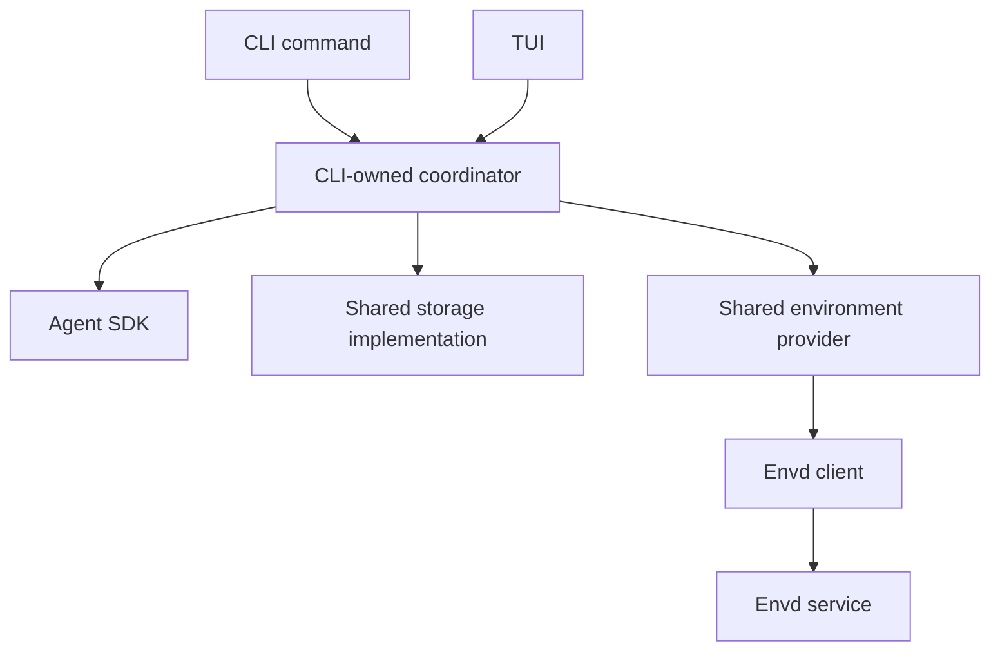
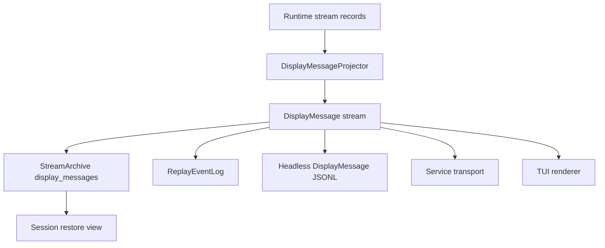

# CLI Product

The CLI product is an independent local product surface for Starweaver durable execution. It embeds the Agent SDK, owns its command and TUI application coordination, can connect directly to envd, streams display-protocol events through stdio, and persists display messages for session restore.

The normative product/process boundary is `00-product-boundaries.md`. The CLI/TUI product is not an RPC frontend and does not share product coordination, handlers, configuration, or lifecycle state with `starweaver-rpc`.

## Product Direction

Prioritize the CLI as the bootstrap product for Starweaver:

- headless agent runs through stdio
- shared configuration rooted at `~/.starweaver/config.toml`
- TUI client state rooted at `~/.starweaver/tui`
- CLI-owned environment attachment and active-mount controls
- CLI commands and TUI interactions over CLI-owned application coordination
- direct local and remote envd connectivity through shared environment abstractions
- TUI as the terminal interface of the CLI product
- async-only model-visible subagent delegation under a TUI-lifetime supervisor
- query-only model access to the selected CLI session store
- display-protocol-first rendering
- persisted `DisplayMessage` records as the session restore source
- TUI renderers and CLI JSONL over the same Starweaver `DisplayMessage` stream
- protocol adapters for Starweaver/AGUI event projection
- launcher-based command dispatch through `starweaver`
- short alias through `sw`
- GitHub release based install and update flow

## Command Model

Starweaver ships CLI launcher binaries:

| Binary           | Role                                                                          |
| ---------------- | ----------------------------------------------------------------------------- |
| `starweaver`     | launcher that dispatches `starweaver {command}` to the active command surface |
| `sw`             | short alias pointing to `starweaver`                                          |
| `starweaver-cli` | local agent CLI product surface                                               |
| `starweaver-rpc` | standalone JSON-RPC host process                                              |
| `starweaver-*`   | future command families loaded by the launcher convention                     |

Launcher examples:

```bash
sw
sw --help
sw -p "summarize this repository"
sw run "summarize this repository"
sw session list --output json
starweaver version
starweaver doctor
starweaver update
starweaver update cli
starweaver update --dry-run
starweaver update --force
starweaver cli -p "summarize this repository"
starweaver rpc stdio
starweaver cli session show <session-id>
starweaver cli session replay <session-id> --output display-jsonl
```

Dispatch rule:

```text
sw <known-cli-command> [args...] -> starweaver-cli <known-cli-command> [args...]
starweaver <unknown-command> [args...] -> exec starweaver-<unknown-command> [args...]
```

The launcher prints help when run without arguments. Built-in commands include `help`, `version`, `doctor`, and `update`. Prompt flags and known CLI commands dispatch directly to the local CLI product, so `sw -p "hello"` and `sw session list` are shortcuts for `sw cli -p "hello"` and `sw cli session list`. Unknown command families retain the external binary convention; the launcher resolves command binaries from the install directory first, then `PATH`.

## Install and Update Semantics

GitHub Release assets are component-scoped. Current release artifacts provide the CLI component.

| Component | Archive prefix                  | Installed binaries                                     | Update command                                                        |
| --------- | ------------------------------- | ------------------------------------------------------ | --------------------------------------------------------------------- |
| CLI       | `starweaver-cli-<tag>-<target>` | `starweaver`, `starweaver-cli`, `sw`, `starweaver-rpc` | `starweaver update`, `starweaver update cli`, `starweaver cli update` |

The installer reads `STARWEAVER_COMPONENTS` as a comma-separated component list. Default installs use `cli`. CLI update commands invoke the installer with `STARWEAVER_COMPONENTS=cli`.

The launcher update path checks the current CLI package version before installing. For `latest`, it compares against the selected GitHub release for the same repository override used by the installer and returns `status=up-to-date` when the selected release is not newer. For pinned `STARWEAVER_VERSION` installs, it skips only when the pinned version matches the current package version so explicit rollbacks still work. `--force` and `STARWEAVER_UPDATE_FORCE=1` bypass the skip check.

The launcher update path downloads `scripts/install.sh`, runs it through `sh` with environment variables passed through `Command::env`, and avoids shell interpolation for real updates. Dry-run output may render a shell command for copy/paste diagnostics and must shell-quote paths.

## Current Implementation Status

Current landed CLI foundations:

- `clap` command surface, launcher dispatch, `sw` alias, installer/update paths, diagnostics, setup templates, auth status/logout, profile and catalog commands
- headless prompt runs, local SQLite sessions/runs, display JSONL replay, approval/deferred commands, resume, trim, current-session pointer, and retained TUI renderer
- config parser for global/project roots, model profiles, selected environment values, tools/MCP metadata, skill/subagent directories, and unmapped metadata
- global config bootstrap under `~/.starweaver`, including `skills`, `subagents`, and `tui` state directories
- responsive TUI state/render/terminal modules, active-run steering, session restore, inline durable HITL decisions, `/help`, `/clear`, `/cost`, `/display`, `/model`, `/session`, `/goal`, asynchronous environment-backed bang-shell execution, streamed tool-call rendering, process-level provider session affinity, and model/display persistence under `~/.starweaver/tui/state.json`
- partial worktree parsing and run metadata support

Current implementation shape for headless execution:

- one-shot `run_prompt` renders stored `DisplayMessage` records after run completion
- CLI and TUI active runs use `CliRuntimeCoordinator`, which is private to the CLI product and owns active-run registration, bounded live display projection, bounded raw runtime forwarding for TUI, cancellation senders, steering senders, background-subagent completion wake-up, and bounded shutdown
- TUI bang-shell execution uses the selected `ProcessShellProvider`, a service-owned worker, bounded event delivery and output capture, process-tree cancellation, and bounded worker cleanup; it never launches an untracked `std::process::Command` from UI state
- CLI and TUI HITL continuation resolves the source from the durable session's active `Waiting` run or a failed pre-start continuation lineage, acquires the shared exclusive `HitlResumeClaim` before allocating a continuation run, marks it started before model/tool execution, and has `LocalStore` consume the claim and transition the waiting source through `RelatedRunUpdate` in the same atomic evidence commit as the continuation; unresolved records and active waiting-continuation lineages block ordinary prompt admission, terminal-head resume stays on the normal continuation path, queued TUI prompts have explicit retry/reconcile transitions, and TUI refresh identity survives transient reload failures
- `LocalStore` persists sessions, runs, raw stream records, display messages, approvals, deferred calls, context state, environment state, checkpoints, replay snapshots, and current-session state; `LocalSessionStore` and `LocalStreamArchive` adapt that store to the shared `SessionStore` and `StreamArchive` contracts while exposing persisted display output as `ReplayScope` / `ReplayCursor` windows during storage convergence

Primary postponed migration gaps:

- normalized JSON output for CLI management subsets
- live stdout streaming for one-shot headless output
- deeper TUI media workflows and grant-gated agent session mutation workflows
- startup asset seeding and config import
- active-run environment mount/unmount/list controls and lifecycle stream projection
- shell environment isolation, shell review, media config, browser config, and OAuth refresh settings
- worktree flag semantics and session-folder import/export

## Headless CLI Mode

Headless mode is the default automation path. It runs an agent from a prompt and writes a replayable event stream to stdio.

Primary forms:

```bash
sw -p "write a short project summary"
sw --prompt "write a short project summary"
sw -p "continue from here" --session <session-id>
sw -p "continue the last session" --continue
sw run -p "write a short project summary"
sw run --session <session-id> -p "continue from here"
sw session replay <session-id> --run <run-id>
```

Session selection rules for `-p/--prompt`:

| Flag                  | Behavior                                                                             |
| --------------------- | ------------------------------------------------------------------------------------ |
| `--session <id>`      | load the selected session and append a new run with the provided prompt              |
| `--continue`          | load the most recent active or resumable session from the selected store             |
| `--new-session`       | create a fresh session even when project defaults point to an existing one           |
| `--run <run-id>`      | select the restore source run inside the selected session before appending a new run |
| `--branch-from <run>` | create a continuation run from a historical run snapshot inside the selected session |

Headless output modes:

| Mode            | Flag                               | Output contract                                                                    |
| --------------- | ---------------------------------- | ---------------------------------------------------------------------------------- |
| `display-jsonl` | default / `--output display-jsonl` | one Starweaver `DisplayMessage` JSON object per line                               |
| `agui-jsonl`    | `--output agui-jsonl`              | Starweaver/AGUI top-level event objects mapped from `DisplayMessage`               |
| `json`          | `--output json`                    | final run summary with session id, run id, status, output preview, and cursor refs |
| `silent`        | `--output silent`                  | persist session/display records and print compact final status                     |

`display-jsonl` is the Starweaver-native automation format for live output. `json` is the compact command-result format for hosts that only need the final run summary. `DisplayMessage` is the durable Starweaver wire event used by CLI output, replay archives, and restore views. `agui-jsonl` is the adapter format for consumers that expect Starweaver/AGUI top-level event objects.

Model choice is CLI/TUI client state. `~/.starweaver/config.toml` defines available model profiles, envd profiles, and provider settings, while `~/.starweaver/tui/state.json` stores the selected TUI model profile. Headless CLI runs can pass `--profile`. RPC configuration and client state are owned separately by the RPC product.

Environment mount choice is CLI run state. `local` is the reserved mount id for the configured local Starweaver workspace. Interactive TUI startup can materialize `local` plus enabled envd profiles so the run can see several environments. CLI/TUI resolves these providers directly through shared environment and envd client abstractions; it does not route attachment operations through the Starweaver host RPC product.

## Session Affinity and Durable Sessions

The CLI separates durable local sessions from provider-routing affinity:

- Durable local session ids identify persisted `SessionStore` records, display replay, restore snapshots, approvals, deferred tools, and current-session pointers.
- Request metadata uses `starweaver.durable_session_id`, `starweaver.durable_run_id`, `cli.session_id`, and `cli.run_id` for durable trace/session correlation. Provider routing affinity is not inferred from these durable metadata keys; it must flow through `AgentContext.session_id` and typed provider settings.
- `AgentContext.session_id` is the logical provider-affinity source consumed by runtime request building.
- TUI creates a process-level `session_affinity_id` at startup and passes it through run metadata as `starweaver.session_affinity_id` for each run.
- TUI `/clear`, durable session selection, and snapshot restore do not mutate `session_affinity_id`. `/clear` first detaches the durable current-session pointer, then clears conversation-scoped transcript, prompt history, composer, panel, and run state while preserving process-level model/display policy and cumulative usage.
- Interactive background-subagent supervisors, completion callbacks, and pending wake queues are keyed by durable session id. `/clear` selects a fresh scope rather than cancelling the detached session's work; an old scope cannot wake the fresh context and becomes eligible again only when that durable session is explicitly reloaded.
- Headless CLI runs set `AgentContext.session_id` from explicit `starweaver.session_affinity_id` metadata when present. If no explicit affinity exists and no restored context affinity exists, the durable session id is used only as the runtime context affinity, not as generic provider HTTP metadata.
- Provider-specific routing is resolved through typed `ModelSettings` overlays: OpenAI prompt-cache keys, Codex OAuth session/thread headers, and opt-in Gateway `x-session-id`.

## CLI and TUI Application Coordination

CLI commands and TUI interactions execute through CLI-owned application coordination. `CliRuntimeCoordinator` is a private product implementation detail; it is not a shared host service and is not consumed by `starweaver-rpc`.



The CLI product may share these lower-level abstractions with the standalone RPC product:

- Agent SDK construction and run lifecycle helpers;
- session, stream, replay, and atomic storage contracts;
- display and AGUI projection helpers;
- environment providers, run bindings, and envd clients;
- protocol-neutral conformance fixtures.

It must not share product command dispatch, active-run registries, client state, authorization, or transport lifecycle with RPC. Shared helpers that currently carry CLI or RPC names must move to the lower owning crate before reuse.

### Envd Connectivity

CLI/TUI resolves local, virtual, composite, and envd-backed providers directly. Envd may run in-process through `LocalEnvd`, as a child stdio service, or at an authenticated HTTP endpoint. Selection and mount state belong to the CLI run and are translated into one SDK-facing environment provider.

The standalone RPC product performs the same kind of resolution independently. The products may use the same `EnvironmentProvider` factories and `EnvdRpcClient`, but they do not share attachment registries or active-run mount state.

### Standalone RPC Packaging

The `starweaver` launcher may dispatch `starweaver rpc ...` to the separately installed `starweaver-rpc` binary. This is process dispatch only and must not introduce a Rust dependency from CLI to RPC or from RPC to CLI.

Legacy `starweaver-cli rpc` and `starweaver cli rpc` forms may exist only during a deprecation window as external-process launchers. They must not host RPC handlers in the CLI process and should be removed after standalone migration is complete.

### Agent-Facing Session Query

CLI/TUI injects a narrow query-only session capability into its agent. The model can list/search sessions, inspect bounded session/run summaries, and replay sanitized user-visible display messages from the selected CLI store. Search is conditional on the optional provider; list/get/replay remain available without it.

The CLI agent cannot create, update, delete, switch, resume, steer, interrupt, or trim sessions/runs through this bundle. Human CLI commands remain separate CLI-owned workflows and can retain their existing explicit mutation/confirmation behavior. Query results do not implicitly change current session, model selection, workspace, or transcript.

The adapter applies CLI-owned namespace/workspace policy and never routes through RPC. Full query schemas, projection safety, and product asymmetry are specified in `08-agent-session-management.md`.

### Async Subagent Product Profile

Interactive TUI uses the async-only model-visible delegation profile from `../sdk/06-async-subagent-execution.md`: `delegate` returns immediately, the blocking backend is hidden, and the TUI-lifetime supervisor owns task/control handles, per-attempt results, completion wake-up, and bounded shutdown.

One-shot headless CLI retains blocking delegation because the process cannot promise detached lifetime; worker mode exposes no subagent delegation. Foreground-turn cancellation and workflow shutdown remain distinct so pending child results cannot wake a just-cancelled turn or leak into a different selected session.

### CLI/TUI Acceptance

- Headless CLI and TUI tests link no `starweaver-rpc` implementation.
- CLI/TUI can run against local providers and authenticated envd endpoints without starting the Starweaver host RPC server.
- CLI/TUI sessions, replay, cancellation, steering, and approval behavior use shared contracts while retaining CLI-owned application state.
- CLI model tools expose session query only; mutation/control definitions and handles are absent and guessed calls fail closed.
- TUI async subagent results return to their original supervisor/session scope, parent continuations are serialized, and shutdown leaves no detached child tasks.
- The CLI manifest does not depend on `starweaver-rpc`; any optional use of `starweaver-rpc-core` is limited to product-neutral projection or client contracts.

## Display Protocol as the UI Boundary

All user-facing run output should flow through `starweaver-stream` display and replay contracts.



The CLI headless renderer should write `DisplayMessage` records as they arrive and flush each JSONL line. Service transports can wrap the same records in transport frames. TUI and restore views consume the same records into renderer-specific view state. The current implementation persists and replays display messages, while live headless stdout streaming remains a migration work item.

## Session Restore from Display Messages

Session restore should use persisted `display_messages` as the primary UI reconstruction source.

Restore flow:

1. resolve session and latest/head run through `SessionStore`
2. load compact run/session projection
3. load persisted `display_messages` after the requested cursor from `StreamArchive`
4. rebuild the visible conversation through the selected renderer
5. resume the agent with input parts, context state, checkpoint refs, and cursor refs when execution continuation is requested
6. continue writing new display messages to the same run or a new run based on command mode

Session restore and replay commands:

```bash
sw session show <session-id>
sw session replay <session-id> --after <cursor>
sw session replay <session-id> --run <run-id> --output display-jsonl
```

## AGUI Compatibility Path

`DisplayMessage` is the Starweaver wire event. It carries AGUI-style lifecycle event names in the serialized `type` field and Starweaver extensions through durable ids, trace context, visibility, metadata, and structured payloads. Starweaver/AGUI projection is an adapter that maps `DisplayMessage` into top-level protocol events such as `RUN_STARTED`, `TEXT_MESSAGE_CONTENT`, `TOOL_CALL_ARGS`, `TOOL_CALL_RESULT`, and the Starweaver extension `HOST_EVENT`. Environment lifecycle replay records project to `HOST_EVENT` display messages, not text chunks.

Starweaver mapping layers:

| Layer                        | Input                 | Output                                 |
| ---------------------------- | --------------------- | -------------------------------------- |
| `DisplayMessageProjector`    | runtime stream record | Starweaver `DisplayMessage`            |
| `ReplayCompactionBuffer`     | `DisplayMessage`      | compact snapshot for restore/history   |
| `HeadlessDisplayJsonlOutput` | `DisplayMessage`      | one JSON object per stdio line         |
| service transport adapter    | `DisplayMessage`      | service/client frame with same payload |

## Local Persistence Direction

CLI local persistence should converge on `starweaver-storage` for shared records:

- session records
- run records
- raw stream records
- display messages
- replay snapshots
- approval and deferred records
- migration status

The CLI can keep product-specific config and cache files in its own config directories while relying on shared storage adapters for session/stream durability.

## Acceptance Gates

```bash
cargo test -p starweaver-cli --locked
make scripts-check
make install-script-check
make docs-check
```

Full repository validation:

```bash
make ci
```
