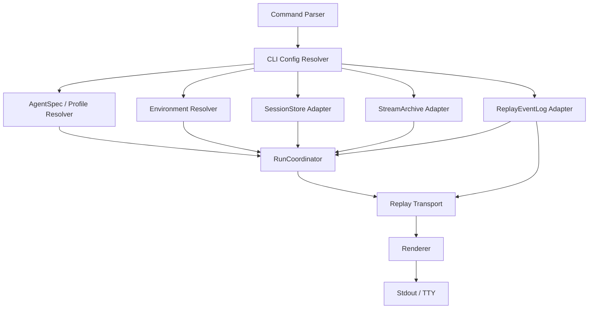
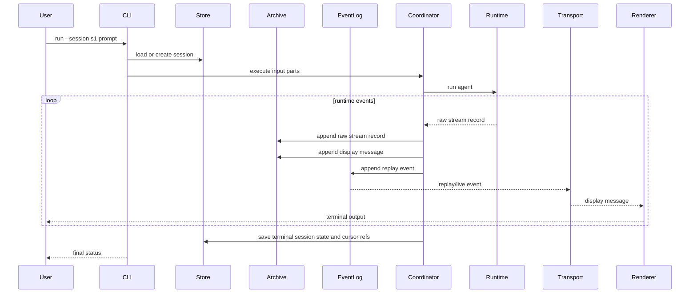

# CLI Product

The CLI Product is a user-facing assembly over the SDK, environment providers, shared session storage contracts, shared stream protocol contracts, and durable runtime services. It validates local developer workflows and provides a concrete product surface for sessions, approvals, diagnostics, replay inspection, and profile-driven runs.

The CLI should be built after reusable `SessionStore`, `ReplayEventLog`, `StreamArchive`, replay transport, display-message projection, and compaction contracts are available. CLI configuration, command parsing, terminal rendering, and local defaults belong to `starweaver-cli`.

## Product Scope

- local prompt runs
- model and provider profile configuration
- project/global config
- environment provider binding
- filesystem and shell tool bundles
- session create/list/resume/inspect
- approval prompts
- stream rendering
- JSONL display-message output
- replay and diagnostics commands
- docs and examples for local usage

## CLI Assembly Shape



The parser maps argv into command intents. The command executor assembles session storage and stream protocol components from CLI configuration. The renderer maps replayed display messages and command results into terminal output.

## Module Split

Suggested `starweaver-cli` module boundaries:

| Module        | Responsibility                                                                                                    |
| ------------- | ----------------------------------------------------------------------------------------------------------------- |
| `args`        | parse argv into typed command intents                                                                             |
| `config`      | resolve global/project config, env vars, defaults, renderer mode, local store paths, and stream backend selection |
| `profiles`    | load `AgentSpec` and host registry references                                                                     |
| `environment` | resolve local, virtual, sandbox, and process providers                                                            |
| `storage`     | open `SessionStore` adapters supplied by shared session/Claw services                                             |
| `stream`      | open `StreamArchive`, `ReplayEventLog`, and replay transport adapters for local tail, JSONL, or service SSE       |
| `commands`    | execute command intents through shared services                                                                   |
| `render`      | render display messages, traces, diagnostics, errors, and JSONL                                                   |
| `approval`    | terminal approval prompts and decision submission                                                                 |

`starweaver-cli/src/main.rs` should stay thin: parse, resolve config, execute command, render output, and return exit code.

## CLI-owned Configuration

CLI config should cover product-local choices:

- default profile path
- default session store path
- default stream archive path when local stream history is persisted separately
- default replay event-log backend
- default replay transport backend
- renderer mode: plain, JSONL, interactive, trace
- environment provider selection
- approval prompt behavior
- diagnostics verbosity
- command aliases and output preferences

Shared session storage semantics stay in `starweaver-session`. Shared stream protocol semantics stay in `starweaver-stream`. Claw provides concrete local and service adapters. CLI config selects adapters and renderers.

## Display Message Contract

CLI user output should flow through `DisplayMessage` for runs, replay, approvals, and inspect views.

Renderer inputs:

- replay transport stream of `DisplayMessage` events
- compact replay snapshots loaded from `StreamArchive` or `ReplayEventLog`
- compact run/session trace projections loaded from `SessionStore`
- diagnostics records
- command errors

Renderer outputs:

- plain deterministic text for tests
- interactive terminal text with status and tool blocks
- JSONL records for automation
- compact tables for inspect/list commands

Renderer variants:

| Renderer              | Use case                                                                 |
| --------------------- | ------------------------------------------------------------------------ |
| `PlainRenderer`       | deterministic tests and simple terminals                                 |
| `JsonRenderer`        | automation, logs, and debugging                                          |
| `InteractiveRenderer` | streaming terminal UX with status, tool blocks, approvals, and subagents |
| `TraceRenderer`       | session/run inspect summaries                                            |

## Command Intents

Initial command families:

```text
starweaver-cli run [--profile <path>] [--session <id>] [--store <path>] [--stream <kind>] [--transport <kind>] [--json] <prompt>
starweaver-cli session create [--profile <path>] [--store <path>]
starweaver-cli session list [--store <path>] [--json]
starweaver-cli session resume <session-id> [--store <path>] [--stream <kind>] [--transport <kind>] [--json]
starweaver-cli session inspect <session-id> [--store <path>] [--json]
starweaver-cli session replay <session-id> <run-id> [--after <cursor>] [--stream <kind>] [--transport <kind>] [--json]
starweaver-cli config get <key>
starweaver-cli config set <key> <value>
starweaver-cli tools list [--profile <path>] [--json]
starweaver-cli diagnostics [--json]
starweaver-cli replay-check
```

Typed command intent examples:

```rust
pub enum CliCommand {
    Run(RunCommand),
    Session(SessionCommand),
    Config(ConfigCommand),
    Tools(ToolsCommand),
    Diagnostics(DiagnosticsCommand),
    ReplayCheck,
    Version,
}
```

## Storage and Stream Resolution

CLI session storage resolution should support:

1. explicit `--store <path>`
2. project `.starweaver/sessions.sqlite`
3. user config directory session store
4. in-memory store for tests and ephemeral runs
5. service-backed store when targeting a remote Claw instance

CLI stream resolution should support:

1. in-memory replay event log for local runs
2. local `StreamArchive` colocated with the SQLite session store
3. JSONL stdout for automation
4. SSE client for service-backed sessions
5. future Redis Stream-backed replay through the shared event-log trait

The CLI should open `SessionStore`, `StreamArchive`, `ReplayEventLog`, and replay transport adapters, then use shared command services. User-facing output reads compact projections and display messages through shared APIs.

## Run Flow



## Approval UX

The CLI should present approvals from `DisplayMessageKind::ApprovalRequested` and submit decisions through the same control path used by service APIs.

Approval surfaces:

- shell execution
- file writes and edits
- network access
- destructive actions
- long-running background processes
- deferred tool calls

Approval decisions become durable session records and display messages.

## Session Inspect

`session inspect` should read compact projections from `SessionStore` and cursor ranges from stream contracts.

Suggested plain output fields:

- session id
- profile
- status
- active run id
- head success run id
- latest run id
- trace id
- environment binding
- checkpoint count
- display message count
- replay cursor range
- usage summary

JSON output should return the same data as structured fields.

## Diagnostics

Diagnostics should expose:

- selected model and provider profile
- active tool bundles
- environment provider summary
- session store backend and path
- stream archive backend and path
- replay event-log backend
- replay transport backend
- latest replay check status
- session state summary when a session is selected
- checkpoint summary
- usage summary
- CI-equivalent local command hints

## Implementation Sequence

1. Keep current deterministic command behavior while splitting `main.rs` into parser, config, command execution, renderer, environment resolution, storage resolution, stream resolution, and transport resolution modules.
2. Use shared `SessionStore` traits from `starweaver-session` and stream traits from `starweaver-stream` as command dependencies.
3. Replace hard-coded `session inspect` output with compact projection rendering.
4. Add SQLite session store resolution and deterministic in-memory store injection for tests.
5. Add local stream archive and in-memory replay event-log injection for tests.
6. Route `run` through the shared run coordinator after the coordinator lands.
7. Add `--json` / JSONL display-message output over the replay transport.
8. Add session replay and approval command paths.
9. Add service-backed SSE replay mode for remote Claw sessions.

## Acceptance Gates

- command parsing tests for every command family
- config resolution tests for store, stream, profile, environment, renderer, and transport selection
- renderer tests over fixed display messages and replay snapshots
- deterministic local run tests through the shared coordinator
- JSONL output tests
- session create/list/inspect tests over `SessionStore`
- session replay tests over `StreamArchive` and replay transport adapters
- replay-after-cursor tests over CLI transport adapters
- approval prompt tests using durable approval records
- environment binding tests
- diagnostics tests
- CLI integration tests through `CARGO_BIN_EXE_starweaver-cli`
