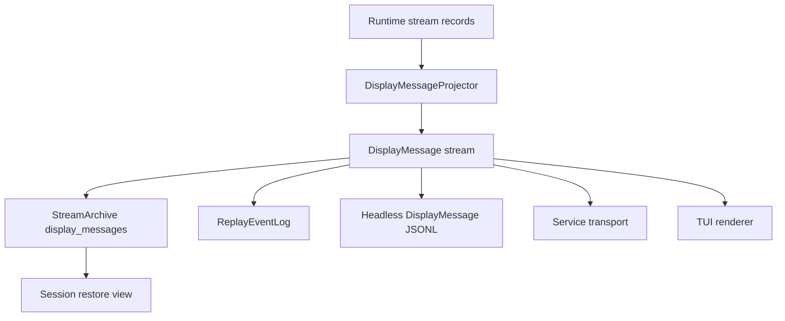

# CLI Product

The CLI Product is the first product surface for Starweaver durable execution. It makes the SDK self-hosting path concrete: a local user can run an agent, stream display-protocol events through stdio, persist display messages for session restore, and later attach richer renderers such as TUI or service-backed clients to the same event feed.

## Product Direction

Prioritize the CLI as the bootstrap product for Starweaver:

- headless agent runs through stdio
- display-protocol-first rendering
- persisted `DisplayMessage` records as the session restore source
- TUI renderers and CLI JSONL over the same Starweaver `DisplayMessage` stream
- protocol adapters for YAACLI/AGUI event compatibility
- launcher-based command dispatch through `starweaver`
- short alias through `sw`
- GitHub release based install and update flow

## Command Model

Starweaver ships CLI launcher binaries:

| Binary           | Role                                                                          |
| ---------------- | ----------------------------------------------------------------------------- |
| `starweaver`     | launcher that dispatches `starweaver {command}` to the active command surface |
| `sw`             | short alias pointing to `starweaver`                                          |
| `starweaver-cli` | local agent CLI product surface                                               |
| `starweaver-*`   | future command families loaded by the launcher convention                     |

Launcher examples:

```bash
starweaver version
starweaver doctor
starweaver update
starweaver update cli
starweaver cli -p "summarize this repository"
sw cli -p "summarize this repository"
starweaver cli session list
starweaver cli session show <session-id>
```

Dispatch rule:

```text
starweaver <command> [args...] -> exec starweaver-<command> [args...]
```

The launcher resolves command binaries from the install directory first, then `PATH`. Built-in commands include `version`, `doctor`, and `update`.

## Install and Update Semantics

GitHub Release assets are component-scoped. Current release artifacts provide the CLI component.

| Component | Archive prefix                  | Installed binaries                   | Update command                                                        |
| --------- | ------------------------------- | ------------------------------------ | --------------------------------------------------------------------- |
| CLI       | `starweaver-cli-<tag>-<target>` | `starweaver`, `starweaver-cli`, `sw` | `starweaver update`, `starweaver update cli`, `starweaver cli update` |

The installer reads `STARWEAVER_COMPONENTS` as a comma-separated component list. Default installs use `cli`. CLI update commands invoke the installer with `STARWEAVER_COMPONENTS=cli`.

The launcher update path downloads `scripts/install.sh`, runs it through `sh` with environment variables passed through `Command::env`, and avoids shell interpolation for real updates. Dry-run output may render a shell command for copy/paste diagnostics and must shell-quote paths.

## Current Implementation Status

Current landed CLI foundations:

- `clap` command surface, launcher dispatch, `sw` alias, installer/update paths, diagnostics, setup templates, auth status/logout, profile and catalog commands
- headless prompt runs, local SQLite sessions/runs, display JSONL replay, approval/deferred commands, resume, trim, current-session pointer, and retained TUI renderer
- config parser for global/project roots, model profiles, selected environment values, tools/MCP metadata, skill/subagent directories, and compatibility metadata
- TUI state/render/terminal modules, active-run steering, `/help`, `/act`, `/plan`, `/clear`, `/goal`, and custom command dispatch
- partial worktree parsing and run metadata support

Primary postponed parity gaps:

- live stdout streaming for headless output
- YAACLI/AGUI top-level event compatibility mode
- slash command parity
- TUI model/session/cost/task/HITL/media workflows
- startup asset seeding and config import
- shell environment isolation, shell review, media config, browser config, and OAuth refresh settings
- worktree flag semantics and session-folder import/export

## Headless CLI Mode

Headless mode is the default automation path. It runs an agent from a prompt and writes a replayable event stream to stdio.

Primary forms:

```bash
sw cli -p "write a short project summary"
sw cli --prompt "write a short project summary"
sw cli -p "continue from here" --session <session-id>
sw cli -p "continue the last session" --continue
sw cli run -p "write a short project summary"
sw cli run --session <session-id> -p "continue from here"
sw cli session replay <session-id> --run <run-id>
```

Session selection rules for `-p/--prompt`:

| Flag                  | Behavior                                                                             |
| --------------------- | ------------------------------------------------------------------------------------ |
| `--session <id>`      | load the selected session and append a new run with the provided prompt              |
| `--continue`          | load the most recent active or resumable session from the selected store             |
| `--new-session`       | create a fresh session even when project defaults point to an existing one           |
| `--run <run-id>`      | select the restore source run inside the selected session before appending a new run |
| `--branch-from <run>` | create a continuation run from a historical run snapshot inside the selected session |

Headless output modes:

| Mode            | Flag                                        | Output contract                                                  |
| --------------- | ------------------------------------------- | ---------------------------------------------------------------- |
| `display-jsonl` | default / `--output display-jsonl`          | one Starweaver `DisplayMessage` JSON object per line             |
| `agui-jsonl`    | `--output agui-jsonl` or compatibility mode | YAACLI/AGUI top-level event objects mapped from `DisplayMessage` |
| `silent`        | `--output silent`                           | persist session/display records and print compact final status   |

`display-jsonl` is the Starweaver-native automation format. `DisplayMessage` is the durable Starweaver wire event used by CLI output, replay archives, and restore views. `agui-jsonl` is the compatibility format for consumers that expect YAACLI/AGUI top-level event objects.

## Display Protocol as the UI Boundary

All user-facing run output should flow through `starweaver-stream` display and replay contracts.



The CLI headless renderer should write `DisplayMessage` records as they arrive and flush each JSONL line. Service transports can wrap the same records in transport frames. TUI and restore views consume the same records into renderer-specific view state. The current implementation persists and replays display messages, while live headless stdout streaming remains a parity work item.

## Session Restore from Display Messages

Session restore should use persisted `display_messages` as the primary UI reconstruction source.

Restore flow:

1. resolve session and latest/head run through `SessionStore`
2. load compact run/session projection
3. load persisted `display_messages` after the requested cursor from `StreamArchive`
4. rebuild the visible conversation through the selected renderer
5. resume the agent with input parts, context state, checkpoint refs, and cursor refs when execution continuation is requested
6. continue writing new display messages to the same run or a new run based on command mode

Session restore and replay commands:

```bash
sw cli session show <session-id>
sw cli session replay <session-id> --after <cursor>
sw cli session replay <session-id> --run <run-id> --output display-jsonl
```

## AGUI Compatibility Path

`DisplayMessage` is the Starweaver wire event. It carries AGUI-style lifecycle event names in the serialized `type` field and Starweaver extensions through durable ids, trace context, visibility, metadata, and structured payloads. Exact YAACLI/AGUI compatibility is an adapter that maps `DisplayMessage` into top-level protocol events such as `RUN_STARTED`, `TEXT_MESSAGE_CHUNK`, `TOOL_CALL_CHUNK`, and `TOOL_CALL_RESULT`.

Starweaver mapping layers:

| Layer                        | Input                 | Output                                 |
| ---------------------------- | --------------------- | -------------------------------------- |
| `DisplayMessageProjector`    | runtime stream record | Starweaver `DisplayMessage`            |
| `ReplayCompactionBuffer`     | `DisplayMessage`      | compact snapshot for restore/history   |
| `HeadlessDisplayJsonlOutput` | `DisplayMessage`      | one JSON object per stdio line         |
| service transport adapter    | `DisplayMessage`      | service/client frame with same payload |

## Local Persistence Direction

CLI local persistence should converge on `starweaver-storage` for shared records:

- session records
- run records
- raw stream records
- display messages
- replay snapshots
- approval and deferred records
- migration status

The CLI can keep product-specific config and cache files in its own config directories while relying on shared storage adapters for session/stream durability.

## Acceptance Gates

```bash
cargo test -p starweaver-cli --locked
make scripts-check
make install-script-check
make docs-check
```

Full repository validation:

```bash
make ci
```
