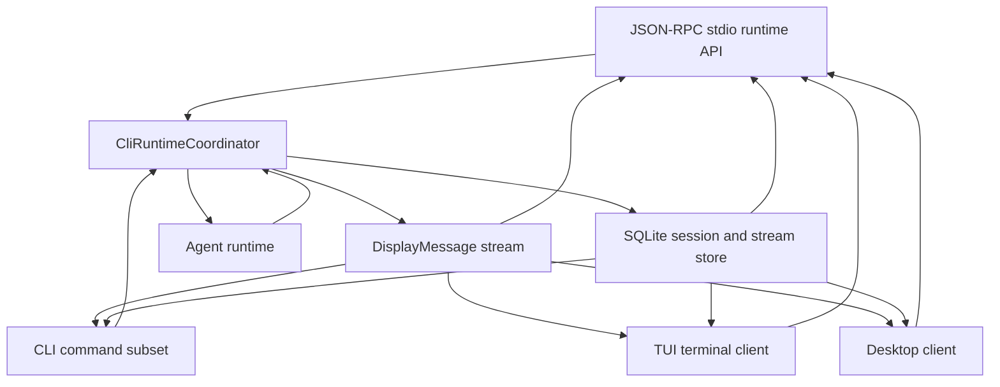
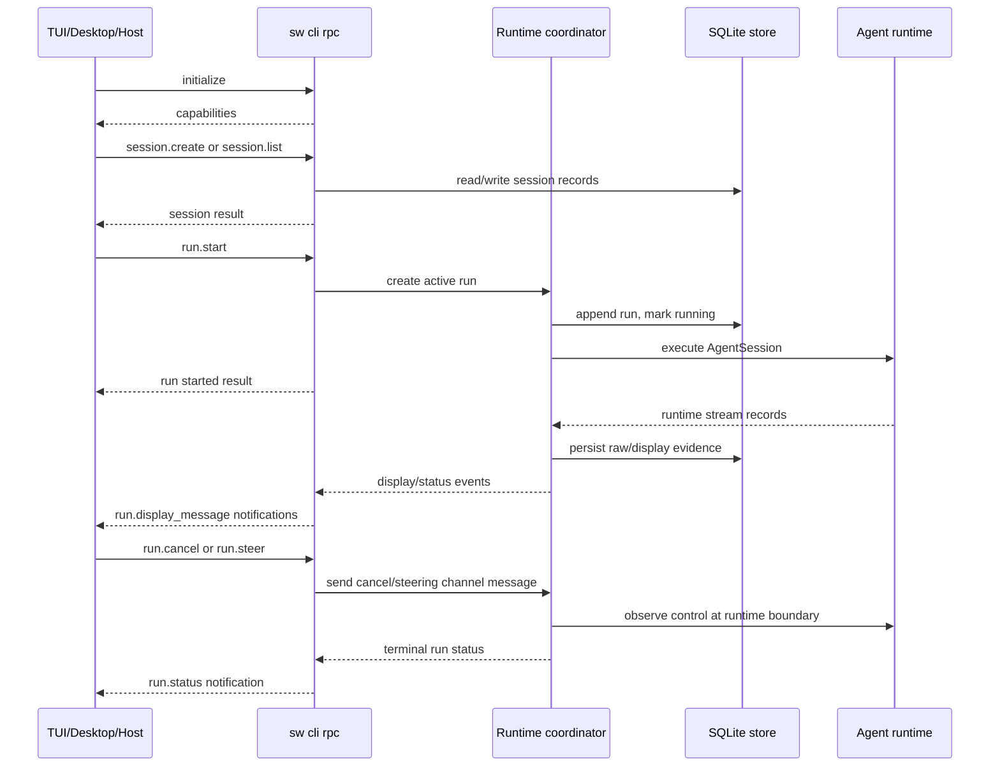
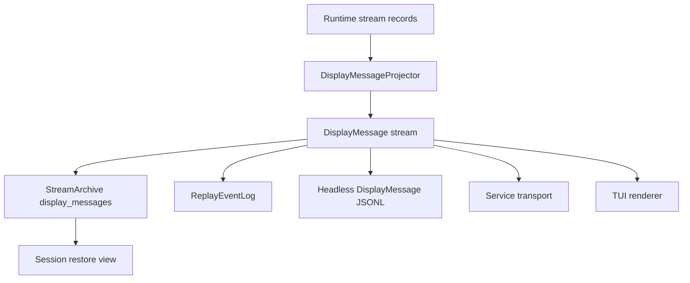

# CLI Product

The CLI Product is the first product surface for Starweaver durable execution. It makes the SDK self-hosting path concrete: a local user can run an agent, stream display-protocol events through stdio, persist display messages for session restore, and later attach richer renderers such as TUI or service-backed clients to the same event feed.

## Product Direction

Prioritize the CLI as the bootstrap product for Starweaver:

- headless agent runs through stdio
- shared configuration rooted at `~/.starweaver/config.toml`
- client UI state rooted at `~/.starweaver/tui` and `~/.starweaver/desktop`
- JSON-RPC stdio runtime as the complete local management and execution API
- CLI commands as a shell-friendly subset over the same runtime/service handlers
- TUI as the terminal client over the runtime surface
- Desktop as the desktop client over the runtime surface
- display-protocol-first rendering
- persisted `DisplayMessage` records as the session restore source
- TUI renderers, Desktop renderers, and CLI JSONL over the same Starweaver `DisplayMessage` stream
- protocol adapters for Starweaver/AGUI event compatibility
- launcher-based command dispatch through `starweaver`
- short alias through `sw`
- GitHub release based install and update flow

## Command Model

Starweaver ships CLI launcher binaries:

| Binary           | Role                                                                          |
| ---------------- | ----------------------------------------------------------------------------- |
| `starweaver`     | launcher that dispatches `starweaver {command}` to the active command surface |
| `sw`             | short alias pointing to `starweaver`                                          |
| `starweaver-cli` | local agent CLI product surface                                               |
| `starweaver-*`   | future command families loaded by the launcher convention                     |

Launcher examples:

```bash
starweaver version
starweaver doctor
starweaver update
starweaver update cli
starweaver cli -p "summarize this repository"
sw cli -p "summarize this repository"
starweaver cli rpc
starweaver cli session list --output json
starweaver cli session show <session-id>
starweaver cli session replay <session-id> --output display-jsonl
```

Dispatch rule:

```text
starweaver <command> [args...] -> exec starweaver-<command> [args...]
```

The launcher resolves command binaries from the install directory first, then `PATH`. Built-in commands include `version`, `doctor`, and `update`.

## Install and Update Semantics

GitHub Release assets are component-scoped. Current release artifacts provide the CLI component.

| Component | Archive prefix                  | Installed binaries                   | Update command                                                        |
| --------- | ------------------------------- | ------------------------------------ | --------------------------------------------------------------------- |
| CLI       | `starweaver-cli-<tag>-<target>` | `starweaver`, `starweaver-cli`, `sw` | `starweaver update`, `starweaver update cli`, `starweaver cli update` |

The installer reads `STARWEAVER_COMPONENTS` as a comma-separated component list. Default installs use `cli`. CLI update commands invoke the installer with `STARWEAVER_COMPONENTS=cli`.

The launcher update path downloads `scripts/install.sh`, runs it through `sh` with environment variables passed through `Command::env`, and avoids shell interpolation for real updates. Dry-run output may render a shell command for copy/paste diagnostics and must shell-quote paths.

## Current Implementation Status

Current landed CLI foundations:

- `clap` command surface, launcher dispatch, `sw` alias, installer/update paths, diagnostics, setup templates, auth status/logout, profile and catalog commands
- headless prompt runs, local SQLite sessions/runs, display JSONL replay, approval/deferred commands, resume, trim, current-session pointer, and retained TUI renderer
- config parser for global/project roots, model profiles, selected environment values, tools/MCP metadata, skill/subagent directories, and compatibility metadata
- global config bootstrap under `~/.starweaver`, including `skills`, `subagents`, `tui`, and `desktop` state directories
- TUI state/render/terminal modules, active-run steering, `/help`, `/clear`, `/cost`, `/model`, `/goal`, shell passthrough, streamed tool-call rendering, and model choice persistence under `~/.starweaver/tui/state.json`
- JSON-RPC stdio MVP with `initialize`, `shutdown`, `profile.*`, `model.*`, `config.get`, `diagnostics.get`, session management, replay, and blocking `run.start`/`run.prompt`
- partial worktree parsing and run metadata support

Current implementation shape for headless execution:

- one-shot `run_prompt` renders stored `DisplayMessage` records after run completion
- the TUI path already uses live raw runtime records, steering messages, and cancellation channels through `execute_agent_session_with_channels`
- `LocalStore` persists sessions, runs, raw stream records, display messages, approvals, deferred calls, context state, environment state, checkpoints, replay snapshots, and current-session state
- JSON-RPC runtime can reuse current session selection, run assembly, TUI streaming channels, cancellation channels, and steering channels while extracting live display projection and event-sink persistence into a shared runtime coordinator

Primary postponed migration gaps:

- live JSON-RPC active-run notifications and non-blocking active run control
- shared runtime coordinator used by RPC, TUI, and CLI commands
- normalized JSON output for CLI management subsets
- live stdout streaming for one-shot headless output
- Starweaver/AGUI top-level event compatibility mode
- slash command migration coverage
- deeper TUI session/task/HITL/media workflows
- startup asset seeding and config import
- shell environment isolation, shell review, media config, browser config, and OAuth refresh settings
- worktree flag semantics and session-folder import/export

## Headless CLI Mode

Headless mode is the default automation path. It runs an agent from a prompt and writes a replayable event stream to stdio.

Primary forms:

```bash
sw cli -p "write a short project summary"
sw cli --prompt "write a short project summary"
sw cli -p "continue from here" --session <session-id>
sw cli -p "continue the last session" --continue
sw cli run -p "write a short project summary"
sw cli run --session <session-id> -p "continue from here"
sw cli session replay <session-id> --run <run-id>
```

Session selection rules for `-p/--prompt`:

| Flag                  | Behavior                                                                             |
| --------------------- | ------------------------------------------------------------------------------------ |
| `--session <id>`      | load the selected session and append a new run with the provided prompt              |
| `--continue`          | load the most recent active or resumable session from the selected store             |
| `--new-session`       | create a fresh session even when project defaults point to an existing one           |
| `--run <run-id>`      | select the restore source run inside the selected session before appending a new run |
| `--branch-from <run>` | create a continuation run from a historical run snapshot inside the selected session |

Headless output modes:

| Mode            | Flag                                        | Output contract                                                                    |
| --------------- | ------------------------------------------- | ---------------------------------------------------------------------------------- |
| `display-jsonl` | default / `--output display-jsonl`          | one Starweaver `DisplayMessage` JSON object per line                               |
| `agui-jsonl`    | `--output agui-jsonl` or compatibility mode | Starweaver/AGUI top-level event objects mapped from `DisplayMessage`               |
| `json`          | `--output json`                             | final run summary with session id, run id, status, output preview, and cursor refs |
| `silent`        | `--output silent`                           | persist session/display records and print compact final status                     |

`display-jsonl` is the Starweaver-native automation format for live output. `json` is the compact command-result format for hosts that only need the final run summary. `DisplayMessage` is the durable Starweaver wire event used by CLI output, replay archives, and restore views. `agui-jsonl` is the compatibility format for consumers that expect Starweaver/AGUI top-level event objects.

JSON-RPC stdio is the complete local runtime API. It covers both management operations and active agent execution. CLI commands are the shell-friendly subset over the same service handlers, and TUI is a terminal client over the same runtime surface. Desktop applications can use the same RPC protocol as a desktop client.

Model choice is client state. `~/.starweaver/config.toml` defines shared model profiles and provider settings, while `~/.starweaver/tui/state.json` and `~/.starweaver/desktop/state.json` store the selected profile for each frontend. Headless CLI runs can still pass `--profile`; RPC `run.start` can pass an explicit `profile`/`modelProfile` or fall back to the selected profile for the supplied `client`.

## JSON-RPC Stdio Runtime Surface

The preferred host integration surface is a long-lived JSON-RPC 2.0 server over stdin/stdout:

```bash
sw cli rpc
starweaver cli rpc
starweaver-cli rpc
```

A host process starts the CLI runtime, sends JSON-RPC requests on stdin, receives JSON-RPC responses and notifications on stdout, and reads diagnostics from stderr. The runtime uses the same local config, profiles, tool policy, workspace binding, client state directories, and durable SQLite store as CLI commands.

Local state roots:

| Path                               | Owner                     | Purpose                                                                                |
| ---------------------------------- | ------------------------- | -------------------------------------------------------------------------------------- |
| `~/.starweaver/config.toml`        | shared CLI/runtime config | default profile, provider settings, config-backed model profiles, output/HITL defaults |
| `~/.starweaver/tools.toml`         | shared CLI/runtime config | tool policy metadata                                                                   |
| `~/.starweaver/mcp.json`           | shared CLI/runtime config | MCP server metadata                                                                    |
| `~/.starweaver/skills`             | shared catalog            | global skill definitions                                                               |
| `~/.starweaver/subagents`          | shared catalog            | global subagent definitions                                                            |
| `~/.starweaver/tui/state.json`     | TUI client                | selected profile and future terminal UI state                                          |
| `~/.starweaver/desktop/state.json` | Desktop client            | selected profile and future desktop UI state                                           |
| `.starweaver/config.toml`          | project config            | workspace-specific environment, trim, provider, and profile overrides                  |
| `.starweaver/state.json`           | project runtime state     | current session pointer                                                                |

RPC is the superset API:

| Surface        | Role                       | Coverage                                                                                                                                  |
| -------------- | -------------------------- | ----------------------------------------------------------------------------------------------------------------------------------------- |
| JSON-RPC stdio | complete local runtime API | session management, run lifecycle, live streams, cancellation, steering, approvals, deferred calls, replay, profiles, config, diagnostics |
| CLI commands   | shell-friendly subset      | scripted prompt runs, session listing/show/replay, approval/deferred decisions, diagnostics, setup, config, update                        |
| TUI            | terminal client            | interactive renderer and controls backed by the same runtime coordinator and display stream                                               |
| Desktop        | desktop client             | graphical renderer and controls backed by the same runtime coordinator and display stream                                                 |

Protocol framing:

- UTF-8 JSON-RPC 2.0 messages are newline-delimited; each line is one complete JSON object.
- stdout is reserved for protocol frames.
- stderr carries human-readable diagnostics, tracing setup messages, and crash reports.
- requests use standard `id`, `method`, and `params` fields.
- responses use standard `result` or `error` fields.
- notifications carry live stream events and have no `id` field.
- protocol version is returned by `initialize` and stored as a date-like string such as `2026-06-08`.

Runtime topology:



Lifecycle:



Core RPC methods:

| Method                     | Purpose                                              | Primary params                                                                                                         | Result                                                                    |
| -------------------------- | ---------------------------------------------------- | ---------------------------------------------------------------------------------------------------------------------- | ------------------------------------------------------------------------- |
| `initialize`               | handshake and capability discovery                   | `clientInfo`, optional `workspaceRoot`                                                                                 | `protocolVersion`, `serverInfo`, `capabilities`, selected config summary  |
| `shutdown`                 | graceful server shutdown                             | optional `timeoutMs`                                                                                                   | terminal status                                                           |
| `session.create`           | create a durable local session                       | `profile`, `title`, `metadata`, optional `workspaceRoot`                                                               | session summary                                                           |
| `session.list`             | list sessions                                        | `profile`, `workspace`, `status`, `limit`                                                                              | session summaries                                                         |
| `session.get`              | load one session and recent runs                     | `sessionId`, `runs`                                                                                                    | session summary plus run summaries                                        |
| `session.current.get`      | read current project session pointer                 | empty params                                                                                                           | current session id or null                                                |
| `session.current.set`      | update current project session pointer               | `sessionId`                                                                                                            | updated pointer                                                           |
| `session.delete`           | delete a session and retained evidence               | `sessionId`                                                                                                            | deletion summary                                                          |
| `session.replay`           | replay persisted display messages                    | `sessionId`, optional `runId`, optional `after` cursor                                                                 | display messages plus cursor range                                        |
| `run.start` / `run.prompt` | append and start an agent run                        | `prompt` or `inputParts`, session selection, `profile`/`modelProfile`, `client`, `hitl`, `metadata`, streaming options | MVP: blocking final summary; target: `sessionId`, `runId`, initial status |
| `run.attach`               | replay then subscribe to an active or historical run | `sessionId`, `runId`, optional `after` cursor                                                                          | attach summary and latest cursor                                          |
| `run.status`               | inspect one run                                      | `sessionId`, `runId`                                                                                                   | run summary                                                               |
| `run.cancel`               | request cancellation for an active run               | `runId`, optional `reason`                                                                                             | cancellation acknowledgement                                              |
| `run.steer`                | enqueue steering text for an active run              | `runId`, `text`, optional `steeringId`                                                                                 | steering acknowledgement                                                  |
| `run.await`                | wait for terminal status                             | `runId`, optional `timeoutMs`                                                                                          | terminal run summary                                                      |
| `approval.list`            | list approval records                                | optional `sessionId`, optional `runId`                                                                                 | approval records                                                          |
| `approval.decide`          | approve or deny a pending approval                   | `approvalId`, `status`, optional `reason`                                                                              | updated approval record                                                   |
| `deferred.list`            | list deferred tool calls                             | optional `sessionId`, optional `runId`                                                                                 | deferred records                                                          |
| `deferred.complete`        | complete a deferred tool call                        | `deferredId`, JSON `result`                                                                                            | updated deferred record                                                   |
| `deferred.fail`            | fail a deferred tool call                            | `deferredId`, `error`                                                                                                  | updated deferred record                                                   |
| `profile.list`             | list available profiles                              | optional `client`                                                                                                      | profile summaries plus current client selection                           |
| `profile.get`              | load one profile                                     | `name`                                                                                                                 | profile details safe for clients                                          |
| `model.list`               | list model profiles for a client                     | optional `client` (`tui` or `desktop`)                                                                                 | profile summaries plus current selected profile                           |
| `model.current`            | read selected model profile for a client             | optional `client`                                                                                                      | `selectedProfile`, `modelId`, client scope                                |
| `model.select`             | persist selected model profile for a client          | `client`, `profile`                                                                                                    | updated selected profile and model id                                     |
| `config.get`               | read selected resolved config values                 | `key` or `keys`                                                                                                        | key/value map                                                             |
| `diagnostics.get`          | read runtime diagnostics                             | optional sections                                                                                                      | diagnostics object                                                        |

Run session selection mirrors existing CLI flags:

| RPC field          | CLI equivalent           | Behavior                                                   |
| ------------------ | ------------------------ | ---------------------------------------------------------- |
| `sessionId`        | `--session <id>`         | append a run to the selected session                       |
| `continueLatest`   | `--continue`             | use the current project session, then latest local session |
| `newSession`       | `--new-session`          | create a fresh session before appending the run            |
| `restoreFromRunId` | `--run <run-id>`         | restore from a selected run before appending the run       |
| `branchFromRunId`  | `--branch-from <run-id>` | branch from a historical run snapshot                      |

Run model selection priority:

| Source                                                  | Scope                 | Priority | Notes                                                                           |
| ------------------------------------------------------- | --------------------- | -------- | ------------------------------------------------------------------------------- |
| `profile` / `modelProfile` in `run.start` params        | one run               | 1        | explicit host override, equivalent to CLI `--profile`                           |
| selected profile in `~/.starweaver/<client>/state.json` | TUI or Desktop client | 2        | used when `client` is supplied and no explicit profile is passed                |
| `general.default_profile` from resolved config          | shared config         | 3        | fallback from `~/.starweaver/config.toml`, project config, env, or CLI defaults |

`model.select` validates the profile against `profile.list` before writing frontend state. It never mutates `~/.starweaver/config.toml`; shared config owns available profiles, client state owns the current selected profile.

Live notifications:

| Method                   | Params                                                  | When emitted                                           |
| ------------------------ | ------------------------------------------------------- | ------------------------------------------------------ |
| `run.display_message`    | `sessionId`, `runId`, `cursor`, native `DisplayMessage` | each projected display message                         |
| `run.raw_event`          | `sessionId`, `runId`, `sequence`, raw runtime record    | debug subscriptions and test harnesses                 |
| `run.snapshot`           | `sessionId`, `runId`, `ReplaySnapshot`                  | compaction milestones and attach responses             |
| `run.status`             | `sessionId`, `runId`, `status`, optional output/error   | queued, running, waiting, completed, failed, cancelled |
| `run.approval_requested` | `sessionId`, `runId`, approval record                   | approval control-flow boundary                         |
| `run.deferred_requested` | `sessionId`, `runId`, deferred record                   | deferred tool-call boundary                            |

Target live semantics: `run.start` returns after durable run creation and active-run registration. The final result arrives through `run.status` and can also be awaited with `run.await`. Active cancellation and steering use the in-memory active-run registry, while every durable event is persisted to SQLite.

Current MVP semantics: `run.start` and `run.prompt` execute a blocking prompt run and return the same compact JSON summary as `--output json` after completion. MVP capabilities advertise `blockingRunStart=true`, `liveDisplay=false`, `cancel=false`, and `steering=false` until the shared runtime coordinator lands.

Example handshake:

```json
{"jsonrpc":"2.0","id":1,"method":"initialize","params":{"clientInfo":{"name":"desktop","version":"0.1.0"}}}
```

```json
{"jsonrpc":"2.0","id":1,"result":{"protocolVersion":"2026-06-08","serverInfo":{"name":"starweaver-cli","version":"0.1.0"},"capabilities":{"sessions":true,"runs":true,"management":true,"profiles":true,"clientModelSelection":true,"blockingRunStart":true,"liveDisplay":false,"cancel":false,"steering":false,"approvals":true,"deferred":true},"config":{"globalDir":"/home/user/.starweaver","tuiStateDir":"/home/user/.starweaver/tui","desktopStateDir":"/home/user/.starweaver/desktop","defaultProfile":"general"}}}
```

Example model selection:

```json
{"jsonrpc":"2.0","id":2,"method":"model.select","params":{"client":"tui","profile":"coding"}}
```

```json
{"jsonrpc":"2.0","id":2,"result":{"client":"tui","selectedProfile":"coding","modelId":"openai:gpt-5"}}
```

Example run start:

```json
{"jsonrpc":"2.0","id":3,"method":"run.start","params":{"prompt":"summarize this repository","newSession":true,"client":"tui","stream":{"displayFormat":"display_message"}}}
```

```json
{"jsonrpc":"2.0","id":3,"result":{"sessionId":"session_...","runId":"run_...","status":"completed","outputPreview":"...","latestCursor":{"scope":"run:run_...","sequence":13}}}
```

Example live event:

```json
{"jsonrpc":"2.0","method":"run.display_message","params":{"sessionId":"session_...","runId":"run_...","cursor":{"scope":"run:run_...","sequence":3},"message":{"schema":"starweaver.display.v1","sequence":3,"type":"TEXT_MESSAGE_CONTENT","session_id":"session_...","run_id":"run_...","payload":{"delta":"Hello"}}}}
```

CLI commands remain a subset/facade over the same handlers:

| CLI command                             | RPC equivalent                         | Purpose                          |
| --------------------------------------- | -------------------------------------- | -------------------------------- |
| `run -p ... --output display-jsonl`     | `run.start` plus display notifications | shell-friendly foreground run    |
| `run --output json`                     | `run.start` / `run.await`              | compact final run summary        |
| `session list --output json`            | `session.list`                         | scripted session discovery       |
| `session show --output json`            | `session.get`                          | scripted session inspection      |
| `session replay --output display-jsonl` | `session.replay`                       | scripted replay export           |
| `approval * --output json`              | `approval.*`                           | scripted HITL decisions          |
| `deferred * --output json`              | `deferred.*`                           | scripted deferred-tool decisions |

TUI should become the terminal client over the runtime coordinator. The current TUI path already creates stream, steering, and cancellation channels; the RPC runtime should reuse those semantics and let the TUI either call the coordinator in-process or speak the same JSON-RPC protocol to an owned local runtime process.

Implementation impact on the current CLI:

- add `CliCommand::Rpc(RpcCommand)` and route it through `run_from_env` so the RPC server can own stdin/stdout directly
- keep `command_output` for shell-friendly one-shot commands and tests
- introduce a `rpc` module with JSON-RPC line framing, request dispatch, error mapping, model selection methods, and stderr diagnostics
- introduce a `CliRuntimeCoordinator` shared by RPC, TUI, and CLI command handlers
- move completion-time display projection in `runner.rs` toward an event-sink model that can project, persist, and emit `DisplayMessage` records as runtime records arrive
- keep raw `AgentStreamRecord` capture for debugging, replay evidence, and TUI state updates
- maintain an active-run registry keyed by `runId` with cancellation sender, steering sender, status, latest cursor, and join handle
- expose management methods through RPC first, then map CLI command subset onto the same service handlers
- reuse `LocalStore` methods for session/replay/approval/deferred management, then converge storage calls onto `starweaver-storage` adapters when the CLI persistence migration lands

Initial build slices:

1. Protocol shell: `sw cli rpc`, `initialize`, `shutdown`, newline JSON-RPC framing tests, stderr diagnostics contract.
2. Management API: `session.create`, `session.list`, `session.get`, current-session pointer methods, `session.replay`, `profile.*`, `model.*`, `config.get`, `diagnostics.get`.
3. Run start MVP: `run.start`/`run.prompt` with prompt text, session selection, client-state model selection, blocking compact JSON result.
4. Live display: shared runtime coordinator, non-blocking active-run registry, per-message persistence, `run.display_message`, terminal `run.status` notification, replay cursor tracking, `run.attach`.
5. Active control: `run.cancel`, `run.steer`, `approval.*`, `deferred.*`, `run.await`.
6. CLI facade: normalize `--output json`, keep `display-jsonl` run/replay streams, and map command handlers onto the same runtime service methods.
7. TUI client migration: route TUI active runs through the coordinator or owned RPC runtime while preserving the retained terminal renderer.
8. Desktop client: consume the same JSON-RPC protocol, display stream, and replay/attach semantics.

## Display Protocol as the UI Boundary

All user-facing run output should flow through `starweaver-stream` display and replay contracts.



The CLI headless renderer should write `DisplayMessage` records as they arrive and flush each JSONL line. Service transports can wrap the same records in transport frames. TUI and restore views consume the same records into renderer-specific view state. The current implementation persists and replays display messages, while live headless stdout streaming remains a migration work item.

## Session Restore from Display Messages

Session restore should use persisted `display_messages` as the primary UI reconstruction source.

Restore flow:

1. resolve session and latest/head run through `SessionStore`
2. load compact run/session projection
3. load persisted `display_messages` after the requested cursor from `StreamArchive`
4. rebuild the visible conversation through the selected renderer
5. resume the agent with input parts, context state, checkpoint refs, and cursor refs when execution continuation is requested
6. continue writing new display messages to the same run or a new run based on command mode

Session restore and replay commands:

```bash
sw cli session show <session-id>
sw cli session replay <session-id> --after <cursor>
sw cli session replay <session-id> --run <run-id> --output display-jsonl
```

## AGUI Compatibility Path

`DisplayMessage` is the Starweaver wire event. It carries AGUI-style lifecycle event names in the serialized `type` field and Starweaver extensions through durable ids, trace context, visibility, metadata, and structured payloads. Exact Starweaver/AGUI compatibility is an adapter that maps `DisplayMessage` into top-level protocol events such as `RUN_STARTED`, `TEXT_MESSAGE_CHUNK`, `TOOL_CALL_CHUNK`, and `TOOL_CALL_RESULT`.

Starweaver mapping layers:

| Layer                        | Input                 | Output                                 |
| ---------------------------- | --------------------- | -------------------------------------- |
| `DisplayMessageProjector`    | runtime stream record | Starweaver `DisplayMessage`            |
| `ReplayCompactionBuffer`     | `DisplayMessage`      | compact snapshot for restore/history   |
| `HeadlessDisplayJsonlOutput` | `DisplayMessage`      | one JSON object per stdio line         |
| service transport adapter    | `DisplayMessage`      | service/client frame with same payload |

## Local Persistence Direction

CLI local persistence should converge on `starweaver-storage` for shared records:

- session records
- run records
- raw stream records
- display messages
- replay snapshots
- approval and deferred records
- migration status

The CLI can keep product-specific config and cache files in its own config directories while relying on shared storage adapters for session/stream durability.

## Acceptance Gates

```bash
cargo test -p starweaver-cli --locked
make scripts-check
make install-script-check
make docs-check
```

Full repository validation:

```bash
make ci
```
