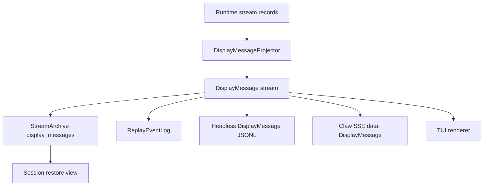
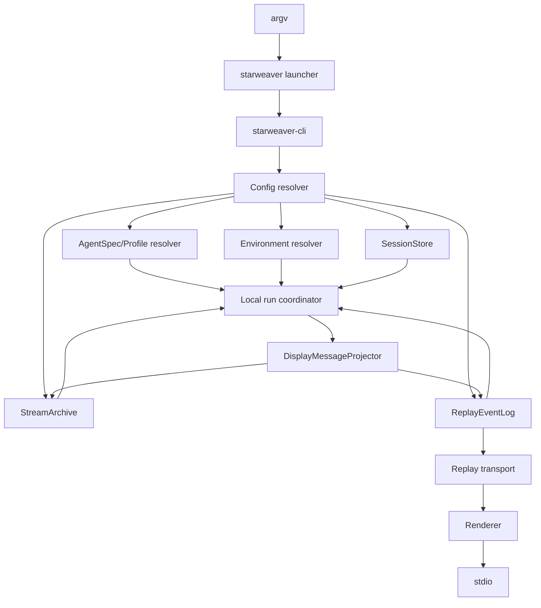
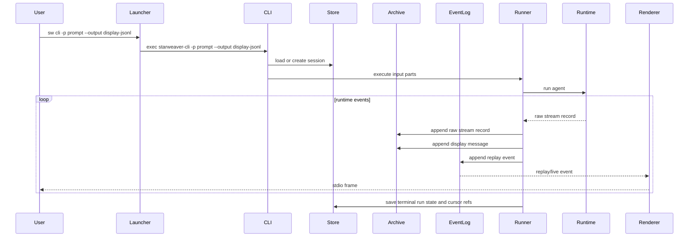

# CLI Product

The CLI Product is the first product surface for Starweaver durable execution. It should make the SDK self-hosting path concrete before service adapters deepen: a local user can run an agent, stream display-protocol events through stdio, persist display messages for session restore, and later attach richer renderers such as TUI or service-backed AGUI clients to the same event feed.

The CLI builds on `starweaver-agent`, `starweaver-session`, `starweaver-stream`, and `starweaver-environment`. `starweaver-cli` owns command parsing, profile/config resolution, local renderer selection, stdio transport, setup/auth/catalog commands, default first-party tool catalog assembly, and installer-facing product behavior. Shared session and stream crates own durable records and display/replay contracts. Claw owns durable service orchestration, workflow definitions, schedules, coordinator adapters, and service transports.

## Product Direction

Prioritize the CLI as the bootstrap product for Starweaver:

- headless agent runs through stdio
- display-protocol-first rendering
- persisted `DisplayMessage` records as the session restore source
- TUI renderers, CLI JSONL, and Claw SSE over the same AGUI-compatible `DisplayMessage` stream
- launcher-based command dispatch through `starweaver`
- short alias through `sw`
- GitHub release based install and update flow

## Framework Selection

Recommended framework choices:

| Area              | Choice                                            | Role                                                                  |
| ----------------- | ------------------------------------------------- | --------------------------------------------------------------------- |
| Command parser    | `clap` with derive API                            | typed subcommands, flags, value enums, help text, suggestions, colors |
| Shell completions | `clap_complete`                                   | generated completions for bash, zsh, fish, PowerShell, and Elvish     |
| CLI tests         | `assert_cmd`, `predicates`, `snapbox` or `trycmd` | binary integration tests and golden output checks                     |
| TUI renderer      | `ratatui`                                         | retained view state rendered from replay/display events               |
| Terminal backend  | `crossterm`                                       | cross-platform terminal control and input events                      |

Selection evidence:

- `clap` documents derive and builder APIs, subcommand parsing, generated help, suggestions, colors, shell completions, and CLI testing helpers such as `trycmd`, `snapbox`, and `assert_cmd`.
- `clap_complete` generates shell completion scripts from a `clap::Command` and supports runtime or ahead-of-time generation.
- `ratatui` is the maintained Rust TUI crate with widgets, layouts, and application patterns; it uses `crossterm` as the default backend for Linux, macOS, and Windows.
- `crossterm` provides cross-platform terminal manipulation, event reading, queued output, and Windows support.

Implementation guidance:

- Use `clap` derive types for stable command schemas and `ValueEnum` for output modes, session sort keys, HITL policy, and completion shell names.
- Keep the launcher command parser small and use `clap` builder APIs where dynamic dispatch to `starweaver-{command}` is easier than derive shapes.
- Generate completions from the same command schema used by tests and release packaging.
- Keep TUI dependencies behind a feature gate until the headless display stream and session restore path are stable.
- Keep headless output independent from TUI crates so automation builds stay small and deterministic.

## Command Model

Starweaver should ship a launcher and command binaries:

| Binary            | Role                                                                      |
| ----------------- | ------------------------------------------------------------------------- |
| `starweaver`      | launcher that dispatches `starweaver {command}` to `starweaver-{command}` |
| `sw`              | short alias pointing to `starweaver`                                      |
| `starweaver-cli`  | local agent CLI product surface                                           |
| `starweaver-claw` | local Claw command and future service durable runtime surface             |
| `starweaver-*`    | future command families loaded by the launcher convention                 |

Launcher examples:

```bash
starweaver cli -p "summarize this repository"
sw cli -p "summarize this repository"
starweaver cli session list
starweaver cli session show <session-id>
```

Dispatch rule:

```text
starweaver <command> [args...] -> exec starweaver-<command> [args...]
```

The launcher should resolve command binaries from the install directory first, then `PATH`. The launcher should reserve built-in commands that operate on the installed product, including `version`, `doctor`, and `update`.

## Install and Update Semantics

GitHub Release assets are component-scoped:

| Component | Archive prefix                   | Installed binaries                   | Update command                                                        |
| --------- | -------------------------------- | ------------------------------------ | --------------------------------------------------------------------- |
| CLI       | `starweaver-cli-<tag>-<target>`  | `starweaver`, `starweaver-cli`, `sw` | `starweaver update`, `starweaver update cli`, `starweaver cli update` |
| Claw      | `starweaver-claw-<tag>-<target>` | `starweaver-claw`                    | `starweaver update claw`, `starweaver claw update`                    |

The installer reads `STARWEAVER_COMPONENTS` as a comma-separated component list. Default installs use `cli`. CLI update commands invoke the installer with `STARWEAVER_COMPONENTS=cli`; Claw update commands invoke it with `STARWEAVER_COMPONENTS=claw`. Claw upgrades are explicit through the Claw update target, so a CLI update keeps the Claw binary at its current version.

The launcher update path should download `scripts/install.sh`, run it through `sh` with environment variables passed through `Command::env`, and avoid shell interpolation for real updates. Dry-run output may render a shell command for copy/paste diagnostics and must shell-quote paths.

## Headless CLI Mode

Headless mode is the default automation path. It runs an agent from a prompt and writes a replayable event stream to stdio.

Primary forms:

```bash
sw cli -p "write a short project summary"
sw cli --prompt "write a short project summary"
sw cli -p "continue from here" --session <session-id>
sw cli -p "continue the last session" --continue
sw cli run -p "write a short project summary"
sw cli run --session <session-id> -p "continue from here"
sw cli session replay <session-id> --run <run-id>
```

Session selection rules for `-p/--prompt`:

| Flag                  | Behavior                                                                             |
| --------------------- | ------------------------------------------------------------------------------------ |
| `--session <id>`      | load the selected session and append a new run with the provided prompt              |
| `--continue`          | load the most recent active or resumable session from the selected store             |
| `--new-session`       | create a fresh session even when project defaults point to an existing one           |
| `--run <run-id>`      | select the restore source run inside the selected session before appending a new run |
| `--branch-from <run>` | create a continuation run from a historical run snapshot inside the selected session |

The parser should reject ambiguous session selectors such as `--session` combined with `--new-session`. `--continue` should use the latest updated session with status `running`, `waiting`, or `completed`, in that priority order. Every prompt-backed invocation creates a new `RunRecord` under the selected `SessionRecord`; runs are the execution and commit units, while sessions are the conversation-level container.

Headless output modes:

| Mode            | Flag                               | Output contract                                                |
| --------------- | ---------------------------------- | -------------------------------------------------------------- |
| `display-jsonl` | default / `--output display-jsonl` | one AGUI-compatible `DisplayMessage` JSON object per line      |
| `silent`        | `--output silent`                  | persist session/display records and print compact final status |

`display-jsonl` is the stable automation format. `DisplayMessage` is the AGUI-compatible Starweaver wire event, so CLI headless output, Claw SSE payloads, replay archives, and restore views share one protocol shape.

## Display Protocol as the UI Boundary

All user-facing run output should flow through `starweaver-stream` display and replay contracts.



The CLI headless renderer writes `DisplayMessage` records directly as JSONL. Claw wraps the same records in SSE frames. TUI and restore views consume the same records into renderer-specific view state.

## Session Restore from Display Messages

Session restore should use persisted `display_messages` as the primary UI reconstruction source.

Restore flow:

1. resolve session and latest/head run through `SessionStore`
2. load compact run/session projection
3. load persisted `display_messages` after the requested cursor from `StreamArchive`
4. rebuild the visible conversation through the selected renderer
5. resume the agent with input parts, context state, checkpoint refs, and cursor refs when execution continuation is requested
6. continue writing new display messages to the same run or a new run based on command mode

Session restore and replay commands:

```bash
sw cli session show <session-id>
sw cli session replay <session-id> --after <cursor>
sw cli session replay <session-id> --run <run-id> --output display-jsonl
```

Persisted display messages support local CLI restore, TUI rehydration, service web UI restore, and compact history inspection through one protocol shape.

## AGUI Compatibility Path

`DisplayMessage` is the AGUI-compatible Starweaver wire event. It carries AGUI-style lifecycle event types in the serialized `type` field and Starweaver extensions through durable ids, trace context, visibility, metadata, and structured payloads.

Reference behavior from Starweaver Claw:

- map run lifecycle into `RUN_STARTED`, `RUN_FINISHED`, `RUN_ERROR`, and custom run events
- map text deltas into text message start/content/end style events
- map reasoning deltas into reasoning message events
- map tool calls and tool results into tool call events
- keep a replay buffer that compacts repeated text, reasoning, and tool chunks
- persist compacted replay lists for history and restore views
- support SSE replay through monotonic event IDs and live tail

Starweaver mapping layers:

| Layer                        | Input                 | Output                                     |
| ---------------------------- | --------------------- | ------------------------------------------ |
| `DisplayMessageProjector`    | runtime stream record | AGUI-compatible `DisplayMessage`           |
| `ReplayCompactionBuffer`     | `DisplayMessage`      | compact snapshot for restore/history       |
| `HeadlessDisplayJsonlOutput` | `DisplayMessage`      | one JSON object per stdio line             |
| `SseReplayTransport`         | `DisplayMessage`      | service/client SSE frame with same payload |

There is no separate AGUI domain model in Starweaver. External compatibility is a schema contract on `DisplayMessage`: standard AGUI event names where available, Starweaver extension fields where durable execution needs more context.

## CLI Assembly Shape



`starweaver-cli/src/main.rs` should stay thin: parse args, resolve config, assemble local dependencies, execute command, stream renderer output, and return exit code.

## Module Split

Suggested `starweaver-cli` module boundaries:

| Module        | Responsibility                                                                       |
| ------------- | ------------------------------------------------------------------------------------ |
| `args`        | parse typed command intents, including `-p/--prompt` headless shorthand              |
| `config`      | resolve global/project config, env vars, output mode, store paths, display transport |
| `profiles`    | load `AgentSpec`, model profile, tools, subagents, and host adapter references       |
| `environment` | resolve local, virtual, sandbox, and process providers                               |
| `storage`     | open `SessionStore` adapters                                                         |
| `stream`      | open `StreamArchive`, `ReplayEventLog`, transport adapters, and cursor refs          |
| `runner`      | local run coordinator over SDK/runtime/session/stream contracts                      |
| `commands`    | execute command intents                                                              |
| `render`      | render display messages, traces, diagnostics, JSONL, and AGUI JSONL                  |
| `launcher`    | dispatch `starweaver {command}` to `starweaver-{command}`                            |
| `install`     | installer/update script contracts and release asset naming                           |

## CLI-owned Configuration

Starweaver needs a first-class CLI configuration layer: global and project configuration directories, stable file names, project-level priority, environment overrides for a small scalar set, skills/subagents as directory trees, and local machine state in a separate state file.

Configuration decisions:

| Area         | Starweaver decision                                                                                                                   |
| ------------ | ------------------------------------------------------------------------------------------------------------------------------------- |
| Global root  | `~/.starweaver/`                                                                                                                      |
| Project root | `.starweaver/`                                                                                                                        |
| Main config  | `config.toml` for profile, model, display, storage, stream, HITL, trim, update, commands, env, skills                                 |
| Tool policy  | `tools.toml` with tool approval and capability policy                                                                                 |
| MCP servers  | `mcp.json` with the same local/project override pattern                                                                               |
| Local state  | `state.json` for selected profile, current session pointer, update cache metadata, and local-only cursors                             |
| Skills       | built-in, global, project directories through `AgentSpec` and skill toolsets                                                          |
| Subagents    | markdown files under global/project `subagents/` compiled into `AgentSpec` entries                                                    |
| Setup        | `sw cli setup` creates starter global and project files for config, tool policy, MCP, skills, subagents, and local state ignore rules |

Config loading should stay predictable:

1. load built-in defaults
2. load global files from `~/.starweaver/`
3. load project files from the nearest `.starweaver/` root
4. apply selected environment variable overrides
5. apply command-line flags

For the first implementation, project `config.toml`, `tools.toml`, and `mcp.json` override the corresponding global file at file scope. This keeps conflict behavior understandable. Fine-grained merge can be added after stable examples prove the need. Skills and subagents load as layered directories: built-in first, global second, project third; later layers override entries with the same name.

Recommended file layout:

| Scope              | Path                            | Purpose                                                          |
| ------------------ | ------------------------------- | ---------------------------------------------------------------- |
| Global config      | `~/.starweaver/config.toml`     | user defaults for profile, display, storage, HITL, trim, update  |
| Global tools       | `~/.starweaver/tools.toml`      | user-level tool approval and capability policy                   |
| Global MCP         | `~/.starweaver/mcp.json`        | user-level MCP servers                                           |
| Global skills      | `~/.starweaver/skills/`         | user skills                                                      |
| Global subagents   | `~/.starweaver/subagents/`      | user subagent definitions                                        |
| Global state       | `~/.starweaver/state.json`      | selected profile, current session pointer, update cache metadata |
| Project config     | `.starweaver/config.toml`       | project profile, storage, environment, trim, display defaults    |
| Project tools      | `.starweaver/tools.toml`        | project tool approval and capability policy                      |
| Project MCP        | `.starweaver/mcp.json`          | project MCP servers                                              |
| Project skills     | `.starweaver/skills/`           | project skills                                                   |
| Project subagents  | `.starweaver/subagents/`        | project subagent definitions                                     |
| Project state      | `.starweaver/state.json`        | project-local current session pointer and cursors                |
| Project SQLite     | `.starweaver/starweaver.sqlite` | local session/run/display/checkpoint indexes                     |
| Project file store | `.starweaver/store/`            | local blobs, compact archives, raw evidence, attachments         |

Project state, SQLite files, and file-store directories are local machine state. Repository templates should include `.gitignore` entries for those paths when `sw cli setup --project` creates a project config root.

Example `config.toml`:

```toml
[general]
default_profile = "general"
default_output = "text"

[profiles]
search_paths = [".starweaver/profiles", "~/.starweaver/profiles"]

[display]
code_theme = "dark"
max_tool_result_lines = 8
show_token_usage = true
show_elapsed_time = true

[storage]
backend = "sqlite-local"
database_path = ".starweaver/starweaver.sqlite"
file_store_path = ".starweaver/store"
archive_large_records_after_bytes = 65536

[stream]
replay_backend = "memory"
archive_display_messages = true
archive_raw_runtime_records = true

[hitl]
headless = "deny"
interactive = "prompt"

[trim]
auto_after_run = true
current_session_keep_recent_runs = 20
current_session_keep_days = 14
all_sessions_keep_days = 60
preserve_starred_sessions = true
preserve_head_success_run = true
compact_before_delete = true

[update]
channel = "stable"
check_interval_hours = 24
```

Example `tools.toml`:

```toml
[tools]
need_approval = ["shell", "write", "edit", "multi_edit", "delete", "move"]
```

Filesystem and shell execution policy is resolved from `[environment]` in `config.toml`; `tools.toml` controls tool-level approval gates.

Example `mcp.json`:

```json
{
  "servers": {
    "docs": {
      "transport": "stdio",
      "command": "npx",
      "args": ["-y", "@example/docs-mcp"],
      "env": {},
      "tools": [
        {
          "name": "lookup",
          "description": "Look up documentation by query.",
          "parameters": {"type": "object"}
        }
      ]
    }
  }
}
```

Environment variable overrides should cover only values needed for automation and CI:

| Variable                    | Purpose                              |
| --------------------------- | ------------------------------------ |
| `STARWEAVER_CONFIG_DIR`     | override global config root          |
| `STARWEAVER_PROJECT_DIR`    | force project root discovery result  |
| `STARWEAVER_PROFILE`        | select default profile               |
| `STARWEAVER_OUTPUT`         | select output mode                   |
| `STARWEAVER_SESSION_DB`     | override SQLite path                 |
| `STARWEAVER_FILE_STORE`     | override file store path             |
| `STARWEAVER_HITL`           | select headless HITL policy          |
| `STARWEAVER_NO_AUTO_TRIM`   | disable automatic trim for a process |
| `STARWEAVER_UPDATE_CHANNEL` | select update channel                |

## Local Persistence and Trim

The CLI can ship with local SQLite plus file storage in the first implementation. This gives session restore, display replay, and bounded disk usage before a service is required.

Storage split:

| Component            | Responsibility                                                                                                                               |
| -------------------- | -------------------------------------------------------------------------------------------------------------------------------------------- |
| SQLite database      | sessions, runs, display-message indexes, replay cursors, checkpoint refs, approval/deferred refs, usage, trace ids, file refs, trim metadata |
| File store           | large raw runtime records, checkpoint blobs, compact replay snapshots, exported archives, attachments, binary resources                      |
| In-memory replay log | active run live tail for local rendering                                                                                                     |
| JSONL stdio          | automation transport over replay envelopes                                                                                                   |

Recommended file-store shape:

```text
.starweaver/store/
  sessions/<session-id>/
    runs/<run-id>/
      raw-stream.jsonl
      display.compact.json
      checkpoints/<checkpoint-id>.json
      artifacts/<artifact-id>
  archives/<export-id>.tar.zst
```

SQLite rows should reference file-store objects by stable ids, relative paths, byte size, checksum, content type, and created time. File writes should be atomic through temp files plus rename. Trim should delete file-store objects only after the SQLite transaction marks the corresponding refs as trimmed or compacted.

Trim has two scopes:

| Scope                | Purpose                                                  | Default trigger                                                  |
| -------------------- | -------------------------------------------------------- | ---------------------------------------------------------------- |
| Current session trim | keep the active conversation compact and fast to restore | after each completed run when `trim.auto_after_run = true`       |
| All sessions trim    | keep local disk usage bounded across old sessions        | explicit `sw cli session trim --all` and optional periodic check |

Trim policy inputs:

- keep recent N runs in the current session
- keep current-session evidence newer than N days
- keep all sessions newer than N days
- preserve starred sessions
- preserve active, running, waiting, and latest successful runs
- compact display messages before deleting raw evidence when `compact_before_delete = true`
- remove orphaned file-store blobs that have no SQLite ref

Trim commands stay inside the compact session command family:

```bash
sw cli session trim --current --dry-run
sw cli session trim --current --keep-runs 20
sw cli session trim --all --older-than 60d
sw cli session trim --session <session-id> --older-than 30d
```

Trim results should report sessions scanned, runs compacted, runs deleted, display messages compacted, raw records deleted, bytes reclaimed, and preserved records. `--dry-run --output display-jsonl` should be stable enough for tests and CI diagnostics.

## Command Intents

The CLI command surface should stay small. Prompt-backed runs are the primary workflow; sessions are created implicitly by runs and managed through a compact inspection/replay/trim family.

Initial command families:

```text
starweaver version
starweaver doctor
starweaver update [--version <tag>] [--channel stable]
starweaver cli -p <prompt> [--session <id> | --continue | --new-session] [--run <run-id>] [--branch-from <run-id>] [--output display-jsonl|silent]
starweaver cli run -p <prompt> [--profile <name-or-path>] [--session <id> | --continue | --new-session] [--store <path>] [--output <mode>] [--hitl deny|defer|fail]
starweaver cli session list [--status <status>] [--profile <name>] [--sort updated|created] [--output display-jsonl|silent]
starweaver cli session show <session-id> [--runs <n>] [--output display-jsonl|silent]
starweaver cli session replay <session-id> [--run <run-id>] [--after <cursor>] [--output display-jsonl|silent]
starweaver cli session trim [--current | --all | --session <session-id>] [--older-than <duration>] [--keep-runs <n>] [--dry-run] [--output display-jsonl|silent]
starweaver cli config init [--global | --project] [--force]
starweaver cli config get <key>
starweaver cli config set <key> <value> [--global | --project]
starweaver cli setup [--global | --project] [--force]
starweaver cli auth status [codex]
starweaver cli auth logout [codex]
starweaver cli skill list|show <name>|doctor
starweaver cli subagent list|show <name>|doctor
starweaver cli mcp list|show <name>|doctor
starweaver cli tools list
starweaver cli tools doctor
starweaver cli tui [--session <session-id>] [--run <run-id>] [--after <cursor>] [--output text|display-jsonl|silent]
starweaver cli approval list|show <approval-id>|approve <approval-id>|reject <approval-id>
starweaver cli deferred list|show <deferred-id>|complete <deferred-id>|fail <deferred-id>
starweaver cli resume [--session <session-id>] [--run <run-id>] [-p <prompt>] [--output text|display-jsonl|silent]
starweaver cli diagnostics [--output display-jsonl|silent]
starweaver cli replay-check
```

Typed command intent sketch:

```rust
pub enum LauncherCommand {
    Dispatch { command: String, args: Vec<String> },
    Version,
    Doctor,
    Update(UpdateCommand),
}

pub enum CliCommand {
    HeadlessRun(RunCommand),
    Run(RunCommand),
    Session(SessionCommand),
    Config(ConfigCommand),
    Tools(ToolsCommand),
    Diagnostics(DiagnosticsCommand),
    Completion(CompletionCommand),
    ReplayCheck,
    Version,
}

pub struct RunCommand {
    pub prompt: String,
    pub session: SessionSelector,
    pub restore_from: Option<RunSelector>,
    pub output: OutputMode,
    pub hitl: HitlPolicy,
}

pub enum SessionSelector {
    New,
    ContinueLatest,
    Id(String),
}

pub enum RunSelector {
    LatestSuccessful,
    Id(String),
    BranchFrom(String),
}

pub enum SessionCommand {
    List(SessionListCommand),
    Show(SessionShowCommand),
    Replay(SessionReplayCommand),
    Trim(SessionTrimCommand),
}

pub enum HitlPolicy {
    Deny,
    Defer,
    Fail,
    Prompt,
}
```

## Session and Run Model

Starweaver CLI should use the Claw-style model: a session contains a sequence of runs. A session is the high-level conversation object. A run is one execution attempt and commit unit.

Session fields:

| Field                       | Purpose                                                       |
| --------------------------- | ------------------------------------------------------------- |
| `id`                        | stable session id                                             |
| `parent_session_id`         | optional parent for forked sessions or delegated agency flows |
| `profile_name`              | selected profile at session creation                          |
| `workspace`                 | local workspace identity and path refs                        |
| `metadata`                  | title, tags, source, user-defined fields                      |
| `head_run_id`               | latest run in sequence                                        |
| `head_success_run_id`       | latest completed run usable for continuation                  |
| `active_run_id`             | currently queued/running/waiting run                          |
| `status`                    | derived session status                                        |
| `created_at` / `updated_at` | lifecycle timestamps                                          |

Run fields:

| Field                                        | Purpose                                                             |
| -------------------------------------------- | ------------------------------------------------------------------- |
| `id`                                         | stable run id                                                       |
| `session_id`                                 | owning session id                                                   |
| `sequence_no`                                | monotonic order inside the session                                  |
| `restore_from_run_id`                        | run snapshot used as continuation source                            |
| `status`                                     | queued, running, waiting, completed, failed, cancelled, interrupted |
| `trigger_type`                               | cli, bridge, schedule, service, delegated                           |
| `profile_name`                               | profile resolved for this run                                       |
| `input_parts`                                | durable user input parts                                            |
| `workspace_override`                         | optional run-scoped workspace refs                                  |
| `output_summary`                             | compact terminal result                                             |
| `error_summary`                              | compact terminal error                                              |
| `usage`                                      | usage summary                                                       |
| `trace_context`                              | trace correlation                                                   |
| `created_at` / `started_at` / `completed_at` | lifecycle timestamps                                                |

Continuation rule:

1. explicit `--run <run-id>` or `--branch-from <run-id>` sets `restore_from_run_id`
2. selected session without a run selector uses `head_success_run_id`
3. fresh sessions start with no restore source
4. every prompt-backed invocation appends a new run under the selected session
5. successful completion updates `head_run_id` and `head_success_run_id`; queued/running runs update `active_run_id`
6. terminal failure updates `head_run_id` and leaves `head_success_run_id` pointing at the previous successful run

## Session Management Commands

The session command family stays intentionally compact:

| Command  | Purpose                                                                    |
| -------- | -------------------------------------------------------------------------- |
| `list`   | list local sessions with status/profile/sort filters                       |
| `show`   | show compact session metadata, recent runs, cursors, usage, and trim state |
| `replay` | replay display messages for a session or one run after a cursor            |
| `trim`   | compact and delete old run evidence for current, selected, or all sessions |

The current session pointer lives in `.starweaver/state.json` for project scopes and `~/.starweaver/state.json` for global scopes. It stores `session_id`, store identity, profile name, workspace identity, updated time, and optional last display cursor.

## Headless HITL Policy

Headless mode should complete unattended. Any approval request, deferred tool request, or interactive HITL boundary should be auto-resolved according to `HitlPolicy`.

Default policy:

- `sw cli -p ...` uses `HitlPolicy::Deny`.
- `sw cli run -p ... --output display-jsonl` uses `HitlPolicy::Deny`.
- `--hitl deny` records an `ApprovalDecision` with `ApprovalStatus::Denied` and emits an `ApprovalResolved` display message.
- `--hitl defer` records deferred tool state and emits a resumable HITL display message for later interactive handling.
- `--hitl fail` terminates the run with a terminal error event.
- interactive/TUI mode can opt into `--hitl prompt`.

The deny path should preserve audit evidence: approval id, tool name, arguments summary, policy source, timestamp, run id, and display cursor. The runtime should receive a deterministic denied control result so tool execution proceeds through the existing approval/deferred semantics.

## Run Flow



## Headless DisplayMessage Event

`--output display-jsonl` should emit one `DisplayMessage` JSON object per line.

Recommended fields:

```json
{
  "schema": "starweaver.display.v1",
  "sequence": 42,
  "session_id": "session_...",
  "run_id": "run_...",
  "timestamp": "2026-01-01T00:00:00Z",
  "type": "TEXT_MESSAGE_CONTENT",
  "payload": {
    "message_id": "message-0",
    "delta": "hello"
  },
  "preview": "hello",
  "visibility": "public"
}
```

The final line should carry a terminal `type` such as `RUN_FINISHED`, `RUN_ERROR`, or `RUN_CANCELLED` with run status and usage summary in `payload`.

## Renderer Contracts

Renderer inputs:

- replay transport stream of `DisplayMessage` events
- compact replay snapshots loaded from `StreamArchive`
- compact run/session trace projections loaded from `SessionStore`
- diagnostics records
- command errors

Renderer outputs:

| Renderer              | Use case                                                  |
| --------------------- | --------------------------------------------------------- |
| `DisplayJsonlOutput`  | automation, logs, replay tooling, AGUI-compatible clients |
| `InteractiveRenderer` | TUI with status, tool blocks, approvals, and subagents    |
| `TraceRenderer`       | session/run inspect summaries                             |

TUI should consume the same replay stream used by headless mode. The TUI process can keep view state in memory while durable restore state remains in `display_messages` and session records.

## Storage and Stream Resolution

CLI session storage resolution should support:

1. explicit `--store <path>`
2. project `.starweaver/sessions.sqlite`
3. user config directory session store
4. in-memory store for tests and ephemeral runs
5. service-backed store when targeting a remote Claw instance

CLI stream resolution should support:

1. local `display_messages` in the SQLite-backed stream archive
2. in-memory replay event log for active local runs
3. stdio `DisplayMessage` JSONL for headless mode
4. SSE client for service-backed sessions using the same `DisplayMessage` payload
5. future Redis Stream-backed replay through the shared event-log trait

## Install and Update Plan

Installation should be GitHub release based and scriptable through curl/wget.

Installer goals:

- install `starweaver` launcher and `starweaver-cli`
- create `sw` alias pointing to `starweaver`
- support Linux, macOS, and Windows Git Bash/MSYS/Cygwin
- resolve latest version through GitHub releases
- support explicit version pinning
- verify checksums when `checksums.txt` is present
- install into `~/.local/bin` for users and `/usr/local/bin` for root by default
- add install directory to PATH when requested by the user environment
- provide deterministic archive names for release automation

Environment variables:

| Variable                    | Purpose                                                |
| --------------------------- | ------------------------------------------------------ |
| `STARWEAVER_VERSION`        | install a specific tag such as `v0.1.0`                |
| `STARWEAVER_INSTALL_DIR`    | custom install directory                               |
| `STARWEAVER_NO_MODIFY_PATH` | skip shell profile PATH modification                   |
| `STARWEAVER_COMPONENTS`     | comma-separated components such as `cli` or `cli,claw` |
| `STARWEAVER_GITHUB_REPO`    | override release repository for forks/testing          |
| `STARWEAVER_UPDATE_CHANNEL` | choose stable, prerelease, or pinned channel later     |

Archive naming:

```text
starweaver-cli-vX.Y.Z-x86_64-unknown-linux-gnu.tar.gz
starweaver-cli-vX.Y.Z-x86_64-apple-darwin.tar.gz
starweaver-cli-vX.Y.Z-aarch64-apple-darwin.tar.gz
starweaver-cli-vX.Y.Z-x86_64-pc-windows-msvc.zip
checksums.txt
```

Unix archive contents:

```text
starweaver
starweaver-cli
sw
```

Windows archive contents:

```text
starweaver.exe
starweaver-cli.exe
sw.exe
```

Alias behavior:

- Unix installers should create `sw` as a symbolic link to the installed `starweaver` launcher.
- Unix installers can fall back to copying `starweaver` to `sw` when the target filesystem or permissions block symlink creation.
- Windows archives should include `.exe` binaries. The installer can create `sw.exe` as a copy of `starweaver.exe` when symlink creation requires elevated permissions.
- `sw --version` and `starweaver --version` should report the same installed product version.
- `sw cli ...` and `starweaver cli ...` should dispatch through the same launcher path.

Update command:

```bash
sw update
starweaver update
starweaver update cli
starweaver cli update
starweaver update claw
starweaver claw update
```

`starweaver update` reuses installer logic: resolve release, download archive, verify checksum, replace installed binaries, and preserve config/session data. CLI update targets install the launcher, `sw`, and `starweaver-cli`. Claw update targets install `starweaver-claw` after Claw release assets are available.

Automatic update policy:

- `starweaver update` performs an explicit update.
- Future background update checks can read GitHub release metadata and write cache records under `~/.cache/starweaver/releases`.
- Background checks should report availability through `starweaver doctor`, diagnostics, and optional CLI notices.
- Automatic replacement of binaries should run only through an explicit `update` command or a user-configured update policy.
- Update checks should support stable, prerelease, and pinned channels through config and `STARWEAVER_UPDATE_CHANNEL`.

## GitHub Release Workflow Requirements

Release automation should publish binary archives with the launcher and command binaries.

Required release artifacts:

- platform archives listed above
- `checksums.txt`
- installer script at `scripts/install.sh`
- release notes with install command, update command, alias behavior, and checksum summary

Install command:

```bash
curl -fsSL https://raw.githubusercontent.com/Wh1isper/starweaver/main/scripts/install.sh | sh
```

Pinned install command:

```bash
STARWEAVER_VERSION=v0.1.0 curl -fsSL https://raw.githubusercontent.com/Wh1isper/starweaver/main/scripts/install.sh | sh
```

## Implementation Sequence

01. Add `clap` derive command schemas, `ValueEnum` types, and parser tests for launcher and CLI commands.
02. Add `clap_complete` completion generation for supported shells.
03. Add config resolver tests for global/project `config.toml`, `tools.toml`, `mcp.json`, `state.json`, layered skills/subagents, selected env overrides, and flag precedence.
04. Specify the display-message restore contract and DisplayMessage AGUI-compatibility mapping in `starweaver-stream` tests.
05. Split `starweaver-cli` into args/config/commands/render/stream/session/storage modules while preserving current deterministic commands.
06. Add local SQLite and file-store adapters for session/run/display indexes, checkpoint refs, raw evidence blobs, compact snapshots, archives, and attachments.
07. Add headless `-p/--prompt` shorthand, session selectors, run selectors, HITL policy flags, and `--output display-jsonl|silent`.
08. Add `DisplayJsonlOutput` over `DisplayMessage` and golden output tests.
09. Add `DisplayMessage` AGUI-compatible lifecycle, text, tool, terminal, and compaction tests based on Starweaver Claw behavior.
10. Persist display messages through the chosen `StreamArchive` in local run tests.
11. Add compact session list/show/replay/trim commands.
12. Add current-session and all-sessions trim with dry-run reports, age and recent-run policies, compact-before-delete behavior, and orphaned file-store cleanup.
13. Add headless HITL auto-deny/defer/fail recording and display-message tests.
14. Add persisted approval and deferred-tool commands for list/show/decision workflows.
15. Add CLI `resume` as a continuation-run workflow over saved session state and control-flow decisions.
16. Add a deterministic TUI snapshot command over retained display messages, with full `ratatui + crossterm` interactivity reserved for the next renderer pass.
17. Add `starweaver` launcher binary and `sw` install alias behavior.
18. Add `scripts/install.sh` with GitHub release resolution, checksum verification, install-dir selection, PATH setup, and alias creation.
19. Update release packaging to include `starweaver`, `starweaver-cli`, `checksums.txt`, alias behavior, update command, and installer guidance.
20. Add release CLI smoke validation for launcher, alias, setup, run, session, completion, and update dry-run behavior.
21. Add service-backed SSE mode over `DisplayMessage` after local CLI restore is stable.

## Acceptance Gates

- command parsing tests for launcher commands and CLI command families
- clap completion generation tests for supported shells
- config resolution tests for global/project files, state files, env overrides, flag precedence, layered skills/subagents, store, stream, profile, environment, renderer, trim, and install channel
- SQLite migration and local file-store atomic write tests
- `-p/--prompt` headless shorthand tests
- session selector tests for `--session`, `--continue`, `--new-session`, `--run`, and `--branch-from`
- session/run continuation tests covering `head_run_id`, `head_success_run_id`, `active_run_id`, and `restore_from_run_id`
- output mode tests for display-jsonl and silent
- renderer tests over fixed display messages and replay snapshots
- deterministic TUI snapshot tests over persisted display replay
- DisplayMessage AGUI-compatibility tests for lifecycle, text, reasoning, tool calls, tool results, custom events, terminal events, and compaction
- display-message persistence tests over `StreamArchive`
- session show tests using compact session/run projections and persisted display messages
- session replay tests with replay-after-cursor behavior
- session trim tests for current-session and all-sessions policies, dry-run JSONL, compact-before-delete, preserved latest successful run, preserved active runs, age filters, recent-run filters, orphan cleanup, and bytes-reclaimed reporting
- headless HITL default-deny/defer/fail tests covering approval and deferred tool requests
- approval command tests for list, show, approve, and reject records
- deferred command tests for list, show, complete, fail, and continuation resume records
- CLI integration tests through `CARGO_BIN_EXE_starweaver-cli`
- launcher integration tests through `CARGO_BIN_EXE_starweaver`
- installer shellcheck or scripts-check coverage
- release CLI smoke checks through `make cli-smoke`
- service coverage gate through `make coverage-service` and grouped coverage through `make coverage-ci` for release readiness
- update command tests for release resolution, checksum verification, and atomic binary replacement planning
- release packaging checks for archive names, binary contents, and checksums
