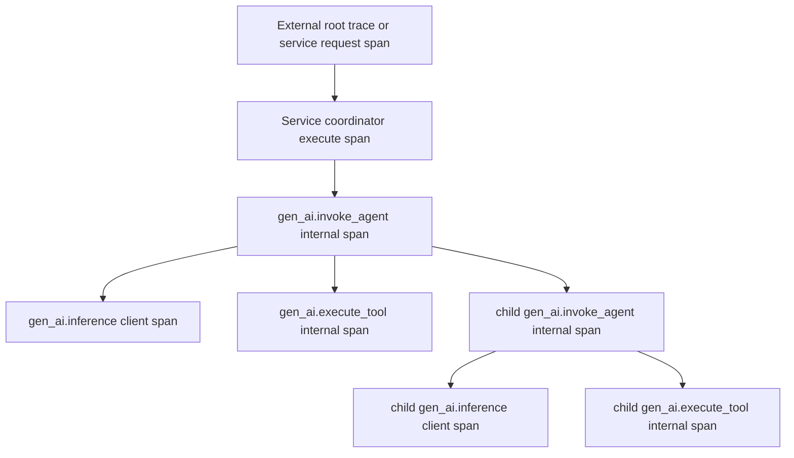
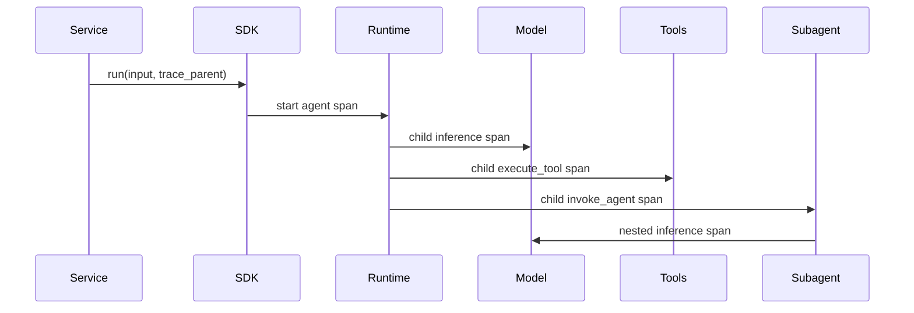
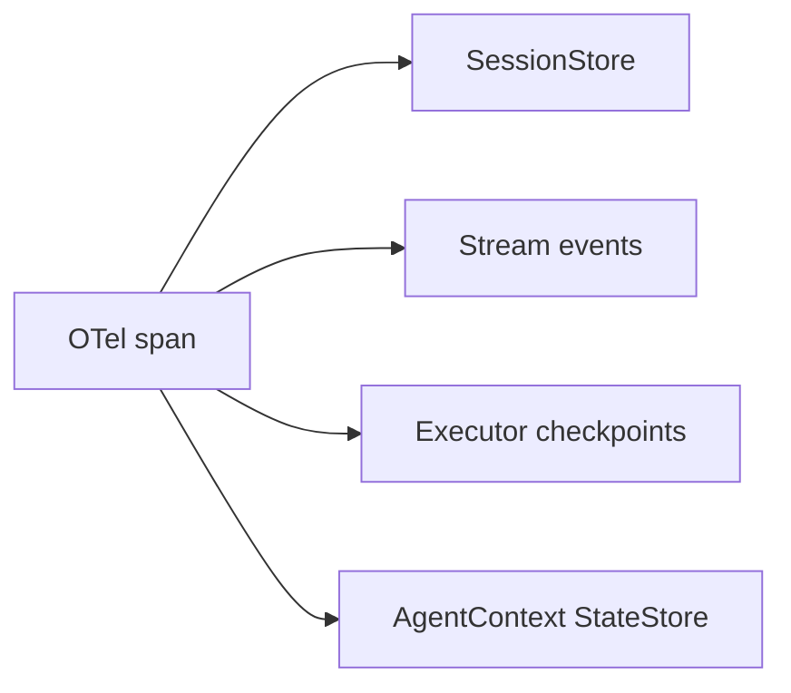

# Observability and Trace Semantics

Starweaver observability follows the latest OpenTelemetry GenAI semantic conventions while preserving a clean SDK boundary for custom collectors. The official recommendation is Langfuse through OTLP, and the same OTLP output can flow into other OpenTelemetry collectors.

## Goals

- Accept an externally supplied root trace or parent span context.
- Create stable spans for agent runs, model requests, tool executions, subagent delegation, and service execution.
- Attach Starweaver identifiers to spans so traces, persisted sessions, stream events, checkpoints, and run inspection APIs correlate.
- Keep canonical OpenTelemetry GenAI attributes as the primary telemetry contract.
- Add Langfuse-friendly extension attributes through an adapter layer.
- Let applications redact or truncate prompt, tool, and output content before export.

## Trace Shape



A service runtime such as `starweaver-claw` can create the coordinator span when an execution request enters the service. The SDK receives the parent context and starts the agent span under it. In a local SDK application, the SDK can create the root agent span directly.

## Span Types

| Operation               | OTel span kind | OTel semantic target              | Parent                                      |
| ----------------------- | -------------- | --------------------------------- | ------------------------------------------- |
| service coordinator run | internal       | service/runtime span              | external request span or root trace         |
| SDK agent run           | internal       | `gen_ai.invoke_agent.internal`    | service coordinator span or external parent |
| remote agent invocation | client         | `gen_ai.invoke_agent.client`      | current agent or workflow span              |
| model request           | client         | `gen_ai.inference.client`         | current agent span                          |
| tool execution          | internal       | `gen_ai.execute_tool.internal`    | current agent span                          |
| subagent delegation     | internal       | `gen_ai.invoke_agent.internal`    | parent agent span                           |
| workflow orchestration  | internal       | `gen_ai.invoke_workflow.internal` | application workflow span                   |
| memory operation        | client         | `gen_ai.memory.client`            | current agent or tool span                  |
| retrieval operation     | client         | `gen_ai.retrieval.client`         | current agent or tool span                  |

## OpenTelemetry Attributes

All GenAI spans should use OpenTelemetry attributes first:

- `gen_ai.operation.name`
- `gen_ai.provider.name`
- `gen_ai.request.model`
- `gen_ai.response.model`
- `gen_ai.response.finish_reasons`
- `gen_ai.conversation.id`
- `gen_ai.agent.id`
- `gen_ai.agent.name`
- `gen_ai.agent.description`
- `gen_ai.agent.version`
- `gen_ai.tool.name`
- `gen_ai.tool.call.id`
- `gen_ai.tool.description`
- `gen_ai.tool.type`
- `gen_ai.usage.input_tokens`
- `gen_ai.usage.output_tokens`
- `gen_ai.usage.cache_read.input_tokens`
- `gen_ai.usage.cache_creation.input_tokens`
- `gen_ai.response.time_to_first_chunk`
- `server.address`
- `server.port`
- `error.type`

Content attributes are opt-in and pass through a redaction policy:

- `gen_ai.system_instructions`
- `gen_ai.input.messages`
- `gen_ai.output.messages`
- `gen_ai.tool.definitions`
- `gen_ai.tool.call.arguments`
- `gen_ai.tool.call.result`

## Starweaver Correlation Attributes

Starweaver adds low-cardinality attributes for trace-to-state joins:

- `starweaver.session.id`
- `starweaver.run.id`
- `starweaver.parent_run.id`
- `starweaver.conversation.id`
- `starweaver.agent.id`
- `starweaver.agent.name`
- `starweaver.subagent.name`
- `starweaver.checkpoint.id`
- `starweaver.environment.provider.id`
- `starweaver.tool.bundle`
- `starweaver.capability.name`
- `starweaver.stream.cursor`

These attributes mirror persisted store identifiers and support ya-claw-style session APIs such as run trace, session turns, and execution inspection.

## Langfuse Adapter

Langfuse is the recommended trace backend. Starweaver should export standard OTLP spans and include Langfuse-friendly metadata through a small adapter:

- trace name from agent, workflow, or session title
- session id from `starweaver.session.id`
- user id from application metadata when supplied
- tags from profile, environment, tool bundle, and deployment metadata
- release/version from application or crate metadata
- observation type from span role: agent, generation, tool, retriever, evaluator, workflow
- model input/output and cost fields when the application enables content export

The adapter keeps Langfuse extensions additive. Collector-neutral OTLP remains the transport contract.

## Propagation API

SDK entry points should accept an optional trace parent:

```rust,ignore
let result = app
    .session(session_id)
    .with_trace_parent(trace_parent)
    .run("Investigate the failing test")
    .await?;
```

Runtime and model APIs should carry a trace context through `AgentContext` metadata and typed dependencies:



## SessionStore Integration

Observability links to durable state through `SessionStore` and `StateStore` identifiers. A ya-claw-style service can persist traces, compact trace projections, and runtime events separately while preserving the same correlation ids.



`SessionStore` should store trace ids and span ids on execution records. The store can expose a compact run trace projection for tools and UI while the external trace backend keeps the full nested timeline.

## Privacy and Sampling

Observability defaults should export structural metadata and usage. Prompt, tool arguments, tool results, model input/output, and system instructions require opt-in content export. The redaction policy should support truncation, JSON path removal, media reference substitution, and per-tool content rules.

Sampling decisions should receive span attributes at span creation time whenever available: provider name, operation name, model name, server address, server port, agent name, and conversation id.

## Acceptance Gates

- trace parent propagation tests
- agent span lifecycle tests
- model request span tests
- tool execution span tests
- nested subagent span tests
- error span status tests
- usage attribute mapping tests
- content redaction tests
- Langfuse adapter snapshot tests
- SessionStore trace id persistence tests
- OTLP exporter integration test behind a feature flag
