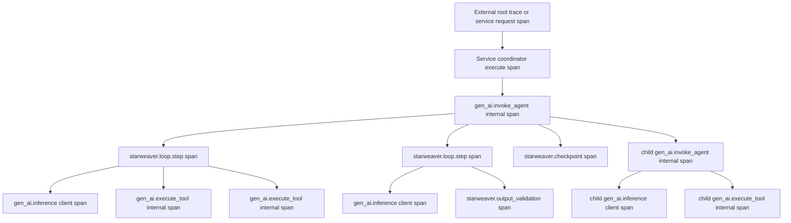
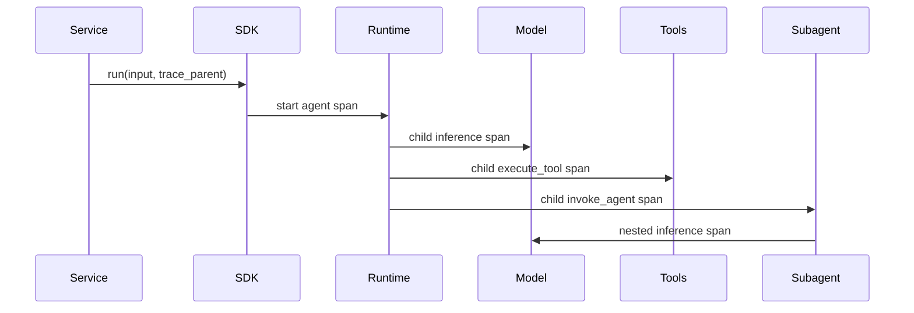
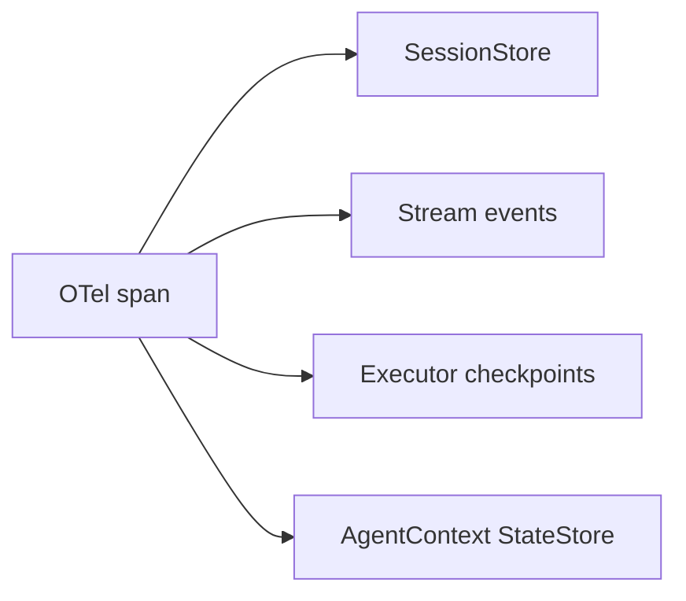

# Observability and Trace Semantics

Starweaver observability follows the latest OpenTelemetry GenAI semantic conventions while preserving a clean SDK boundary for custom collectors. The official recommendation is Langfuse through OTLP, and the same OTLP output can flow into other OpenTelemetry collectors.

## Goals

- Accept an externally supplied root trace or parent span context.
- Create stable spans for agent runs, model requests, tool executions, subagent delegation, and service execution.
- Attach Starweaver identifiers to spans so traces, persisted sessions, stream events, checkpoints, and run inspection APIs correlate.
- Keep canonical OpenTelemetry GenAI attributes as the primary telemetry contract.
- Add Langfuse-friendly extension attributes through an adapter layer.
- Let applications redact or truncate prompt, tool, and output content before export.

## Trace Shape

One trace should contain the complete agent loop as a nested span tree. `trace_id` remains stable across the run. Each runtime boundary creates a new `span_id`, and child boundaries set `parent_span_id` to the active parent span.



A service runtime can create the coordinator span when an execution request enters the service. The SDK receives the parent context and starts the agent span under it. In a local SDK application, the SDK can create the root agent span directly.

The loop-step span groups one model/tool/output iteration. Model and tool spans attach to the active loop-step span so trace viewers can show each loop turn with its model request, sibling tool calls, retries, output validation, and checkpoint evidence.

## Trace Levels and Content Policy

Starweaver uses two telemetry levels:

| Level | Default            | Purpose                                                 | Content policy                                                                                        |
| ----- | ------------------ | ------------------------------------------------------- | ----------------------------------------------------------------------------------------------------- |
| info  | yes                | Canonical model/runtime reconstruction                  | canonical internal request/response, structural tool and checkpoint evidence after redaction          |
| debug | application opt-in | Provider wire debugging and high-volume filter analysis | raw provider request/response/event-stream payloads and all-filter snapshots after stricter redaction |

The default info layer records the converted Starweaver model interface: canonical messages, settings, request parameters, tool definitions, canonical responses, usage, finish reason, and provider metadata. This layer is enough for most incident reconstruction because it captures the SDK-visible state after provider-neutral conversion.

The debug LLM-request layer records exact provider request bodies, merged HTTP options, provider responses, status metadata, and raw stream events before canonical parsing. Applications enable it only for targeted diagnostics because these payloads can be large and can include sensitive prompt or provider-specific content.

History compaction, compact filters, and capability filters use compact info spans when they change the request shape. A full all-filter trace can exist as a debug span/event stream that records every filter input/output snapshot. Exporters should sample and redact these debug events separately from the default span tree.

## Span Types

| Operation               | OTel span kind | OTel semantic target              | Parent                                      |
| ----------------------- | -------------- | --------------------------------- | ------------------------------------------- |
| service coordinator run | internal       | service/runtime span              | external request span or root trace         |
| SDK agent run           | internal       | `gen_ai.invoke_agent.internal`    | service coordinator span or external parent |
| runtime loop step       | internal       | `starweaver.loop.step`            | current agent span                          |
| remote agent invocation | client         | `gen_ai.invoke_agent.client`      | current agent or workflow span              |
| model request           | client         | `gen_ai.inference.client`         | current loop-step span                      |
| tool execution          | internal       | `gen_ai.execute_tool.internal`    | current loop-step span                      |
| output validation       | internal       | `starweaver.output_validation`    | current loop-step span                      |
| checkpoint              | internal       | `starweaver.checkpoint`           | current agent span or loop-step span        |
| subagent delegation     | internal       | `gen_ai.invoke_agent.internal`    | parent agent span                           |
| workflow orchestration  | internal       | `gen_ai.invoke_workflow.internal` | application workflow span                   |
| memory operation        | client         | `gen_ai.memory.client`            | current agent, loop-step, or tool span      |
| retrieval operation     | client         | `gen_ai.retrieval.client`         | current agent, loop-step, or tool span      |

## Runtime Span Recorder Contract

The runtime should depend on a small recorder abstraction before binding to any exporter. This keeps the core loop testable and allows the first implementation to use deterministic in-memory spans.

```rust,ignore
pub trait TraceRecorder: Send + Sync {
    fn start_span(&self, spec: SpanSpec, parent: &TraceContext) -> SpanHandle;
}

pub struct SpanHandle {
    pub context: TraceContext,
}
```

Recorder responsibilities:

- create child `TraceContext` values with the same trace id, a fresh span id, and the parent span id
- record span attributes at start time for sampling and backend indexing
- record span events for retries, stream milestones, checkpoints, approval, deferral, and content export decisions
- record success or error status and `error.type`
- close spans when the runtime boundary completes
- expose an `InMemoryTraceRecorder` for span-tree snapshot tests
- provide feature-gated adapters for `tracing`, OpenTelemetry, OTLP, and Langfuse-friendly metadata

Runtime propagation rules:

- the SDK/session trace parent starts the agent span
- the agent span context becomes the active run trace context
- each loop step starts from the active agent span context
- each model request receives the child inference span context through `ModelRequestContext`
- each tool execution receives the child tool span context through `ToolContext`
- each subagent receives a child agent span context and repeats the same nesting rules
- each checkpoint stores the active trace id and span id in resume evidence and future execution records

## Model and LLM Request Trace Contract

The runtime creates `gen_ai.inference` spans around every model call. The span uses client kind and carries low-cardinality provider/model attributes. Inside that span, the runtime records default info-level events:

- `starweaver.model.request`: canonical model messages, settings, request parameters, tool counts, native tool counts, and output-schema presence.
- `starweaver.model.stream_event`: canonical stream event records emitted by the model layer.
- `starweaver.model.response`: canonical model response, usage, finish reason, model name, and provider metadata.

The production protocol client may receive an optional debug recorder through `ModelRequestContext`. When supplied, it records debug-level spans/events for:

- exact HTTP request after provider adapter conversion, auth/config/override merge, and extra-body merge
- exact HTTP response before canonical parsing
- future provider stream chunks before canonical stream normalization

This split keeps the model layer reconstructable by default while preserving a precise wire-level diagnostic seam for provider bugs, gateway/audit issues, and replay fixture generation.

## Tool, Capability, and Filter Spans

The runtime creates `gen_ai.execute_tool` spans around each tool call. Tool spans include tool name, call id, arguments event, result event, error status, and control-flow metadata. Content-bearing attributes pass through the same redaction policy as model content.

Capability and filter spans use Starweaver namespaced operations:

- `starweaver.history.compaction` for compact capability/filter changes to canonical history
- `starweaver.filter.all` as a debug-level high-volume trace for every filter input/output pair
- future `starweaver.capability.<name>` spans for policy, approval, media upload, context injection, and environment instruction capabilities

Compact spans record before/after counts, hashes, policy names, and capability names by default. Full input/output snapshots are debug events.

## OpenTelemetry Attributes

All GenAI spans should use OpenTelemetry attributes first:

- `gen_ai.operation.name`
- `gen_ai.provider.name`
- `gen_ai.request.model`
- `gen_ai.response.model`
- `gen_ai.response.finish_reasons`
- `gen_ai.conversation.id`
- `gen_ai.agent.id`
- `gen_ai.agent.name`
- `gen_ai.agent.description`
- `gen_ai.agent.version`
- `gen_ai.tool.name`
- `gen_ai.tool.call.id`
- `gen_ai.tool.description`
- `gen_ai.tool.type`
- `gen_ai.usage.input_tokens`
- `gen_ai.usage.output_tokens`
- `gen_ai.usage.cache_read.input_tokens`
- `gen_ai.usage.cache_creation.input_tokens`
- `gen_ai.response.time_to_first_chunk`
- `server.address`
- `server.port`
- `error.type`

Content attributes are opt-in and pass through a redaction policy:

- `gen_ai.system_instructions`
- `gen_ai.input.messages`
- `gen_ai.output.messages`
- `gen_ai.tool.definitions`
- `gen_ai.tool.call.arguments`
- `gen_ai.tool.call.result`

## Starweaver Correlation Attributes

Starweaver adds low-cardinality attributes for trace-to-state joins:

- `starweaver.session.id`
- `starweaver.run.id`
- `starweaver.parent_run.id`
- `starweaver.conversation.id`
- `starweaver.agent.id`
- `starweaver.agent.name`
- `starweaver.subagent.name`
- `starweaver.checkpoint.id`
- `starweaver.environment.provider.id`
- `starweaver.tool.bundle`
- `starweaver.capability.name`
- `starweaver.stream.cursor`

These attributes mirror persisted store identifiers and support service session APIs such as run trace, session turns, and execution inspection.

## Langfuse Adapter

Langfuse is the recommended trace backend. Starweaver should export standard OTLP spans and include Langfuse-friendly metadata through a small adapter:

- trace name from agent, workflow, or session title
- session id from `starweaver.session.id`
- user id from application metadata when supplied
- tags from profile, environment, tool bundle, and deployment metadata
- release/version from application or crate metadata
- observation type from span role: agent, generation, tool, retriever, evaluator, workflow
- model input/output and cost fields when the application enables content export

The adapter keeps Langfuse extensions additive. Collector-neutral OTLP remains the transport contract.

## Propagation API

SDK entry points should accept an optional trace parent:

```rust,ignore
let result = app
    .session(session_id)
    .with_trace_parent(trace_parent)
    .run("Investigate the failing test")
    .await?;
```

Runtime and model APIs should carry a trace context through `AgentContext` metadata and typed dependencies:



## SessionStore Integration

Observability links to durable state through `SessionStore` and `StateStore` identifiers. A service host can persist traces, compact trace projections, and runtime events separately while preserving the same correlation ids.



`SessionStore` should store trace ids and span ids on execution records. The store can expose a compact run trace projection for tools and UI while the external trace backend keeps the full nested timeline.

## Privacy and Sampling

Observability defaults should export structural metadata and usage. Prompt, tool arguments, tool results, model input/output, and system instructions require opt-in content export. The redaction policy should support truncation, JSON path removal, media reference substitution, and per-tool content rules.

Sampling decisions should receive span attributes at span creation time whenever available: provider name, operation name, model name, server address, server port, agent name, and conversation id.

## Acceptance Gates

- trace parent propagation tests
- in-memory recorder span-tree snapshot tests
- agent span lifecycle tests
- loop-step span tests for model/tool/output iterations
- model request span tests
- tool execution sibling span tests
- output validation and retry span-event tests
- checkpoint span and resume evidence tests
- nested subagent span tests
- error span status tests
- usage attribute mapping tests
- content redaction tests
- Langfuse adapter snapshot tests
- SessionStore trace id persistence tests
- OTLP exporter integration test behind a feature flag
