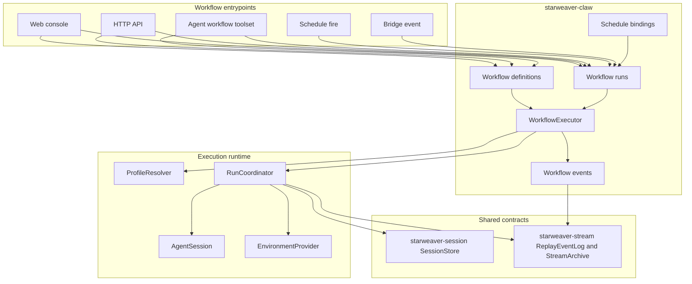
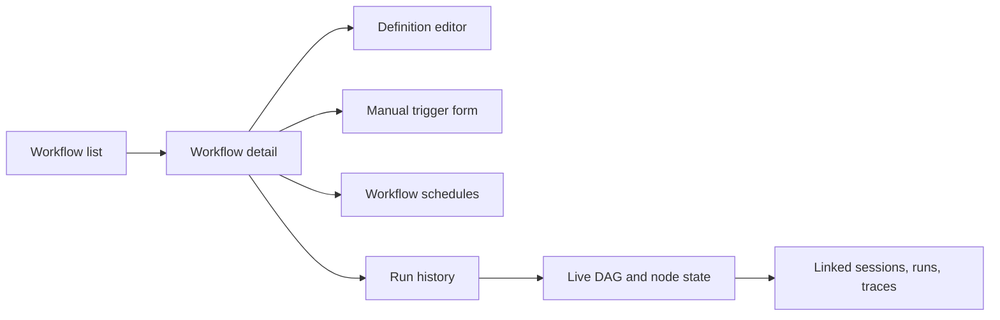

# Workflow Orchestration

Workflow orchestration is a durable `starweaver-claw` capability for defining, triggering, supervising, and replaying multi-step agent work. It builds on the shared `starweaver-session` and `starweaver-stream` contracts so workflow runs remain connected to ordinary sessions, runs, checkpoints, display messages, and trace evidence.

## Goals

- Treat workflows as first-class Claw resources with durable definitions, runs, node runs, and event history.
- Let agents discover, create, start, inspect, steer, cancel, and repair workflows through a built-in workflow toolset.
- Let service and web clients manage workflow definitions, manual triggers, run history, live node state, and workflow-specific schedule bindings.
- Reuse execution profiles as workflow node presets, with `Self` resolving to the supervising session profile.
- Reuse the normal session/run execution path for node work: profile resolution, environment binding, sandbox policy, approvals, deferred tool calls, stream archiving, and trace correlation.
- Project compact workflow progress back to supervising conversations and live service clients.

## Layer Position



`starweaver-claw` owns workflow orchestration state, product behavior, HTTP APIs, and executor coordination. `starweaver-runtime` stays focused on deterministic agent execution. `starweaver-agent` exposes agent sessions, profiles, and tool bundle ergonomics used by node execution.

## Resource Model

### WorkflowDefinition

A workflow definition is the reusable plan.

Fields:

- `workflow_id`
- `name`
- `description`
- `status`: `draft | active | archived`
- `definition_version`
- `schema_version`
- `owner_kind`: `user | agent | api | system`
- `owner_session_id`
- `owner_run_id`
- `scope`: `global | session`
- `tags`
- `when_to_use`
- `argument_hint`
- `input_schema`
- `definition`
- `metadata`
- `created_at`
- `updated_at`
- `archived_at`

The `definition` payload stores a JSON-compatible workflow document. YAML import and export are API and console conveniences over the same stored document.

### WorkflowRun

A workflow run is one execution attempt for a definition.

Fields:

- `workflow_run_id`
- `workflow_id`
- `workflow_version`
- `status`: `queued | running | waiting | completed | failed | cancelled`
- `trigger_kind`: `web | api | agent | schedule | bridge | system`
- `supervisor_session_id`
- `supervisor_run_id`
- `profile_name`
- `workspace_ref`
- `inputs`
- `result`
- `error_message`
- `current_node_ids`
- `created_at`
- `started_at`
- `finished_at`
- `updated_at`
- `metadata`

`supervisor_session_id` and `supervisor_run_id` connect an agent-triggered workflow to the conversation supervising it. Web and API triggers can bind a monitoring session explicitly.

### WorkflowNodeRun

A workflow node run maps one DAG node attempt to Claw session/run evidence.

Fields:

- `node_run_id`
- `workflow_run_id`
- `node_id`
- `attempt_no`
- `status`: `pending | ready | queued | running | waiting | completed | failed | cancelled | skipped`
- `profile_name`
- `session_id`
- `run_id`
- `input_parts`
- `output_text`
- `output_json`
- `error_message`
- `needs`
- `started_at`
- `finished_at`
- `updated_at`
- `metadata`

Node runs link back to shared session and stream records. This keeps workflow inspection, run replay, approval handling, and trace lookup on the same evidence graph used by ordinary agent runs.

### WorkflowEvent

Workflow events provide a replayable status stream.

Fields:

- `workflow_event_id`
- `workflow_run_id`
- `node_run_id`
- `source_kind`: `workflow | node | run | steer | system`
- `event_type`
- `payload`
- `created_at`

Node run stream records are projected into compact workflow events with links to original run traces and display messages.

## Definition Format

Definitions can be edited as YAML and stored as JSON.

```yaml
schema: starweaver.workflow.v1
name: Research Report
version: 1
description: Produce a multi-source research report.
when_to_use: Use for research, comparison, landscape analysis, and sourced report writing.
argument_hint: "{ topic: string, audience?: string }"
tags: [research, report]

inputs:
  type: object
  properties:
    topic:
      type: string
    audience:
      type: string
  required: [topic]

policy:
  max_concurrency: 3
  on_node_failure: fail_workflow

nodes:
  landscape:
    profile: Self
    prompt: |
      Research the landscape for {{ inputs.topic }}.
      Return concise findings with sources.

  technical:
    profile: Self
    prompt: |
      Analyze technical architecture and implementation details for {{ inputs.topic }}.

  synthesize:
    profile: Self
    needs: [landscape, technical]
    mode: continue
    prompt: |
      Synthesize results for {{ inputs.audience | default("engineering leadership") }}.
      Landscape: {{ nodes.landscape.output_text }}
      Technical: {{ nodes.technical.output_text }}

result:
  from_node: synthesize
```

Top-level fields:

| Field           | Purpose                                            |
| --------------- | -------------------------------------------------- |
| `schema`        | Workflow document schema, `starweaver.workflow.v1` |
| `name`          | Human-readable workflow name                       |
| `version`       | Definition version copied into each run            |
| `description`   | Catalog and run summary text                       |
| `when_to_use`   | Agent-facing discovery hint                        |
| `argument_hint` | Input shape hint for agents and forms              |
| `tags`          | Search, grouping, and policy metadata              |
| `inputs`        | JSON Schema for run inputs                         |
| `policy`        | Concurrency, retry, timeout, and failure behavior  |
| `nodes`         | DAG node map                                       |
| `result`        | Result projection rules                            |

Node fields:

| Field             | Default                 | Purpose                                              |
| ----------------- | ----------------------- | ---------------------------------------------------- |
| `profile`         | `Self`                  | Execution profile used for this node                 |
| `needs`           | `[]`                    | Parent nodes required before this node becomes ready |
| `mode`            | `isolate`               | Session/run mode for node execution                  |
| `prompt`          | required                | Template rendered from inputs and dependency outputs |
| `input_parts`     | generated from `prompt` | Structured input override                            |
| `retry_count`     | workflow policy         | Retry attempts for this node                         |
| `timeout_seconds` | workflow policy         | Node timeout                                         |
| `output_schema`   | empty                   | Optional JSON output schema                          |
| `metadata`        | empty                   | Node labels and UI hints                             |

## Profile Resolution

Workflow nodes use Claw execution profiles as presets.

- `Self` resolves to the supervising session/run profile for agent-triggered workflows.
- `Self` resolves to `workflow_runs.profile_name` for web, API, schedule, bridge, or system triggers.
- Named profiles resolve through the same profile resolver used by ordinary runs.

The workflow toolset should expose profile discovery helpers:

- `list_agent_presets(query: string | null)`
- `get_agent_preset(name: string)`

## Execution Semantics

Workflow lifecycle:

01. Create a `WorkflowRun` with `status="queued"`.
02. Snapshot definition version, inputs, profile, workspace binding, and supervisor provenance.
03. Claim the run in the single-node workflow executor.
04. Validate inputs against `input_schema`.
05. Build the DAG and mark root nodes `ready`.
06. Start ready nodes up to `policy.max_concurrency`.
07. Resolve each node profile, render prompt/input parts, then create or steer a Claw session/run.
08. Observe node run stream events until terminal state or wait state.
09. Store node output, status, and compact trace links.
10. Emit workflow events through `ReplayEventLog` and archive them through `StreamArchive` where service replay requires persistence.
11. Mark dependent nodes `ready` when their dependencies complete.
12. Project the workflow result from the configured result node or result expression.
13. Mark the workflow run terminal and publish completion events to service clients and supervising conversations.

Node execution modes:

| Mode       | Behavior                                                                      |
| ---------- | ----------------------------------------------------------------------------- |
| `isolate`  | Create a fresh workflow-private session and first run for the node            |
| `continue` | Continue the workflow run's shared session for sequential synthesis or review |
| `steer`    | Steer an active node/session while the target is running                      |
| `fork`     | Create a child session from a source session's latest successful run          |

The v1 default mode is `isolate` because it gives each node a clean durable history and direct failure boundary.

## Supervision and Events

Agent-triggered workflows are supervised by the session/run that called the workflow tool. The executor emits compact progress messages into the supervising conversation when the run is active, and stores replayable events for later inspection.

Workflow event types:

- `workflow.accepted`
- `workflow.started`
- `node.queued`
- `node.running`
- `node.output_available`
- `node.failed`
- `workflow.waiting`
- `workflow.completed`
- `workflow.failed`
- `workflow.cancelled`

Event delivery uses the same stream contracts as ordinary sessions:

- `ReplayEventLog` for live tail and reconnect
- `StreamArchive` for durable replay and compact snapshots
- `DisplayMessageProjector` for terminal, JSONL, web, and bridge-friendly projections
- OpenTelemetry trace context for workflow, node, model, and tool span correlation

## Built-in Workflow Toolset

The Claw runtime can inject a built-in workflow toolset into profiles that enable workflow management. The internal client carries session id, run id, resolved profile, workspace binding, and bearer auth outside model-visible arguments.

Suggested tools:

- `list_workflows(filters)`
- `get_workflow(workflow_id)`
- `create_workflow(definition)`
- `update_workflow(workflow_id, patch)`
- `archive_workflow(workflow_id)`
- `start_workflow(workflow_id, inputs, profile_name, metadata)`
- `list_workflow_runs(filters)`
- `get_workflow_run(workflow_run_id)`
- `watch_workflow_run(workflow_run_id, cursor)`
- `cancel_workflow_run(workflow_run_id)`
- `steer_workflow_node(workflow_run_id, node_id, instruction)`
- `retry_workflow_node(workflow_run_id, node_id)`

Ownership fields are assigned by the runtime. Agent-created definitions default to session scope, and agent-created runs record the supervising session/run provenance.

## Access and Filtering

Workflow management follows the same single-node auth posture as schedules. HTTP and web clients use configured bearer auth. Agents use a profile-enabled workflow toolset backed by an internal client.

List filters:

- `owner_kind`
- `owner_session_id`
- `supervisor_session_id`
- `trigger_kind`
- `scope`
- `status`
- `tags`
- `query`
- `created_by_current_session`
- `supervised_by_current_session`
- `touched_by_current_session`
- `only_current_session`
- `include_archived`
- `include_completed`

Agent tool defaults should surface global active workflows, workflows created by the current session, runs supervised by the current session, and recent runs touched by linked node sessions.

## API Surface

Initial HTTP API shape:

- `GET /api/workflows`
- `POST /api/workflows`
- `GET /api/workflows/{workflow_id}`
- `PATCH /api/workflows/{workflow_id}`
- `POST /api/workflows/{workflow_id}/archive`
- `GET /api/workflow-runs`
- `POST /api/workflows/{workflow_id}/runs`
- `GET /api/workflow-runs/{workflow_run_id}`
- `GET /api/workflow-runs/{workflow_run_id}/events`
- `POST /api/workflow-runs/{workflow_run_id}/cancel`
- `POST /api/workflow-runs/{workflow_run_id}/nodes/{node_id}/steer`
- `POST /api/workflow-runs/{workflow_run_id}/nodes/{node_id}/retry`

The API returns compact session/run links so clients can jump from workflow state to ordinary run replay.

## Schedule Integration

Workflow schedules are schedule records with `execution_mode="workflow"` and a target workflow id. Schedule fire records should link to the created workflow run.

The workflows console owns workflow-specific schedule create/edit/pause/resume/delete actions. A schedules console can still show fire history and cross-link to workflow run detail.

## Workflows Console

The service console should expose a dedicated workflows surface:



Workflow detail should include definition summary, editable document, input schema, trigger form, schedule bindings, run history, live DAG state, event log, result projection, cancel controls, steer controls, and linked session/run replay.

## Implementation Plan

1. Add workflow resource records and migrations in `starweaver-claw` storage adapters.
2. Add workflow definition parsing, validation, and template rendering.
3. Add a single-node `WorkflowExecutor` that drives DAG readiness and uses the existing run coordinator for node execution.
4. Add workflow event projection into `ReplayEventLog` and durable archives.
5. Add workflow APIs and internal controller methods.
6. Add built-in workflow toolset wiring for enabled profiles.
7. Add schedule bindings for `execution_mode="workflow"`.
8. Add console views for definitions, schedules, run history, and live DAG state.
9. Add tests for definition validation, node scheduling, profile resolution, event projection, cancellation, retry, schedule trigger, and agent tool ownership.
