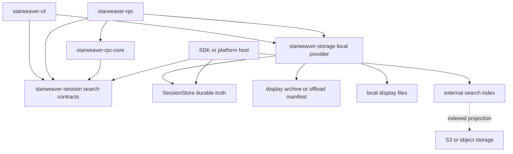
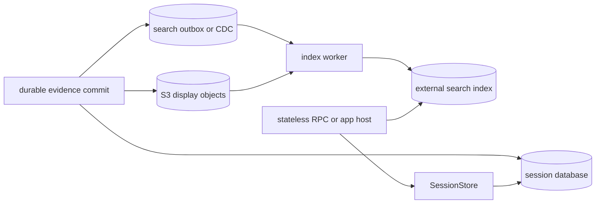

# Pluggable Session Search

Status: implemented Phase 1; Phase 2 and external Phase 3 remain follow-ons

Revision: 2026-07-14

## Implementation Status

The in-repository Phase 1 acceptance scope is implemented:

- `starweaver-session` owns provider/query/filter/scope/result/capability/coverage/error/cursor contracts plus optional idempotent mutation-writer contracts and conformance fakes;
- `starweaver-storage::LocalSessionSearchProvider` reads canonical session/run records, projects only textual input and bounded output preview, and optionally scans validated `display.compact.json` mirrors in process with fixed-string semantics and file/count/byte bounds;
- local cursors are authenticated opaque values bound to normalized query, authorization scope, provider, corpus generation, and page position;
- `sw session search` supports human, JSON, JSONL-compatible, and silent output without changing the current session;
- standalone RPC owns independent configuration, provider construction, `session.search`, read authorization, error mapping, and conditional feature/capability negotiation;
- `starweaver-rpc-core` owns the typed host DTO projection.

SQLite FTS/materialized-index migrations and external production backends remain Phase 2/3 follow-ons. No external index dependency is part of the implemented baseline. Current display mirrors are still non-authoritative, so missing or unsafe mirrors report partial coverage while canonical metadata/input/output results remain valid.

This spec defines an optional, product-neutral way to discover previously persisted Starweaver sessions by metadata and user-visible text. The same query contract is consumed independently by CLI/TUI, the standalone RPC product, SDK applications, and future stateless service hosts.

The first concrete backend is local: SQLite remains the durable source of truth, while a bounded ripgrep-compatible scan can find eligible text in local display-message offload files. Remote object storage such as S3 requires a separate index; a stateless server queries that index through the same interface and does not list or download the object store on every request.

## Decision

Introduce a standalone read capability, tentatively named `SessionSearchProvider`, rather than adding search methods to `SessionStore`.

- `SessionStore` remains the canonical durable-state, resume, checkpoint, and atomic-evidence contract. Authorized lifecycle CRUD and active-run control belong to the host session-management service defined in `08-agent-session-management.md`.
- `SessionSearchProvider` is optional, read-only from the caller's perspective, and assembled at the application/product composition root beside the store.
- Shared query, result, capability, location, completeness, and error types belong in `starweaver-session`.
- The local SQLite plus filesystem implementation belongs in `starweaver-storage`.
- CLI and RPC inject the interface independently. Neither product imports the other product's service, configuration, or local-store wrapper.
- `starweaver-rpc-core` owns only the typed JSON-RPC projection for `session.search`.
- External index implementations may live in application or platform crates and need not depend on `rusqlite` or local filesystem types.
- Search results are discovery projections, never restore state, authority, or durable truth. Any follow-up `show`, `replay`, `resume`, or mutation reloads the canonical session/run and reauthorizes the target through the host session-management service.

Search is an application capability because it composes several durable domains and policies. It is not part of the agentic loop, model protocol, mutable `AgentContext`, or environment provider.

## Goals

- Search historical sessions by title, canonical text input, output preview, and eligible display-message text.
- Retain ordinary metadata filtering and browsing when no text query is supplied.
- Let hosts replace local search with PostgreSQL FTS, OpenSearch, Tantivy, a vector service, or another implementation without changing CLI/RPC semantics.
- Support local display-message offload with SQLite metadata plus bounded filesystem scanning.
- Support stateless hosts whose display payloads are in S3 or another object store and whose searchable projection is maintained elsewhere.
- Make provider availability, supported query modes, freshness, partial results, and cursor invalidation explicit.
- Preserve CLI/RPC product independence and existing storage layering.
- Default to a small, redacted, user-visible search projection rather than indexing arbitrary durable JSON.

## Non-goals

- Replacing `SessionStore`, `StreamArchive`, or `ReplayEventLog`.
- Treating an index hit as proof that a session is resumable or still exists.
- Searching raw checkpoints, complete `ResumableState`, environment state, credentials, arbitrary metadata, inline binary, or opaque resource contents by default.
- Fetching every S3 object during an interactive query.
- Defining a general object-store, media-store, or signed-URL API.
- Requiring semantic/vector search in the common contract. It can be an advertised extension after lexical behavior is stable.
- Making CLI a client of RPC, or reusing CLI handlers/configuration inside RPC.
- Making run ids globally unique. Search identities always include the owning session.

## Current-State Constraint

Current shared SQLite storage persists session/run records and display/replay evidence as versioned JSON rows. It has no FTS index. The existing `SessionFilter` supports only exact `status`, `profile`, and `workspace` filters plus a limit, and current SQLite filtering decodes records before filtering.

Current CLI filesystem artifacts such as `display.compact.json` are post-commit compatibility mirrors. They can be absent or stale and are not canonical references from durable records. The first implementation may scan them as a best-effort content source, but it must report partial completeness when they are missing and must not infer resumability from them.

Before an offloaded file becomes authoritative display storage, the storage/stream path must persist a locator, digest, encoding, projection version, and lifecycle policy. This search design supports that target model without retroactively declaring current mirrors authoritative.

## Ownership and Dependency Shape



Allowed dependency direction:

```text
starweaver-cli ─┬─> starweaver-session
                └─> starweaver-storage

starweaver-rpc ─┬─> starweaver-rpc-core
                ├─> starweaver-session
                └─> starweaver-storage

starweaver-storage ─> starweaver-session
```

Forbidden direction remains:

```text
starweaver-cli <-> starweaver-rpc
starweaver-session -> starweaver-storage
starweaver-session -> product configuration or handlers
```

No new crate is required for the first implementation. A separate search crate should be considered only if multiple substantial index adapters need dependencies that do not belong in `starweaver-storage` or an application/platform crate.

## Shared Query Contract

The public names below are provisional, but the separation is normative:

```rust
#[async_trait]
pub trait SessionSearchProvider: Send + Sync {
    fn capabilities(&self) -> SessionSearchCapabilities;

    async fn search(
        &self,
        scope: &SessionSearchScope,
        query: SessionSearchQuery,
    ) -> Result<SessionSearchPage, SessionSearchError>;
}
```

`SessionSearchProvider` does not extend `SessionStore`. A provider implementation can own `Arc<dyn SessionStore>`, archive readers, a local scanner, an HTTP index client, tenant authorization policy, or any combination required by that host.

### Query

```rust
pub struct SessionSearchQuery {
    pub text: Option<String>,
    pub filter: SessionSearchFilter,
    pub sources: BTreeSet<SessionSearchSource>,
    pub granularity: SessionSearchGranularity,
    pub sort: SessionSearchSort,
    pub limit: u32,
    pub cursor: Option<String>,
}
```

The common baseline supports literal lexical text, not caller-supplied regular expressions. A provider must reject unsupported modes rather than silently changing semantics.

`SessionSearchFilter` should cover stable, typed fields:

- session status;
- run status when run/display sources are selected;
- profile;
- workspace;
- created/updated time range;
- an optional explicit session-id set for constrained lookup;
- display visibility classes allowed by the host policy.

Arbitrary JSONPath or metadata predicates are excluded from the baseline. A future extension may add typed, allowlisted metadata keys.

`SessionSearchSource` initially includes:

- `session_metadata` — title and approved metadata projections;
- `run_input` — canonical textual input parts;
- `run_output_preview` — bounded persisted preview text;
- `display_message` — eligible persisted/offloaded display text.

The default sources are `session_metadata`, `run_input`, `run_output_preview`, and user-visible `display_message`. Raw runtime stream records, internal diagnostics, tool arguments/results, resource bodies, and arbitrary payload fields are excluded unless an application explicitly installs a broader projection policy.

`SessionSearchGranularity` supports:

- `session` — default; one result per session using its best match;
- `run` — one result per `(session_id, run_id)`;
- `occurrence` — individual match locations when the provider advertises this capability.

A text-free query is a paginated metadata browse. Existing `SessionStore::list_sessions` remains valid and does not require a search provider; products should not make ordinary session listing depend on optional full-text search.

### Sorting and Pagination

Default ordering is:

- text query: provider relevance descending, then session `updated_at` descending, then stable identity;
- metadata-only query: session `updated_at` descending, then `session_id` descending.

Provider scores are meaningful only within one query and provider generation. They must not be persisted as durable evidence or compared across providers.

The cursor is opaque and must bind at least:

- provider/cursor format version;
- normalized query fingerprint;
- sort position and stable identity tie-breaker;
- index or local-corpus generation when required;
- tenant/authorization scope without exposing it to the caller.

A cursor is not a SQLite row id, filesystem path, S3 key, or RPC transport cursor. Providers may expire cursors or reject them after an index generation change, but must return `invalid_cursor` rather than restart from page one.

## Result Contract

```rust
pub struct SessionSearchPage {
    pub hits: Vec<SessionSearchHit>,
    pub next_cursor: Option<String>,
    pub coverage: SessionSearchCoverage,
}

pub struct SessionSearchHit {
    pub session: SessionSearchSummary,
    pub run_id: Option<RunId>,
    pub source: SessionSearchSource,
    pub location: SessionSearchLocation,
    pub snippet: Option<SessionSearchSnippet>,
    pub score: Option<f64>,
    pub matched_at: Option<DateTime<Utc>>,
}
```

`SessionSearchSummary` is a minimal stable projection containing session id, title, status, profile, workspace display value, created/updated timestamps, and optional run status/preview. It must not embed `ResumableState`, checkpoints, environment state, full arbitrary metadata, credentials, or complete tool payloads.

`SessionSearchLocation` preserves provenance:

- session identity;
- optional run identity, always paired with session identity;
- source family;
- for display occurrences, the owning archive scope, source agent/run ids, display sequence, and family-aware cursor when one exists;
- an opaque document/occurrence id for diagnostics and deduplication.

The owning archive scope and the `DisplayMessage` source run are different concepts and must not be collapsed. A parent run can archive a message emitted by a child run. Similarly, a `run_id` is not assumed globally unique outside its session.

Snippets are bounded plain text. Highlight ranges use offsets into the returned snippet rather than backend-generated HTML. Providers must not return local paths, object keys, signed URLs, raw serialized JSON lines, or text outside the approved projection.

### Coverage and Freshness

Every page reports coverage, even when there are no hits:

```rust
pub struct SessionSearchCoverage {
    pub state: SessionSearchCoverageState,
    pub searched_sources: BTreeSet<SessionSearchSource>,
    pub unavailable_sources: BTreeSet<SessionSearchSource>,
    pub indexed_through: Option<DateTime<Utc>>,
    pub generation: Option<String>,
    pub warnings: Vec<SessionSearchWarning>,
}
```

Coverage states are:

- `complete` — all requested sources were searched for the provider's declared corpus;
- `eventually_consistent` — the provider accepted the query but may lag canonical writes; a watermark is returned when available;
- `partial` — a source was missing, unreadable, timed out, exceeded scan limits, or was intentionally skipped;
- `degraded` — results were produced through a fallback path after an index failure.

`partial`, `eventually_consistent`, and `degraded` are not equivalent to no matches. CLI and RPC must preserve these states rather than returning a bare empty list.

## Capabilities and Errors

`SessionSearchCapabilities` advertises at least:

- supported query modes (`literal`, optional `phrase`, optional `prefix`, optional `semantic`);
- searchable source families;
- supported filters, granularities, and sort orders;
- whether occurrence locations, snippets, scores, and freshness watermarks are available;
- maximum page size;
- consistency class (`read_through`, `transactional_index`, or `eventual_index`).

The baseline interoperability mode is case-insensitive literal lexical matching over normalized Unicode text. Exact tokenizer, stemming, phrase, prefix, fuzzy, regex, and semantic behavior must be capability-gated. In particular, the common `text` field is never interpreted as a shell expression or regular expression.

Required error categories:

- `invalid_query` — invalid limits, incompatible filters, or malformed input;
- `invalid_cursor` — expired, wrong-query, wrong-provider, or wrong-generation cursor;
- `unsupported` — requested source/mode/filter/granularity is not advertised;
- `unavailable` — configured provider or required index cannot serve the request;
- `permission_denied` — caller scope cannot query the requested corpus;
- `failed` — bounded internal failure with a safe diagnostic.

A product with no provider installed reports search as unsupported. It must not return an empty successful page. A temporarily unhealthy configured provider reports unavailable. Provider health and search coverage must never expose credentials, index endpoints containing secrets, local absolute paths, or raw indexed content.

## Authorization Scope

The provider call receives the host-constructed `SessionSearchScope` separately from the user-controlled query, as shown in the shared trait above.

The scope carries an opaque namespace/tenant boundary and policy fingerprint established by the application. It is not accepted directly from CLI flags or RPC params. Local single-user products use a local-store scope. Agent-facing callers derive or wrap this scope from the host-constructed `AgentSessionScope` in `08-agent-session-management.md`; neither scope accepts owner or namespace authority from model arguments.

Authorization filtering must happen in, or before, index evaluation. Fetching cross-tenant hits and filtering them only after ranking is not acceptable because counts, timing, snippets, and cursors can leak hidden sessions. Cursor fingerprints include the authorization scope. A returned hit still undergoes canonical reload and resource authorization before replay, resume, steering, interruption, update, or deletion.

## Search Projection Policy

Search indexes projections, not arbitrary durable records. The default projection is:

| Source     | Included by default                                         | Excluded by default                                                           |
| ---------- | ----------------------------------------------------------- | ----------------------------------------------------------------------------- |
| Session    | title, status, profile, workspace display value, timestamps | arbitrary metadata values, environment refs                                   |
| Run input  | textual `InputPart` values                                  | inline bytes, data URLs, opaque resource bodies                               |
| Run output | bounded output/structured preview text                      | full structured payload and hidden validator evidence                         |
| Display    | user-visible text and approved assistant text previews      | internal/diagnostic visibility, raw tool args/results, arbitrary payload JSON |
| Resource   | media type, safe display name when approved                 | URI query strings, signed URLs, downloaded object contents                    |

Hosts can install a stricter projection and redaction policy. Broader indexing is opt-in and must be visible in provider capabilities/diagnostics. The projection should reuse stream sanitization helpers where possible, but search policy remains independently testable because display-safe is not automatically search-safe.

Sensitive values are removed before they reach an external index. Query logs, traces, and metrics record lengths, modes, timings, and counts, not raw query text or snippets unless the host explicitly enables a protected audit policy.

## Local SQLite and Filesystem Provider

The first concrete implementation belongs in `starweaver-storage` and composes:

- `SessionStore`/SQLite for authoritative session/run existence, typed metadata, filters, and follow-up loading;
- display archive/offload locators for content provenance;
- a `LocalContentScanner` for approved local text files;
- the shared projection/redaction policy.

### Query Flow

1. Validate the query, capability request, page size, cursor, and local scope.
2. Select candidate sessions/runs from SQLite using indexed typed columns or bounded JSON projection while migrations are introduced.
3. Search only known display/offload files under the configured root.
4. Treat ripgrep output as a candidate locator, then parse the durable/display format and reapply the approved projection. Never return a raw JSON match line.
5. Join matches back to canonical `(session_id, run_id)` records and discard deleted or inaccessible rows.
6. Deduplicate repeated content across display archive, replay, snapshot, and compatibility mirrors by stable source identity.
7. Rank, cap snippets, apply stable tie-breakers, and encode an opaque next cursor.
8. Report missing files, scan limits, parse failures, or stale mirrors through coverage.

The preferred scanner is ripgrep-compatible fixed-string search, either through a linked library or a safely spawned `rg` process. If a process is used:

- arguments are passed directly without a shell and use an invocation equivalent to `rg --no-config --fixed-strings --regexp <query> -- <validated-paths>`;
- `--no-config`, explicit `--regexp`, and the `--` path separator are mandatory so option-like queries and paths cannot alter invocation semantics;
- the subprocess receives a controlled environment that removes or neutralizes `RIPGREP_CONFIG_PATH` and unrelated user configuration;
- fixed-string mode is mandatory for baseline queries;
- candidate paths are derived from validated durable ids and a configured root, never from query text;
- path traversal and symlink escape are rejected;
- file count, total bytes, output bytes, wall time, and concurrency are bounded;
- a missing `rg` binary either selects an in-process bounded fallback or makes the display source unavailable; it never silently searches different fields.

Current CLI compatibility mirrors are best-effort sources. SQLite metadata results remain valid when a mirror is missing, while a request that includes display content reports partial coverage. Once authoritative offload manifests land, only manifest-addressed objects/files participate in the declared complete corpus.

### Local Scale Path

Filesystem scanning is the bootstrap implementation, not a requirement for every local deployment. The same provider can later use SQLite FTS5 or a local Tantivy index without changing callers.

A local materialized index should store one redacted document per stable source identity, with filter/sort columns outside the text body. Its index schema and tokenizer version form part of the generation. A migration or policy change triggers a rebuild rather than ad hoc interpretation of older rows.

## Index Ingestion Contract

Remote/object-storage deployments need an ingestion seam in addition to the read provider. The product-neutral mutation shape belongs with session search contracts; concrete dispatchers and index clients belong in storage, application, or platform layers.

Tentative contracts:

```rust
#[async_trait]
pub trait SessionSearchIndexWriter: Send + Sync {
    async fn apply(
        &self,
        mutations: &[SessionSearchMutation],
    ) -> Result<SessionSearchCheckpoint, SessionSearchIndexError>;
}
```

A mutation contains a stable event id, monotonic source revision, projection version, operation, scope, and redacted document or tombstone. Operations cover:

- upsert session projection;
- upsert run projection;
- upsert display occurrence/batch projection;
- delete run projection;
- delete/tombstone session projection;
- generation reset/rebuild boundary.

The writer contract is optional for applications whose index is maintained out of process. Implementing `SessionSearchProvider` is sufficient for reading; implementing the writer gives Starweaver-managed publication a common target.

### Mutation Production

Every search-relevant durable mutation must be represented, including:

- session create/save, status/title/profile/workspace update;
- run append/update and terminal preview update;
- atomic run-evidence/display commit;
- run prune;
- session delete/tombstone;
- projection/redaction policy version change.

The existing stream publication outbox is not a complete search change feed because it does not cover every session mutation. A local materialized index can update in the same SQLite transaction. An external index uses a dedicated durable search outbox or an equivalent transactional CDC source.

Publication rules:

1. Commit canonical durable evidence and the search mutation/outbox row atomically where the store permits it.
2. Publish idempotently by event id and document revision.
3. Acknowledge the outbox only after the index durably accepts the mutation.
4. Never let an older retry overwrite a newer document revision.
5. Publish deletes as tombstones and retain them long enough to defeat delayed upserts.
6. Expose backlog age/watermark as search freshness, not as a successful fully-current result.

Search indexing is allowed to fail without rolling back an already committed run when publication is asynchronous. The failure remains durable and retryable in the outbox.

## Object Storage and Stateless Hosts

S3 or another object store can hold authoritative display payloads, but it is not the interactive search index. A stateless server must not recursively list a bucket or download candidate objects on each query.

The target shape is:



The object locator is backend-private. The indexed document keeps stable Starweaver identities, a content digest, projection version, safe text, filter fields, and an opaque archive locator only when required by the indexer. Query results expose Starweaver session/run/display locations, not S3 keys or signed URLs.

An external implementation is responsible for tenant isolation, index credentials, retention, regional placement, encryption, and its own operational dependencies. It must still implement common capability, cursor, coverage, minimal-hit, and error semantics.

If object upload and database commit cannot share a transaction, the durable manifest records upload state explicitly. The indexer publishes a document only after the referenced object is durable and digest-verified. Missing objects produce retryable ingestion failures and an eventual/partial watermark, not fabricated complete coverage.

## Rebuild and Reconciliation

Every indexed backend must support a deterministic rebuild from canonical durable evidence or an application-owned export of that evidence.

A rebuild:

1. allocates a new index generation;
2. scans sessions/runs in stable keyset order;
3. resolves only approved display/offload sources;
4. applies the current projection and redaction version;
5. records malformed/unavailable evidence without aborting unrelated sessions;
6. catches up mutations committed after the scan watermark;
7. atomically switches reads to the new generation;
8. retires the old generation after active cursors expire.

A reconciliation job compares durable source revisions/digests against indexed revisions and repairs missing documents and tombstones. It is required for an external eventually consistent backend and recommended for local materialized indexes.

Unknown durable schema versions are not coerced through generic JSON. They are isolated, reported in coverage/diagnostics, and left for a compatible reader or migration.

## CLI Product Integration

The CLI independently composes an optional provider from CLI configuration and its selected local store:

```rust
struct CliService {
    // existing CLI-owned fields
    session_search: Option<Arc<dyn SessionSearchProvider>>,
}
```

Proposed command:

```bash
sw session search "oauth refresh"
sw session search "tool failed" --workspace . --status active
sw session search "summary" --source display --limit 20
sw session search --profile coding --after <opaque-cursor>
```

Baseline flags:

- optional positional text query;
- exact `--status`, `--profile`, and `--workspace` filters;
- repeatable `--source`;
- `--granularity session|run|occurrence` when supported;
- `--limit` with a product maximum;
- opaque `--after` cursor;
- existing management output modes, including a stable JSON projection.

Human output shows session id, optional run id, title, updated time, source, bounded snippet, and a warning when coverage is not complete. JSON output preserves `hits`, `nextCursor`, and `coverage` without rendering backend paths.

Search does not implicitly change the current session or resume a run. Users pass a returned id to existing `session show`, `session replay`, or `resume` flows. This avoids ambiguous automation and keeps search read-only.

`session list` continues to work without a search provider. `session search` with no configured provider exits with a distinct unsupported-capability error; zero matches is a successful empty page.

CLI local defaults may install the SQLite/filesystem provider automatically when the selected store is local. Database path and display/offload root come from CLI-owned configuration. A filesystem root must correspond to the selected database namespace; mismatched roots are rejected or reported as unavailable rather than mixed into one result set.

## Standalone RPC Integration

The RPC product independently injects the provider into `RpcService`, not `RpcRuntimeCoordinator`. Search is a read operation over durable evidence, not active-run coordination.

The proposed host method is `session.search`. Its typed request/result DTOs belong in `starweaver-rpc-core` and project the shared domain types into host-protocol casing and versioning.

Example request:

```json
{
  "jsonrpc": "2.0",
  "id": "search_1",
  "method": "session.search",
  "params": {
    "query": "oauth refresh",
    "filters": {
      "status": ["active"],
      "workspace": "/workspace/project"
    },
    "sources": ["session_metadata", "run_input", "display_message"],
    "granularity": "session",
    "limit": 20,
    "cursor": null
  }
}
```

Example result:

```json
{
  "hits": [
    {
      "session": {
        "sessionId": "session_...",
        "title": "OAuth refresh investigation",
        "status": "active",
        "updatedAt": "2026-07-14T12:00:00Z"
      },
      "runId": "run_...",
      "source": "display_message",
      "snippet": {
        "text": "...refresh supervisor retried the token...",
        "highlights": [{"start": 3, "end": 10}]
      }
    }
  ],
  "nextCursor": null,
  "coverage": {
    "state": "complete",
    "searchedSources": ["session_metadata", "run_input", "display_message"],
    "unavailableSources": []
  }
}
```

RPC rules:

- advertise the `session.search` feature only when a provider is installed;
- optionally include detailed provider capabilities in `initialize` without exposing backend topology or credentials;
- require the existing `read` authorization scope;
- derive tenant/store scope from the authenticated server context, never from request params;
- return `unsupported_feature` when no provider or requested query capability exists;
- map malformed/wrong-query cursors to invalid params and provider outages to a typed safe server error;
- cap request text, source count, page size, query time, and response bytes;
- never return full `SessionRecord`, `RunRecord`, local paths, index endpoints, object locators, or unredacted durable payloads in a search hit.

The method remains proposed until implementation and conformance tests update `spec/ops/06-json-rpc-host-protocol.md`. It is not retroactively part of the currently implemented host protocol v1 method table.

RPC uses only `rpc.toml` and RPC-owned environment overrides. It never reads CLI search configuration or `CliConfig`. Likewise, CLI never calls `session.search` merely to implement local search.

## Configuration Model

Configuration selects an implementation; it does not alter the shared query contract. Exact keys graduate with implementation, but products need to express:

- enabled/disabled state;
- backend kind (`local` or an application-provided external backend);
- local database namespace and optional authoritative/compatibility display root;
- projection/redaction policy selection;
- scan/index limits and timeout;
- external endpoint/credential references without exposing secret values;
- rebuild/reconciliation controls outside request handling.

The provider is optional. Default behavior for the first product implementation is:

- CLI: install local metadata search for the selected SQLite store; enable display-file search only when a validated local root is available;
- RPC: install local metadata search for its selected SQLite store; enable filesystem content search only when RPC-owned configuration provides the matching root;
- stateless service: require an explicitly configured external provider for text search.

CLI and RPC currently choose different database defaults. They search the same sessions only when operators explicitly configure them against the same durable store and compatible display/offload corpus. No cross-product discovery is implied by installation on the same machine.

## Consistency and Failure Semantics

Canonical durable storage wins every conflict:

- a hit whose session was deleted from `SessionStore` is suppressed;
- a stale title/status may be repaired in the response from canonical metadata and queued for reindex;
- a stale content snippet is not returned if its source digest/revision no longer matches;
- a session present in canonical storage but absent from an eventual index may be missing until the advertised watermark catches up;
- a filesystem mirror failure does not make a canonical session non-resumable;
- search failure does not prevent ordinary session CRUD, replay, or resume.

Providers do not silently fall back between materially different query semantics. An application may compose an explicit fallback provider, but the response then reports `degraded` coverage and the actual searched sources.

Index health belongs in product diagnostics. Recommended fields are provider kind, capability summary, generation, indexed-through watermark, pending mutation count/age, last successful reconciliation, and redacted last error category.

## Performance and Resource Bounds

Every product establishes limits below or equal to provider capabilities:

- maximum query bytes and normalized code points;
- maximum page size and snippet bytes;
- maximum candidate sessions/runs;
- local files, total input bytes, scanner output bytes, subprocesses, and wall time;
- external request deadline and retry budget;
- total RPC/CLI JSON response bytes.

Local filesystem scans must remain cancellable. SQLite work uses the storage crate's blocking boundary rather than occupying asynchronous runtime workers. External requests inherit caller cancellation and one absolute deadline; retries do not reset it.

No API promises an exact total result count. Exact counts can be expensive, stale, or information-sensitive. Pagination uses `next_cursor` only.

## Observability

Search emits product-neutral measurements without raw content:

- query mode, requested/searched source families, granularity, and result count;
- provider kind, coverage state, latency, timeout/cancellation, and error category;
- index generation/watermark and outbox lag where available;
- local scan candidate/file/byte counts;
- rebuild/reconciliation progress and failures.

Trace/session correlation may include safe session ids for a selected hit only under the host's observability policy. Raw query text, snippets, display payloads, signed URLs, file paths, and credentials are excluded from default logs and spans.

## Implementation Plan

### Phase 1: Shared contract and bounded local search (implemented)

1. Shared search query/result/capability/scope/error/cursor and optional writer contracts live in `starweaver-session`, with cursor and delayed-write conformance tests.
2. `starweaver-storage` provides canonical SQLite record search plus bounded in-process fixed-string scanning for validated display files.
3. Filesystem completeness remains explicit because current CLI mirrors are not authoritative.
4. `sw session search` provides human and stable JSON output with opaque pagination.
5. `starweaver-rpc-core` and standalone RPC provide typed DTOs, conditional feature negotiation, RPC-owned configuration/scope, read authorization, and handler/error integration.

### Phase 2: Durable local index

1. Add typed search projection columns/tables and FTS or another local index through canonical storage migrations.
2. Add stable document revisions, tombstones, projection version, generation, and rebuild tooling.
3. Integrate search-relevant writes with the canonical transaction or a dedicated local outbox.
4. Remove full-record scans from the normal indexed path while retaining deterministic rebuild.

### Phase 3: External/stateless indexing

This phase is an independent follow-on RFC/implementation track. It is not an acceptance gate for async subagents, CLI query-only session tools, RPC session control, or the bounded local search provider.

1. Stabilize `SessionSearchMutation` and writer conformance tests from concrete local evidence.
2. Add a durable search outbox/CDC adapter covering every relevant mutation.
3. Implement at least one external fake/reference adapter with tenant isolation, watermark, tombstone, retry, and generation tests.
4. Validate an S3-offloaded display corpus where the stateless query path touches only the index and canonical session store, not object listing.

Semantic/vector search remains a later capability-gated extension. It must not weaken lexical baseline, authorization, provenance, freshness, or redaction rules.

## Acceptance Gates

Contract and implementation gates:

```bash
cargo test -p starweaver-session --locked
cargo test -p starweaver-storage --locked
cargo test -p starweaver-cli --locked
cargo test -p starweaver-rpc-core --locked
cargo test -p starweaver-rpc --all-targets --locked
cargo run -p xtask --locked -- check-architecture
make capability-check
git diff --check
```

Required contract evidence:

- providers distinguish unsupported, unavailable, partial, degraded, and empty complete results;
- opaque cursors reject wrong query, scope, provider, and generation;
- all hits use composite session/run identity and preserve archive/source provenance;
- local scans cannot escape the configured root through ids, symlinks, or malformed manifests;
- query text cannot become shell options or regex syntax in baseline mode, including leading-dash queries; the implemented scanner is in process and never reads `RIPGREP_CONFIG_PATH` (a future process scanner must add that fixture);
- missing/stale compatibility mirrors produce partial coverage without hiding SQLite sessions;
- projection tests exclude secrets, opaque metadata, tool payloads, inline binary, resource query strings, internal display messages, and backend locators;
- duplicate archive/replay/snapshot representations collapse to one stable source identity;
- delete/prune/status/update mutations cannot be resurrected by delayed index writes;
- CLI and RPC expose equivalent domain semantics while retaining independent configuration and no product-to-product dependency;
- RPC advertises `session.search` only when installed and requires read authorization.

Phase 2/3 follow-on gates, not claimed by the bounded read-through implementation:

- an external provider must prove authorization before ranking and bind cursors to scope;
- durable rebuild plus catch-up must produce the same searchable projection as steady-state ingestion.

## Related Specs

- `00-product-boundaries.md` — CLI/RPC independence and shared lower-layer ownership
- `02-shared-execution-components.md` — session, stream, replay, and SQLite component split
- `03-durable-service-runtime.md` — durable truth, display archive, replay, and resume
- `04-cli-product.md` — CLI command and local composition boundary
- `06-json-rpc-host-protocol.md` — implemented RPC profile including optional `session.search`
- `08-agent-session-management.md` — agent-facing authorized query/control facade that may consume this provider
- `../core/07-versioned-protocol-contracts.md` — versioned durable evidence and cursor identity rules
