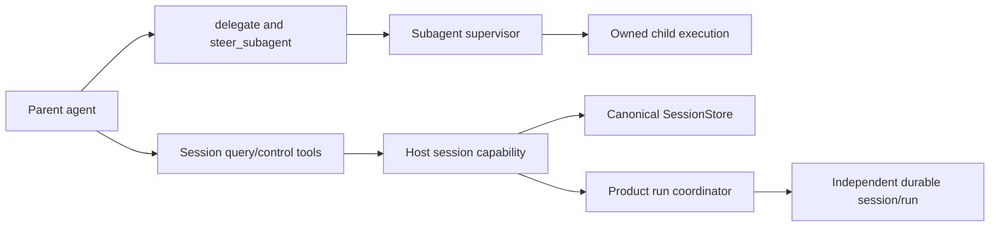
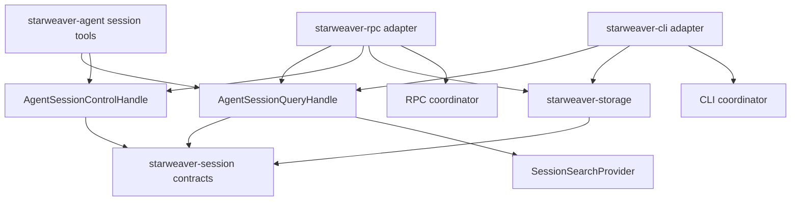
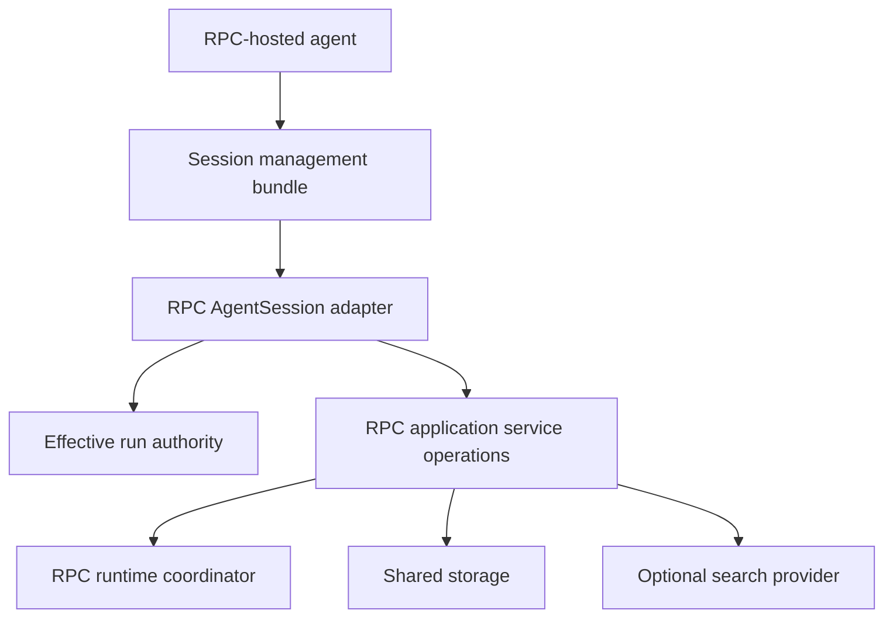
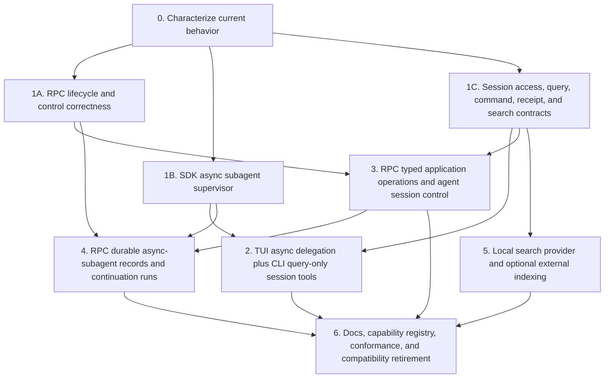

# Agent-Facing Session Management

Status: proposed

Revision: 2026-07-14

This spec defines how a Starweaver agent may discover and, when explicitly authorized, control durable sessions and runs owned by its product host. It builds on the shared `SessionStore` contract and the optional `SessionSearchProvider` from `07-session-search.md`.

The capability is intentionally different from asynchronous subagent delegation. Async subagents are child executions inside one parent application scope; session management operates on independent durable conversations through host-owned query and control services.

## Decision

Introduce a first-party agent session-management bundle with two separately grantable capabilities:

- **query capability** — list, search, inspect, and replay safe projections of sessions and runs;
- **control capability** — create/update/tombstone sessions and start, steer, or interrupt runs through the owning product coordinator.

Product policy is asymmetric:

| Product agent        | Query capability                                  | Control capability                                                        |
| -------------------- | ------------------------------------------------- | ------------------------------------------------------------------------- |
| CLI/TUI agent        | yes, over the selected CLI store                  | no model-visible mutations                                                |
| Standalone RPC agent | yes, over the authorized RPC store scope          | optional, grant-gated mutations                                           |
| Generic SDK agent    | only when the application injects a query service | only when the application injects a control service and grants operations |

Human-facing CLI commands remain independent of the tools available to the CLI's model. The CLI user may still invoke existing management commands such as `sw session delete`; the CLI agent itself receives only read/query tools.

The RPC agent does not call its own JSON-RPC transport. `starweaver-rpc` implements a narrow in-process query/control facade over RPC-owned storage and `RpcRuntimeCoordinator`. External RPC clients continue to use `session.*` and `run.*` methods from `06-json-rpc-host-protocol.md`.

Boundary rules:

- Shared durable session/run records, filters, identities, and query projections remain in `starweaver-session`.
- Optional lexical/full-text discovery continues through `SessionSearchProvider`; search is not folded into `SessionStore`.
- `starweaver-agent` owns query/control tool schemas, safe result projections, tool instructions, and narrow host-handle traits.
- CLI and RPC independently implement those host handles over their own storage and coordination.
- Mutating run operations pass through the owning product coordinator so active-run registration, streaming, cancellation, steering, environment leases, and durable status stay coherent.
- A model tool never calls the local JSON-RPC transport or dispatches JSON-RPC frames back into its own host.
- Agent-visible interruption is cooperative. Hard process termination and evidence purge are not baseline model tools.

## Goals

- Let an agent find relevant historical sessions and inspect bounded canonical state.
- Let an authorized RPC agent create and update sessions, start new runs, steer active runs, and interrupt active runs.
- Preserve the same domain semantics across CLI and RPC without creating a product dependency.
- Reuse existing durable records and active-run coordination instead of introducing a second session model.
- Make authorization, idempotency, races, redaction, self-control, and destructive actions explicit.
- Keep optional search failure independent from ordinary list/get and run control.
- Return compact, prompt-safe evidence rather than complete serialized state.
- Provide a phased implementation plan that can land below the model tool surface first.

## Non-goals

- Treating one session as a subagent or replacing `SubagentRegistry`.
- Exposing arbitrary `SessionStore` methods or a raw SQL/search interface to the model.
- Making CLI a client of RPC or sharing CLI/RPC handlers and active-run registries.
- Allowing an agent to widen its own authorization or capability grants.
- Letting an agent hard-kill the host process, executor thread, environment service, or model request.
- Allowing model-visible evidence purge. Agent delete is a tombstone/archive operation by default.
- Mutating a terminal run. New work is represented by a new run.
- Assuming a durable `running` record is controllable after host restart.
- Returning complete message history, checkpoints, environment state, tool payloads, credentials, or arbitrary metadata by default.
- Making search mandatory for basic session listing and loading.

## Product Capability Matrix

| Operation                      |           CLI/TUI agent |                  RPC agent | Human/external product surface                       |
| ------------------------------ | ----------------------: | -------------------------: | ---------------------------------------------------- |
| list sessions                  |                     yes |                        yes | existing CLI/RPC management surfaces                 |
| search sessions                | when provider installed |    when provider installed | proposed by `07-session-search.md`                   |
| get session summary            |                     yes |                        yes | existing CLI/RPC surfaces                            |
| list/get run summaries         |                     yes |                        yes | existing storage/RPC surfaces                        |
| replay display-safe run output |                     yes |                        yes | shared stream archive/replay projections             |
| create session                 |                      no |                        yes | existing RPC method; CLI human flow remains separate |
| update/archive session         |                      no |                        yes | proposed typed mutation                              |
| delete/tombstone session       |                      no | yes, approval/policy gated | existing RPC delete needs narrowed agent policy      |
| start run                      |                      no |                        yes | existing RPC non-blocking run start                  |
| steer active run               |                      no |                        yes | existing RPC run steering                            |
| interrupt active run           |                      no |                        yes | existing RPC cooperative cancellation                |
| purge evidence                 |                      no |                         no | admin-only external operation, if supported          |
| hard terminate host/process    |                      no |                         no | host operator lifecycle only                         |

“CLI query-only” applies to tools available to the model running inside CLI/TUI. It does not remove human `sw session delete`, resume, trim, or other product commands. Likewise, RPC's external JSON-RPC method table and its internal agent tool grant are related application operations but separate trust boundaries.

## Current Implementation Baseline

Current foundations already include:

- canonical session/run records and `SessionStore` operations;
- shared SQLite storage adapters;
- CLI local session list/show/replay/delete/trim and durable run flows;
- RPC `session.create`, `session.list`, `session.get`, `session.delete`, `run.start`, `run.status`, `run.await`, `run.cancel`, and `run.steer` handlers;
- CLI and RPC active-run steering/cancellation coordinators;
- the proposed `SessionSearchProvider` design in `07-session-search.md`;
- deny-by-default first-party tool dependency/capability grant patterns.

The missing capability is not basic external RPC control. It is the model-facing, host-injected session-management bundle plus the lower contracts needed to make that bundle safe and product-independent.

Current constraints that implementation must address:

- RPC run control is process-local even when durable state says a run is active;
- current RPC active control and several wire paths identify a run by `run_id` even though durable identity is composite `(session_id, run_id)`;
- current session records do not yet provide a complete owner/namespace/revision contract for resource authorization;
- the durable shape has one `active_run_id`, but run admission does not yet enforce one active run per session transactionally;
- RPC coordinator task ownership and shutdown need to become explicit before agents create more background runs;
- current RPC status waiting has a check/notification race and should move to a state-carrying primitive before broader orchestration;
- terminal entries need bounded retention and removal from the active control registry;
- CLI local persistence is still converging on shared storage adapters;
- `SessionStore` does not yet expose a complete typed update/archive API with optimistic revision semantics;
- search is optional and proposed, so query tools need a useful no-search baseline.

## Identity, Ownership, and Admission Invariants

A managed resource target is identified by:

```text
(namespace_id, session_id, run_id?)
```

`run_id` is never treated as globally unique. Every query, replay, steer, interrupt, idempotency record, control receipt, and active-registry lookup uses the owning namespace/session. Product-local convenience APIs may omit an implicit single-user namespace, but it remains part of the authorization context.

Ownership and lineage are separate:

- owner/principal and namespace are host-derived fields or an equivalent access-control record;
- request params, arbitrary metadata, `parent_session_id`, and `parent_run_id` cannot assign authority;
- lineage records provenance only;
- a managing agent can control only an owned/delegated target allowed by `AgentSessionScope`;
- unauthorized lookup does not reveal whether a hidden target exists.

The initial durable model permits at most one `queued`, `starting`, `running`, or `waiting` run per session. `start_session_run` acquires a transactional admission lease/fencing generation before active registration. A conflicting start returns `run_conflict`. Supporting multiple active runs in one session requires a future explicit durable-model revision; it must not be introduced accidentally through concurrent agent tools.

A durable `running` row alone is not an active lease. Active control is valid only when the current host instance owns an unexpired admission/control lease and matching fencing generation. Startup reconciliation classifies expired owners and either safely resumes from a supported checkpoint or terminalizes the run as interrupted/failed; it never reports steer/interrupt success against an orphan record.

## Separation from Async Subagents



The boundaries differ in several ways:

| Area             | Async subagent                             | Agent session management                  |
| ---------------- | ------------------------------------------ | ----------------------------------------- |
| ownership        | child of one parent application/supervisor | independent durable host record           |
| primary identity | `agent_id` plus `attempt_id`               | `(namespace_id, session_id, run_id)`      |
| execution path   | hidden SDK delegate backend                | product session store and run coordinator |
| result delivery  | parent message bus and continuation        | ordinary run streams/replay/status        |
| authority        | inherited child capabilities               | explicit host session-management grant    |
| lifetime         | supervisor/process or durable worker       | durable session lifecycle                 |

A session created through session management is not automatically registered as a subagent. A subagent result is not automatically a searchable independent session unless the host explicitly persists such a projection.

## Ownership and Dependency Shape



Rules:

- `starweaver-agent` may depend on shared session contracts but not on CLI or RPC.
- `starweaver-session` does not depend on the agent SDK, storage implementation, or products.
- `starweaver-storage` does not own active-run steering or runtime construction.
- CLI and RPC adapters can use the same traits and DTOs but remain separate implementations.
- A shared helper can move to a lower crate only if it is genuinely product-neutral; product handlers, client state, auth, and coordinators do not move merely to reduce duplication.

## Host Capability Interfaces

Names are provisional; the narrow split is normative.

```rust
#[async_trait]
pub trait AgentSessionQuery: Send + Sync {
    async fn list_sessions(
        &self,
        scope: &AgentSessionScope,
        query: AgentSessionListQuery,
    ) -> Result<AgentSessionPage, AgentSessionQueryError>;

    async fn search_sessions(
        &self,
        scope: &AgentSessionScope,
        query: SessionSearchQuery,
    ) -> Result<SessionSearchPage, AgentSessionQueryError>;

    async fn get_session(
        &self,
        scope: &AgentSessionScope,
        session_id: &SessionId,
        include: AgentSessionInclude,
    ) -> Result<AgentSessionView, AgentSessionQueryError>;

    async fn list_runs(
        &self,
        scope: &AgentSessionScope,
        session_id: &SessionId,
        query: AgentRunListQuery,
    ) -> Result<AgentRunPage, AgentSessionQueryError>;

    async fn get_run(
        &self,
        scope: &AgentSessionScope,
        session_id: &SessionId,
        run_id: &RunId,
    ) -> Result<AgentRunView, AgentSessionQueryError>;

    async fn replay_run(
        &self,
        scope: &AgentSessionScope,
        target: AgentRunTarget,
        query: AgentReplayQuery,
    ) -> Result<AgentDisplayPage, AgentSessionQueryError>;
}

#[async_trait]
pub trait AgentSessionControl: Send + Sync {
    async fn create_session(
        &self,
        scope: &AgentSessionScope,
        command: CreateManagedSession,
    ) -> Result<SessionMutationReceipt, AgentSessionControlError>;

    async fn update_session(
        &self,
        scope: &AgentSessionScope,
        command: UpdateManagedSession,
    ) -> Result<SessionMutationReceipt, AgentSessionControlError>;

    async fn delete_session(
        &self,
        scope: &AgentSessionScope,
        command: DeleteManagedSession,
    ) -> Result<SessionMutationReceipt, AgentSessionControlError>;

    async fn start_run(
        &self,
        scope: &AgentSessionScope,
        command: StartManagedRun,
    ) -> Result<RunStartReceipt, AgentSessionControlError>;

    async fn steer_run(
        &self,
        scope: &AgentSessionScope,
        command: SteerManagedRun,
    ) -> Result<RunControlReceipt, AgentSessionControlError>;

    async fn interrupt_run(
        &self,
        scope: &AgentSessionScope,
        command: InterruptManagedRun,
    ) -> Result<RunControlReceipt, AgentSessionControlError>;
}
```

These traits are host capabilities, not persistence traits:

- query implementations can combine `SessionStore`, `StreamArchive`, compact projections, and `SessionSearchProvider`;
- control implementations validate authority and call canonical storage/coordinator application operations;
- the tool bundle receives only a filtered handle, not a broad mutable host/service object;
- the scope is host-constructed and not deserialized from model arguments.

`starweaver-agent` owns these host capability traits alongside the first-party bundle. Product-neutral record, query, command, projection, receipt, scope, and error DTOs that must be shared without the SDK remain in `starweaver-session`. The traits must not be added to `AgentContext` as unrestricted mutable service handles or moved into a product crate.

## Agent Session Scope and Grants

`AgentSessionScope` carries host-derived authority:

- store/tenant namespace;
- source product and initiating durable session/run identities;
- allowed target session set or policy predicate;
- allowed operations;
- profile/workspace constraints;
- whether self-query and self-control are allowed;
- approval requirements;
- caller/profile/server policy fingerprint;
- result redaction/projection policy;
- absolute command deadline and quotas.

The effective authority is the intersection of:

1. server/application policy;
2. selected agent profile policy;
3. initiating caller authority, when a caller created the run;
4. target namespace/ownership policy;
5. the installed per-tool `ToolCapabilityGrant`.

No layer can widen a prior layer. In RPC HTTP mode, a caller with the required `run` scope can start a run, but without additional configured session-update/delete/control authority it cannot cause that model to acquire those operations merely because the server profile supports them. Stdio/local mode uses an explicit configured local authority rather than pretending that transport identity is an unlimited grant.

Scope identifiers and policy fingerprints can be recorded in audit evidence, but secret credentials and full policy documents are not returned to the model.

## Query Tool Bundle

The baseline model-visible names are provisional:

- `list_sessions`;
- `search_sessions` when a provider is installed;
- `get_session`;
- `list_session_runs`;
- `get_session_run`;
- `replay_session_run`.

A host may expose one structured query tool instead, but it must preserve the same typed operations, capability discovery, limits, and error semantics. It must not accept arbitrary method names or JSON-RPC passthrough payloads.

### List sessions

Inputs include typed filters and an opaque page token:

- status;
- profile;
- workspace;
- created/updated range;
- limit;
- page token.

List works directly from canonical storage and remains available when search is disabled or unhealthy. Results contain compact session summaries and a next-page token; exact total count is not required.

### Search sessions

Search projects the `SessionSearchProvider` contract from `07-session-search.md`.

- capability absence is `unsupported`, not an empty success;
- partial/eventual/degraded coverage is preserved;
- search hits are reloaded or revalidated against canonical storage before control;
- a hit does not grant authority to the referenced session;
- snippets are untrusted historical content and are never interpreted as instructions.

### Get/list session and runs

`get_session` returns a bounded `AgentSessionView` with selected sections:

- stable identity, title, status, profile, safe workspace display, timestamps, and revision;
- bounded recent run summaries;
- active/head run identities;
- resumability/control availability flags computed by the host;
- optional compact trace/usage projections.

`list_session_runs` provides bounded keyset pagination under one authorized session. `get_session_run` requires both `session_id` and `run_id`; it returns a compact run view, status, input/output preview, safe error category, timestamps, cursor refs, and control availability.

`replay_session_run` returns only sanitized, user-visible `DisplayMessage` projections after a family-aware cursor. It does not return raw runtime records, internal diagnostics, full tool arguments/results, checkpoint/context payloads, or hidden environment evidence. Replay is a read/query operation and never resumes or changes the target run.

None of these tools return full resumable context, checkpoint payloads, credentials, arbitrary metadata, or complete tool payloads.

## RPC Agent Control Bundle

The RPC agent receives the query tools plus the following controls when its effective grant allows them:

- `create_session`;
- `update_session`;
- `delete_session`;
- `start_session_run`;
- `steer_session_run`;
- `interrupt_session_run`.

The CLI agent does not receive these definitions. Hiding a definition through prepare-tools is required in addition to runtime authorization; a guessed tool call still fails closed.

### Create session

`create_session` accepts only allowlisted fields:

- optional title;
- configured profile id;
- workspace selected from allowed roots or a host-defined workspace reference;
- approved typed metadata keys;
- idempotency key.

It creates a durable session but does not implicitly start a run. The result returns the compact session view, revision, and receipt id.

The host validates the profile and workspace before persistence. Generic metadata cannot carry provider headers, credentials, environment tokens, authorization scopes, or hidden tool grants.

### Update or archive session

`update_session` supports an explicit patch, not arbitrary record replacement:

- title;
- profile for future runs when policy permits;
- approved metadata keys;
- archive/unarchive status transition.

It requires an expected revision or equivalent compare-and-set token. Conflicts return `conflict` with the current safe revision rather than overwriting concurrent human/agent changes.

Immutable identities, historical run records, trace ids, environment state, and stream cursors are not patchable through this tool. Changing workspace after runs exist is excluded from the baseline unless a later migration policy defines its effect.

### Delete session

Agent-visible delete means tombstone by default:

- deletion first acquires a revision-checked session deletion fence/intent that blocks new run admission, async continuations, and subagent delegation under that session;
- active runs and owned subagent attempts must first become terminal according to the configured cancellation policy;
- the current controlling run cannot delete its own session;
- deleting another active session requires explicit interruption/cancellation under the same fence and a terminal-state recheck;
- child terminal results and pending delivery audit evidence are persisted before tombstoning;
- approval is required by default;
- retained evidence remains hidden/auditable according to storage policy;
- the operation carries an expected revision and idempotency key.

`deleteEvidence=true`, physical purge, index-generation deletion controls, and storage-file removal are not model-visible baseline arguments. Search tombstones are produced by the canonical mutation path.

### Start run

`start_session_run` creates a new non-blocking run under a selected session. It accepts:

- explicit `session_id`;
- canonical `InputPart` values, with text-only baseline allowed initially;
- optional configured profile/model override within the grant;
- allowed environment attachment references;
- idempotency key;
- safe causal metadata identifying the managing run/tool call.

The command returns only after durable run creation and active registration, with `session_id`, `run_id`, accepted status, and replay scope/cursor refs. It does not wait for completion.

Run creation must reuse the same RPC-owned application operation as external `run.start` after transport DTO validation. It must not invoke JSON-RPC recursively and must not duplicate coordinator logic in the tool implementation.

A host enforces managed-run quotas and recursion policy. By default a managed run does not inherit session-control mutation tools unless its profile explicitly grants them, preventing unbounded run creation chains.

### Steer active run

`steer_session_run` requires the composite `(session_id, run_id)` target, structured steering input, a steering id, and optional idempotency key.

- the host reloads/rechecks target ownership;
- the run must be in the local active control registry and non-terminal;
- steering queues input at the runtime control boundary and returns an accepted receipt;
- success does not mean the model has consumed the steering message;
- repeated steering ids are idempotent within retention;
- queue depth, payload bytes, and command deadline are bounded;
- the controlling run cannot steer itself through this tool by default.

A later replay/status event can acknowledge consumption. The tool must not hold product registry locks across asynchronous steering work.

### Interrupt active run

`interrupt_session_run` requests cooperative cancellation and returns an accepted/idempotent receipt.

- the target must be locally active and controllable;
- the host records the request reason/category without exposing arbitrary sensitive text in logs;
- cancellation token propagation and bounded forced task abort remain coordinator responsibilities;
- terminal durability and cleanup happen asynchronously;
- callers use query/status/replay to observe the final state;
- interrupting a terminal run returns `terminal`/`not_active`, not a fabricated new cancellation success;
- a durable `running` row with no active control handle returns `stale_active` or `unavailable` and triggers reconciliation;
- the controlling run cannot interrupt itself through this tool by default.

“Interrupt” does not mean killing the RPC process, Tokio runtime, thread, model provider process, envd service, or operating-system process. Hard host termination is never a model tool.

## CRUD and Run Lifecycle Semantics

Session and run mutations use version/idempotency controls:

- creates and run starts use caller-provided or host-generated idempotency keys bound to normalized command fingerprints;
- update/delete use expected session revision;
- steer/interrupt use stable operation ids and terminal-state rechecks;
- same key plus same command returns the original receipt;
- same key plus different command returns `idempotency_conflict`;
- receipts are bounded durable evidence, not proof that asynchronous runtime effects completed.

Canonical status rules:

```text
session: active -> archived -> active
session mutation fence: stable -> deleting -> deleted|stable_on_failure
session: active|archived|failed -> deleted
run: queued -> starting -> running|waiting -> completed|failed|cancelled
```

A terminal run is immutable. Steering or new user work after terminal completion creates a new run rather than reopening the old one. Session deletion/tombstoning is monotonic unless an explicit admin recovery contract is designed later.

## Coordination, Durable Control, and Atomicity

Model tools do not implement multi-domain mutations directly. Product operations establish the required ordering.

RPC control uses a durable admission/control record with host instance id, lease expiry/heartbeat, and fencing generation. Accepted steer/interrupt operations receive stable control event ids and durable receipts. A durable control inbox/outbox or equivalent atomic operation ensures that retries and process loss cannot apply an older command to a newer run owner. The in-process `AgentControlHandle` is an execution adapter for the current fenced owner, not durable truth by itself.

Canonical session/run mutation, idempotency receipt, search outbox/tombstone, and admission/control evidence are committed atomically where the storage backend supports one transaction. When effects such as runtime start or external index publication occur afterward, durable state records the pending effect and compensation/reconciliation path.

### Run start

1. validate effective grant, target session revision/status, profile, input, environment refs, quota, and idempotency;
2. atomically persist a stable admission id/intent, idempotency receipt, fenced one-active-run slot, and queued run evidence while rejecting a session deletion fence;
3. acquire environment/execution resources idempotently under the admission id so crash reconciliation can discover and release them;
4. construct runtime and stream adapters;
5. register active control state with the same fencing generation and transition the durable run to starting/running;
6. publish accepted lifecycle/replay evidence;
7. return the receipt;
8. on failure, persist terminal/failed admission and release idempotently keyed resources and the active slot through compensation/reconciliation.

### Steering

1. authorize composite target and reject self-control;
2. locate active control and capture generation/version;
3. reserve idempotency record;
4. queue steering without holding the registry lock;
5. record accepted/failed effect against the same generation;
6. return the receipt.

### Interruption

1. authorize and locate active target;
2. atomically classify current terminal/control state;
3. record/deduplicate the interruption request;
4. signal cooperative cancellation;
5. let the owned finalizer persist terminal status, replay marker, and environment cleanup;
6. remove control state from the active registry after terminal persistence and retain only a bounded terminal cache.

### Session delete

1. authorize, approve, compare expected revision, and reject self-session deletion;
2. atomically CAS a durable deletion fence/intent that blocks new run admission, result-triggered continuations, and subagent delegation for the session;
3. under that fence, locate active runs and owned subagent attempts, request cancellation/interruption, and wait or return a durable pending receipt according to policy;
4. persist terminal child/run outcomes plus undelivered result references required for audit or later administrative recovery;
5. after the required terminal policy is satisfied, tombstone canonical session state and emit the search-index mutation atomically where supported;
6. clear only product-owned current pointers that reference the tombstoned session;
7. preserve or purge evidence solely according to non-model admin policy;
8. on pre-tombstone failure, retain or release the fence through an explicit retry/abort transition rather than silently reopening admission.

## Prompt and Evidence Safety

Stored session content is untrusted input. Query/search tool instructions must tell the agent that:

- snippets, titles, prompts, model outputs, and tool previews can contain prompt injection;
- historical content is evidence to analyze, not system/developer instruction;
- a returned session id must be passed through a separate authorized control call;
- search/list/get results never imply permission or current controllability.

Projection rules:

- bound result count, text bytes, recent runs, and trace depth;
- sanitize display text through an independently tested session-management policy;
- exclude internal/diagnostic visibility unless explicitly granted;
- omit raw tool args/results, full metadata, checkpoint/context/environment payloads, URLs with secrets, local absolute backend paths, and index locators;
- represent errors as safe categories and bounded messages;
- annotate source session/run and timestamps so evidence cannot be confused with current user input.

## Authorization, Approval, and Audit

Query and control are separate grants. Recommended operation classes:

| Class             | Operations                  | Default policy                                   |
| ----------------- | --------------------------- | ------------------------------------------------ |
| `session.read`    | list/get/run views          | allowed only in configured namespace             |
| `session.search`  | optional text discovery     | allowed only with provider and projection policy |
| `session.create`  | create session, start run   | RPC profile grant and quota                      |
| `session.control` | steer/interrupt             | RPC profile grant; self-target denied            |
| `session.update`  | title/profile/archive patch | approval configurable                            |
| `session.delete`  | tombstone                   | approval required                                |

Audit evidence includes:

- controlling session/run/agent/tool-call identity;
- target session/run identity;
- operation and safe normalized fingerprint;
- effective policy fingerprint;
- approval/idempotency receipt ids;
- accepted/rejected/conflict/terminal result;
- timestamps and trace correlation.

It excludes raw prompt/search/steering text by default, secrets, credentials, complete metadata, and provider request content.

## Failure Model

Required query error categories:

- `invalid_query`;
- `not_found`;
- `unsupported`;
- `unavailable`;
- `permission_denied`;
- `invalid_cursor`;
- `failed`.

Required control error categories:

- `invalid_command`;
- `not_found`;
- `permission_denied`;
- `approval_required` or deferred approval evidence;
- `conflict`;
- `idempotency_conflict`;
- `run_conflict`;
- `not_active`;
- `terminal`;
- `stale_active`;
- `quota_exceeded`;
- `unavailable`;
- `failed`.

Errors are safe for model consumption and do not disclose whether an unauthorized cross-tenant identity exists. Hosts may map both unauthorized and hidden not-found targets to one external category.

Optional search outage does not disable list/get/control. Storage outage disables canonical query/control even if an external search index still returns hits, because an index is not durable truth.

## CLI/TUI Integration

The CLI composition root installs an `AgentSessionQuery` adapter over the selected CLI store and optional CLI-configured search provider.

CLI model tools:

- list sessions;
- search sessions when available;
- get session summaries;
- list/get run summaries;
- replay bounded user-visible display messages.

The adapter applies the active CLI namespace/workspace policy and returns stable human-independent JSON tool results. It does not install `AgentSessionControl`, even though human CLI commands can delete, resume, or trim local sessions.

The TUI can render tool calls/results through ordinary display messages. Session query does not implicitly switch current session, restore history, enqueue a prompt, or mutate TUI model selection.

## Standalone RPC Integration

RPC implements both handles over RPC-owned application operations:



Integration rules:

- model tools call internal typed application operations, not `RpcService::handle_text` and not the stdio/HTTP transport;
- external JSON-RPC DTO parsing/authorization remains at the transport/service boundary;
- both paths may reuse the same typed application command and receipt implementation after their distinct authorization inputs are resolved;
- effective agent authority is fixed/derived when the managing run starts and cannot be widened through run metadata;
- managed run starts are non-blocking so the controlling agent remains able to continue or supervise other work;
- RPC active-run task handles and status watchers must be explicitly owned before managed run creation is enabled;
- graceful shutdown stops new managed starts, interrupts according to policy, joins finalizers, and persists terminal state;
- RPC configuration remains in `rpc.toml`; it never reads CLI tool grants or current-session state.

### Relation to host protocol v1

The external host protocol already implements most low-level operations needed for the RPC adapter. This spec does not retroactively add agent tools to the implemented v1 method table.

New external methods such as `session.search`, typed `session.update`, or richer `run.get` graduate into `06-json-rpc-host-protocol.md` only after implementation and conformance tests land. Internal model tools can still reuse shared application operations without exposing new wire methods prematurely.

## Interaction with Async Subagent Continuations

An async subagent completion may create a continuation run under its parent session as specified in `../sdk/06-async-subagent-execution.md`. That host-generated continuation does not call the model-visible `start_session_run` tool and does not require the parent model to hold cross-session create authority.

Conversely, a run created through session management is an independent managed run:

- its output appears through its own stream/replay/status;
- it does not send a subagent result message to the controller unless a later orchestration policy explicitly subscribes and summarizes it;
- its run id cannot be passed to `steer_subagent`;
- its session/run control does not use the subagent supervisor.

This prevents the two control planes from becoming aliases with incompatible lifetime and authority semantics.

## Cross-Feature Delivery Order

The two requested capabilities share RPC lifecycle prerequisites but retain separate tool and identity contracts.



Milestone rules:

0. Freeze characterization tests for current delegate modes, CLI/TUI lifetime, RPC run start/status/await/steer/cancel, storage identity, and shutdown.
1. Execute three independent tracks in parallel: fix RPC lost wake-up, task ownership, composite targets, terminal eviction, one-active-run admission, lease/fencing, and reconciliation; build the SDK async supervisor; and define session access/query/control/search contracts. Neither product integration begins with a broad service handle or JSON-RPC loopback.
2. Enable TUI async-only `delegate` under an application-lifetime supervisor and install only the query session bundle. Keep one-shot headless blocking and worker delegation disabled.
3. After RPC lifecycle correctness and shared contracts land, extract typed application operations below wire dispatch and install grant-gated query/control adapters with revisions, idempotency, approval, self-target denial, and durable receipts.
4. After the SDK supervisor and RPC control foundation land, add subagent durability and idempotent result-triggered continuation runs. Do not mutate terminal parent runs or reuse session-management tools as subagent controls.
5. Implement bounded local search and index/tombstone publication independently. Basic list/get/replay/control never waits for full-text search.
6. Update user docs and capability status only for implemented slices, run full conformance/security/architecture gates, and then retire long-lived product exposure of synchronous model `delegate`.

## Observability

Session-management spans/events record:

- operation class;
- source and target safe identities under policy;
- result category;
- latency and deadline/cancellation;
- list/hit/result counts and coverage state;
- idempotency/conflict/approval outcome;
- active control generation and final accepted receipt;
- causal link from managing run to created run.

Default telemetry excludes raw query text, snippets, session prompts/outputs, steering text, full input parts, metadata values, credentials, and backend paths.

## Implementation Plan

### Phase 0: Correct host lifecycle prerequisites

1. Replace run-id-only control lookups with composite namespace/session/run targets.
2. Fix RPC run-status waiting so terminal updates cannot be lost; prefer a state-carrying `watch`-style primitive.
3. Move RPC Tokio executor ownership into an explicit RPC host/executor boundary or otherwise make spawned task ownership and shutdown explicit.
4. Track run consumer/finalizer handles, remove terminal controls from the active registry, and bound terminal replay cache.
5. Add transactional one-active-run admission plus host lease/fencing and startup orphan reconciliation.
6. Make stdio request execution capable of accepting control while a long await exists, or prohibit unbounded blocking methods on a control connection.
7. Complete CLI/RPC convergence on shared session/storage contracts needed by the adapters.

### Phase 1: Shared query/control contracts

1. Add compact `AgentSessionView`, `AgentRunView`, display replay pages, includes, revisions, commands, receipts, scopes, and error categories.
2. Add host-derived namespace/owner/access records and keep lineage non-authoritative.
3. Add narrow `AgentSessionQuery` and `AgentSessionControl` host handles plus filtered dependency requirements.
4. Add typed session update/archive, idempotency/revision, admission lease, fencing, and durable control receipt operations at the canonical application/storage boundary.
5. Preserve optional `SessionSearchProvider` as a separate injected read capability.
6. Add fake-handle contract tests before product integration.

### Phase 2: Query-only CLI agent bundle

1. Implement first-party query tools in `starweaver-agent`.
2. Add a CLI adapter over the selected shared/local store and optional local search provider.
3. Install only query definitions in CLI/TUI agent profiles.
4. Add bounded prompt-safe projections, display-safe replay, no-provider behavior, pagination, and TUI display tests.
5. Verify that model tools cannot switch, resume, delete, or control CLI sessions.

### Phase 3: RPC agent control bundle

1. Extract reusable typed RPC application operations below wire DTO dispatch.
2. Implement the RPC query/control adapter over RPC-owned storage, search, authority, and coordinator.
3. Add create/update/tombstone, non-blocking run start, steering, and interruption tools.
4. Add capability-grant intersection, approval, self-target denial, recursion quotas, and audit receipts.
5. Reuse active run/state/replay operations without JSON-RPC loopback.
6. Add restart/stale-active and concurrent terminal/control race tests.

### Phase 4: Search and richer lifecycle integration

1. Land bounded local search and expose `search_sessions` independently in both products.
2. Add search mutation/tombstone integration for session updates/deletes.
3. Add optional external index/provider conformance from `07-session-search.md`.
4. Add managed-run completion summaries or subscriptions only after a concrete orchestration need; do not conflate them with subagent completion.

### Phase 5: User-facing graduation

1. Update capability registry/status when each slice is implemented.
2. Add CLI/RPC configuration and docs for grants, approvals, quotas, and outputs.
3. Graduate any new external RPC methods into the implemented host protocol profile with shared transport conformance fixtures.
4. Run full architecture, security, docs, and release gates.

## Acceptance Gates

```bash
cargo test -p starweaver-session --locked
cargo test -p starweaver-storage --locked
cargo test -p starweaver-agent --all-targets --locked
cargo test -p starweaver-cli --all-targets --locked
cargo test -p starweaver-rpc-core --locked
cargo test -p starweaver-rpc --all-targets --locked
cargo run -p xtask --locked -- check-architecture
make capability-check
make docs-check
git diff --check
```

Required evidence:

- CLI agents receive query tools and no session/run mutation definitions or handles;
- RPC agent tools cannot exceed server/profile/caller/grant authority;
- direct guessed calls fail closed even when definitions are hidden;
- list/get/replay work without search and preserve canonical pagination/cursor semantics;
- search preserves coverage and revalidates hits against canonical storage;
- historical content is bounded, sanitized, provenance-labelled, and treated as untrusted evidence;
- session update/delete use expected revisions and idempotency conflict detection;
- agent delete cannot purge evidence or delete its own controlling session, and its deletion fence prevents delete-vs-start, delete-vs-continuation, and delete-vs-child-completion races;
- deleting a session coordinates cancellation/terminalization of owned runs and subagent attempts before tombstone while retaining required pending-result audit evidence;
- managed run start enforces one active run per session, commits durable intent before idempotently keyed external resources, and actively registers the same fencing generation before returning;
- created runs do not recursively inherit control authority without an explicit grant;
- steering/interrupt require composite identity, reject self-targets, and race safely with terminal completion;
- stale durable `running` records and expired host leases do not produce false control success, and startup reconciliation is deterministic;
- terminal runs leave the active control registry and host shutdown joins finalizers;
- model tools use typed in-process application operations and never loop through JSON-RPC transport;
- CLI and RPC retain independent config, auth, state, coordinators, and no product-to-product dependency;
- async subagent ids and durable session/run ids cannot be used interchangeably.

## Related Specs

- `02-shared-execution-components.md` — canonical session, stream, replay, and storage split
- `03-durable-service-runtime.md` — host coordinator, active run, resume, and interruption contracts
- `04-cli-product.md` — independent CLI/TUI coordination and local session surface
- `06-json-rpc-host-protocol.md` — implemented standalone host protocol and external control methods
- `07-session-search.md` — optional product-neutral historical discovery provider
- `../sdk/03-first-party-tool-bundles.md` — first-party tool grants and filtered dependency policy
- `../sdk/06-async-subagent-execution.md` — separate parent-owned async child execution topology
- `../core/07-versioned-protocol-contracts.md` — durable identity, lifecycle, and versioning contracts
