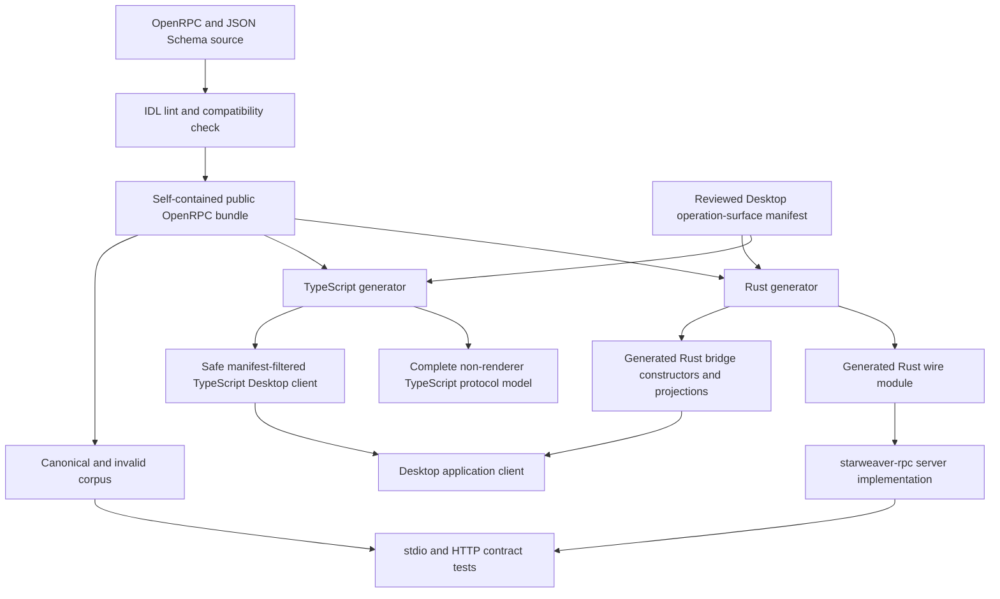
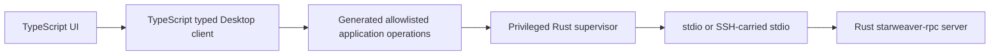

# RPC IDL and Client Generation

Status: accepted architecture; implementation planned

Revision: 2026-07-21

This specification defines the language-neutral source of truth for the Starweaver host protocol and the generated boundaries used by the Rust RPC server and the TypeScript Desktop client. It complements the implemented JSON-RPC behavior in `06-json-rpc-host-protocol.md` and the Desktop lifecycle and authority rules under `../desktop/`.

## Decision

Starweaver adopts an IDL-first host protocol.

- A checked-in OpenRPC document plus JSON Schema components is the canonical structural definition of the `starweaver.host` wire protocol.
- The IDL generates Rust wire types, method and notification registries, validation code, and server binding signatures consumed by `starweaver-rpc-core` and implemented by `starweaver-rpc`.
- The same IDL generates TypeScript wire types, runtime decoders, method and notification maps, and a typed client consumed by Starweaver Desktop.
- The Rust and TypeScript outputs are generated peers. Neither language implementation is a protocol source.
- Existing Rust DTOs, method tables, and the v1 conformance corpus are the migration baseline, not permanent competing definitions.
- JSON-RPC 2.0 framing and the existing `starweaver.host` protocol identity remain unchanged by adopting the IDL.
- The checked-in bundled IDL is public and sufficient for an independent Go, Python, Swift, or other client generator. First-party implementation initially generates only Rust and TypeScript.

The IDL is authoritative for structural wire facts: method and notification names, parameter and result shapes, error codes and public data, field names, enum values, requiredness, nullability, defaults, bounds, and type openness. Behavioral rules that cannot be expressed structurally remain normative in their owning specifications, including replay ordering, durability, authorization, process supervision, fencing, recovery, and shutdown barriers.

## Goals

- Define one language-neutral structural contract for every host method, notification, and public error.
- Generate the Rust server boundary and TypeScript Desktop client boundary from the same revision.
- Preserve the existing JSON-RPC v1 wire format while migrating away from handwritten duplicate registries.
- Make field omission, nullability, aliases, numeric ranges, tagged unions, and unknown-field behavior explicit.
- Keep transports independent from the method data model while recording transport and capability requirements.
- Make protocol drift and same-major breaking changes fail in CI.
- Publish an artifact that third parties can use without reading Rust source.
- Preserve the Desktop privileged-backend and least-authority renderer boundary.

## Non-goals

- Replacing JSON-RPC with gRPC, Protobuf, MessagePack, or a new binary transport.
- Generating `starweaver-rpc` handler behavior, storage queries, runtime coordination, authorization policy, or transport supervision.
- Treating OpenRPC or JSON Schema as a complete description of replay, durability, process, or security semantics.
- Exposing internal runtime, storage, provider, OAuth, environment, or SQLite types directly because a generator can serialize them.
- Giving the Desktop renderer a raw stdio handle, arbitrary JSON-RPC method dispatch, credentials, paths, SSH authority, or process control.
- Making the Desktop shell depend on `starweaver-rpc`, `starweaver-runtime`, `starweaver-agent`, or `starweaver-storage` implementations.
- Shipping first-party SDKs for every language in the first phase.
- Generating product-private launch configuration from `rpc.toml`; the public launch envelope remains a separate versioned contract.

## Current Baseline

The current v1 implementation already has strong conformance evidence but is Rust-first:

- `starweaver-rpc-core` contains handwritten Serde DTOs and JSON-RPC envelope helpers;
- `V1_METHOD_CONTRACTS`, `V1_NOTIFICATION_METHODS`, and error constants are handwritten registries;
- `rpc-contract-catalog-v1.json` maps methods to Rust type names;
- `rpc-wire-v1.json` contains canonical and invalid examples;
- `rpc-wire-v1.schema.json` describes the concrete conformance corpus, not the complete method DTO type system; and
- Rust deserialization remains the current acceptance authority.

The migration must preserve all valid canonical v1 frames and the intended rejection behavior captured by the existing invalid corpus. The generated IDL bundle replaces neither the corpus nor transport tests: it becomes their structural source and validation target.

## Ownership

| Concern                                                                                              | Owner                                                                                             |
| ---------------------------------------------------------------------------------------------------- | ------------------------------------------------------------------------------------------------- |
| Canonical host IDL source and bundled public artifact                                                | repository-level `protocol/starweaver-host/` tree                                                 |
| IDL profile, bundling, linting, compatibility checks, and generators                                 | repository `xtask` automation                                                                     |
| Generated Rust wire module and protocol helpers                                                      | `starweaver-rpc-core`                                                                             |
| Rust server implementation, handlers, authorization, coordination, and transports                    | `starweaver-rpc`                                                                                  |
| Complete generated TypeScript protocol model and codecs                                              | repository generator output, excluded from renderer imports                                       |
| Manifest-filtered safe TypeScript bridge/client bindings                                             | Starweaver Desktop application source                                                             |
| Child process, stdio/SSH transport, request identity, retries, replay recovery, and authority checks | Desktop privileged Rust backend                                                                   |
| Renderer-facing application intents and safe view models                                             | Desktop TypeScript application layer and narrow Tauri bridge                                      |
| Durable and product-neutral domain semantics                                                         | existing owning crates and specs                                                                  |
| Current JSON-RPC behavior                                                                            | `06-json-rpc-host-protocol.md`                                                                    |
| Desktop process and client lifecycle                                                                 | `../desktop/01-product-and-process-boundaries.md` and `../desktop/02-rpc-client-and-lifecycle.md` |

The IDL may define public projections of lower-layer records, but it must not import Rust crate paths or make a generated language binding depend on internal domain types. Manual Rust conversion code maps generated wire projections to product-neutral domain types where reuse is appropriate.

## Canonical Artifact Layout

The planned source layout is:

```text
protocol/
  starweaver-host/
    v1/
      openrpc.yaml
      schemas/
        common.yaml
        lifecycle.yaml
        sessions.yaml
        runs.yaml
        streams.yaml
        interactions.yaml
        environments.yaml
        errors.yaml
      examples/
        initialize.json
        run-start.json
        stream-event.json
      generated/
        starweaver-host-v1.openrpc.json
```

Rules:

- Split YAML files are the human-maintained source.
- `generated/starweaver-host-v1.openrpc.json` is the deterministic, self-contained release artifact.
- The bundled artifact has no local file references and can be consumed outside the repository.
- Source and bundled documents carry the protocol name, major, revision, and an artifact digest. The digest is computed over canonical bundled bytes with the digest field omitted, so it is not self-referential.
- Generated language code records the same identity and digest in a header.
- Examples are conformance evidence, never a substitute for schemas.
- Generated files are committed for review and release reproducibility but are never edited manually.

The exact directory may be introduced during implementation without creating a new workspace crate. A crate or package is added only if a concrete publishing or dependency boundary requires it.

## IDL Profile

The canonical source and public bundle use OpenRPC 1.4.0 and its JSON Schema Draft 7 Schema Object dialect. The root records `openrpc: 1.4.0`, and CI validates the bundle against the pinned official OpenRPC meta-schema. Starweaver supports a constrained, deterministic Draft 7 subset rather than attempting to generate every legal JSON Schema construct. Moving authoring to a newer JSON Schema dialect requires a separately specified, equivalence-tested lowering into the OpenRPC dialect; mixed-dialect schemas are rejected.

The supported profile includes:

- named component schemas and local `$ref` references;
- closed and explicitly open objects;
- required and optional properties;
- strings with length, pattern, format, and enum constraints;
- booleans;
- bounded integers and numbers;
- arrays with one item schema and explicit size bounds where required;
- maps with an explicit value schema;
- tagged unions with a stable discriminator;
- `oneOf` only when variants are structurally disjoint or discriminator-selected;
- explicit null unions;
- default values whose decode behavior is defined by the profile; and
- descriptions and deprecation metadata.

The generator rejects unsupported or ambiguous constructs. It must not silently widen an unsupported type to `serde_json::Value`, TypeScript `any`, or an unvalidated object.

### Method Model

Every method declares:

- its exact JSON-RPC method name;
- named-object parameter structure;
- a generated aggregate parameter type name;
- result schema;
- public error references;
- required protocol feature, if any;
- allowed transport profiles;
- HTTP authorization scope, when applicable;
- idempotency class;
- stability and deprecation state; and
- compatibility aliases, if the server still accepts an older method name.

Every method sets `paramStructure: by-name`. Its standard OpenRPC `params` array contains one Content Descriptor per named object property, including requiredness and schema references; `x-starweaver-params-type` names the generated aggregate object without changing the JSON-RPC shape. Empty params use an empty descriptor list and generate an empty closed object. Omitted JSON-RPC params continue to normalize to that object where the v1 envelope permits it. Positional parameter arrays are not generated or accepted.

A canonical method projection has this form:

```yaml
methods:
  - name: model.select
    paramStructure: by-name
    x-starweaver-params-type: ModelSelectParams
    params:
      - name: profile
        required: true
        schema:
          type: string
          minLength: 1
      - name: clientStateScope
        required: false
        x-starweaver-read-aliases: [client]
        schema:
          type: string
    result:
      name: modelSelection
      schema:
        $ref: "#/components/schemas/ModelSelection"
```

It generates the aggregate `{ profile: string, clientStateScope?: string }` and the canonical frame below, not a nested `{ params: { ... } }` member:

```json
{"jsonrpc":"2.0","id":"req_1","method":"model.select","params":{"profile":"default","clientStateScope":"desktop"}}
```

The generator derives aggregate requiredness and defaults only from the descriptors, rejects duplicate descriptor names, and accepts `client` only in compatibility readers. This projection and its frame are cross-generator fixtures. At least one pinned third-party OpenRPC parser must load the public bundle in CI; Starweaver-only parsing is insufficient evidence of a portable artifact.

### Notification Model

Server-to-client notifications are declared in the bundled document through one stable `x-starweaver-notifications` extension because they are typed connection output rather than request/response methods. Each entry declares:

- exact notification method name;
- params schema;
- required feature;
- allowed transports;
- ordering and durability documentation reference; and
- generated TypeScript and Rust variant name.

The extension is structural only. Ordering such as subscribe-response flush before `subscription.ready` remains normative in `06-json-rpc-host-protocol.md`.

### Starweaver Extensions

The initial profile permits only reviewed extensions under `x-starweaver-*`, including:

- protocol identity and artifact digest;
- generated aggregate type names;
- feature requirements;
- transport availability;
- authorization scope;
- idempotency class;
- server notification declarations;
- canonical writer name plus legacy read aliases; and
- links to normative behavioral sections.

Language-specific implementation paths or arbitrary generator snippets are prohibited in the canonical IDL. Rust and TypeScript naming follows deterministic generator rules, with an explicit language-neutral generated type name only where the wire contract needs a stable public name.

## Generation Shape



One deterministic repository command performs bundling and both language generations. A check command reruns generation in memory or a temporary output tree and fails when committed output differs.

The implementation may use pinned third-party parsers internally, but Starweaver owns the constrained profile and generated public API. Replacing a parser or formatter must not alter generated wire behavior without an explicit IDL change.

## Generated Rust Boundary

The Rust output lives under a generated module owned by `starweaver-rpc-core`. It includes:

- request parameter and result structs;
- public enums and tagged unions;
- notification params and the notification union;
- JSON-RPC request ID and envelope types;
- error-code constants and public error-data types;
- method metadata and an exhaustive method identifier enum;
- parameter decode and result encode/validation functions;
- an exhaustive generated service trait and dispatcher binding each method to its params, result, and declared errors; and
- protocol identity and bundled-IDL digest constants.

The generated Rust boundary is wire-only. It derives or implements the required Serde behavior and structural validation, but it does not:

- open storage;
- construct agents;
- authorize requests;
- allocate environments;
- own Tokio tasks;
- implement retries;
- write responses; or
- depend on product handlers.

`starweaver-rpc` implements the generated server interface and converts between generated wire DTOs and domain/service types. The generated dispatcher may perform method lookup, params decoding, handler invocation, result validation, and public error envelope selection. Transport framing, connection state, authorization, request ordering, response flush, subscriptions, and shutdown remain handwritten server responsibilities.

Generated Rust types replace handwritten wire DTOs and registries only after parity tests pass. Compatibility readers that cannot be represented as the canonical writer shape may remain in a small handwritten adapter module, but they must be declared by the IDL as read aliases and covered by legacy fixtures. Handwritten modules must not redefine canonical method or field names.

## Generated TypeScript Boundary

Generation has two distinct TypeScript outputs.

The complete protocol model includes:

- wire interfaces and discriminated unions;
- branded string identifiers where structural distinction is useful;
- exact method-to-params/result and notification-to-params maps;
- public error-code and error-data types;
- lossless runtime codecs for host JSON;
- canonical encoders for request params;
- protocol identity and bundled-IDL digest constants;
- a typed transport-neutral `HostRpcClient`; and
- exhaustive notification dispatch helpers.

This complete model is useful for conformance and future trusted external TypeScript clients, but it is not renderer-authorized and must not be imported into the Desktop renderer bundle. Architecture tooling enforces that import boundary.

Desktop maintains a reviewed operation-surface manifest that references IDL methods and notifications and defines separate bridge request, result, and notification projections. The manifest does not redefine the host wire schema; it classifies wire fields as renderer-provided, supervisor-constructed, supervisor-overridden, or forbidden across the bridge, and selects credential-free output fields for a safe Desktop projection. Generation combines the host IDL with that authority manifest to emit the renderer-importable TypeScript `DesktopHostClient`, safe bridge DTOs and runtime decoders, and the matching Rust application-operation enum, wire-construction code, and safe projection code. A host method or wire field does not become renderer-callable or renderer-visible merely because it exists in the IDL.

TypeScript static types are not runtime validation. Every bridge result and notification must pass a generated safe decoder before entering Desktop application state. Decoder failure is a bridge/protocol incompatibility, not a value to coerce into a partial view model.

## Desktop Client and Privilege Boundary

The TypeScript application implements the Desktop client experience and consumes the generated TypeScript bindings. The privileged Rust backend still owns the physical host connection and every authority-bearing lifecycle operation required by the accepted Desktop specs.



The split is normative:

- TypeScript owns typed user-facing client calls, decoded host views, notification reduction, and presentation state.
- The Rust supervisor owns child and OpenSSH processes, workspace routing, request IDs, idempotency keys, connection initialization, capability checks, transport framing, cursor persistence, replay/reconnect coordination, mutation recovery, stderr diagnostics, and shutdown.
- The renderer never receives a raw child stdin/stdout stream, bearer token, SSH handle, launch envelope, unrestricted filesystem path, or generic process primitive.
- The renderer does not submit a free-form `{method, params}` JSON-RPC frame.
- The Tauri boundary accepts the exhaustive operation allowlist and safe bridge DTOs generated from the reviewed Desktop surface manifest, or equivalent generated per-operation commands. It does not expose the complete host method map or full wire params/results by default. The Rust backend maps an accepted bridge request to the generated Rust host binding and independently checks connection state, the negotiated feature intersection, workspace routing, and authority.
- The Rust backend must strip, construct, or override every supervisor-owned wire field, including request IDs, idempotency keys, execution-domain bindings, client scopes, and retry metadata. It must never deserialize renderer input directly as a complete host wire params type.
- Results and notifications cross into TypeScript only through generated safe projections after Rust envelope validation, redaction, and operation/channel authorization. Raw host paths, credentials, private diagnostics, and fields absent from the bridge schema fail closed. TypeScript generated decoders provide a second structural boundary before state mutation.

This design makes TypeScript the Desktop protocol client without moving process or host authority into the webview. It also preserves renderer reload recovery because connection and cursor ownership remain process-owned in Rust.

An independent trusted TypeScript application outside Desktop may implement a direct `HostRpcTransport` over HTTP or a spawned stdio process. That does not weaken Desktop's renderer policy.

## Wire Type Rules

### Names and Enums

- JSON field names use the exact canonical spellings in the IDL, normally camelCase.
- Wire enum values preserve their existing spellings, normally snake_case where v1 already uses it.
- Generated Rust and TypeScript symbol naming does not change wire names.
- A canonical writer emits only the current name.
- Legacy field or method aliases are read-only compatibility declarations and are never emitted by generated clients.

### Optional, Nullable, and Default

The IDL distinguishes:

- an omitted optional property;
- a present property whose value is `null`;
- an empty object;
- an empty array;
- a property with a decode default; and
- a property omitted by the canonical encoder when it has its default value.

Generators must not collapse these cases into one language-specific optional type. A default applies only where the IDL declares the same behavior as the current v1 decoder.

### Closed and Open Objects

Object openness is per type.

- Request params are closed unless a specific extension map is part of the contract.
- Current v1 result and notification types preserve their existing strictness during migration.
- Open metadata uses an explicit map value schema or an explicit `JsonValue` schema.
- A generator must not infer openness from the presence of an example.

Adding a field to a closed result is a breaking change even if the field would be optional in a permissive language. A same-major additive field is allowed only for a type explicitly declared extensible and only when both generated readers are proven to ignore or preserve unknown extension fields as specified.

### JSON Values

Unconstrained JSON is represented by one explicit `JsonValue` component. Every use requires a description of its trust, redaction, persistence, and forwarding semantics. New public fields should prefer a typed schema or a bounded extension map. The generator rejects implicit `any` and Rust-only type references.

### Integers

Every integer declares a signedness and wire range. Platform-sized integers such as Rust `usize` are not public IDL types.

TypeScript `number` is used only when an already-established wire range is within JavaScript's safe integer range. Adopting the IDL must not add a new maximum to an existing v1 integer. Each existing `u64`- or platform-sized field is audited as follows:

1. if the implemented protocol already has and enforces a domain maximum at or below `9_007_199_254_740_991`, the IDL records that existing limit;
2. otherwise the TypeScript transport uses a lossless JSON integer tokenizer/codec and exposes the value as `bigint` or a branded decimal representation without changing the v1 JSON number on the wire; or
3. a future major changes the wire representation to a decimal string.

The generator rejects an unsafe integer mapped to TypeScript `number`, but the generated Rust v1 server continues accepting the existing numeric range. Generated TypeScript clients send string request IDs by default; this client choice does not narrow the server's existing acceptance of numeric IDs. The Rust Desktop bridge may project an unsafe host integer as a decimal string in its separate safe bridge DTO because that bridge is not the host wire protocol.

### Paths and Identifiers

- Session, run, subscription, and other IDs receive named schemas rather than becoming anonymous strings.
- Server paths, workspace-relative paths, display paths, and resource references are distinct types.
- A server path is never documented as a path on the client machine.
- Sensitive or unnecessary absolute paths must be removed from safe Desktop projections rather than merely branded.

### Tagged Unions

All generated unions that affect client control flow use a stable discriminator. Variant selection must not depend on trial deserialization order. Adding a new variant to a closed union is breaking unless the IDL explicitly defines an unknown/extension variant and both generators implement it consistently.

## JSON-RPC Envelope Rules

The generator owns common envelope types and preserves the implemented profile:

- `jsonrpc` is exactly `"2.0"`;
- batch arrays are unsupported;
- params are named objects;
- omitted params normalize only where the method accepts the empty object;
- request IDs may be strings, integers in the existing v1 server range, or explicit `null`; generated TypeScript clients use strings and do not narrow server acceptance;
- notifications omit the request ID;
- booleans, fractional IDs, arrays, and objects are invalid IDs;
- success and error are mutually exclusive; and
- server notifications have exactly `jsonrpc`, `method`, and `params` unless a future major changes the envelope.

Generated clients use string request IDs by default. The Desktop supervisor creates them per connection; renderer state never chooses JSON-RPC IDs.

## Errors

The IDL contains the stable JSON-RPC and Starweaver host error catalog. Each method references the errors it can intentionally return, while the common protocol errors remain globally available.

The current v1 `{code, message}` shape is preserved until a reviewed contract adds public structured data. Desktop-required machine decisions must eventually use typed, credential-free `error.data` variants rather than message parsing. When introduced, error data must:

- use a stable discriminator;
- avoid raw provider responses, SQL, credentials, headers, unrestricted paths, and debug chains;
- identify retryability and reconciliation requirements explicitly where relevant; and
- be generated in Rust and TypeScript from the same schema.

Unknown error codes remain protocol-safe generic errors. A client must not reinterpret an unknown code as success or retry an effectful request without the mutation recovery contract.

## Features, Transports, and Authorization

IDL method metadata records availability but does not grant authority.

The IDL migration preserves the closed v1 initialize shape and assigns precise semantics to its existing fields:

- a new client writes its client-supported feature IDs to request `protocol.features`;
- result `protocol.features` continues to report server-supported feature IDs;
- client-required feature IDs are local client policy, not a new v1 wire field; the client rejects initialization when any required ID is absent from the result;
- both peers deterministically compute the negotiated intersection from request-supported and result-supported IDs and store it in connection state; and
- an omitted request protocol or an empty/missing request feature list selects legacy-v1 mode.

Legacy-v1 mode preserves existing behavior: current v1 methods are admitted according to the existing server-supported feature and authorization rules, and current v1 notification variants remain available. Existing method admission is not changed to require a non-empty client intersection. Only a newly introduced client-opt-in behavior, especially a new notification or interaction variant, may require membership in the negotiated intersection. The server must never emit such a new variant unless the client explicitly advertised its feature. Subscription and reconnect tests preserve the mode and intersection.

The v1 IDL migration adds no initialize fields. Any additional top-level request/result member, including richer capability objects, reconnect identity, or storage/runtime compatibility data, requires a new protocol major unless an already-published extensible envelope explicitly permits it. Until the request-feature semantics and per-connection intersection are implemented, adding a notification variant is breaking even when the server advertises a new feature.

Transport and authorization metadata remain runtime constraints:

- stdio may advertise live subscriptions; unary HTTP remains replay-only under the current transport profile.
- HTTP scopes are documentation and generated metadata for clients and server routing; authentication enforcement remains in `starweaver-rpc`.
- Desktop application operations are additionally restricted by its Tauri allowlist and Rust supervisor policy.

No generated client may assume that an IDL-listed method is available merely because its type exists. Negotiated features and transport capabilities are runtime inputs.

## Versioning and Compatibility

Protocol compatibility continues to use:

- family name `starweaver.host`;
- a breaking integer major;
- a non-ordered revision identifying the exact contract artifact; and
- negotiated feature IDs.

The bundled-IDL digest identifies exact generated artifacts but is not a replacement for major or feature negotiation. Clients must not order revision strings or require an exact digest when the same major and required features are compatible.

### Same-Major Compatible Changes

A same-major revision may:

- add a feature-gated method;
- add a feature-gated notification only after the existing v1 request `protocol.features` has the specified client-supported semantics, legacy-v1 mode is implemented, and the server emits the new variant exclusively to clients whose negotiated intersection contains that feature;
- add an error reference without changing an existing code's meaning;
- add documentation or examples;
- deprecate a published method or add a legacy read alias while retaining the method and one canonical writer name; or
- extend a schema explicitly designed as extensible under its declared rules.

### Breaking Changes

A new major is required to:

- rename or remove any published method, including a deprecated method;
- change a canonical field name or type;
- change requiredness, nullability, default behavior, numeric range, string length, or array bounds incompatibly;
- change an existing enum value or tagged-union discriminator;
- add a variant to a closed union;
- change JSON integer and decimal-string representations;
- change an error code's meaning;
- change request/response/notification envelope shape;
- weaken an authority or redaction boundary; or
- change durable, replay, ordering, or idempotency semantics in a way an old client cannot safely interpret.

A compatibility checker compares the proposed bundled IDL with the last released artifact for the same major. Deprecation is migration guidance and never permits same-major removal. Waivers require an explicit protocol-major decision; they are not generator flags.

## Authoring and Generation Workflow

A protocol change follows this order:

1. Update the normative behavioral spec when semantics change.
2. Edit the split canonical IDL source.
3. Regenerate the bundled OpenRPC artifact, Rust bindings, the Desktop-manifest-filtered TypeScript bindings and Rust bridge operation enum, and fixture skeletons.
4. Add or update canonical and invalid fixtures.
5. Implement or update Rust server handlers and projections.
6. Update the Desktop application wrapper for newly exposed operations.
7. Run IDL, Rust, TypeScript, transport, architecture, and compatibility checks.
8. Review generated diff and semantic diff together.

The planned commands are:

```text
make rpc-idl-generate
make rpc-idl-check
```

`rpc-idl-generate` writes deterministic committed artifacts. `rpc-idl-check` never mutates the worktree and fails on stale output, unsupported schema constructs, unresolved references, incomplete method/error/notification coverage, compatibility violations, or fixture mismatch.

`make rpc-contracts-check` remains the end-to-end runtime gate and consumes the generated contract rather than maintaining an independent method catalog.

## Migration Plan

### Phase 0: freeze and audit the v1 baseline

- Inventory every current method, compatibility alias, notification, error, and embedded cross-crate wire type.
- Classify every object as closed, extensible, compatibility-only, or opaque JSON.
- Audit optional/null/default behavior and all Serde aliases.
- Audit integer widths and JavaScript safety.
- Record current valid and invalid corpus behavior before replacing any DTO.

### Phase 1: canonical v1 IDL and bundling

- Add the split OpenRPC and JSON Schema source.
- Produce the self-contained bundled artifact.
- Validate the existing corpus against method-specific schemas.
- Keep current Rust DTOs as the runtime implementation while proving structural parity.
- Reject any accidental wire change discovered during transcription; intentional fixes require explicit compatibility treatment.

### Phase 2: generated Rust server boundary

- Generate Rust wire DTOs, registries, errors, notifications, and server signatures.
- Add conversion adapters between generated wire projections and lower-layer domain types.
- Run old and generated decoders over the complete corpus and require equivalent results.
- Switch `starweaver-rpc-core` dispatch and `starweaver-rpc` handlers to generated bindings.
- Remove handwritten canonical registries only after the generated path passes in-process, stdio, and HTTP gates.

### Phase 3: generated TypeScript Desktop client

- Add and review the Desktop operation-surface manifest as an authority and projection policy over IDL method, notification, and field references, not a duplicate host wire definition.
- Generate separate safe bridge request/result/notification DTOs, TypeScript runtime decoders, filtered operation maps, and the typed Desktop client.
- Generate the matching allowlisted Rust Desktop bridge operation enum, bridge decoders, wire constructors, and safe output projection code or equivalent per-operation commands.
- Keep process, transport, negotiation, cursor, retry, and recovery ownership in the Rust supervisor.
- Implement a vertical slice covering initialize, session list/get, run start/status, replay, subscribe, and stream notifications.
- Expand to the complete Desktop-required method set after lifecycle and security tests pass.

### Phase 4: external interoperability proof

- Publish the bundled IDL with release artifacts.
- Build one small independent non-Rust/non-TypeScript conformance client, preferably Go, from the public artifact.
- Verify initialize, session list/get, run start/status, replay, and unary HTTP against a shipped RPC binary.
- Treat any required reading of Rust source as an IDL completeness defect.

## Validation Gates

The IDL implementation is not complete until CI proves:

- split source lint and deterministic bundling;
- validation of the public bundle against the pinned official OpenRPC 1.4.0 meta-schema and successful loading by at least one pinned third-party OpenRPC parser;
- no unresolved or external local references in the release bundle;
- exact method, notification, feature, and error coverage;
- no unsupported schema construct or implicit `any`;
- current canonical fixtures validate against the correct method schemas;
- current invalid fixtures are rejected by both generated Rust and TypeScript decoders where applicable;
- generated files are current and formatted;
- generated Rust compiles without handwritten canonical type duplication;
- generated TypeScript passes strict type checking and runtime decoder tests;
- Rust and TypeScript serialize canonical request params identically;
- Rust and TypeScript decode canonical responses and notifications equivalently;
- same-major compatibility comparison against the previous released bundle;
- in-process, stdio, and HTTP server contract tests;
- Desktop boundary checks prove that only safe bridge request/result/notification fields selected by the reviewed Desktop surface manifest cross the renderer bridge, reject raw renderer JSON-RPC or ungenerated operations, prevent injection of supervisor-owned fields, and prevent raw path, credential, or private-diagnostic leakage;
- old-client/new-host, new-client/old-host, omitted/empty request features, missing locally required features, reconnect-preserved mode/intersection, duplicate notification, cursor gap, malformed frame, and incompatible-host tests; and
- `git diff --check`, repository formatting, architecture, and ordinary test gates.

The intended aggregate commands are:

```text
make rpc-idl-check
make rpc-contracts-check
make desktop-boundaries-check
make desktop-check
make fmt-check
make check
make test
git diff --check
```

## Acceptance Criteria

This architecture is implemented when:

01. one reviewed OpenRPC/JSON Schema source defines every public v1 structural contract;
02. a deterministic self-contained bundle ships with Starweaver releases;
03. `starweaver-rpc-core` canonical wire types and server bindings are generated from that bundle;
04. `starweaver-rpc` implements the generated Rust server boundary without a competing handwritten method registry;
05. Desktop consumes safe TypeScript bridge/client bindings and runtime decoders derived from the IDL and its reviewed operation-surface manifest;
06. Desktop's Rust supervisor retains process, transport, routing, request identity, replay recovery, authority, wire construction, and output projection ownership;
07. the renderer cannot submit arbitrary JSON-RPC, complete host params, supervisor-owned fields, or bypass generated bridge schemas and operation allowlists;
08. the existing v1 corpus passes generated Rust, generated TypeScript, stdio, and HTTP conformance gates;
09. same-major breaking IDL changes fail CI; and
10. a third party can generate another language client from the published bundle without importing Rust code.
