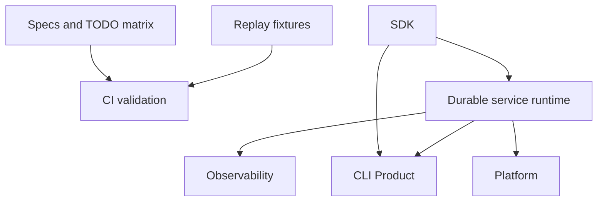

# Operations, Durability, and Products

The operations layer turns core runtime evidence and SDK contracts into validated releases, durable services, and product surfaces.

## Scope

- CI and readiness gates
- provider replay coverage
- feature coverage matrix
- durable execution and service runtime
- OpenTelemetry GenAI observability
- Langfuse-friendly OTLP export
- CLI Product
- platform integration
- release acceptance

## Operations Shape

## Readiness Model

A feature moves from planned to accepted when it has:

- spec coverage
- implementation
- targeted tests
- docs examples where user-facing
- CI coverage
- TODO matrix update
- clear ownership in crate map
- trace/span semantics when the feature affects runtime, model, tool, subagent, or service execution

## Acceptance Gates

- `make replay-check`
- `make fmt-check`
- `make check`
- `make test`
- `python3 scripts/check-docs-examples.py`
- `make ci`
