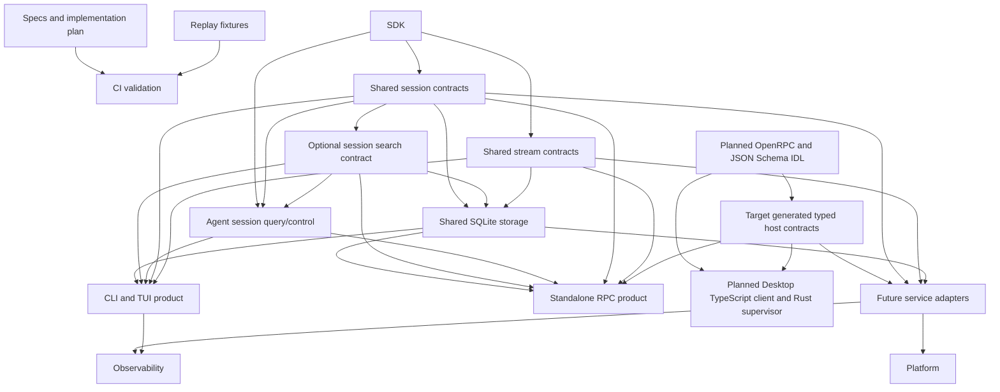

# Operations, Durability, and Products

The operations layer turns core runtime evidence and SDK contracts into validated releases, durable execution foundations, and product surfaces.

## Scope

- CI and readiness gates
- provider replay coverage
- feature coverage matrix
- shared session storage and stream protocol components
- optional pluggable session discovery across local and external indexes
- agent-facing session query/control with query-only CLI and grant-gated RPC policy
- durable execution and service runtime contracts
- OpenTelemetry GenAI observability
- Langfuse-friendly OTLP export
- CLI product
- JSON-RPC host protocol
- language-neutral RPC IDL plus generated Rust server and safe manifest-filtered TypeScript Desktop bindings
- platform integration
- release acceptance

## Target Operations Shape

The host-IDL and Desktop-client nodes below are accepted targets. Current RPC execution remains on handwritten Rust DTOs and the v1 corpus until the parity migration in `09-rpc-idl-and-client-generation.md` completes.

## Spec Map

- `00-product-boundaries.md` — normative independence and shared-library boundaries for CLI/TUI, standalone RPC, and envd
- `01-ci-readiness.md` — replay CI, docs examples, feature coverage matrix, and release acceptance gates
- `02-shared-execution-components.md` — shared session storage and stream protocol contracts
- `03-durable-service-runtime.md` — durable sessions, `SessionStore`, stream archive, resume, interruption, service transports, display-message replay, and storage contracts
- `04-cli-product.md` — independent CLI/TUI product surface with headless stdio display streams, session restore, direct envd connectivity, launcher dispatch, install/update flow, and the planned hardened public RPC component contract
- `05-observability.md` — OpenTelemetry GenAI tracing, Langfuse-friendly OTLP export, nested agent/model/tool spans, and trace-to-session correlation
- `06-json-rpc-host-protocol.md` — independent standalone RPC product protocol, transport profiles, typed method/event/error contracts, stream replay/subscription semantics, projections, idempotency, and acceptance gates
- `07-session-search.md` — optional product-neutral session search contract, local SQLite/filesystem provider, external index ingestion, and independent CLI/RPC integration
- `08-agent-session-management.md` — agent-facing query/control bundles, composite identity and ownership, query-only CLI policy, grant-gated RPC CRUD/run control, and lifecycle prerequisites
- `09-rpc-idl-and-client-generation.md` — OpenRPC/JSON Schema source of truth, generated Rust server boundary, safe manifest-filtered TypeScript Desktop bridge/client, compatibility rules, migration, and validation gates

## Readiness Model

A feature moves from planned to accepted when it has:

- spec coverage
- implementation
- targeted tests
- docs examples where user-facing
- CI coverage
- implementation plan update
- clear ownership in crate map
- trace/span semantics when the feature affects runtime, model, tool, subagent, or service execution

## Acceptance Gates

- `make replay-check`
- `make fmt-check`
- `make check`
- `make test`
- `make scripts-check`
- `make docs-check`
- `make coverage-ci`
- `make ci`
