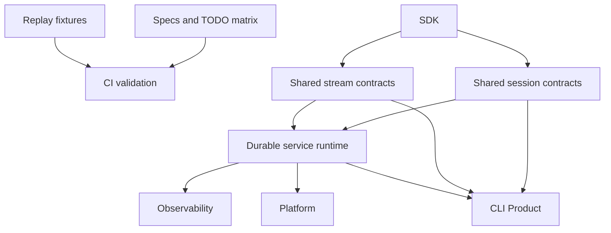

# Operations, Durability, and Products

The operations layer turns core runtime evidence and SDK contracts into validated releases, durable services, and product surfaces.

## Scope

- CI and readiness gates
- provider replay coverage
- feature coverage matrix
- shared session storage and stream protocol components
- durable execution and service runtime
- OpenTelemetry GenAI observability
- Langfuse-friendly OTLP export
- CLI Product
- platform integration
- release acceptance

## Operations Shape

## Spec Map

- `01-ci-readiness.md` — replay CI, docs examples, feature coverage matrix, and release acceptance gates
- `02-shared-execution-components.md` — shared session storage and stream protocol contracts for CLI and Claw
- `03-durable-service-runtime.md` — durable sessions, `SessionStore`, stream archive, resume, interruption, SSE, display-message replay, and storage contracts
- `04-cli-product.md` — CLI Product surface built over SDK, environment providers, shared session/stream components, and service runtime contracts
- `05-observability.md` — OpenTelemetry GenAI tracing, Langfuse-friendly OTLP export, nested agent/model/tool spans, and trace-to-session correlation

## Readiness Model

A feature moves from planned to accepted when it has:

- spec coverage
- implementation
- targeted tests
- docs examples where user-facing
- CI coverage
- TODO matrix update
- clear ownership in crate map
- trace/span semantics when the feature affects runtime, model, tool, subagent, or service execution

## Acceptance Gates

- `make replay-check`
- `make fmt-check`
- `make check`
- `make test`
- `make scripts-check`
- `make docs-check`
- `make coverage-ci`
- `make ci`
