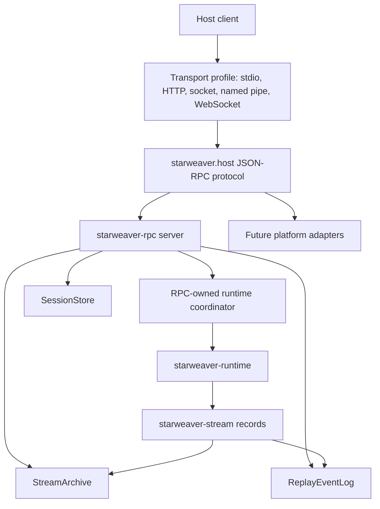
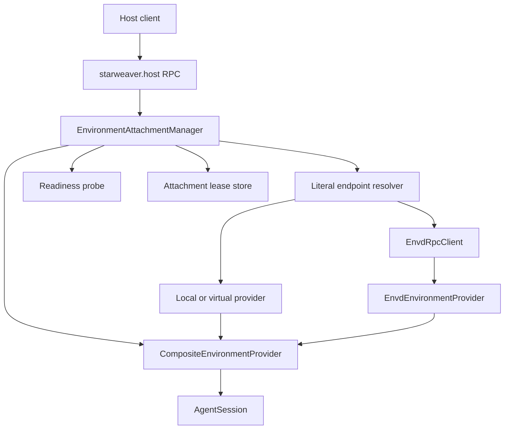
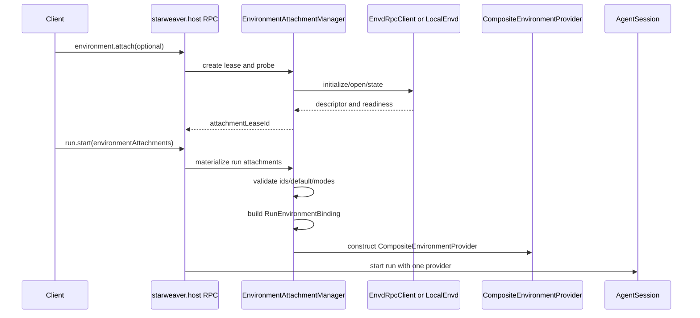
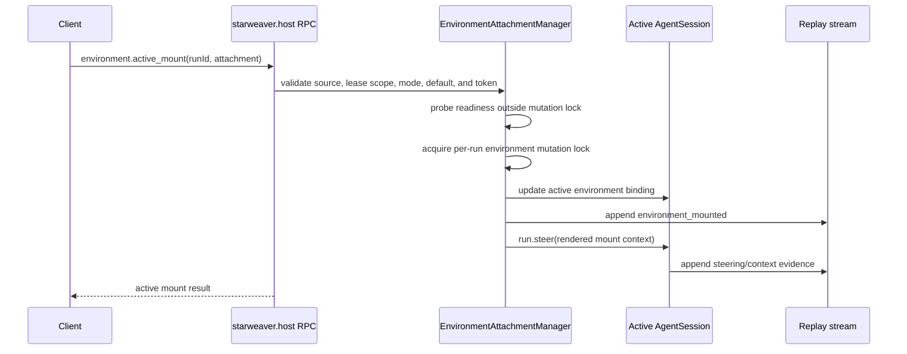
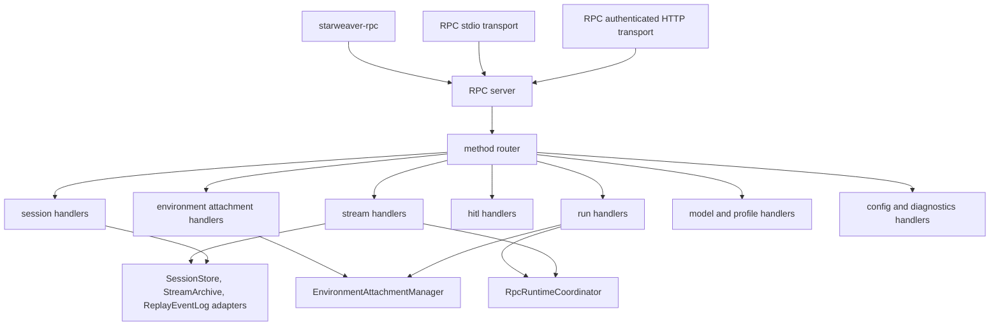

# Future Host Protocol Extensions

Status: non-normative RFC archive

Implemented handwritten host behavior is inventoried by `../06-json-rpc-host-protocol.md`. The sole accepted IDL-first JSON-RPC major-1 contract is defined by `../09-rpc-idl-and-client-generation.md` and atomically replaces that wire. This archive preserves proposals not incorporated into the target, including additional transports, authorization roles, and hosted concerns. Where this archive conflicts with the IDL-first spec, the IDL-first spec controls. Statements using normative language here are design history and are not target requirements.

The Starweaver host protocol is the independent control plane implemented by the standalone `starweaver-rpc` product for host clients, automation hosts, and future product surfaces that need durable sessions, run orchestration, replay, live stream subscriptions, HITL decisions, model profile selection, configuration reads, and diagnostics.

JSON-RPC 2.0 is the semantic request/response protocol. Stdio, HTTP, local sockets, named pipes, and WebSocket are transport profiles over the same typed Starweaver method and event contracts. The normative product boundary is `00-product-boundaries.md`: RPC does not depend on or run through `starweaver-cli`, and CLI/TUI do not run through RPC.

## Goals

- Define a Starweaver-owned host-control protocol instead of treating RPC as a CLI implementation detail.
- Keep RPC independent from CLI/TUI while allowing both products to reuse lower-level runtime, session, stream, storage, environment, and envd abstractions.
- Keep the protocol Starweaver-native by making `ReplayScope`, `ReplayCursor`, `ReplayEvent`, `DisplayMessage`, session records, run records, approval records, and deferred records the canonical data.
- Make JSON-RPC framing transport-neutral enough to move from stdio to HTTP, local sockets, or WebSocket without changing method semantics.
- Make stream replay and live subscription semantics cursor-safe, scope-local, and reconnectable.
- Make all mutating methods idempotent when clients provide an idempotency key.
- Make errors structured enough for host clients to distinguish invalid params, missing records, active-run conflicts, closed subscriptions, timeouts, and failed runtime operations.
- Make projection into AGUI or other UI protocols an explicit edge concern, never the protocol core.
- Keep model profile selection as client state, separate from shared Starweaver config.

## Non-goals

- This protocol does not define provider model wire formats. Provider protocols remain in `starweaver-model`.
- This protocol does not define hosted multi-tenant auth. Hosted auth belongs to future platform/service layers.
- This protocol does not define CLI or TUI behavior. CLI/TUI own separate application coordination and do not reuse RPC handlers or active-run state.
- This protocol does not make AGUI the native event format. AGUI is one projection format.
- This protocol does not replace or underlie CLI command UX.

## Layering



The protocol boundary is the `starweaver.host` method, event, and error contract. `starweaver-rpc` is the standalone local implementation. Future platform adapters can implement the same protocol over different transports or bridge it into external protocols without importing CLI product code.

## RPC-owned configuration and agent materialization

The standalone product resolves `$STARWEAVER_CONFIG_DIR/rpc.toml` (default `~/.starweaver/rpc.toml`) or the path named by `STARWEAVER_RPC_CONFIG`. This is not the CLI `config.toml` and is not parsed through CLI configuration types.

The minimal RPC configuration schema is:

```toml
[server]
default_profile = "default"
database_path = "starweaver.sqlite3"
workspace_root = "."

[profiles.default]
model_id = "openai-responses:gpt-5"
toolsets = ["filesystem"]

[providers.openai]
api_key_env = "OPENAI_API_KEY"
base_url = "https://api.openai.com/v1"
```

Profile materialization is RPC-owned and follows this sequence:

1. Validate the selected RPC profile and referenced first-party toolsets.
2. Parse the logical model id and resolve an RPC provider endpoint.
3. Read credentials from the configured environment variable only when a run starts.
4. Build a production `ProtocolModelClient` from `starweaver-model`.
5. Project the profile into `AgentSpec` and resolve it through `AgentSpecRegistry`.
6. Build the RPC-owned runtime and attach its independently resolved local/envd environment.

Production configuration does not expose deterministic `TestModel` profiles. Unit tests inject a private deterministic profile fixture without changing the production catalog or management results. CLI and RPC may use the same lower `AgentSpec`, model, environment, session, stream, and storage abstractions, but their config files, profile registries, selected state, and coordinators remain independent.

## Protocol Identity

The protocol name is `starweaver.host`.

Version shape:

| Field      | Meaning                                                  |
| ---------- | -------------------------------------------------------- |
| `name`     | Fixed string `starweaver.host`                           |
| `major`    | Breaking contract generation, starting at `1`            |
| `revision` | Date-like revision string for documentation and fixtures |
| `features` | Negotiated feature names returned by `initialize`        |

Example:

```json
{
  "name": "starweaver.host",
  "major": 1,
  "revision": "2026-06-23",
  "features": [
    "session.lifecycle",
    "run.lifecycle",
    "stream.replay",
    "stream.subscribe",
    "hitl.approvals",
    "hitl.deferred",
    "environment.attachments",
    "environment.active_mounts",
    "projection.agui"
  ]
}
```

Clients should key behavior off `major` and `features`, not off revision string ordering.

Feature names:

| Feature                      | Meaning                                |
| ---------------------------- | -------------------------------------- |
| `session.lifecycle`          | Session create/list/get/delete/current |
| `run.lifecycle`              | Run start/get/status/await/cancel      |
| `run.steering`               | Active run steering                    |
| `stream.replay`              | Retained replay by `ReplayScope`       |
| `stream.subscribe`           | Live stream subscriptions              |
| `stream.snapshot`            | Compact replay snapshots               |
| `hitl.approvals`             | Approval list/show/decide              |
| `hitl.deferred`              | Deferred tool list/show/complete/fail  |
| `environment.attachments`    | Host-managed environment attachments   |
| `environment.active_mounts`  | Active-run environment mount mutations |
| `client.model_selection`     | Frontend-local model selection         |
| `projection.display_message` | Starweaver display-message projection  |
| `projection.agui`            | AGUI projection                        |

## JSON-RPC Envelope Rules

Each request, response, and notification is JSON-RPC 2.0.

Request:

```json
{
  "jsonrpc": "2.0",
  "id": "req_1",
  "method": "run.start",
  "params": {}
}
```

Response:

```json
{
  "jsonrpc": "2.0",
  "id": "req_1",
  "result": {}
}
```

Error:

```json
{
  "jsonrpc": "2.0",
  "id": "req_1",
  "error": {
    "code": -32014,
    "message": "run is not active",
    "data": {
      "kind": "run_not_active",
      "retryable": false,
      "sessionId": "session_...",
      "runId": "run_..."
    }
  }
}
```

Notification:

```json
{
  "jsonrpc": "2.0",
  "method": "starweaver.event",
  "params": {}
}
```

Envelope requirements:

- `jsonrpc` must be `2.0`.
- Request `id` must be a string or integer. `null` ids are rejected for requests.
- Request `params` must be an object. Missing params are treated as `{}`.
- Server notifications have no `id`.
- Host protocol v1 defines no client-to-server notification methods. Client messages that mutate state or control subscriptions must carry an `id`.
- JSON-RPC batch arrays are not part of host protocol v1. A batch array receives `invalid_request`.
- Protocol-owned field names use `camelCase`.
- Embedded Starweaver records keep their crate-defined serde shape.

## Common Params

Most methods accept only their method-specific params. Mutating methods and long-running methods may also accept these common fields:

| Field            | Type   | Meaning                                                     |
| ---------------- | ------ | ----------------------------------------------------------- |
| `requestId`      | string | Client correlation id distinct from JSON-RPC `id`           |
| `idempotencyKey` | string | Client key for idempotent mutation semantics                |
| `traceContext`   | object | Optional W3C trace context fields such as `traceparent`     |
| `metadata`       | object | Method-specific durable metadata where the method allows it |

`requestId` is for logs and diagnostics. It does not imply idempotency. `idempotencyKey` is the only field that changes repeated mutation behavior.

## Transport Profiles

Transport profiles only define framing, process IO, and connection lifetime. They do not change methods, params, results, events, cursor semantics, idempotency, or error data.

| Profile      | Framing                                        | Primary use                         |
| ------------ | ---------------------------------------------- | ----------------------------------- |
| `stdio`      | UTF-8 newline-delimited JSON objects           | Local host launches standalone RPC  |
| `http`       | One JSON-RPC object per `POST /rpc` body       | Local request/response integrations |
| `local-sock` | One JSON-RPC object per length-delimited frame | Long-lived local host integrations  |
| `named-pipe` | Same as local socket                           | Windows local host integrations     |
| `websocket`  | One JSON-RPC object per text message           | Browser-backed local or platform UI |

Stdio profile:

- stdin carries client requests.
- stdout is reserved for JSON-RPC responses and notifications.
- stderr carries human-readable diagnostics, trace setup messages, and crash reports.
- Each non-empty stdin line must be one complete JSON object.
- Each stdout line is one complete JSON object.
- The server exits after a successful `shutdown` response is written or after stdin closes.

HTTP profile:

- `POST /rpc` carries one UTF-8 JSON-RPC request object as the HTTP request body.
- Successful JSON-RPC responses use HTTP `200 OK` with an `application/json` response body.
- JSON-RPC notifications without response ids use HTTP `204 No Content`.
- HTTP request parsing failures use HTTP `4xx` responses before JSON-RPC dispatch.
- `GET /health` and `GET /healthz` may expose a lightweight local health response.
- Unary HTTP does not carry live server notifications. HTTP clients use `run.await`, `run.status`, `stream.replay`, or a future long-connection profile for progress.
- Unary HTTP `initialize` responses must not advertise live subscription features such as `stream.subscribe` unless the server is also negotiating a long-connection notification profile.
- Unary HTTP does not support connection-scoped environment attachment leases.
  HTTP clients use session-scoped leases or inline run attachments.
- The server stops accepting new HTTP requests after a successful `shutdown` response is written.

Local socket and named-pipe profile:

- Each frame starts with a 4-byte unsigned big-endian payload length.
- The payload is one UTF-8 JSON-RPC object.
- The length counts payload bytes only and excludes the 4-byte prefix.
- The peer closes the connection after `shutdown` or transport failure.

WebSocket profile:

- Each text message is one complete JSON-RPC object.
- Binary messages are rejected with `invalid_request`.
- Platform deployments must authenticate the WebSocket before accepting host protocol messages.

## Shared Data Contracts

The host protocol reuses shared crates as wire contracts:

| Data                   | Owner                | Protocol role                        |
| ---------------------- | -------------------- | ------------------------------------ |
| `SessionId`, `RunId`   | `starweaver-core`    | Stable durable identifiers           |
| `InputPart`            | `starweaver-session` | Structured run input                 |
| `SessionRecord`        | `starweaver-session` | Durable session state                |
| `RunRecord`            | `starweaver-session` | Durable run state                    |
| `RunStatus`            | `starweaver-session` | Run lifecycle status                 |
| `ApprovalRecord`       | `starweaver-session` | Approval workflow state              |
| `DeferredToolRecord`   | `starweaver-session` | Deferred tool workflow state         |
| `ReplayScope`          | `starweaver-stream`  | Stream replay namespace              |
| `ReplayCursor`         | `starweaver-stream`  | Resume point inside one replay scope |
| `ReplayEvent`          | `starweaver-stream`  | Canonical replay/live stream event   |
| `ReplaySnapshot`       | `starweaver-stream`  | Compact replay state                 |
| `DisplayMessage`       | `starweaver-stream`  | Starweaver-native UI/display event   |
| `StreamTerminalMarker` | `starweaver-stream`  | Terminal stream marker               |

Protocol-owned wrapper objects may add `subscriptionId`, `requestId`, `idempotencyKey`, pagination tokens, projection payloads, and client metadata around these shared records. They should not duplicate or reshape shared records unless the protocol explicitly defines a projection.

## Client Lifecycle

All clients begin with `initialize`.

```json
{
  "jsonrpc": "2.0",
  "id": "req_init",
  "method": "initialize",
  "params": {
    "clientInfo": {
      "name": "local_host",
      "version": "0.1.0"
    },
    "clientIdentity": {
      "clientId": "local-host:user-machine-install"
    },
    "clientStateScope": "local_host",
    "workspaceRoot": "/workspace/project",
    "requiredFeatures": ["run.lifecycle", "stream.subscribe"],
    "preferredProjectionFormats": ["starweaver.display_message", "agui"]
  }
}
```

Result:

```json
{
  "protocol": {
    "name": "starweaver.host",
    "major": 1,
    "revision": "2026-06-23",
    "features": [
      "run.lifecycle",
      "stream.replay",
      "stream.subscribe",
      "environment.attachments",
      "environment.active_mounts"
    ]
  },
  "serverInfo": {
    "name": "starweaver-rpc",
    "version": "X.Y.Z"
  },
  "connectionId": "conn_...",
  "capabilities": {
    "sessions": true,
    "runs": true,
    "streams": true,
    "approvals": true,
    "deferredTools": true,
    "environmentAttachments": true,
    "environmentActiveMounts": true,
    "clientModelSelection": true,
    "projections": ["starweaver.display_message", "agui"],
    "defaultProjectionFormat": "starweaver.display_message"
  },
  "limits": {
    "maxRequestBytes": 1048576,
    "maxResponseBytes": 8388608,
    "defaultPageLimit": 50,
    "maxPageLimit": 500,
    "maxReplayEvents": 1000,
    "maxSubscriptions": 32
  },
  "config": {
    "globalDir": "/home/user/.starweaver",
    "projectDir": "/workspace/project/.starweaver",
    "defaultProfile": "default_model"
  }
}
```

Lifecycle invariants:

- Calls other than `initialize` may be rejected until initialization succeeds.
- `requiredFeatures` is fail-closed. If any required feature is absent, initialize fails with `unsupported_feature`.
- `clientIdentity.clientId` is the preferred durable idempotency scope. If it is absent, idempotency is scoped to the connection only.
- `clientStateScope` selects frontend-local state such as model selection. It does not mutate shared config.
- A connection can own multiple stream subscriptions.
- Clients should respect advertised `limits`; servers reject oversized payloads or exhausted resources with structured errors.
- `shutdown` closes subscriptions, stops accepting new requests, and returns after terminal cleanup that is safe to run synchronously.
- Servers may process independent requests concurrently. Mutations for one session, run, approval, deferred record, or subscription must be serialized by that record key.

### `shutdown`

Requests graceful connection shutdown.

Params:

| Field              | Type    | Required | Meaning                                                                 |
| ------------------ | ------- | -------- | ----------------------------------------------------------------------- |
| `timeoutMs`        | number  | no       | Maximum cleanup wait                                                    |
| `cancelActiveRuns` | boolean | no       | Whether to request cancellation for active runs owned by the connection |

Result:

```json
{
  "status": "shutdown",
  "closedSubscriptions": 2,
  "cancelledRuns": []
}
```

Shutdown closes subscriptions owned by the connection. It does not cancel active runs unless `cancelActiveRuns` is true. The stdio profile exits the process after the shutdown response is written.

## Pagination and Limits

List and replay methods use explicit limits and opaque pagination or cursor tokens.

Pagination rules:

- `limit` defaults to `limits.defaultPageLimit` from `initialize`.
- `limit` greater than `limits.maxPageLimit` fails with `invalid_params`.
- `pageToken` is opaque, server-owned, and scoped to the method plus filter params that produced it.
- Changing filter params while reusing a page token fails with `invalid_params`.
- `nextPageToken: null` means the page is complete.
- Profile and model lists still expose `limit` and `pageToken`; local config implementations can return all entries in one page.

Replay limit rules:

- `stream.replay.limit` defaults to `limits.maxReplayEvents` unless the server advertises a smaller method-specific default.
- `stream.subscribe.replay.limit` defaults to `limits.maxReplayEvents`.
- Replay limits greater than `limits.maxReplayEvents` fail with `invalid_params`.
- A subscription that would need more retained events than its accepted replay limit fails with `replay_limit_exceeded`.

## Method Groups

The protocol uses domain-qualified method names.

| Group       | Methods                                                                                                                                                                   |
| ----------- | ------------------------------------------------------------------------------------------------------------------------------------------------------------------------- |
| Lifecycle   | `initialize`, `shutdown`                                                                                                                                                  |
| Session     | `session.create`, `session.list`, `session.get`, `session.current.get`, `session.current.set`, `session.delete`                                                           |
| Run         | `run.start`, `run.get`, `run.status`, `run.await`, `run.cancel`, `run.steer`                                                                                              |
| Environment | `environment.attach`, `environment.detach`, `environment.list`, `environment.health`, `environment.active_mount`, `environment.active_unmount`, `environment.active_list` |
| Stream      | `stream.replay`, `stream.subscribe`, `stream.unsubscribe`, `stream.snapshot`, `stream.cursorRange`                                                                        |
| HITL        | `approval.list`, `approval.show`, `approval.decide`, `deferred.list`, `deferred.show`, `deferred.complete`, `deferred.fail`                                               |
| Model       | `model.list`, `model.current`, `model.select`                                                                                                                             |
| Profile     | `profile.list`, `profile.get`                                                                                                                                             |
| Config      | `config.get`                                                                                                                                                              |
| Diagnostics | `diagnostics.get`                                                                                                                                                         |

`stream.*` is the canonical stream API. Product-specific command shortcuts can call shared handlers, but protocol clients should not need separate methods for run attach, session output, and replay export.

## Session Methods

### `session.create`

Creates a durable session record.

Params:

| Field            | Type   | Required | Meaning                                       |
| ---------------- | ------ | -------- | --------------------------------------------- |
| `profile`        | string | no       | Agent/model profile for future runs           |
| `title`          | string | no       | Human-readable session title                  |
| `workspaceRoot`  | string | no       | Session workspace path                        |
| `metadata`       | object | no       | Durable session metadata                      |
| `idempotencyKey` | string | no       | Idempotent create key scoped to client/method |

Result:

```json
{
  "session": {}
}
```

### `session.list`

Lists durable sessions.

Params:

| Field       | Type   | Required | Meaning                                      |
| ----------- | ------ | -------- | -------------------------------------------- |
| `status`    | string | no       | `active`, `archived`, `failed`, or `deleted` |
| `profile`   | string | no       | Profile filter                               |
| `workspace` | string | no       | Workspace filter                             |
| `limit`     | number | no       | Maximum rows                                 |
| `pageToken` | string | no       | Opaque pagination token                      |

Result:

```json
{
  "sessions": [],
  "nextPageToken": null
}
```

### `session.get`

Loads a session and recent runs.

Params:

| Field       | Type   | Required | Meaning                                                  |
| ----------- | ------ | -------- | -------------------------------------------------------- |
| `sessionId` | string | yes      | Session id                                               |
| `runsLimit` | number | no       | Maximum recent runs                                      |
| `include`   | array  | no       | Optional sections such as `runs`, `trace`, `environment` |

Result:

```json
{
  "session": {},
  "runs": []
}
```

### Current Session Pointer

`session.current.get` and `session.current.set` operate on the project runtime state pointer. They do not change `SessionRecord` contents.

`session.current.get` params:

| Field           | Type   | Required | Meaning                                    |
| --------------- | ------ | -------- | ------------------------------------------ |
| `workspaceRoot` | string | no       | Project root; defaults to initialized root |

Result:

```json
{
  "workspaceRoot": "/workspace/project",
  "sessionId": "session_...",
  "session": {}
}
```

`sessionId` and `session` are `null` when no current pointer exists.

`session.current.set` params:

| Field            | Type           | Required | Meaning                                    |
| ---------------- | -------------- | -------- | ------------------------------------------ |
| `workspaceRoot`  | string         | no       | Project root; defaults to initialized root |
| `sessionId`      | string or null | yes      | Session id to set, or `null` to clear      |
| `idempotencyKey` | string         | no       | Idempotent pointer update key              |

Result:

```json
{
  "workspaceRoot": "/workspace/project",
  "sessionId": "session_...",
  "session": {}
}
```

`session.current.set` must verify the session exists before updating the pointer when `sessionId` is not `null`. Clearing an already empty pointer is successful.

### `session.delete`

Deletes or tombstones a session.

Params:

| Field            | Type    | Required | Meaning                                             |
| ---------------- | ------- | -------- | --------------------------------------------------- |
| `sessionId`      | string  | yes      | Session id                                          |
| `deleteEvidence` | boolean | no       | Delete run, stream, approval, and deferred evidence |
| `reason`         | string  | no       | Human-readable reason                               |
| `idempotencyKey` | string  | no       | Idempotent delete key                               |

Result:

```json
{
  "sessionId": "session_...",
  "deleted": true,
  "evidenceDeleted": false
}
```

Delete invariants:

- `deleteEvidence` defaults to `false`; retained run and stream evidence may remain as hidden audit data.
- If `deleteEvidence` is `true`, session records, run records, replay events, stream snapshots, approvals, and deferred records are removed as one durable operation or the method fails.
- Deleting the current project session clears the current pointer.
- Deleting a session with an active run returns `run_conflict` unless the product has first cancelled or completed the run.

## Run Methods

`run.start` is the core run creation method. It accepts structured input. Plain prompt text is represented as an `InputPart` with kind `text`.

Params:

| Field                    | Type   | Required | Meaning                                             |
| ------------------------ | ------ | -------- | --------------------------------------------------- |
| `input`                  | object | yes      | Run input object with `parts`                       |
| `session`                | object | no       | Session selection policy                            |
| `model`                  | object | no       | One-run model/profile override                      |
| `clientStateScope`       | string | no       | Frontend-local model selection scope                |
| `environment`            | object | no       | Workspace and environment selection hints           |
| `environmentAttachments` | array  | no       | Inline or pre-attached environments for the run     |
| `hitl`                   | object | no       | Approval/deferred policy overrides                  |
| `stream`                 | object | no       | Initial subscription and projection options         |
| `metadata`               | object | no       | Run metadata                                        |
| `idempotencyKey`         | string | no       | Idempotent run creation key scoped to client/method |

Input object:

```json
{
  "parts": [
    {
      "kind": "text",
      "text": "summarize this repository"
    }
  ]
}
```

Session selection:

```json
{
  "policy": "new"
}
```

| Policy              | Fields                          | Meaning                                                  |
| ------------------- | ------------------------------- | -------------------------------------------------------- |
| `selected`          | `sessionId`                     | Append under a specific session                          |
| `current`           | none                            | Use current project session pointer                      |
| `current_or_latest` | none                            | Use current project session pointer, then latest session |
| `latest`            | none                            | Use latest resumable session                             |
| `new`               | optional `title`, `profile`     | Create a new session                                     |
| `restore`           | `sessionId`, `restoreFromRunId` | Append after restoring a run snapshot                    |
| `branch`            | `sessionId`, `branchFromRunId`  | Append a branch run from historical run evidence         |

`current` fails with `not_found` when no current project session exists. `current_or_latest` is the protocol form of the CLI continue behavior.

Current CLI compatibility parameters map `sessionId` to `selected`,
`continueLatest=true` to `current_or_latest`, and `newSession=true` to `new`.
These session selectors are mutually exclusive. A request that supplies more
than one target selector is rejected before environment attachment
materialization.

Model options:

```json
{
  "profile": "coding",
  "settings": {}
}
```

| Field      | Type   | Required | Meaning                                    |
| ---------- | ------ | -------- | ------------------------------------------ |
| `profile`  | string | no       | Config-backed profile for this run         |
| `settings` | object | no       | Typed `ModelSettings` overlay for this run |

Model option invariants:

- `profile` must resolve through shared config.
- `settings` must validate against `starweaver-model` typed model settings for the resolved provider.
- Arbitrary provider HTTP headers are not accepted through generic RPC metadata.
- Provider routing affinity can only flow through typed provider routing settings and runtime context, not durable session ids.

Result:

```json
{
  "sessionId": "session_...",
  "runId": "run_...",
  "status": "running",
  "stream": {
    "subscriptionId": "sub_...",
    "scope": "run:run_...",
    "cursor": null,
    "replay": {
      "events": [],
      "nextCursor": null,
      "hasMore": false
    }
  }
}
```

Run invariants:

- `run.start` creates durable session/run records before returning.
- `run.start` returns after the run is accepted and active-run registration is complete.
- `stream` is `null` when the request does not ask for an initial subscription.
- Terminal completion is reported through stream events and can be read with `run.await` or `run.status`.
- If `stream.subscribe` options are supplied in `run.start`, the server creates the run subscription atomically with run registration.
- The server must not use durable session ids as provider routing headers. Provider routing affinity flows through context and typed model settings only.

Environment options:

```json
{
  "workspaceRoot": "/workspace/project",
  "provider": "local",
  "worktree": {
    "mode": "existing",
    "name": "feature"
  },
  "metadata": {}
}
```

Environment fields are hints resolved by the product host against Starweaver environment provider configuration. Unsupported providers, worktree modes, or workspace roots fail with `configuration_failed` or `invalid_params`; they must not silently widen file or shell policy.

Run environment attachments:

```json
{
  "environmentAttachments": [
    {
      "id": "local",
      "kind": "local",
      "default": true
    },
    {
      "id": "data",
      "kind": "envd",
      "endpointRef": "http://127.0.0.1:8770/rpc",
      "authToken": "request-only bearer token",
      "environmentId": "dataset",
      "mode": "read_only"
    }
  ]
}
```

`environmentAttachments` entries have two allowed forms:

- A pre-attached lease ref with `attachmentLeaseId`, plus run-local fields such
  as `id`, `mode`, and `default`.
- An inline attachment source with `kind`, endpoint/source fields, `mode`, and
  `default`. The server resolves it through the same attachment manager used by
  `environment.attach`.

Attachment invariants:

- `id` is the run-local agent-facing mount identity. It is an ASCII slug and is
  exposed to tools as `/environment/{id}`.
- `local` is a reserved mount id for the host's configured local Starweaver
  environment. A non-local attachment source must not use `id: "local"`.
  Product surfaces should use `{"id": "local", "kind": "local"}` for the local
  workspace mount instead of inventing aliases such as `workspace`.
- One attachment is the default for unqualified paths. Multiple attachments
  require exactly one `default: true`. A single attachment defaults to true when
  omitted.
- When `environmentAttachments` is omitted, the local host behaves as if the run
  had one reserved local attachment with `id: "local"`, `kind: "local"`, and
  `default: true`.
- When `environmentAttachments` is present, the list is authoritative. Clients
  that want local workspace access alongside envd-backed environments must
  include the reserved `local` attachment explicitly.
- `attachmentLeaseId` is a host-control lease id, not an envd environment id and
  not visible to the model.
- A run-local `mode` on a lease ref may keep or narrow the leased mode. It must
  not widen a `read_only` lease to `read_write`.
- Inline envd attachments identify envd by `endpointRef`, optional request-only
  `authToken`, and `environmentId`. The local host accepts literal `http://...`
  endpoints with bearer tokens and literal `stdio://...` endpoints for
  host-launched stdio envd processes. Named aliases are future host
  capabilities.
- `authToken` is a transport credential. It is never returned by
  `environment.attach`, `environment.list`, `run.start`, stream replay, or model
  visible environment context.
- A session-scoped `attachmentLeaseId` can only be used by a run bound to the
  same `sessionId`. If the run target session is not explicit or cannot be
  proven before materialization, the server rejects the lease ref.
- Session target selection is resolved before lease materialization and must not
  change after lease scope validation.
- Run preparation must resolve and probe all attachments before creating the
  runtime session. A failure in any required attachment fails `run.start` before
  active-run registration.
- The runtime receives one SDK `EnvironmentProvider`, normally a
  `CompositeEnvironmentProvider`; it does not receive a list of host-control
  attachments.

### Config-Backed TUI Envd Profiles

Interactive TUI startup always materializes the reserved local mount first and
then appends enabled envd profiles from shared `config.toml`. TUI envd
attachments are configured in shared config instead of TUI argv. The config owns
zero or more named envd profiles:

```toml
[envd_profiles.data]
label = "Data"
endpoint = "http://127.0.0.1:8766/rpc"
auth_token_env = "STARWEAVER_DATA_ENVD_TOKEN"
environment_id = "dataset"
mode = "read_only"

[envd_profiles.review]
endpoint = "http://127.0.0.1:8770/rpc"
auth_token_env = "STARWEAVER_REVIEW_ENVD_TOKEN"
environment_id = "review"
mount_id = "review"
mode = "read_write"
```

Profile rules:

- The table name is the stable envd profile name. `mount_id` defaults to the
  table name and must be an ASCII attachment slug.
- `mount_id = "local"` is invalid for an envd profile because `local` is
  reserved for the host's configured local Starweaver environment.
- `endpoint` is currently a literal `http://...` envd RPC endpoint for TUI
  profiles. Dynamic host-control attachments additionally support literal
  `stdio://...` endpoint refs.
- HTTP profiles must provide either `auth_token_env` or request-only
  `auth_token`. `auth_token_env` is preferred for real deployments. Direct
  `auth_token` values must not be returned by `config.get`, diagnostics, stream
  events, replay, or model-visible context.
- `mode` is `read_write` by default and may be `read_only`.
- `enabled = false` excludes a profile from TUI run materialization.
- TUI materializes a run-local `environmentAttachments` list containing
  `{"id": "local", "kind": "local"}` plus all enabled envd profiles.
- The reserved `local` mount is the default unless exactly one enabled envd
  profile has `default = true`. More than one enabled envd profile with
  `default = true` is invalid. This preserves existing local-workspace behavior
  unless the user explicitly chooses a remote default.
- These config-backed profiles are a TUI convenience over the same attachment
  manager semantics. RPC callers can still pass inline attachments or prepared
  leases explicitly.

HITL options:

```json
{
  "policy": "prompt"
}
```

| Field    | Type   | Required | Meaning                                            |
| -------- | ------ | -------- | -------------------------------------------------- |
| `policy` | string | no       | `configured`, `prompt`, `deny`, `defer`, or `fail` |

HITL policy meanings:

| Policy       | Meaning                                                  |
| ------------ | -------------------------------------------------------- |
| `configured` | Use resolved product/profile configuration               |
| `prompt`     | Create approval records and wait for human decisions     |
| `deny`       | Deny approval-required actions                           |
| `defer`      | Persist deferred tool records for later completion       |
| `fail`       | Fail the run when an approval-required action is reached |

Run stream options:

```json
{
  "subscribe": true,
  "scope": "run",
  "cursor": null,
  "replay": {
    "enabled": true,
    "limit": 1000
  },
  "projection": {
    "formats": ["starweaver.display_message"]
  }
}
```

If `stream.subscribe` options are supplied in `run.start`, `scope` may be `run` or `session`; the server expands it to `run:<runId>` or `session:<sessionId>` after durable ids are allocated. The `stream` result follows `stream.subscribe` result semantics for the expanded scope.

### `run.get`

Loads one run record and optional compact trace.

Params:

| Field       | Type   | Required | Meaning                           |
| ----------- | ------ | -------- | --------------------------------- |
| `sessionId` | string | yes      | Session id                        |
| `runId`     | string | yes      | Run id                            |
| `include`   | array  | no       | Optional sections such as `trace` |

Result:

```json
{
  "run": {},
  "trace": null
}
```

### `run.status`

Returns the current run status from active-run state when present, otherwise from durable run state.

Params:

| Field       | Type   | Required | Meaning    |
| ----------- | ------ | -------- | ---------- |
| `sessionId` | string | yes      | Session id |
| `runId`     | string | yes      | Run id     |

Result:

```json
{
  "sessionId": "session_...",
  "runId": "run_...",
  "status": "running",
  "outputPreview": null,
  "error": null
}
```

### `run.await`

Waits for terminal run status.

Params:

| Field       | Type   | Required | Meaning               |
| ----------- | ------ | -------- | --------------------- |
| `sessionId` | string | yes      | Session id            |
| `runId`     | string | yes      | Run id                |
| `timeoutMs` | number | no       | Maximum wait duration |

Result:

```json
{
  "run": {},
  "status": "completed",
  "outputPreview": "..."
}
```

Await invariants:

- `run.await` returns only after the run reaches a terminal status.
- If `timeoutMs` expires first, the method returns a `timeout` error with `sessionId`, `runId`, and the current run status in `error.data`.
- Disconnecting a client cancels the pending await request, not the underlying run.

### `run.cancel`

Requests cooperative cancellation.

Params:

| Field            | Type   | Required | Meaning                     |
| ---------------- | ------ | -------- | --------------------------- |
| `runId`          | string | yes      | Active run id               |
| `reason`         | string | no       | Human-readable reason       |
| `idempotencyKey` | string | no       | Idempotent cancellation key |

Result:

```json
{
  "runId": "run_...",
  "accepted": true
}
```

### `run.steer`

Queues steering text for an active run.

Params:

| Field            | Type   | Required | Meaning                     |
| ---------------- | ------ | -------- | --------------------------- |
| `runId`          | string | yes      | Active run id               |
| `input`          | object | yes      | Steering input parts        |
| `steeringId`     | string | no       | Client-provided steering id |
| `idempotencyKey` | string | no       | Idempotent steering key     |

Result:

```json
{
  "runId": "run_...",
  "steeringId": "steer_...",
  "queued": true
}
```

## Environment Attachment Methods

The host owns an `EnvironmentAttachmentManager` between JSON-RPC handlers and
run preparation. It resolves host-control refs into SDK providers and leases.
Envd remains the environment data/effect plane; the host manager only owns
selection, probing, lifecycle, and run binding.



Manager responsibilities:

- Validate attachment ids, default selection, access modes, and source shape.
- Resolve literal `endpointRef` transport refs supported by the advertised
  protocol revision. The local host supports literal `http://...` envd endpoints
  with request-only bearer tokens and literal `stdio://...` envd endpoints for
  local stdio processes.
- Construct SDK providers such as local, virtual, sandbox, or envd-backed
  providers.
- Probe process liveness and environment readiness before a run uses an
  attachment.
- Track connection-scoped and session-scoped attachment leases.
- Materialize one run-scoped `RunEnvironmentBinding` from inline attachments
  and lease refs, then construct the SDK provider composition.
- Mutate active-run environment bindings when `environment.active_mounts` is
  advertised, while preserving one SDK provider handle for runtime tools.
- Release manager-owned leases when their scope closes, while leaving envd
  service-owned environment state to envd.

Future manager capabilities:

- Resolve named `endpointRef` aliases to concrete local or remote transports.
- Launch host-owned envd daemons when a configured endpoint requires it.
- Support local socket, named pipe, and WebSocket envd transports.

Manager non-goals:

- It does not expose envd file, process, mount, or operation DTOs through
  `starweaver.host`.
- It does not store full envd state in Starweaver session storage.
- The current implementation does not mutate an already running AgentSession.
  The target active-run mount design below requires an updatable environment
  binding and append-only context injection through steering.

### Attachment Source

Attachment source shape:

```json
{
  "id": "data",
  "kind": "envd",
  "endpointRef": "http://127.0.0.1:8770/rpc",
  "authToken": "request-only bearer token for HTTP",
  "environmentId": "dataset",
  "mode": "read_only",
  "default": false,
  "defaultForShell": false,
  "metadata": {}
}
```

Fields:

| Field             | Type    | Required | Meaning                                                       |
| ----------------- | ------- | -------- | ------------------------------------------------------------- |
| `id`              | string  | yes      | Agent-facing mount identity within the lease or run           |
| `kind`            | string  | no       | `local`, `virtual`, `sandbox`, or `envd`; defaults to `local` |
| `endpointRef`     | string  | for envd | Literal `http://...` or `stdio://...` envd endpoint           |
| `authToken`       | string  | for HTTP | Request-only bearer token for HTTP envd                       |
| `environmentId`   | string  | no       | Concrete environment id inside the implementation             |
| `mode`            | string  | no       | `read_write` or `read_only`; defaults to `read_write`         |
| `default`         | boolean | no       | Default preference when materialized into a run               |
| `defaultForShell` | boolean | no       | Shell default preference; requires command/process capability |
| `metadata`        | object  | no       | Host metadata, never model-visible by default                 |

Endpoint refs:

- Literal `http://...` endpoints connect through authenticated
  `EnvdRpcClient::http_with_token`. The local host accepts loopback HTTP
  endpoints by default.
- Literal `stdio://program?arg=...` endpoints spawn a host-local envd child
  process through `EnvdRpcClient::spawn_stdio`. Query parameters are repeated
  `arg=` values. Stdio endpoints do not use bearer tokens. Literal stdio refs
  are a trusted-local RPC capability: the requesting host integration is asking
  the local host process to launch a concrete program.
- `id: "local"` is reserved for `kind: "local"` and does not use endpoint
  fields. A host should reject `id: "local"` with `kind: "envd"` or any future
  remote source kind.
- Endpoint URLs must not contain userinfo credentials, credential-like query
  parameters, fragments, or embedded bearer material. Transport credentials must
  flow through request-only fields such as `authToken` or configured secret
  sources, never through `endpointRef`.
- The first local product should accept loopback HTTP endpoints by default.
  Non-loopback endpoints require explicit host policy or endpoint alias
  configuration and should otherwise fail with `configuration_failed` or
  `unsupported_feature`.
- Results, stream payloads, diagnostics, and error data may include a redacted
  endpoint ref only when it is safe. They must omit or redact query strings,
  userinfo, launch credentials, and any host path outside declared
  agent-facing mount roots.
- The current local host returns `stdio://<redacted>` for literal stdio endpoint
  refs in lease results. The full program path and args remain request-only host
  control data.
- Named aliases, local socket, named pipe, WebSocket, and managed daemon launch
  policies are future host capabilities. Servers that do not advertise those
  capabilities reject them with `unsupported_feature`.
- Alias resolution failures return `configuration_failed` once alias resolvers
  are supported.
- Transport liveness failures return `environment_unavailable`.

### `environment.attach`

Creates or reuses an attachment lease for a connection or session.

Params:

```json
{
  "scope": {
    "kind": "session",
    "sessionId": "session_..."
  },
  "attachment": {
    "id": "data",
    "kind": "envd",
    "endpointRef": "http://127.0.0.1:8770/rpc",
    "authToken": "request-only bearer token",
    "environmentId": "dataset",
    "mode": "read_only"
  },
  "readiness": {
    "policy": "required",
    "timeoutMs": 5000
  },
  "idempotencyKey": "attach-data"
}
```

Params fields:

| Field            | Type   | Required | Meaning                                           |
| ---------------- | ------ | -------- | ------------------------------------------------- |
| `scope`          | object | no       | `connection` or `session`; defaults to connection |
| `attachment`     | object | yes      | Attachment source                                 |
| `readiness`      | object | no       | Probe policy and timeout                          |
| `idempotencyKey` | string | no       | Idempotent attach key                             |

Scope shape:

```json
{
  "kind": "connection"
}
```

```json
{
  "kind": "session",
  "sessionId": "session_..."
}
```

Readiness policy:

| Policy        | Meaning                                                              |
| ------------- | -------------------------------------------------------------------- |
| `required`    | Attach fails if liveness or environment readiness cannot be proven   |
| `best_effort` | Attach succeeds but reports degraded readiness                       |
| `skip`        | Construct the lease without probing; run materialization may reprobe |

Result:

```json
{
  "attachment": {
    "attachmentLeaseId": "envatt_...",
    "scope": {
      "kind": "session",
      "sessionId": "session_..."
    },
    "id": "data",
    "kind": "envd",
    "endpointRef": "http://127.0.0.1:8770/rpc",
    "environmentId": "dataset",
    "mode": "read_only",
    "default": false,
    "mountRoot": "/environment/data",
    "status": "ready",
    "readiness": {
      "transport": "ready",
      "environment": "ready",
      "capabilities": {
        "files": ["read", "list", "stat", "glob", "grep"],
        "command": [],
        "process": []
      }
    }
  }
}
```

Attach invariants:

- A repeated idempotent attach returns the original lease.
- Reusing the same `id` in the same scope with a different source returns
  `already_exists` unless a future replace mode is specified.
- Session-scoped leases may be reused by future runs for that session.
- Connection-scoped leases require a stateful connection profile such as stdio,
  local socket, named pipe, or WebSocket. Unary HTTP rejects connection-scoped
  environment leases.
- Connection-scoped leases are released on `shutdown` or connection loss.
- The manager may share one transport client between compatible leases, but
  lease ids remain distinct host-control records.

Attachment status values:

| Status        | Meaning                                        |
| ------------- | ---------------------------------------------- |
| `ready`       | Probe succeeded and the provider can be used   |
| `degraded`    | Lease exists but readiness is only best-effort |
| `unavailable` | Probe failed or transport is unreachable       |
| `detached`    | Lease was released                             |

### `environment.detach`

Releases an attachment lease.

Params:

```json
{
  "attachmentLeaseId": "envatt_...",
  "force": false,
  "idempotencyKey": "detach-data"
}
```

Params fields:

| Field               | Type    | Required | Meaning                                      |
| ------------------- | ------- | -------- | -------------------------------------------- |
| `attachmentLeaseId` | string  | yes      | Lease id returned by `environment.attach`    |
| `force`             | boolean | no       | Reserved for future force-after-run policies |
| `idempotencyKey`    | string  | no       | Idempotent detach key                        |

Result:

```json
{
  "attachmentLeaseId": "envatt_...",
  "detached": true
}
```

Detach invariants:

- Detaching a lease used by an active run returns `run_conflict` unless a future
  force policy explicitly detaches only after the active run finishes.
- Detach releases host manager resources and host-launched processes when no
  remaining lease uses them. Literal stdio envd refs are currently per-client
  ephemeral process launches, not shared host-manager daemon resources; a
  readiness probe and a runtime mount may use distinct stdio child processes.
  Shared process ownership belongs to a future managed launch or alias policy.
- Detach does not imply envd `environment.close` or `environment.unload`.
  Concrete envd lifecycle remains envd-owned.

### `environment.list`

Lists attachment leases visible to the connection.

Params:

```json
{
  "scope": {
    "kind": "session",
    "sessionId": "session_..."
  },
  "status": "ready",
  "limit": 50,
  "pageToken": null
}
```

Result:

```json
{
  "attachments": [],
  "nextPageToken": null
}
```

The result uses the same attachment lease shape returned by
`environment.attach`, but secrets and launch credentials are always redacted.

### `environment.health`

Probes one existing lease or one inline attachment source.

Params:

```json
{
  "attachmentLeaseId": "envatt_...",
  "timeoutMs": 5000
}
```

Inline probe:

```json
{
  "attachment": {
    "id": "data",
    "kind": "envd",
    "endpointRef": "http://127.0.0.1:8770/rpc",
    "authToken": "request-only bearer token",
    "environmentId": "dataset"
  },
  "timeoutMs": 5000
}
```

Result:

```json
{
  "status": "ready",
  "readiness": {
    "transport": "ready",
    "environment": "ready",
    "capabilities": {
      "files": ["read", "write", "list", "stat", "glob", "grep"],
      "command": ["run"],
      "process": ["start", "wait", "input", "signal", "kill"]
    }
  }
}
```

Health invariants:

- `environment.health` is diagnostic. A ready result is not a permanent
  guarantee; tool calls still handle per-operation failures.
- For envd, HTTP `/health` or transport initialization proves process liveness.
  `initialize` plus `environment.open` or `environment.state` proves
  environment readiness.
- Health results must not include provider credentials, raw shell output, or
  host filesystem paths beyond declared agent-facing mount roots.

### Run Materialization

Before `run.start` creates an active run, the server materializes environment
attachments:



Materialization rules:

- Inline attachments and `attachmentLeaseId` refs can be mixed in one run.
- `RunEnvironmentBinding` is a host-side run-local value:
  `mounts`, `defaultMountId`, `defaultShellMountId`, readiness summary, and
  safe lease refs. It is not a general graph abstraction.
- The run-local `id` determines the agent-facing path even when a lease has a
  different source identity.
- The initial `RunEnvironmentBinding` starts at `bindingVersion = 1`. When
  `environment.active_mounts` is not advertised, the binding remains immutable
  for the run. When the feature is advertised, active mount/unmount operations
  create new binding versions; previous stream/replay records keep describing
  the binding version that existed when they were emitted.
- The run record should store safe attachment refs, lease ids when applicable,
  readiness summary, and start/end state versions when providers expose them.
- Failed required probes fail `run.start` before durable active-run
  registration. If the server has already created a durable run record, it must
  mark that run failed instead of leaving an active orphan.

### Active-Run Environment Mounting

Active-run mounting is part of the `environment.active_mounts` feature. Servers
that do not advertise this feature must reject the methods below with
`unsupported_feature`. The feature attaches or removes run-local mounts while a
run is active; it does not turn envd into the agent-control plane.

| Method                       | Purpose                                               |
| ---------------------------- | ----------------------------------------------------- |
| `environment.active_mount`   | Add or replace one mount on an active run             |
| `environment.active_unmount` | Remove one active-run mount for future tool calls     |
| `environment.active_list`    | Return the active run's current materialized bindings |

`environment.active_mount` params:

```json
{
  "runId": "run_...",
  "attachment": {
    "id": "data",
    "kind": "envd",
    "endpointRef": "http://127.0.0.1:8770/rpc",
    "authToken": "request-only bearer token",
    "environmentId": "dataset",
    "mode": "read_only",
    "default": false,
    "defaultForShell": false
  },
  "replace": false,
  "injectContext": true,
  "expectedBindingVersion": 3,
  "idempotencyKey": "mount-data-run_..."
}
```

`attachment` is the same host-control attachment ref used by `run.start`: it may
be an inline source or a lease ref with `attachmentLeaseId`, run-local `id`,
optional `mode`, optional `default`, and optional `defaultForShell`.
`defaultForShell` maps to the SDK `default_for_shell` flag and may only select a
ready mount with command/process capability. Lease refs inherit the same rules
as run materialization: read-only leases cannot be widened, session-scoped
leases must belong to the run's session, connection-scoped leases must belong
to the calling connection, and the server must reject ambiguous or unproven
ownership.

`environment.active_mount` result:

```json
{
  "runId": "run_...",
  "operationId": "envop_...",
  "mountId": "data",
  "previousBindingVersion": 3,
  "bindingVersion": 4,
  "replace": false,
  "previousDefaultMountId": "local",
  "currentDefaultMountId": "local",
  "previousDefaultShellMountId": "local",
  "currentDefaultShellMountId": "local",
  "mount": {
    "id": "data",
    "kind": "envd",
    "root": "/environment/data",
    "mode": "read_only",
    "default": false,
    "defaultForShell": false,
    "status": "ready",
    "readiness": {},
    "environmentId": "dataset"
  },
  "environment": {
    "bindingVersion": 4,
    "defaultMountId": "local",
    "defaultShellMountId": "local",
    "mounts": [
      {
        "id": "local",
        "kind": "local",
        "root": "/environment/local",
        "mode": "read_write",
        "default": true,
        "defaultForShell": true,
        "status": "ready",
        "readiness": {}
      },
      {
        "id": "data",
        "kind": "envd",
        "root": "/environment/data",
        "mode": "read_only",
        "default": false,
        "defaultForShell": false,
        "status": "ready",
        "readiness": {},
        "environmentId": "dataset"
      }
    ]
  },
  "eventCursor": {
    "scope": "run:run_...",
    "sequence": 42
  },
  "steeringCursor": {
    "scope": "run:run_...",
    "sequence": 43
  }
}
```

`environment.active_unmount` params:

```json
{
  "runId": "run_...",
  "mountId": "data",
  "newDefaultMountId": "local",
  "newDefaultShellMountId": "local",
  "injectContext": true,
  "expectedBindingVersion": 4,
  "idempotencyKey": "unmount-data-run_..."
}
```

`newDefaultMountId` is required when `mountId` is the current default mount and
must name another ready mount in the active binding. The first implementation
rejects unmounting a mount that owns live background processes with
`run_conflict`; future protocol revisions may add an explicit process policy
such as wait, detach, or terminate.

`newDefaultShellMountId` is required when `mountId` is the current shell default
and another ready command/process-capable mount should become the shell default.
If the active binding has no remaining shell-capable mount, the server sets
`defaultShellMountId` to null and future shell calls without an explicit
`/environment/{id}` cwd fail as shell-unavailable.

`environment.active_unmount` result:

```json
{
  "runId": "run_...",
  "operationId": "envop_...",
  "mountId": "data",
  "previousBindingVersion": 4,
  "bindingVersion": 5,
  "previousDefaultMountId": "local",
  "currentDefaultMountId": "local",
  "previousDefaultShellMountId": "local",
  "currentDefaultShellMountId": "local",
  "removedMount": {
    "id": "data",
    "kind": "envd",
    "root": "/environment/data",
    "mode": "read_only",
    "default": false,
    "defaultForShell": false,
    "status": "detached",
    "readiness": {}
  },
  "environment": {
    "bindingVersion": 5,
    "defaultMountId": "local",
    "defaultShellMountId": "local",
    "mounts": [
      {
        "id": "local",
        "kind": "local",
        "root": "/environment/local",
        "mode": "read_write",
        "default": true,
        "defaultForShell": true,
        "status": "ready",
        "readiness": {}
      }
    ]
  },
  "eventCursor": {
    "scope": "run:run_...",
    "sequence": 44
  },
  "steeringCursor": {
    "scope": "run:run_...",
    "sequence": 45
  }
}
```

`environment.active_list` params:

```json
{
  "runId": "run_..."
}
```

`environment.active_list` result:

```json
{
  "runId": "run_...",
  "environment": {
    "bindingVersion": 5,
    "defaultMountId": "local",
    "defaultShellMountId": "local",
    "mounts": [
      {
        "id": "local",
        "kind": "local",
        "root": "/environment/local",
        "mode": "read_write",
        "default": true,
        "defaultForShell": true,
        "status": "ready",
        "readiness": {}
      }
    ]
  },
  "latestEnvironmentCursor": {
    "scope": "run:run_...",
    "sequence": 44
  }
}
```

Active mutation results may include a `warnings` array. Warning entries must be
safe to display and should include a stable `code` plus short `message`, for
example when lifecycle replay succeeded but optional steering context injection
failed.

Active binding mutation sequence:



Active binding invariants:

- The runtime still observes one SDK `EnvironmentProvider`. The active binding
  swap is a host/runtime handle update, not a new envd-aware runtime API.
- Each active run has one environment mutation lock. Mount, unmount, and default
  updates are serialized under that lock.
- Every successful mutation increments `bindingVersion` exactly once. Clients may
  pass `expectedBindingVersion`; a mismatch fails with `run_conflict` and does
  not mutate the binding.
- Binding updates affect future tool calls only. Tool calls already executing
  finish against the binding version they started with.
- Same-id `active_mount` fails with `already_exists` unless `replace: true`.
  Replacement validates and probes the new source before acquiring the mutation
  lock, then atomically swaps the mount. Replacing the current default mount
  keeps that mount id as default. Replacing a non-default mount with
  `attachment.default: true` moves the default to the replaced mount.
- Adding a new mount with `attachment.default: true` moves `defaultMountId` to
  the new ready mount. Adding or replacing a mount with
  `attachment.defaultForShell: true` moves `defaultShellMountId` to that mount
  after verifying command/process capability.
- A request that would leave the active binding without a default mount fails
  with `invalid_params` or `run_conflict` and leaves the old binding active.
- A request that would leave the active binding with an invalid shell default
  fails with `invalid_params` or `run_conflict`. If no shell-capable mount
  remains after a valid unmount, `defaultShellMountId` becomes null and implicit
  shell calls fail as shell-unavailable.
- If no mount explicitly selects `defaultForShell`, the host recomputes
  `defaultShellMountId` from `defaultMountId` when the default mount is ready
  and command/process-capable; otherwise it sets `defaultShellMountId` to null.
  Explicit-cwd shell calls to `/environment/{id}` can still use non-default
  shell-capable mounts.
- The reserved id `local` keeps the same rule as run materialization:
  `id: "local"` must use `kind: "local"` and remote sources cannot replace it.
- If stream append fails after the binding update, the server must mark the run
  failed or unavailable before acknowledging success; it must not silently return
  a successful mount result without replay evidence.
- If steering/context injection fails after the environment lifecycle event was
  appended, the mount remains active and the result omits `steeringCursor` while
  including a safe `warnings` entry. Clients can use `active_list` to recover
  the current binding.
- Context injection is append-only. After the binding update, the host renders
  the environment context for that exact mount state and injects it through the
  same steering path used by `run.steer`.
- If the model turn is already in flight, the steering message is queued as the
  next user/host steering input. It does not interrupt provider streaming.
- Active unmount removes future routing first, appends `environment_unmounted`,
  then queues a steering message that says the mount is unavailable.
- Active unmount releases the active-run use of any lease-backed mount. After
  the unmount event is durable, `environment.detach` no longer conflicts with
  that run for the removed lease.
- Secrets such as `authToken`, token environment variables, endpoint launch
  credentials, and host filesystem paths outside declared mount roots must not
  appear in steering text, stream payloads, active results, or error data.

Environment lifecycle replay events:

| Item kind               | When emitted                                                                                      |
| ----------------------- | ------------------------------------------------------------------------------------------------- |
| `environment_info`      | At the beginning of every run stream after environment materialization and before model/tool work |
| `environment_mounted`   | After an active mount updates the runtime binding for future tool calls                           |
| `environment_unmounted` | After an active unmount removes or disables a mount for future tool calls                         |

These are canonical typed run replay events encoded as
`ReplayEventKind::EnvironmentLifecycle`. RPC projection must preserve the typed
event for native replay and project it losslessly to display-message and AGUI
payload formats for clients that request those views. They are delivered to
subscribers through the existing `stream.event` notification wrapper and are not
separate `starweaver.event` notification kinds.

Environment lifecycle payload shape:

```json
{
  "operationKind": "environment_info",
  "runId": "run_...",
  "bindingVersion": 1,
  "environment": {
    "bindingVersion": 1,
    "defaultMountId": "local",
    "defaultShellMountId": "local",
    "mounts": [
      {
        "id": "local",
        "kind": "local",
        "root": "/environment/local",
        "mode": "read_write",
        "default": true,
        "defaultForShell": true,
        "status": "ready",
        "readiness": {},
        "source": {
          "kind": "local"
        }
      },
      {
        "id": "data",
        "kind": "envd",
        "root": "/environment/data",
        "mode": "read_only",
        "default": false,
        "defaultForShell": false,
        "status": "ready",
        "readiness": {},
        "environmentId": "dataset",
        "source": {
          "kind": "envd_profile",
          "profile": "data"
        }
      }
    ]
  }
}
```

`environment_mounted` and `environment_unmounted` use the same environment
summary shape and add `operationId`, `action`, `mount`,
`previousDefaultMountId`, `currentDefaultMountId`, `previousBindingVersion`,
`bindingVersion`, `previousDefaultShellMountId`, `currentDefaultShellMountId`,
and the stream cursor for any appended steering/context event when
`injectContext` is true. The event is emitted after the binding update, so it
describes the state that future tool calls will observe. The steering/context
event is emitted afterward and remains append-only.

No environment lifecycle item may contain `authToken`, token environment
variable values, host launch credentials, or undeclared host filesystem paths.
Endpoint refs may be omitted or redacted by host policy; clients must use mount
ids, binding versions, and readiness fields for display decisions.

## Stream Methods

Streams use `ReplayScope` and `ReplayCursor`.

Scope examples:

| Scope                 | Meaning                                  |
| --------------------- | ---------------------------------------- |
| `session:session_...` | Ordered display feed across session runs |
| `run:run_...`         | Ordered display feed for one run         |

Cursor rule:

- A cursor is valid only inside its exact scope.
- A replay after cursor `N` returns events with sequence greater than `N`.
- A missing cursor means replay from the first retained event.
- Sequence values are monotonic inside a scope.
- Gaps can exist after retention trimming; servers report retained range through `stream.cursorRange`.

Stream item shape:

```json
{
  "cursor": {
    "scope": "run:run_...",
    "sequence": 3
  },
  "event": {},
  "projections": []
}
```

`event` is the canonical `ReplayEvent`. `projections` contains zero or more projection result entries requested by the client. Current compatibility output items may also include top-level `payloadFormat`, `payload`, and `displayMessage` fields for existing AGUI/display-message consumers, but clients should treat `event` plus `projections` as the canonical stream contract. `stream.replay`, `stream.subscribe` replay results, and `starweaver.event` notifications all use this stream item shape for canonical stream events.

### `stream.replay`

Replays retained events without opening a live subscription.

Params:

| Field        | Type   | Required | Meaning                        |
| ------------ | ------ | -------- | ------------------------------ |
| `scope`      | string | yes      | Replay scope                   |
| `cursor`     | object | no       | Last cursor observed by client |
| `limit`      | number | no       | Maximum events                 |
| `projection` | object | no       | Projection options             |

Result:

```json
{
  "scope": "run:run_...",
  "events": [],
  "nextCursor": null,
  "retainedRange": {
    "first": null,
    "last": null
  },
  "hasMore": false
}
```

`nextCursor` is the cursor for the last returned event. If no events are returned, it is the request cursor when present, otherwise `null`.

### `stream.subscribe`

Creates a live subscription, optionally replaying retained events before live events.

This method is only valid on a connection or transport profile that advertised live subscription support. Unary request/response HTTP clients use `stream.replay`, `run.status`, or `run.await` instead.

Params:

| Field        | Type   | Required | Meaning              |
| ------------ | ------ | -------- | -------------------- |
| `scope`      | string | yes      | Replay/live scope    |
| `cursor`     | object | no       | Last observed cursor |
| `replay`     | object | no       | Replay options       |
| `projection` | object | no       | Projection options   |

Replay options:

```json
{
  "enabled": true,
  "limit": 1000
}
```

Result:

```json
{
  "subscriptionId": "sub_...",
  "scope": "run:run_...",
  "cursor": null,
  "active": true,
  "replay": {
    "events": [],
    "nextCursor": null,
    "retainedRange": {
      "first": null,
      "last": null
    },
    "hasMore": false
  }
}
```

Subscription invariants:

- The server must guarantee no event gap between replayed retained events and live events observed by the subscription.
- If replay is enabled, retained events are returned in the `stream.subscribe` result. Live notifications for that subscription start only after the response is written.
- If retained replay after the requested cursor exceeds the requested `replay.limit`, the server returns `replay_limit_exceeded` and does not create the live subscription. The client should page with `stream.replay`, then subscribe from the latest cursor.
- A `subscription.ready` event is the first notification for a successful subscription and records the cursor from which live tail begins.
- A terminal stream event does not automatically delete retained replay evidence.
- `stream.unsubscribe` is idempotent for an existing or already closed subscription id.

### `stream.unsubscribe`

Closes a subscription owned by the connection.

Params:

| Field            | Type   | Required | Meaning                   |
| ---------------- | ------ | -------- | ------------------------- |
| `subscriptionId` | string | yes      | Subscription id           |
| `reason`         | string | no       | Client reason for closing |

Result:

```json
{
  "subscriptionId": "sub_...",
  "closed": true
}
```

### `stream.snapshot`

Loads the latest compact replay snapshot for a scope.

Params:

| Field   | Type   | Required | Meaning      |
| ------- | ------ | -------- | ------------ |
| `scope` | string | yes      | Replay scope |

Result:

```json
{
  "scope": "session:session_...",
  "snapshot": null
}
```

### `stream.cursorRange`

Returns the retained cursor range.

Params:

| Field   | Type   | Required | Meaning      |
| ------- | ------ | -------- | ------------ |
| `scope` | string | yes      | Replay scope |

Result:

```json
{
  "scope": "run:run_...",
  "first": {
    "scope": "run:run_...",
    "sequence": 0
  },
  "last": {
    "scope": "run:run_...",
    "sequence": 42
  }
}
```

## Event Notifications

The server emits one notification method for protocol events: `starweaver.event`.

Event envelope:

```json
{
  "jsonrpc": "2.0",
  "method": "starweaver.event",
  "params": {
    "eventId": "evt_...",
    "kind": "stream.event",
    "subscriptionId": "sub_...",
    "scope": "run:run_...",
    "cursor": {
      "scope": "run:run_...",
      "sequence": 3
    },
    "item": {
      "cursor": {
        "scope": "run:run_...",
        "sequence": 3
      },
      "event": {},
      "projections": []
    }
  }
}
```

Event kinds:

| Kind                  | Meaning                                                            |
| --------------------- | ------------------------------------------------------------------ |
| `stream.event`        | One canonical stream item containing `ReplayEvent` and projections |
| `subscription.ready`  | Replay phase is complete; live tail is attached                    |
| `subscription.closed` | Subscription closed by client, server, or terminal policy          |
| `run.started`         | Durable run accepted and active registration done                  |
| `run.status`          | Run status changed                                                 |
| `approval.changed`    | Approval record changed                                            |
| `deferred.changed`    | Deferred tool record changed                                       |
| `diagnostic`          | Non-fatal server diagnostic                                        |

Environment lifecycle details such as `environment_info`,
`environment_mounted`, and `environment_unmounted` are `stream.event` payloads,
not top-level notification kinds.

Event payload rules:

| Kind                  | Required params fields                         |
| --------------------- | ---------------------------------------------- |
| `stream.event`        | `subscriptionId`, `scope`, `cursor`, `item`    |
| `subscription.ready`  | `subscriptionId`, `scope`, `cursor`            |
| `subscription.closed` | `subscriptionId`, `scope`, `reason`            |
| `run.started`         | `sessionId`, `runId`, `status`                 |
| `run.status`          | `sessionId`, `runId`, `status`, optional `run` |
| `approval.changed`    | `approval`                                     |
| `deferred.changed`    | `deferred`                                     |
| `diagnostic`          | `level`, `message`, optional `details`         |

Ordering guarantees:

- Events for one subscription are emitted in cursor order.
- `subscription.ready` for a subscription is emitted before live stream events for that subscription.
- `run.status` can be emitted independently of stream events, but terminal run status should be reflected in retained run records.
- Cross-subscription ordering is not meaningful.
- `eventId` is unique within one connection and suitable for client log correlation.

## Projections

The canonical stream payload is always `ReplayEvent`.

Projection request:

```json
{
  "formats": ["starweaver.display_message", "agui"],
  "includeCanonicalEvent": true
}
```

Projection formats:

| Format                       | Meaning                                                                 |
| ---------------------------- | ----------------------------------------------------------------------- |
| `starweaver.display_message` | Extracted or synthesized `DisplayMessage` for displayable replay events |
| `agui`                       | AGUI top-level event mapped from the display projection                 |

Projection result entry:

```json
{
  "format": "agui",
  "payload": {
    "type": "TEXT_MESSAGE_CONTENT",
    "delta": "hello"
  }
}
```

Projection invariants:

- Projection is optional. Clients can consume `ReplayEvent` directly.
- Projection failure must not drop the canonical event.
- The default projection format is `starweaver.display_message`.
- Multiple projections can be returned when requested.
- Projection adapters live at RPC protocol/product edges, not in runtime coordination.

Environment lifecycle projection:

- Canonical `environment_info`, `environment_mounted`, and
  `environment_unmounted` replay events project to a `DisplayMessage` with
  `type: "HOST_EVENT"`, diagnostic visibility by default, and the safe
  lifecycle payload under `payload`.
- The display payload includes `operationKind` with the lifecycle kind,
  `bindingVersion`, `environment`, and mutation fields such as `mount`,
  `previousDefaultMountId`, `currentDefaultMountId`,
  `previousDefaultShellMountId`, and `currentDefaultShellMountId` when present.
- The legacy display projection may also include `payload.kind` as a duplicate
  compatibility field, but native replay events use `operationKind` to avoid
  colliding with the outer `ReplayEventKind` tag.
- The AGUI projection maps that display message through the normal display
  adapter, producing a top-level `HOST_EVENT` event whose payload contains
  the same safe lifecycle payload. It must not degrade lifecycle records into
  text chunks.
- `ReplayEventKind::EnvironmentLifecycle` uses this projection path. Native
  replay still returns the typed canonical event unchanged.

## HITL Methods

Approval methods use `ApprovalRecord` as the canonical record.

`approval.list` params:

| Field       | Type   | Required | Meaning                 |
| ----------- | ------ | -------- | ----------------------- |
| `sessionId` | string | no       | Session filter          |
| `runId`     | string | no       | Run filter              |
| `status`    | string | no       | Approval status filter  |
| `limit`     | number | no       | Maximum rows            |
| `pageToken` | string | no       | Opaque pagination token |

Result:

```json
{
  "approvals": [],
  "nextPageToken": null
}
```

`approval.show` params:

| Field        | Type   | Required | Meaning     |
| ------------ | ------ | -------- | ----------- |
| `approvalId` | string | yes      | Approval id |

Result:

```json
{
  "approval": {}
}
```

`approval.decide` params:

| Field            | Type   | Required | Meaning                 |
| ---------------- | ------ | -------- | ----------------------- |
| `approvalId`     | string | yes      | Approval id             |
| `decision`       | string | yes      | `approved` or `denied`  |
| `reason`         | string | no       | Human-readable reason   |
| `idempotencyKey` | string | no       | Idempotent decision key |

Result:

```json
{
  "approval": {}
}
```

Deferred methods use `DeferredToolRecord` as the canonical record.

`deferred.list` params:

| Field       | Type   | Required | Meaning                 |
| ----------- | ------ | -------- | ----------------------- |
| `sessionId` | string | no       | Session filter          |
| `runId`     | string | no       | Run filter              |
| `status`    | string | no       | Deferred status filter  |
| `limit`     | number | no       | Maximum rows            |
| `pageToken` | string | no       | Opaque pagination token |

Result:

```json
{
  "deferred": [],
  "nextPageToken": null
}
```

`deferred.show` params:

| Field        | Type   | Required | Meaning            |
| ------------ | ------ | -------- | ------------------ |
| `deferredId` | string | yes      | Deferred record id |

Result:

```json
{
  "deferred": {}
}
```

`deferred.complete` params:

| Field            | Type   | Required | Meaning                   |
| ---------------- | ------ | -------- | ------------------------- |
| `deferredId`     | string | yes      | Deferred record id        |
| `result`         | any    | yes      | Tool result payload       |
| `idempotencyKey` | string | no       | Idempotent completion key |

Result:

```json
{
  "deferred": {}
}
```

`deferred.fail` params:

| Field            | Type   | Required | Meaning                |
| ---------------- | ------ | -------- | ---------------------- |
| `deferredId`     | string | yes      | Deferred record id     |
| `error`          | string | yes      | Failure message        |
| `idempotencyKey` | string | no       | Idempotent failure key |

Result:

```json
{
  "deferred": {}
}
```

HITL invariants:

- Decisions and deferred completions must persist before returning success.
- A repeated idempotent decision returns the persisted record.
- A conflicting repeated decision returns `idempotency_conflict`.
- HITL updates should emit `approval.changed` or `deferred.changed` for active subscriptions whose scope is affected.

## Model and Profile Methods

RPC-owned configuration owns the standalone host's available model profiles. RPC client state owns the selected profile for a client. Neither reads nor mutates CLI/TUI profile configuration.

`profile.list` reads RPC config-backed model profiles.

Params:

| Field       | Type   | Required | Meaning                 |
| ----------- | ------ | -------- | ----------------------- |
| `limit`     | number | no       | Maximum rows            |
| `pageToken` | string | no       | Opaque pagination token |

Result:

```json
{
  "profiles": [],
  "nextPageToken": null
}
```

`profile.get` reads one RPC config-backed profile.

Params:

| Field  | Type   | Required | Meaning      |
| ------ | ------ | -------- | ------------ |
| `name` | string | yes      | Profile name |

Result:

```json
{
  "profile": {}
}
```

`model.list` returns profile summaries and the selected profile for one client state scope.

Params:

| Field              | Type   | Required | Meaning                                          |
| ------------------ | ------ | -------- | ------------------------------------------------ |
| `clientStateScope` | string | no       | `tui`, `local_host`, or another registered scope |
| `limit`            | number | no       | Maximum rows                                     |
| `pageToken`        | string | no       | Opaque pagination token                          |

Result:

```json
{
  "profiles": [],
  "selectedProfile": "default_model",
  "nextPageToken": null
}
```

`model.current` reads the selected profile for one client state scope without listing all profiles.

Params:

| Field              | Type   | Required | Meaning                                          |
| ------------------ | ------ | -------- | ------------------------------------------------ |
| `clientStateScope` | string | yes      | `tui`, `local_host`, or another registered scope |

Result:

```json
{
  "clientStateScope": "local_host",
  "selectedProfile": "default_model",
  "resolvedProfile": {}
}
```

`model.select` params:

| Field              | Type   | Required | Meaning                                          |
| ------------------ | ------ | -------- | ------------------------------------------------ |
| `clientStateScope` | string | yes      | `tui`, `local_host`, or another registered scope |
| `profile`          | string | yes      | RPC config-backed model profile name             |

Result:

```json
{
  "clientStateScope": "local_host",
  "selectedProfile": "default_model",
  "resolvedProfile": {}
}
```

`model.select` must not read or mutate CLI `~/.starweaver/config.toml`. RPC profile definitions come from RPC-owned `rpc.toml`; selected client state is stored separately from that declarative catalog.

Run model selection priority:

1. Explicit `run.start.model.profile`.
2. Selected profile for `clientStateScope`.
3. Resolved config default profile.

## Config and Diagnostics

`config.get` reads selected resolved config values through an allowlist. It must not expose secrets by default.

`config.get` params:

```json
{
  "keys": ["runtime.default_profile", "storage.database"]
}
```

`config.get` result:

```json
{
  "values": {
    "runtime.default_profile": "default"
  }
}
```

`diagnostics.get` returns operational state safe for clients.

Params:

| Field     | Type  | Required | Meaning                                             |
| --------- | ----- | -------- | --------------------------------------------------- |
| `include` | array | no       | Optional sections such as `storage`, `runs`, `logs` |

Result:

```json
{
  "serverInfo": {},
  "protocol": {},
  "storage": {},
  "activeRuns": [],
  "clientStateScopes": [],
  "profiles": [],
  "environmentPolicies": []
}
```

Diagnostic sections may include:

- server version
- protocol identity
- storage paths
- active run counts
- environment attachment summaries and readiness
- selected client state roots
- configured model profile names
- environment policy summaries

Diagnostics must not include OAuth tokens, API keys, provider request bodies, or raw shell output.

## Idempotency

Mutating methods accept `idempotencyKey`.

Recommended methods:

- `session.create`
- `run.start`
- `run.cancel`
- `run.steer`
- `environment.attach`
- `environment.detach`
- `environment.active_mount`
- `environment.active_unmount`
- `approval.decide`
- `deferred.complete`
- `deferred.fail`
- `session.current.set`
- `session.delete`

Semantics:

- Idempotency scope is `(clientIdentity.clientId or connectionId, method, idempotencyKey)`.
- The server stores a digest of canonical params and the result record reference.
- Repeating the same method with the same key and same params returns the original result.
- Repeating the same method with the same key and different params returns `idempotency_conflict`.
- For `run.start`, idempotency must prevent duplicate durable runs.
- For `environment.active_mount` and `environment.active_unmount`, idempotency
  must prevent duplicate binding mutations, duplicate environment lifecycle
  events, and duplicate steering context injections. Replays of the same key
  return the original result including the original cursors.
- For process-local stdio servers, in-memory idempotency is acceptable for methods that do not create durable state. Durable run creation should persist enough metadata to survive a client reconnect when practical.

## Error Model

JSON-RPC standard codes:

| Code     | Meaning          | Use                                                |
| -------- | ---------------- | -------------------------------------------------- |
| `-32700` | Parse error      | Invalid JSON                                       |
| `-32600` | Invalid request  | Envelope is not a valid host protocol request      |
| `-32601` | Method not found | Unknown method                                     |
| `-32602` | Invalid params   | Params shape, type, enum, or field validation fail |
| `-32603` | Internal error   | Unexpected server failure                          |

Starweaver domain codes:

| Code     | Kind                      | Meaning                                                   |
| -------- | ------------------------- | --------------------------------------------------------- |
| `-32001` | `not_initialized`         | Method requires successful initialize                     |
| `-32002` | `unsupported_feature`     | Required feature is unavailable                           |
| `-32010` | `not_found`               | Session, run, approval, deferred, or subscription missing |
| `-32011` | `already_exists`          | Create conflicts with existing record                     |
| `-32012` | `idempotency_conflict`    | Same key used with different params                       |
| `-32013` | `run_conflict`            | Run state does not allow requested action                 |
| `-32014` | `run_not_active`          | Active-run-only action requested for inactive run         |
| `-32015` | `stream_cursor_invalid`   | Cursor scope or sequence is invalid                       |
| `-32016` | `stream_trimmed`          | Requested cursor is before retained range                 |
| `-32017` | `subscription_closed`     | Subscription no longer accepts events                     |
| `-32018` | `timeout`                 | Operation timed out                                       |
| `-32019` | `cancelled`               | Operation was cancelled                                   |
| `-32020` | `approval_conflict`       | Approval has already reached a terminal decision          |
| `-32021` | `deferred_conflict`       | Deferred record has already reached a terminal state      |
| `-32022` | `replay_limit_exceeded`   | Subscribe replay would exceed requested limit             |
| `-32030` | `execution_failed`        | Runtime or tool execution failed                          |
| `-32031` | `environment_unavailable` | Environment transport or readiness probe failed           |
| `-32040` | `storage_failed`          | Durable storage operation failed                          |
| `-32050` | `configuration_failed`    | Config/profile resolution failed                          |
| `-32060` | `payload_too_large`       | Request, response, or frame exceeds advertised limits     |
| `-32061` | `resource_exhausted`      | Subscription, page, or server resource limit reached      |

Error data shape:

```json
{
  "kind": "stream_cursor_invalid",
  "retryable": false,
  "field": "cursor.scope",
  "expected": "run:run_...",
  "received": "session:session_...",
  "sessionId": "session_...",
  "runId": "run_..."
}
```

`replay_limit_exceeded` error data should include `scope`, `requestedLimit`, `retainedRange`, and `nextPageCursor` when known.

Error invariants:

- `error.message` is concise and safe to show.
- `error.data.kind` is stable and machine-readable.
- `error.data.retryable` tells clients whether immediate retry is meaningful.
- Validation errors include a field path when possible.
- Storage and runtime failures should preserve a safe failure category without exposing secrets.
- Environment availability failures should include safe fields such as
  `attachmentLeaseId`, `id`, `endpointRef`, `environmentId`, `phase`, and
  `retryable`, but not credentials, command output, or daemon stderr.
- Oversized requests fail with `payload_too_large` when the server can still emit a JSON-RPC error; otherwise the transport may close.
- Exhausted subscription slots or other advertised resource limits fail with `resource_exhausted`.

## Retention and Reconnect

Reconnect flow:

1. Client stores the last `ReplayCursor` per scope.
2. Client reconnects and calls `initialize`.
3. Client calls `stream.replay` or `stream.subscribe` with the stored cursor.
4. Server returns retained events after the cursor or reports `stream_trimmed`.
5. If trimmed, client can load `stream.snapshot` and continue from the retained range.

Retention invariants:

- Servers should expose retained cursor range.
- Trimmed evidence must be explicit. Silent replay from the earliest retained event after an out-of-range cursor is not allowed.
- Compact snapshots should include the cursor they summarize.
- Clients should treat snapshots as read models, not as exact event logs.

## Security and Locality

The stdio profile is local-process IPC. It inherits the user's local OS identity and filesystem permissions.

Security rules:

- Remote exposure is outside stdio profile scope.
- HTTP without server authentication may bind only to loopback addresses.
- Non-loopback HTTP requires an explicit server authentication policy and TLS or an authenticated reverse proxy.
- RPC authorization distinguishes read, run, approval, administration, and shutdown authority.
- Local sockets and named pipes must use same-user filesystem or OS permissions.
- WebSocket profile must be protected by a platform-owned auth layer before remote use.
- `config.get` must use an allowlist and redact secrets.
- Diagnostics must never expose provider credentials, OAuth refresh tokens, raw request bodies, or shell output.
- Paths returned to clients should be limited to operational paths necessary for diagnostics.
- Runtime/tool approvals and deferred completions remain explicit methods; the protocol must not silently auto-approve actions.

## Crate and Implementation Shape

The review baseline includes a legacy `starweaver-rpc` entrypoint that delegates implementation to `starweaver-cli`. This is migration evidence only and violates `00-product-boundaries.md`. The accepted target moves typed params/results to `starweaver-rpc-core` and all server wiring, handlers, coordination, authorization, subscriptions, configuration projection, and transport lifecycle to `starweaver-rpc`.

Current `starweaver-rpc-core` ownership:

- JSON-RPC frame parsing and request validation
- JSON-RPC request/error/notification envelopes
- stream payload format parsing
- replay cursor parsing and scope validation
- replay result and environment attachment result helpers
- `DisplayMessage` and AGUI output projection helpers

Target `starweaver-rpc-core` ownership:

- method constants or `RpcMethod`
- params/result structs
- environment attachment params/result structs and validation helpers
- event envelope structs
- error code/data structs
- protocol identity and feature names
- serde round-trip tests
- optional JSON Schema generation for host clients
- golden JSON fixture tests

Target `starweaver-rpc` ownership:

- standalone `starweaver-rpc` binary and process lifecycle;
- stdio and authenticated HTTP transports;
- method router and typed handlers;
- RPC-owned runtime coordinator and active-run registry;
- RPC-owned environment attachment manager using shared provider/envd abstractions;
- RPC configuration and client-selection state;
- authorization, subscriptions, idempotency, projection, and shutdown.

Legacy CLI-owned transport, handler, coordinator, attachment, and lifecycle code must be removed after behavior is preserved by RPC fixtures. It must not become a shared product service.

`starweaver-storage` owns concrete SQLite `SessionStore`, `StreamArchive`, and `ReplayEventLog` adapters. The RPC server depends on shared store/archive traits at the protocol handler boundary.

Target module shape:



## Migration to the Standalone RPC Product

The legacy CLI-owned RPC implementation provides characterization evidence for local stdio and HTTP framing, model selection, session management, non-blocking runs, active control, approvals, deferred tools, replay, and AGUI projection. Its implementation must move into the independent `starweaver-rpc` product rather than becoming shared CLI application code. The target protocol and product tighten that surface in these ways:

| Current shape                                                              | Target shape                                                                 |
| -------------------------------------------------------------------------- | ---------------------------------------------------------------------------- |
| Shared frame/projection helpers but CLI-owned method handlers              | Typed contracts in `starweaver-rpc-core` and handlers in `starweaver-rpc`    |
| `payloadFormat` centered on AGUI/default output                            | Canonical `ReplayEvent` with optional projections                            |
| `session.replay`, `session.output`, `run.attach` split by product behavior | `stream.replay` and notification-capable `stream.subscribe` by `ReplayScope` |
| Ad hoc params via `serde_json::Value`                                      | Typed params/results with serde fixture tests                                |
| Mostly string errors                                                       | JSON-RPC errors with stable `error.data.kind`                                |
| `prompt` field as primary run input                                        | `InputPart` list as primary input                                            |
| No idempotency contract                                                    | Idempotency keys on mutating methods                                         |
| Per-method live notification names                                         | Unified `starweaver.event` envelope                                          |

This migration must preserve behavior through fixtures while removing the `starweaver-rpc -> starweaver-cli` dependency. CLI/TUI must retain independent execution and envd connectivity and must not import the migrated RPC handlers.

## Review Checklist

Architecture review:

- RPC is an independent product and host-control protocol, not a CLI helper module.
- TUI is not routed through RPC and does not share RPC coordination state.
- CLI commands are not the protocol source of truth and do not reuse RPC handlers.
- Environment attachment management is host-control; envd remains the
  environment data/effect plane.
- Runtime checkpoint and stream record types remain durable upstream evidence, not a new protocol crate.
- Session and stream persistence are accessed through shared contracts.
- Agent-facing session tools call typed in-process application operations and never loop back through JSON-RPC.
- Async subagent execution remains a parent-owned child topology and is not projected as session CRUD.
- Projection stays at protocol/product edges.

Wire review:

- Every request and response has a typed schema.
- Every mutating request has an idempotency story.
- Resource authorization combines principal, namespace, ownership/delegation, and operation grant rather than relying on method scope alone.
- Run targets use composite namespace/session/run identity; run ids are not assumed globally unique.
- Session updates use typed patches and expected revisions; run status/evidence has no generic patch method.
- Every replay/live event carries a scope and cursor.
- Every list method has a pagination story.
- Every error has a machine-readable kind.
- Environment attachment ids, default selection, readiness, and lease scope have
  typed validation.
- Every notification kind has required payload fields.
- Advertised limits have defined failure behavior.
- Embedded shared records keep their existing serde shape.

Streaming review:

- Subscribe has no replay/live gap.
- Cursor semantics are scope-local.
- Retention trimming is explicit.
- Snapshot and replay roles are distinct.
- Terminal events do not erase durable replay evidence.
- Cross-subscription ordering is not promised.

Operational review:

- Stdio stdout is protocol-only.
- Stderr is diagnostics-only.
- Config reads are allowlisted.
- Secrets are redacted.
- Shutdown closes subscriptions predictably.
- Run admission enforces the declared one-active-run model with a durable host lease and fencing generation.
- Steering/interruption have durable control ids/receipts and startup orphan reconciliation.
- Destructive session/run retention operations reject active targets and coordinate search tombstones.
- Attachment manager leases have explicit scope and release behavior.
- Transport profiles do not change method semantics.

Future-surface review:

- Local socket and WebSocket can reuse the same protocol crate.
- A host client can consume the protocol from `starweaver-rpc` without linking or launching CLI internals.
- Durable async-subagent operator control can add feature-gated `subagent.list/status/steer/cancel/await` methods keyed by `attempt_id`; these remain separate from session CRUD and top-level run control.
- Platform adapters can bridge events without adopting AGUI as the core.
- JSON Schema and golden fixtures can be generated from typed protocol structs.

## Acceptance Gates

Before this protocol is accepted as implemented:

```bash
cargo test -p starweaver-rpc-core --locked
cargo test -p starweaver-rpc --locked
make fmt-check
make check
make test
git diff --check
```

Required tests:

- JSON-RPC envelope parse, invalid request, notification, shutdown, and method-not-found fixtures.
- `initialize` feature negotiation fixtures.
- Typed serde round trips for every params/result/event/error type.
- Error fixtures for invalid params, not found, stream cursor invalid, stream trimmed, timeout, run not active, and idempotency conflict.
- Error fixture for `replay_limit_exceeded` on `stream.subscribe`.
- Error fixtures for `payload_too_large` and `resource_exhausted`.
- `run.start` idempotency fixture proving no duplicate run.
- `run.start` model override and HITL policy validation fixtures.
- `environment.attach` idempotency fixture proving no duplicate lease.
- `environment.detach` conflict fixture for an active run attachment.
- `environment.health` fixture covering ready, unavailable, and redacted error data.
- `run.start` multi-attachment fixture proving default selection and `/environment/{id}` materialization.
- `environment_info` first-event fixture proving the initial binding is emitted
  before model/tool work and is replayable after reconnect.
- `environment.active_mount` fixtures covering inline source, lease ref, mode
  narrowing, `replace: false` conflict, `replace: true` replacement,
  `attachment.default: true`, `attachment.defaultForShell: true`,
  `expectedBindingVersion` conflict, and reserved `local` rejection.
- `environment.active_unmount` fixtures covering ordinary unmount, default
  unmount requiring `newDefaultMountId`, live background process conflict, lease
  active-run conflict release, and idempotent retry without duplicate events.
- Default shell mutation fixtures covering `defaultShellMountId` recompute,
  invalid shell default rejection, current shell default unmount with
  `newDefaultShellMountId`, and the no-shell-capable-mount null case.
- `environment.active_list` fixture proving the latest binding version, default
  mount, default shell mount, safe mount summaries, and latest environment cursor.
- Environment lifecycle stream fixtures proving `environment_mounted` and
  `environment_unmounted` ordering, redaction, native replay preservation,
  display projection, AGUI projection, and no-gap live subscribe replay.
- Environment lifecycle projection fixtures proving both typed lifecycle replay
  events and transitional `ReplayEventKind::Raw` lifecycle payloads project to
  `HOST_EVENT` `DisplayMessage` and AGUI events without becoming text chunks.
- Concurrent active environment mutation fixture proving per-run serialization
  and monotonic `bindingVersion`.
- Current-session pointer set, clear, and missing-session fixtures.
- `stream.replay` run scope and session scope fixtures.
- `stream.subscribe` replay-before-live no-gap fixture.
- Projection fixture proving canonical event remains present when AGUI projection is requested.
- HITL approval/deferred decision idempotency fixtures.
- Profile/model selection fixtures proving client-local selection does not mutate shared config.
- Stdio transport fixture proving stdout contains only protocol frames.
- HTTP transport fixture proving `POST /rpc` dispatches through the standalone RPC service and `shutdown` stops the accept loop.
- Architecture fixture proving `starweaver-rpc` and `starweaver-cli` have no dependency edge in either direction.
- Envd fixture proving RPC resolves an envd-backed provider without invoking CLI configuration or handlers.
