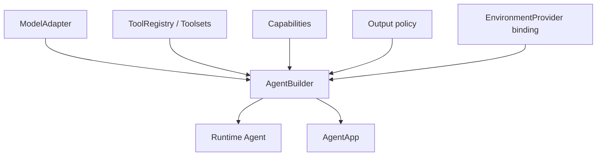
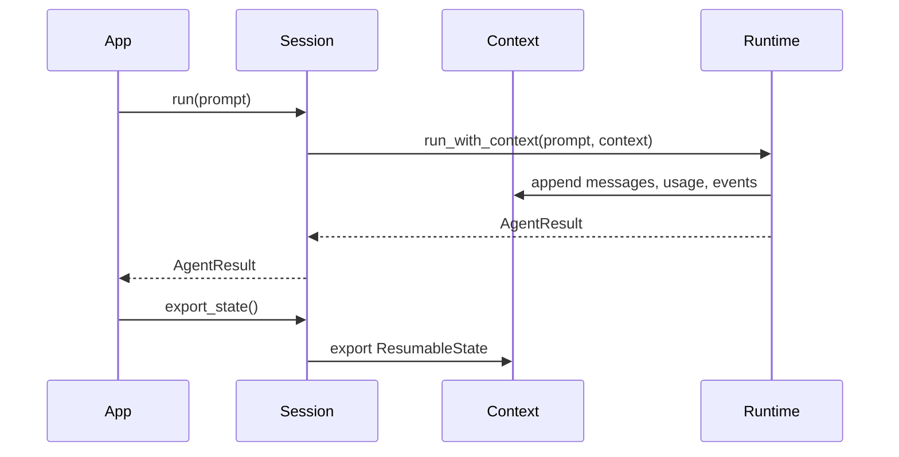

# Agent SDK App Surface

`starweaver-agent` is the public SDK facade. It should provide a small, ergonomic surface over a highly testable core runtime, matching the application role that ya-agent-sdk plays while retaining Rust-native types and composition.

## Public Surfaces

- `AgentBuilder`: reusable runtime agent construction.
- `AgentApp`: application wrapper with SDK protocols.
- `AgentSession`: context-backed multi-run session.
- `SubagentRegistry`: SDK-level delegation registry.
- policy presets: model, output, tools, approvals, streaming, environment, durability.
- capability bundles: first-party and application-defined behavior.

## Builder Flow

## Session Flow

Session guarantees:

- repeated runs share one context
- usage accumulates
- message history persists
- notes and state persist
- stream events work through the same context
- restored sessions preserve serializable state and rely on the app to rehydrate process-local dependencies

## Policy Presets

SDK policy presets configure common app behavior while runtime semantics remain owned by core crates:

- output policy presets for text, JSON schema, typed output, and output functions
- approval presets for shell, edit, file write, network, and deferred tools
- retry presets for model, tool, and output validation
- streaming presets for event collection, event handling, and service stream adapters
- environment presets for local, process, sandbox, and composite providers
- model presets for provider aliases and gateway routes

## Documentation Contract

The SDK docs should cover:

- agent builder basics
- models and testing
- tools and toolsets
- output policies
- dependencies and context
- message history
- capabilities
- durability
- SDK app and sessions
- subagents
- MCP and environment-backed tools

All Rust examples in docs must compile through `scripts/check-docs-examples.py`.

## Acceptance Gates

- `AgentSession` tests for multi-run usage, restore, caller-provided context, and streaming
- docs examples for SDK app and sessions
- facade re-export tests for public SDK types
- builder tests for model, tools, capabilities, settings, output, and overrides
- dependency and state behavior documented through examples
