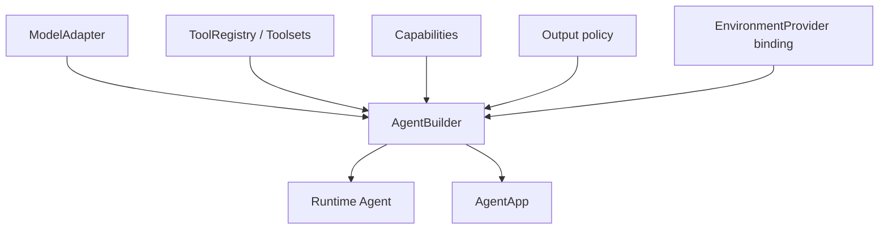
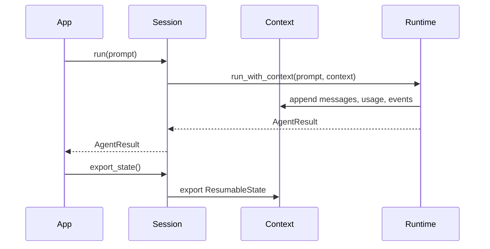

# Agent SDK App Surface

`starweaver-agent` is the public SDK facade. It should provide a small, ergonomic surface over a highly testable core runtime while retaining Rust-native types and composition.

## Public Surfaces

- `AgentBuilder`: reusable runtime agent construction.
- `AgentApp`: application wrapper with SDK protocols.
- `AgentSession`: context-backed multi-run session.
- `SubagentRegistry`: SDK-level delegation registry.
- policy presets: model, output, tools, approvals, streaming, environment, durability.
- capability bundles: first-party and application-defined behavior.
- observability controls: trace parent propagation, span export hooks, content redaction, and Langfuse-friendly OTLP metadata.

## Builder Flow

## Session Flow

Session guarantees:

- repeated runs share one context
- usage accumulates
- message history persists
- notes and state persist
- stream events work through the same context
- restored sessions preserve serializable state and rely on the app to rehydrate process-local dependencies

## Async Execution Ownership

A bare `RuntimeAgent` or per-turn `AgentSession` does not implicitly own fire-and-forget work. Model-visible async `delegate` is available only when an `AgentApp` or product host injects the execution-scope supervisor defined in `06-async-subagent-execution.md`.

The supervisor outlives individual parent turns and owns child task/control handles, cancellation, bounded wait, result retention, message delivery, and shutdown. Restoring serializable session state does not recreate process-local children; a durable host reconciles persisted child records explicitly. Apps without this owner use the programmatic/blocking delegation backend or expose no delegation tools.

## Policy Presets

SDK policy presets configure common app behavior while runtime semantics remain owned by core crates:

- output policy presets for text, JSON schema, typed output, and output functions
- approval presets for shell, edit, file write, network, and deferred tools
- retry presets for model, tool, and output validation
- streaming presets for event collection, event handling, and service stream adapters
- observability presets for OTel GenAI spans, Langfuse metadata, and content redaction
- environment presets for local, process, sandbox, and composite providers
- model presets for provider aliases, model settings, capability profiles, and gateway routes

Model presets live in `starweaver-model` and are re-exported by `starweaver-agent`. The model preset surface provides:

- settings presets such as `anthropic_high`, `openai_responses_high`, `openai_responses_pro`, `grok_4_5_high`, `gemini_thinking_level_low`, and provider aliases such as `anthropic`, `grok`, or `gemini`
- config presets such as `claude_1m`, `gpt5_270k`, `gpt5_350k`, `grok_4_5_500k`, `deepseek_v4_1m`, and `gemini_200k`
- runtime presets that combine model id, provider name, model name, settings preset, config preset, and a caller-supplied `HttpModelConfig`
- `AgentSpec.model.settings_preset` with inline `settings` as an overlay

P0 policy presets should be serializable, composable, and directly usable by `AgentSpec`:

- `approval_preset`: common approval profiles for shell, edit, write, network, download, and deferred tools
- `retry_preset`: model retry, tool retry, output validation retry, and timeout defaults
- `streaming_preset`: collected events, callback handlers, stream replay metadata, and service stream adapters
- `observability_preset`: trace recorder selection, W3C trace propagation, OTel/Langfuse metadata, sampling, and redaction defaults
- `environment_preset`: local, virtual, process-capable, sandbox, and composite provider profiles
- `durability_preset`: session store, checkpoint cadence, stream persistence, and resume profile settings

`AgentSpec` is the SDK app profile format. It should cover model presets, output policy, toolset selection, subagent selection, policy presets, session/runtime policy, environment preset, skill bundle config, host tool adapters, and MCP servers. Registry-backed fields validate by stable names before building an `AgentBuilder`, and programmatic handles remain outside serialized specs.

## Documentation Contract

The SDK docs should cover:

- agent builder basics
- models and testing
- tools and toolsets
- output policies
- dependencies and context
- message history
- capabilities
- durability
- SDK app and sessions
- subagents
- MCP and environment-backed tools
- observability and trace propagation

All Rust examples in docs must compile through `make docs-check` and the Rust `xtask` crate.

## Acceptance Gates

- `AgentSession` tests for multi-run usage, restore, caller-provided context, and streaming
- docs examples for SDK app and sessions
- facade re-export tests for public SDK types
- builder tests for model, tools, capabilities, settings, output, and overrides
- `AgentSpec` validation tests for model presets, policy presets, selected toolsets, selected subagents, environment presets, skill config, host adapter config, and MCP server config
- policy preset tests for approval, retry, streaming, observability, environment, and durability presets
- dependency and state behavior documented through examples
- trace parent propagation tests
