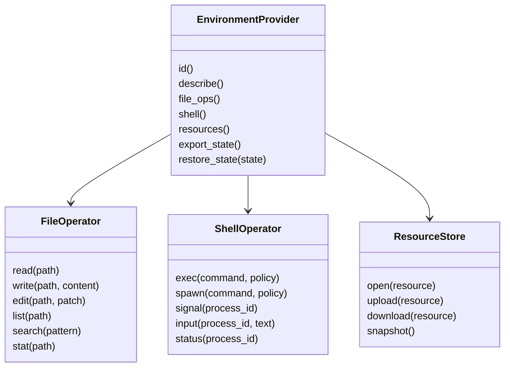
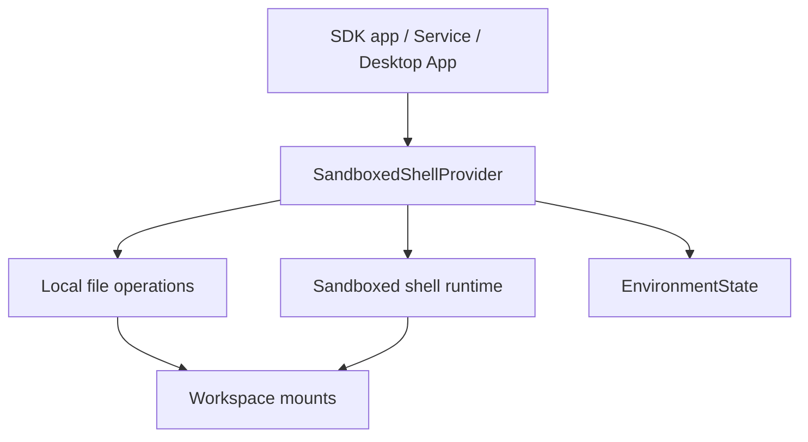
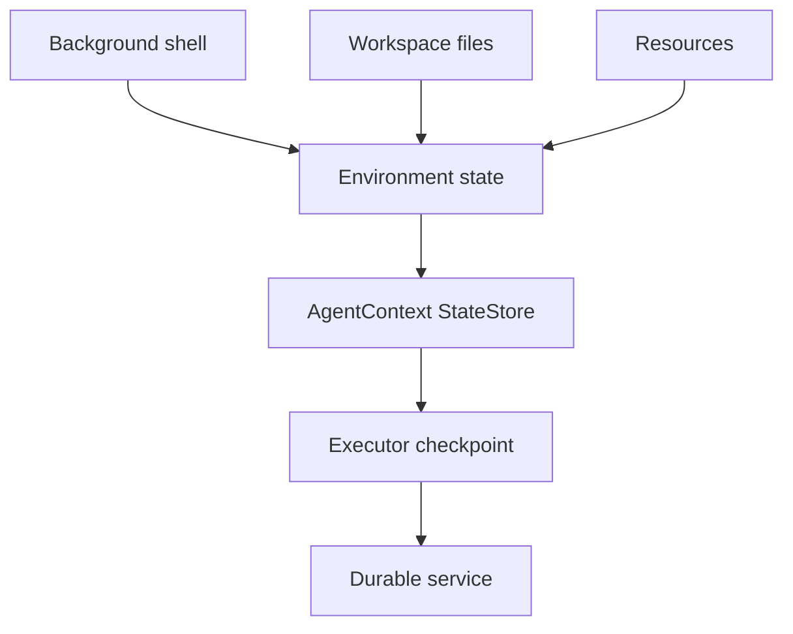

# Environment Provider

`EnvironmentProvider` is the boundary for filesystem, shell, process, resources, sandbox, and environment state. It connects provider-owned resources with Starweaver's `AgentContext`, `StateStore`, capabilities, and durable executor seam.

## Design Goal

Environment-backed tools should be first-party SDK features while runtime semantics stay provider-neutral. The runtime executes tools; the SDK binds tools to environment providers through capabilities and context.

## Abstraction Review

The first Rust implementation should keep `EnvironmentProvider` intentionally small: identity, text file read/write/list, shell execution, and state export. Rich file operators, background process control, resource registries, and sandbox mounts should grow as optional provider capabilities or focused extension traits after SDK and service call sites prove the needed shape.

The stable architectural split is:

- provider owns long-lived resources, lifecycle, policy, and restore/reconnect behavior
- `AgentContext` carries typed provider handles for the active process
- `StateStore` carries serializable provider id, resource refs, process refs, policy revision, and environment state hash
- first-party tool bundles convert provider capabilities into normal tools

This shape gives SDK users a native environment path while keeping the core runtime provider-neutral.

## Provider Shape



## Provider Families

- local provider: direct workspace file access with policy controls and a shell backend selected by host policy
- sandboxed shell provider: local workspace file access plus OS-level sandboxed shell execution over declared workspace mounts
- process provider: isolated child process workspace
- sandbox provider: container or remote microVM workspace
- composite provider: routes file, shell, media, and resource operations to specialized providers
- virtual provider: deterministic in-memory filesystem and fake shell for tests

## Context Integration

Environment state is stored under a dedicated `StateStore` domain:

```json
{
  "environment": {
    "provider_id": "local",
    "workspace_root": "/workspace",
    "resources": {},
    "processes": {},
    "policy_revision": "rev_1"
  }
}
```

Process-local handles stay inside typed dependencies. Serializable identifiers and resource references live in `StateStore`.

## File Operations

File operations should support:

- read file
- write file
- append file
- exact edit
- structured patch/edit
- list directory
- glob with ripgrep-style matching through native Rust libraries such as `globset`
- grep with regex line matching through native Rust libraries such as `grep-regex` and `grep-matcher`
- provider traversal through `ignore` for local `.gitignore`, hidden-file, and ignored-file behavior
- stat
- snapshot or checksum
- binary/media resource references

Policies should cover:

- workspace root restrictions
- hidden files
- ignored files
- max file size
- write approval
- destructive operation approval
- audit logging

## Shell Operations

Shell operations should support:

- one-shot exec
- background process spawn
- stdin input
- signal and kill
- status and output streaming
- timeout
- environment variables
- working directory
- resource limits
- workspace mount visibility shared with provider file operations
- sandbox diagnostics and runtime capability discovery

Policies should cover:

- command allow/deny rules
- network access
- write access
- long-running process approval
- max runtime
- output size limits
- audit logging

## Sandboxed Shell Provider

`SandboxedShellProvider` composes a local provider-scoped file operator with a shell backend that executes in an OS-level sandbox over explicit workspace mounts. The provider owns lifecycle, policy, diagnostics, and state export; `AgentContext` carries the provider handle and durable state carries serializable mount and process references.



Provider configuration should include:

- workspace mounts with host path, provider path, sandbox path, and read/write mode
- default working directory inside the sandbox path space
- runtime backend preference: auto, Linux bubblewrap/seccomp, macOS seatbelt, Windows restricted token, Docker, Podman, nsjail, remote microVM
- policy profile: read-only, workspace-write, relay-workspace-write, network-proxy, full-access diagnostic profile
- network mode: blocked, restricted, proxy, full
- home strategy: tmpfs or denied home
- timeout, output limit, environment allowlist, and process cleanup mode
- startup diagnostics for runtime availability, mount visibility, write behavior, network behavior, and process cleanup

Linux should prefer bubblewrap with seccomp and optional Landlock hardening. macOS should generate a seatbelt profile with explicit workspace and temp allowlists. Windows should use restricted tokens, Job Objects, AppContainer where available, and ACL grants for selected roots. Containerized modes use Docker or Podman mounts and cgroup limits. Remote and cloud modes implement the same provider contract through their service boundary.

Filesystem and shell views should share the same workspace mount set so writes from `write` are visible to shell commands and shell-created files are visible to `glob`, `grep`, and `view`. `EnvironmentState` should record provider id, mount ids, sandbox runtime, policy revision, diagnostics summary, background process handles, and output cursors.

## Durable Execution

Long-running environment resources need resumable state:



The provider exports a state summary. The service runtime persists that summary and asks the provider to restore or reconnect when a session resumes.

## Tool Binding

Environment operations become tools through capability bundles:

- filesystem capability
- shell capability
- resource capability
- sandbox policy capability
- environment instruction capability
- background process capability

The runtime sees normal tools. The SDK stores an `EnvironmentHandle` typed dependency on `AgentContext`; the runtime injects the active `AgentContext` into `ToolContext.dependencies` for each tool call, and SDK tools resolve the provider from that agent-scope dependency.

## Acceptance Gates

- virtual file operator tests
- local provider policy tests
- shell fake tests
- background shell lifecycle tests
- environment state export/restore tests
- capability bundle registration tests
- approval metadata tests for shell and file writes
- durable provider state reference tests
