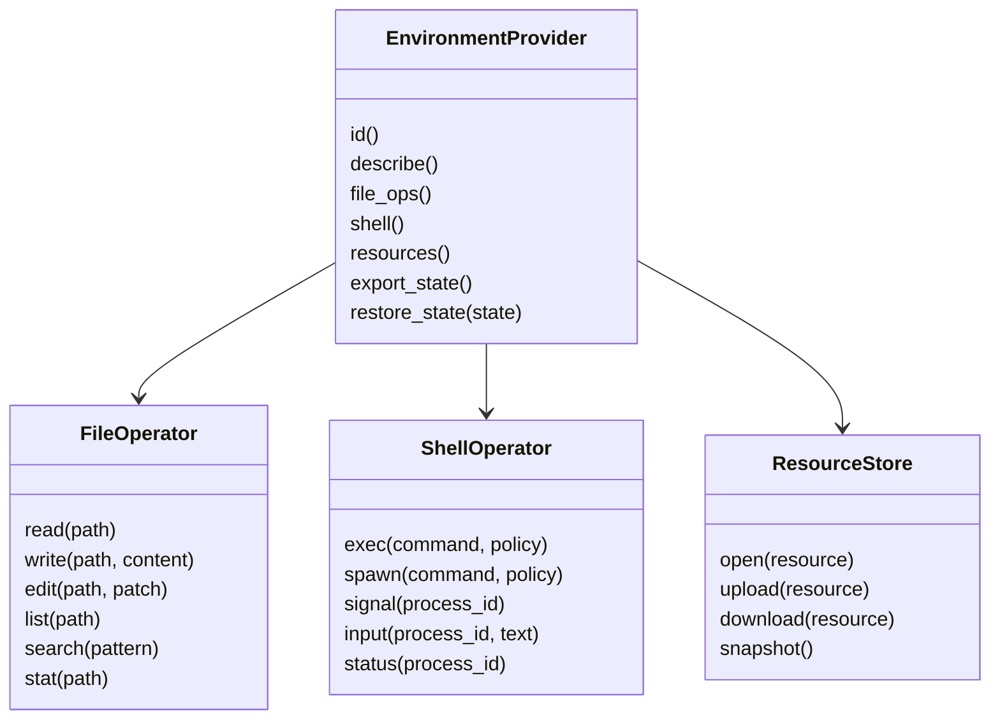
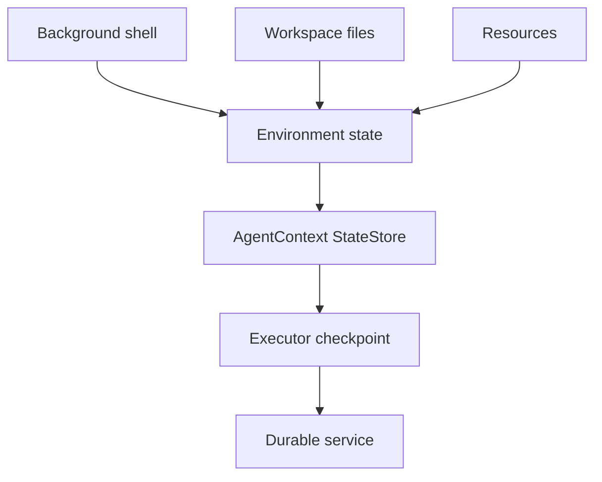

# Environment Provider

`EnvironmentProvider` is the boundary for filesystem, shell, process, resources, sandbox, and environment state. It unifies the environment concepts from ya-agent-sdk with Starweaver's `AgentContext`, `StateStore`, capabilities, and durable executor seam.

## Design Goal

Environment-backed tools should be first-party SDK features while runtime semantics stay provider-neutral. The runtime executes tools; the SDK binds tools to environment providers through capabilities and context.

## Provider Shape



## Provider Families

- local provider: direct workspace file and shell access with policy controls
- process provider: isolated child process workspace
- sandbox provider: container or remote microVM workspace
- composite provider: routes file, shell, media, and resource operations to specialized providers
- virtual provider: deterministic in-memory filesystem and fake shell for tests

## Context Integration

Environment state is stored under a dedicated `StateStore` domain:

```json
{
  "environment": {
    "provider_id": "local",
    "workspace_root": "/workspace",
    "resources": {},
    "processes": {},
    "policy_revision": "rev_1"
  }
}
```

Process-local handles stay inside typed dependencies. Serializable identifiers and resource references live in `StateStore`.

## File Operations

File operations should support:

- read file
- write file
- append file
- exact edit
- structured patch/edit
- list directory
- glob
- grep
- stat
- snapshot or checksum
- binary/media resource references

Policies should cover:

- workspace root restrictions
- hidden files
- ignored files
- max file size
- write approval
- destructive operation approval
- audit logging

## Shell Operations

Shell operations should support:

- one-shot exec
- background process spawn
- stdin input
- signal and kill
- status and output streaming
- timeout
- environment variables
- working directory
- resource limits

Policies should cover:

- command allow/deny rules
- network access
- write access
- long-running process approval
- max runtime
- output size limits
- audit logging

## Durable Execution

Long-running environment resources need resumable state:



The provider exports a state summary. The service runtime persists that summary and asks the provider to restore or reconnect when a session resumes.

## Tool Binding

Environment operations become tools through capability bundles:

- filesystem capability
- shell capability
- resource capability
- sandbox policy capability
- environment instruction capability
- background process capability

The runtime sees normal tools. The SDK and context provide the environment dependency.

## Acceptance Gates

- virtual file operator tests
- local provider policy tests
- shell fake tests
- background shell lifecycle tests
- environment state export/restore tests
- capability bundle registration tests
- approval metadata tests for shell and file writes
- durable provider state reference tests
