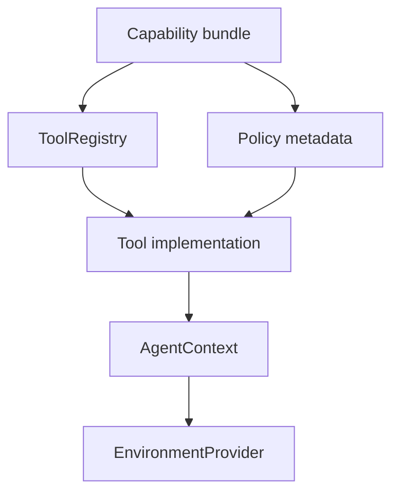
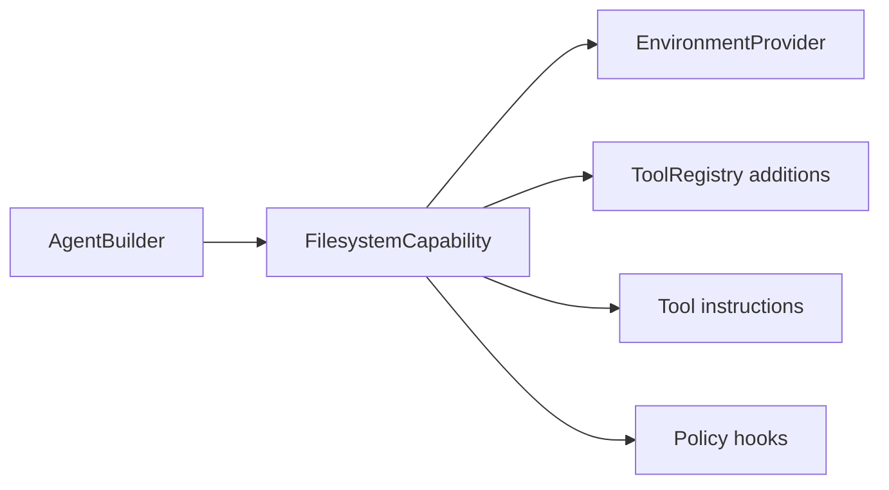

# First-Party Tool Bundles

First-party tool bundles make Starweaver useful out of the box. They integrate application-facing capabilities through `AgentContext`, `EnvironmentProvider`, and normal toolsets while keeping the runtime kernel generic.

## Bundle Architecture

Each bundle should expose:

- tool definitions
- tool implementations
- grouped tool instructions with stable deduplication keys
- prompt-ready usage guidance that can be injected through SDK presets
- approval metadata
- retry policy
- context dependencies
- event emission
- state domain usage
- deterministic fake for tests

## Target Bundles

### Filesystem Bundle

Tools:

- `view`: read focused UTF-8 files after discovery
- `write`: write intentional provider-scoped file contents with approval metadata when configured
- `edit`: apply exact replacements or create files
- `multi_edit`: apply multiple exact replacements atomically
- `ls`: list provider-scoped entries
- `glob`: discover candidate paths with ripgrep-style glob semantics
- `grep`: search provider-scoped text with regex line matching, include globs, context lines, and max-result controls
- `mkdir`, `delete`, `move`, `copy`: emit host/provider filesystem operation envelopes
- `resource_ref`: create durable provider resource references

Backed by `EnvironmentProvider` file/search operations. Local providers should use native Rust libraries for grep/glob acceleration: `globset` for path matching, `grep-regex` and `grep-matcher` for line regex search, and `ignore` for traversal and ignore-file semantics. Virtual and sandbox providers should preserve the same result schema for deterministic tests and durable replay.

### Shell Bundle

Tools:

- `shell_exec`: bounded one-shot command execution
- `shell_exec` with `background=true`: create a durable process handle for long-running commands
- `shell_input`: send stdin to a background process
- `shell_signal`: send a signal to a background process
- `shell_kill`: terminate and clean up a background process
- `shell_status`: inspect process state
- `shell_wait`: wait for or poll background output

Backed by `EnvironmentProvider` shell operations. Local desktop-style execution should use `SandboxedShellProvider` so command execution sees the same workspace mounts as filesystem tools while policy and diagnostics remain provider-owned.

### Resource, Media, and Download Bundle

Public tools:

- `download`: stream one or more URLs into the active `EnvironmentProvider` or resource store
- `load_media_url`: classify and pass remote image, video, audio, and document URLs into provider-ready model content when native model capabilities support the content type
- `read_image`: analyze an image URL through a configured fallback understanding model when native vision is unavailable
- `read_video`: analyze a video URL through a configured fallback understanding model when native video understanding is unavailable
- `read_audio`: transcribe or analyze an audio URL through a configured fallback understanding model when native audio understanding is unavailable

Backed by `EnvironmentProvider` resource APIs, model capability detection, media understanding fallback agents, download adapters, and media capability hooks. The tool implementations should stay provider-neutral at the SDK layer and route provider-specific native media behavior through `starweaver-model` profiles and request mapping.

PDF and Office conversion should be delivered through skill workflows that call shell commands such as PyMuPDF4LLM and MarkItDown in the active environment. These conversions remain outside the default SDK built-in host tool surface because broad document conversion is format-heavy, dependency-heavy, and better handled as an installable skill.

Implementation requirements:

- `download` validates HTTP/HTTPS URLs, follows host runtime redirects, streams with bounded memory, writes safe UUID filenames, records original URL, content type, byte size, checksum when available, and final provider path or resource id.
- `load_media_url` accepts only HTTP and HTTPS URLs, detects content category through headers and extension hints, checks current model capabilities, returns provider-ready media/document URL parts when supported, and emits a precise fallback message that points to `read_image`, `read_video`, `read_audio`, or `download` plus document-conversion skills.
- `read_image`, `read_video`, and `read_audio` use configurable fallback models, account usage into the parent `AgentContext`, preserve trace correlation, and return structured text evidence with source URL, model id, and truncation metadata.
- Media and download tools share protocol validation, host-network-policy delegation, streaming size limits, content-type sniffing, and deterministic fake clients.

### Search and Web Bundle

Public tools:

- `search`: general web search
- `scrape`: page-to-Markdown scrape

The final public web search/scrape surface intentionally stays to two tools. Raw HTTP `fetch` behavior should become an adapter internal while the SDK public surface presents `search` and `scrape` to models.

`search` requirements:

- Use an injectable `SearchClient` abstraction with deterministic fake clients for tests.
- Provide a Brave Search adapter as the required first executable search backend; Google Custom Search and Tavily can be added as optional fallback adapters.
- Normalize results into a provider-neutral result shape with title, URL, snippet/description, source provider, rank, optional published time, optional content type, and citation metadata.
- Enforce query length, result count, timeout, quota, retry, and redaction policy through SDK configuration.

`scrape` requirements:

- Use an injectable `ScrapeClient` abstraction with deterministic fake clients for tests.
- Prefer Firecrawl when configured, then Cloudflare Browser Run when configured, then a local static-HTML Markdown adapter for reachable pages. For PDF, Office, spreadsheet, presentation, and EPUB resources, return a structured handoff to `download` plus a document-conversion skill workflow.
- Validate URL protocols, delegate network reachability policy to the user's environment, apply request timeout, response size limits, text truncation metadata, content type detection, and binary guards.
- Return Markdown content, source URL, final URL, title when detected, total length, truncation flag, adapter name, and citation metadata.
- Treat raw HTTP `fetch` behavior as an internal scrape/download/media-probing helper and expose `download` for saving full remote resources.

Provider-native tools such as OpenAI `web_search_preview`, OpenAI `web_fetch`, OpenAI `file_search`, Gemini `google_search`, and Gemini `url_context` remain model-native pass-throughs with replay fixtures. SDK host tools remain deterministic and provider-neutral.

### Task Bundle

Tools:

- `task_create`: create a lightweight task operation envelope
- `task_get`: get task details by id
- `task_update`: update task status, content, or dependencies
- `task_list`: list known tasks

Backed by `AgentContext` task state or an SDK host task service. Notes and arbitrary state stay on `AgentContext` as SDK data accessed through typed dependencies by custom tools.

### Skill Bundle

The skill bundle follows the ya-mono `SkillToolset` design and loads skills through the active `EnvironmentProvider` file operations. Skills are markdown packages with a `SKILL.md` entrypoint and YAML frontmatter. The SDK scans provider-visible skill directories, loads frontmatter for prompt summaries, and loads full markdown content when a skill is activated.

Tools and bundle APIs:

- `list_skills`: return discovered skill names, descriptions, source scope, and metadata
- `load_skill`: load full skill markdown content by name for prompt injection or explicit user inspection
- `reload_skills`: refresh project, global, shared, and bundled skill caches at request boundaries
- expose skill-contributed toolsets through the SDK registry when a skill declares tool requirements or packaged tools
- expose skill instructions through grouped toolset instructions so prompt injection stays deduplicated

Discovery paths are derived from configured provider roots and preserve ya-mono precedence:

1. shared user skills: `.agents/skills/`
2. tool-specific user skills: `skills/`
3. shared project skills: `.agents/skills/`
4. tool-specific project skills: `skills/`

Project scopes override user scopes, and tool-specific scopes override shared scopes within the same root. Each skill directory can include `SKILL.md`, `references/`, `scripts/`, and `assets/`. The active environment should expose the same files to filesystem and shell bundles so skill instructions can reference provider-visible resources.

Skill config should support:

- primary directory name, defaulting to `skills`
- extra directory names, including `.agents/skills`
- bundled first-party skill roots copied or mounted into provider-visible locations by a pre-scan hook
- hot reload at request boundaries
- deterministic virtual-provider tests for scanning, precedence, parse errors, reload, and full-content loading

Skill state lives in a context state domain and SDK config.

### MCP Bundle

The live MCP client should use the official Model Context Protocol Rust SDK at <https://github.com/modelcontextprotocol/rust-sdk> through the `rmcp` crate. Starweaver should wrap `rmcp` behind SDK toolset contracts so MCP tools, resources, prompts, sampling, roots, logging, completions, notifications, subscriptions, and long-running tasks can participate in Starweaver policy, context, tracing, and replay tests.

Responsibilities:

- discover MCP tools and convert them into `ToolDefinition` values
- call MCP tools with `gen_ai.execute_tool` spans and Starweaver run ids
- expose MCP resources and prompts through SDK bundle APIs
- map MCP roots to `EnvironmentProvider` workspace bindings
- route MCP sampling through configured Starweaver model adapters
- preserve MCP progress/cancellation events in `AgentContext` events
- test stdio and streamable HTTP transports with deterministic servers

### Tool Proxy Bundle

Tools:

- `search_tools`: search the wrapped tool catalog and return XML with full schemas
- `call_tool`: invoke a wrapped tool by name with JSON arguments
- expose ranked tool metadata
- route large dynamic toolsets through a stable two-tool model-facing surface

This bundle keeps large tool surfaces manageable through a stable two-tool proxy. Tool schemas are returned in search results, and provider/private built-in tool search stays in the model native-tool layer. `ToolProxyToolset` lives in the core tool crate as a generic toolset combinator; SDK users can wrap it with `PrefixedToolset` when they need multiple proxy surfaces.

## Capability Integration

Bundles should be installed through capability builders:

## Policy Model

Bundle policies include:

- approval requirements
- workspace access rules
- network access rules
- max output size
- timeout
- retry count
- audit labels
- durable resource behavior
- user-visible risk level

Policies are represented as tool metadata and capability settings so runtime and service layers can inspect them consistently.

## Acceptance Gates

- bundle registration tests
- fake environment tests
- policy metadata tests
- approval/deferred behavior tests
- context state mutation tests
- event emission tests
- official `rmcp` client integration tests
- skill discovery, precedence, reload, and full-content loading tests over virtual and local providers
- docs examples for each public bundle
