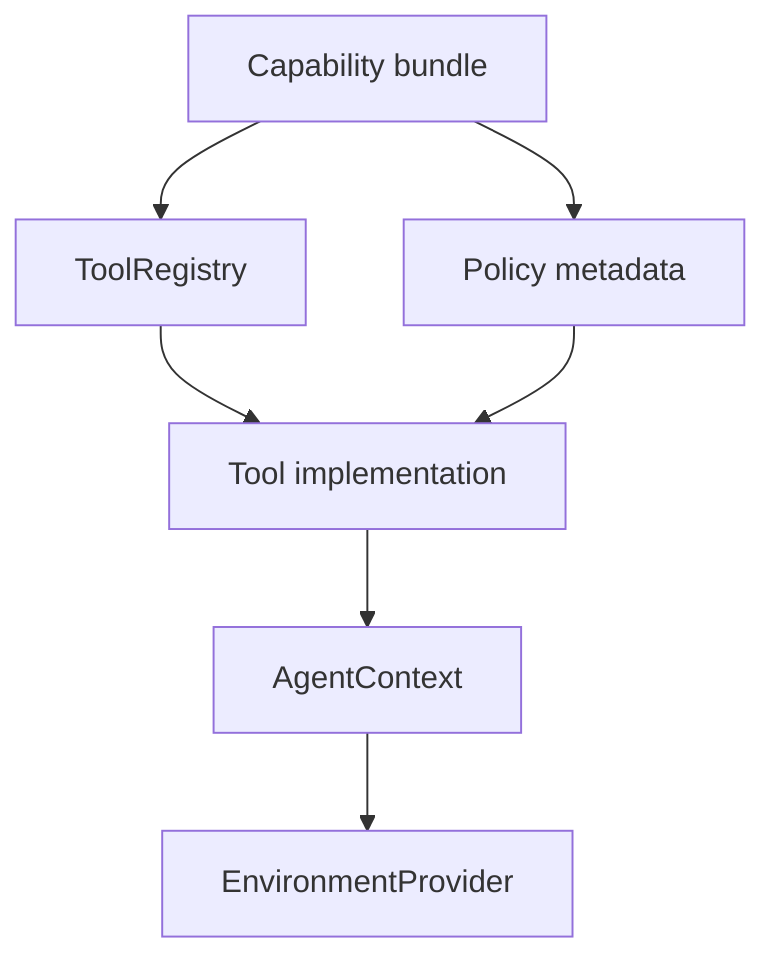
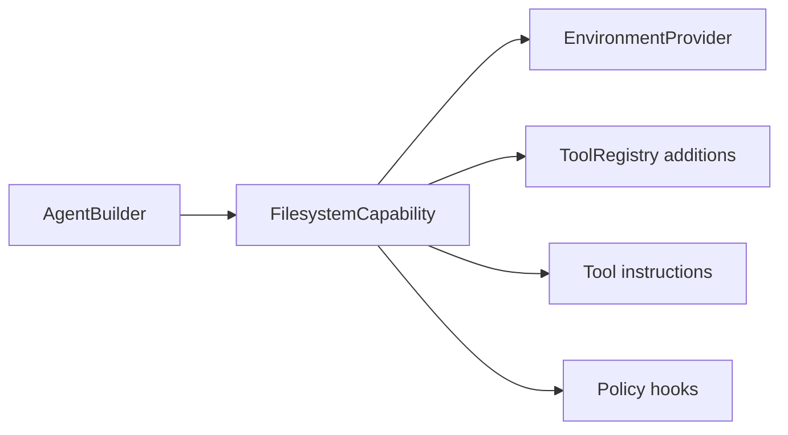

# First-Party Tool Bundles

First-party tool bundles make Starweaver useful out of the box. They integrate application-facing capabilities through `AgentContext`, `EnvironmentProvider`, and normal toolsets while keeping the runtime kernel generic.

## Bundle Architecture

Each bundle should expose:

- tool definitions
- tool implementations
- grouped tool instructions with stable deduplication keys
- prompt-ready usage guidance that can be injected through SDK presets
- approval metadata
- retry policy
- context dependencies
- event emission
- state domain usage
- deterministic fake for tests

## Target Bundles

### Filesystem Bundle

Tools:

- `view`: read focused UTF-8 files after discovery
- `write`: write intentional provider-scoped file contents with approval metadata when configured
- `edit`: apply exact replacements or create files
- `multi_edit`: apply multiple exact replacements atomically
- `ls`: list provider-scoped entries
- `glob`: discover candidate paths with ripgrep-style glob semantics
- `grep`: search provider-scoped text with regex line matching, include globs, context lines, and max-result controls
- `mkdir`, `delete`, `move`, `copy`: emit host/provider filesystem operation envelopes
- `resource_ref`: create durable provider resource references

Backed by `EnvironmentProvider` file/search operations. Local providers should use native Rust libraries for grep/glob acceleration: `globset` for path matching, `grep-regex` and `grep-matcher` for line regex search, and `ignore` for traversal and ignore-file semantics. Virtual and sandbox providers should preserve the same result schema for deterministic tests and durable replay.

### Shell Bundle

Tools:

- `shell_exec`: bounded one-shot command execution
- `shell_exec` with `background=true`: create a durable process handle for long-running commands
- `shell_input`: send stdin to a background process
- `shell_signal`: send a signal to a background process
- `shell_kill`: terminate and clean up a background process
- `shell_status`: inspect process state
- `shell_wait`: wait for or poll background output

Backed by `EnvironmentProvider` shell operations. Local desktop-style execution should use `SandboxedShellProvider` so command execution sees the same workspace mounts as filesystem tools while policy and diagnostics remain provider-owned.

### Resource and Media Bundle

Tools:

- upload file
- download file
- attach resource
- inspect image/audio/video metadata
- store media references in context state

Backed by `EnvironmentProvider.resources()` and media capability hooks.

### Search and Web Bundle

Tools:

- `search`: web search
- `search_stock_image`: royalty-free stock image search
- `search_image`: real-time image search
- `fetch`: page or resource fetch
- `scrape`: page-to-Markdown scrape
- `download`: resource download
- `load_media_url`: load remote media or documents as provider-ready content references
- citation metadata capture

The bundle should support gateway routing and deterministic tests through injectable clients. The current SDK surface keeps these tools as host-operation envelopes until host-backed adapters land.

Replacement requirements for ya-agent-sdk parity:

- `search` should use an injectable web-search client with provider priority, timeout, quota, and citation metadata.
- `search_stock_image` and `search_image` should use injectable image-search clients and validate result URL accessibility.
- `fetch` should provide HTTP `HEAD` and `GET`, redirect checks, SSRF policy, streaming limits, text truncation, binary size guards, and content-type metadata.
- `scrape` should provide page-to-Markdown conversion through a crawler/scraper adapter with deterministic fixture tests.
- `download` should stream one or more URLs into the active `EnvironmentProvider` or resource store with safe filenames and per-file metadata.
- `load_media_url` should classify image, video, audio, and document URLs and map them to model/provider media capability paths.
- Provider-native tools such as OpenAI `web_search_preview`, OpenAI `web_fetch`, OpenAI `file_search`, Gemini `google_search`, and Gemini `url_context` should remain model-native pass-throughs with replay fixtures; SDK host tools should remain deterministic and provider-neutral.

### Task Bundle

Tools:

- `task_create`: create a lightweight task operation envelope
- `task_get`: get task details by id
- `task_update`: update task status, content, or dependencies
- `task_list`: list known tasks

Backed by `AgentContext` task state or an SDK host task service. Notes and arbitrary state stay on `AgentContext` as SDK data accessed through typed dependencies by custom tools.

### Skill Bundle

Tools:

- list skills
- load skill instructions
- expose skill-provided toolsets
- reload project and global skills

Skill state lives in a context state domain and SDK config.

### MCP Bundle

The live MCP client should use the official Model Context Protocol Rust SDK at <https://github.com/modelcontextprotocol/rust-sdk> through the `rmcp` crate. Starweaver should wrap `rmcp` behind SDK toolset contracts so MCP tools, resources, prompts, sampling, roots, logging, completions, notifications, subscriptions, and long-running tasks can participate in Starweaver policy, context, tracing, and replay tests.

Responsibilities:

- discover MCP tools and convert them into `ToolDefinition` values
- call MCP tools with `gen_ai.execute_tool` spans and Starweaver run ids
- expose MCP resources and prompts through SDK bundle APIs
- map MCP roots to `EnvironmentProvider` workspace bindings
- route MCP sampling through configured Starweaver model adapters
- preserve MCP progress/cancellation events in `AgentContext` events
- test stdio and streamable HTTP transports with deterministic servers

### Tool Proxy Bundle

Tools:

- `search_tools`: search the wrapped tool catalog and return XML with full schemas
- `call_tool`: invoke a wrapped tool by name with JSON arguments
- expose ranked tool metadata
- route large dynamic toolsets through a stable two-tool model-facing surface

This bundle keeps large tool surfaces manageable through a stable two-tool proxy. Tool schemas are returned in search results, and provider/private built-in tool search stays in the model native-tool layer. `ToolProxyToolset` lives in the core tool crate as a generic toolset combinator; SDK users can wrap it with `PrefixedToolset` when they need multiple proxy surfaces.

## Capability Integration

Bundles should be installed through capability builders:

## Policy Model

Bundle policies include:

- approval requirements
- workspace access rules
- network access rules
- max output size
- timeout
- retry count
- audit labels
- durable resource behavior
- user-visible risk level

Policies are represented as tool metadata and capability settings so runtime and service layers can inspect them consistently.

## Acceptance Gates

- bundle registration tests
- fake environment tests
- policy metadata tests
- approval/deferred behavior tests
- context state mutation tests
- event emission tests
- official `rmcp` client integration tests
- docs examples for each public bundle
