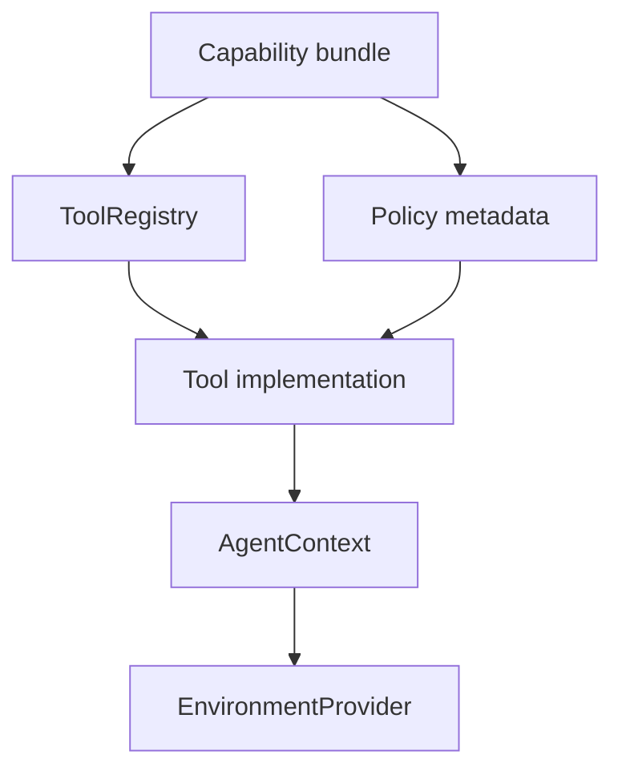
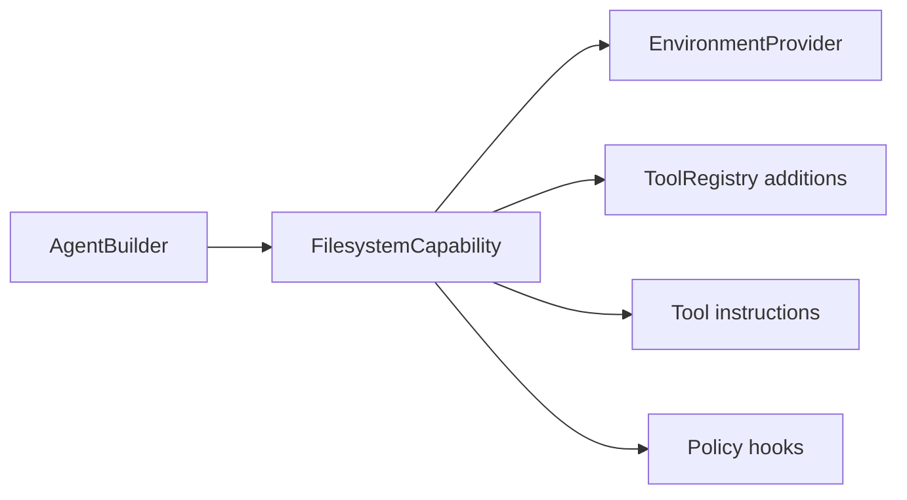

# First-Party Tool Bundles

First-party tool bundles make Starweaver useful out of the box. They integrate ya-agent-sdk-style tools through capabilities, `AgentContext`, and `EnvironmentProvider`, while keeping the runtime kernel generic.

## Bundle Architecture

Each bundle should expose:

- tool definitions
- tool implementations
- tool instructions
- approval metadata
- retry policy
- context dependencies
- event emission
- state domain usage
- deterministic fake for tests

## Target Bundles

### Filesystem Bundle

Tools:

- read file
- write file
- append file
- edit file
- list directory
- glob
- grep
- stat
- snapshot/checksum

Backed by `EnvironmentProvider.file_ops()`.

### Shell Bundle

Tools:

- exec command
- spawn background process
- input to process
- signal process
- kill process
- process status
- collect output

Backed by `EnvironmentProvider.shell()`.

### Resource and Media Bundle

Tools:

- upload file
- download file
- attach resource
- inspect image/audio/video metadata
- store media references in context state

Backed by `EnvironmentProvider.resources()` and media capability hooks.

### Search and Web Bundle

Tools:

- web search
- page fetch
- page scrape
- resource download
- citation metadata capture

The bundle should support gateway routing and deterministic tests through injectable clients.

### Task and Note Bundle

Tools:

- create task
- update task
- list tasks
- set note
- get note
- delete note
- list notes

Backed by `AgentContext` state and note stores.

### Skill Bundle

Tools:

- list skills
- load skill instructions
- expose skill-provided toolsets
- reload project and global skills

Skill state lives in a context state domain and SDK config.

### Tool Search and Proxy Bundle

Tools:

- search tool catalog
- proxy remote tool call
- expose ranked tool metadata
- route dynamic toolsets

This bundle keeps large tool surfaces manageable and matches ya-agent-sdk tool-search patterns.

## Capability Integration

Bundles should be installed through capability builders:

## Policy Model

Bundle policies include:

- approval requirements
- workspace access rules
- network access rules
- max output size
- timeout
- retry count
- audit labels
- durable resource behavior
- user-visible risk level

Policies are represented as tool metadata and capability settings so runtime and service layers can inspect them consistently.

## Acceptance Gates

- bundle registration tests
- fake environment tests
- policy metadata tests
- approval/deferred behavior tests
- context state mutation tests
- event emission tests
- docs examples for each public bundle
