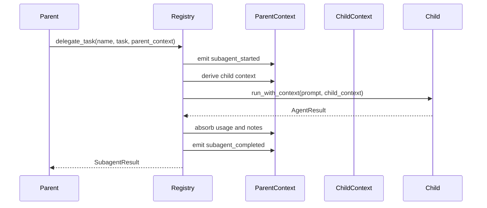
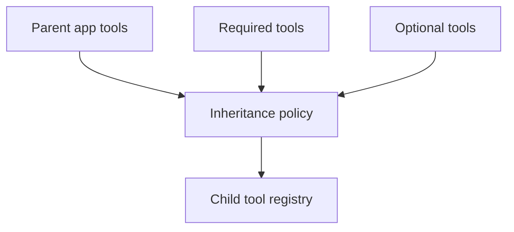

# Subagents and Skills

Subagents and skills let applications scale beyond one prompt loop. The SDK layer owns their application ergonomics, while the core runtime provides stable context, tool, event, and checkpoint contracts.

## Subagent Contracts

Serializable configuration lives in `SubagentSpec`:

- name
- description
- instruction
- system prompt
- required inherited tools
- optional inherited tools
- model override
- model settings/config
- metadata

Runtime configuration lives in `SubagentConfig` and includes an executable agent handle.

## Delegation Flow

Failure path:

- missing subagent emits `subagent_failed`
- runtime failure emits a typed failed event when the error boundary is added
- cancellation and timeout emit lifecycle events after runtime support lands

## Inherited Tools

Tool inheritance policy should support:

- required inherited tool names
- optional inherited tool names
- parent capability-provided toolsets
- environment-backed tools
- tool aliasing or prefixing
- denied tool names
- approval policy propagation

## Unified Delegation Tool

The SDK should support a unified parent-facing delegation tool that lets the model choose a subagent by name. It should include:

- JSON schema listing available subagents
- descriptions and instructions
- task id
- metadata
- timeout/retry policy
- tool inheritance policy
- lifecycle event emission
- durable polling extension point

## Skills

Skills are reusable packages of instructions, examples, and optional tools. Starweaver should support:

- project skills
- global skills
- bundled first-party skills
- skill discovery
- skill instruction loading
- skill-provided toolsets
- hot reload in development
- deterministic tests for skill parsing and exposure

## State and Durability

Subagent and skill execution should record:

- task id
- parent run id
- child run id
- lifecycle events
- inherited tools
- usage
- notes/state changes
- environment state references
- checkpoint references

Durable service runtime can use this record for polling, resume, cancellation, and audit.

## Acceptance Gates

- subagent spec parser tests
- file and directory loader tests
- lifecycle event tests
- parent-child usage tests
- parent-child note tests
- inherited dependency tests
- inherited tool policy tests
- unified delegation tool tests
- skill parser and toolset tests
- nested delegation guard tests
