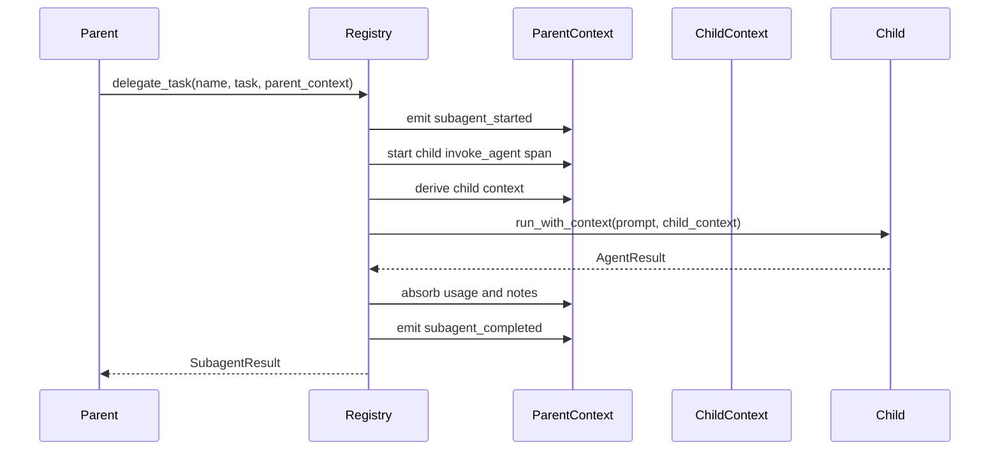
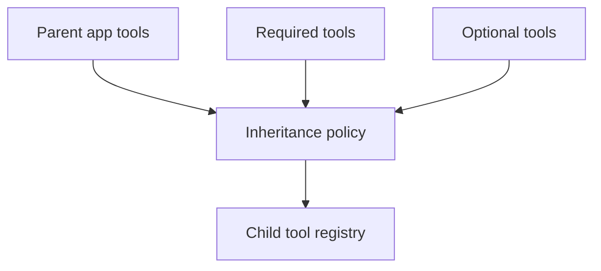

# Subagents and Skills

Subagents and skills let applications scale beyond one prompt loop. The SDK layer owns their application ergonomics, while the core runtime provides stable context, tool, event, and checkpoint contracts.

## Subagent Contracts

Serializable configuration lives in `SubagentSpec`:

- name
- description
- instruction
- system prompt
- required inherited tools
- optional inherited tools
- model override
- model settings/config
- metadata

Runtime configuration lives in `SubagentConfig` and includes an executable agent handle.

## Built-In Preset Policy

Starweaver does not expose an `include_builtin_subagents` flag. Hosts register first-party or product-specific subagents explicitly through `AgentSpecRegistry` or `SubagentRegistry`, then select them with `all_subagents` or named `subagents` in `AgentSpec`. This keeps product-owned agents visible in configuration and avoids an implicit global preset set.

## Delegation Flow



Failure path:

- missing subagent emits `subagent_failed`
- runtime failure emits a typed failed event when the error boundary is added
- cancellation and timeout emit subagent lifecycle events after dedicated child-run lifecycle handling lands

## Inherited Tools

Tool inheritance policy is a P0 SDK contract. The parent registry resolves inherited tools before a child agent is built, and availability is computed from the parent-visible tool catalog.

Tool inheritance policy should support:

- required inherited tool names that must resolve for the subagent to be available
- optional inherited tool names that are attached when present
- auto-inherit tools marked by metadata, including task and context-management tools
- parent capability-provided toolsets
- environment-backed tools
- skill-contributed toolsets
- tool aliasing or prefixing
- denied tool names that remove tools after auto-inherit and optional matching
- approval policy propagation through tool metadata
- clear errors for unknown required tools, denied required tools, and conflicting aliases



## Unified Delegation Tool

The SDK should support a unified parent-facing delegation tool that lets the model choose a subagent by name. It should include:

- JSON schema listing available subagents
- descriptions and instructions
- task id
- metadata
- timeout/retry policy
- tool inheritance policy
- lifecycle event emission
- durable polling extension point

## Skills

Skills are reusable packages of instructions, examples, assets, references, and optional tools. Starweaver uses the environment-backed fileops-loaded design: the skill loader scans the active `EnvironmentProvider` file roots, reads `SKILL.md` through provider file operations, and keeps skill assets in the same provider-visible path space used by filesystem and shell tools.

Skill package format:

```markdown
---
name: code-review
description: Review code quality, security, and maintainability. Use before merging changes.
---

# Code Review Guidelines

Read the relevant files, inspect tests, classify findings by severity, and provide concrete fixes.
```

Discovery scope:

- shared user skills from `.agents/skills/`
- tool-specific user skills from `skills/`
- shared project skills from `.agents/skills/`
- tool-specific project skills from `skills/`
- bundled first-party skills synced into provider-visible directories by a pre-scan hook

Loading behavior:

- scan `SKILL.md` files through `EnvironmentProvider` file operations
- cache `name`, `description`, source path, source scope, and frontmatter extras for available-skill prompt summaries
- load full markdown body only when a skill is activated or explicitly requested
- reload caches at request boundaries in development profiles
- preserve deterministic precedence: shared user, tool-specific user, shared project, tool-specific project
- report parse errors with provider path, frontmatter field, and source scope
- allow skills to declare tool requirements, optional tool requirements, prompt snippets, and packaged toolsets

Starweaver should support:

- project skills
- global skills
- bundled first-party skills
- skill discovery over virtual, local, process, and sandbox providers
- skill instruction loading
- skill-provided toolsets
- hot reload in development
- deterministic tests for skill parsing, precedence, reload, activation, and exposure

## State and Durability

Subagent and skill execution should record:

- task id
- parent run id
- child run id
- lifecycle events
- inherited tools
- usage
- notes/state changes
- environment state references
- checkpoint references
- trace id and span id references

Durable service runtime can use this record for polling, resume, cancellation, and audit.

## Acceptance Gates

- subagent spec parser tests
- file and directory loader tests
- lifecycle event tests
- parent-child usage tests
- parent-child note tests
- inherited dependency tests
- inherited tool policy tests
- unified delegation tool tests
- skill parser, precedence, reload, activation, and toolset tests
- skill fileops tests over virtual provider and local provider fixtures
- nested delegation guard tests
- nested span propagation tests
