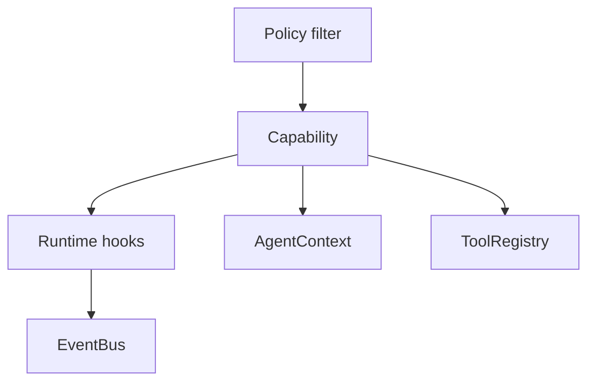
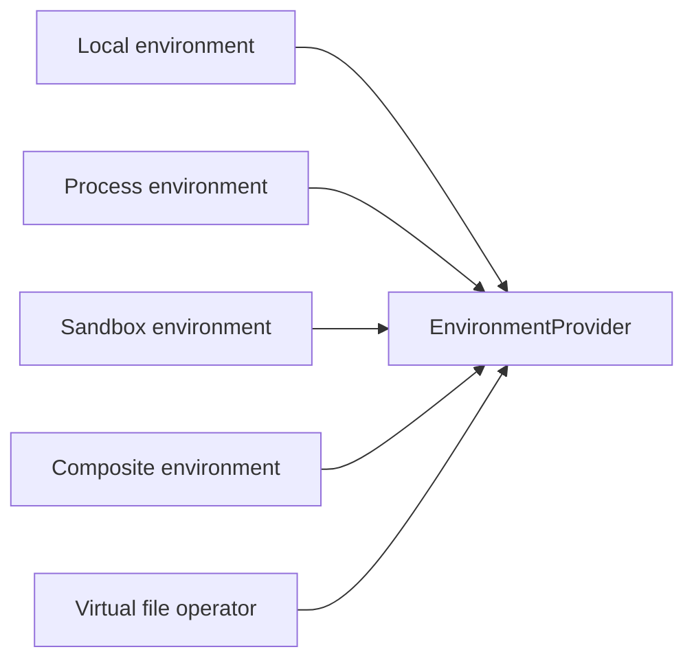

# SDK Integration Map

This spec maps application-facing agent concepts into Starweaver's first-party SDK architecture. The SDK layer should provide application-ready building blocks through capabilities, `AgentContext`, `EnvironmentProvider`, and policy presets while preserving the core runtime boundary.

## Integration Principles

- Policy filters become capabilities with explicit hook points and context evidence.
- Environment modules become `EnvironmentProvider` implementations and environment-backed tool bundles.
- Context helpers become `AgentContext` state, notes, messages, tasks, and usage tools.
- Subagent configuration becomes `SubagentSpec`, `SubagentConfig`, and unified delegation tools.
- First-party SDK features remain extensible through traits, capabilities, toolsets, and typed dependencies.

## Design Direction

The Rust SDK should express application-facing agent features through Starweaver-native traits: `ModelAdapter`, `AgentContext`, `AgentCapability`, `EnvironmentProvider`, `AgentExecutor`, and `SessionStore`. The environment abstraction should graduate one proven capability at a time, with rich operators living behind optional traits and first-party bundles.

## Module Map

| Feature family     | Starweaver target                                  | Spec owner                                                    | Validation path                      |
| ------------------ | -------------------------------------------------- | ------------------------------------------------------------- | ------------------------------------ |
| agent construction | `AgentBuilder`, `AgentApp`, `AgentSession`         | `sdk/01-agent-sdk-app.md`                                     | SDK session and builder tests        |
| lifecycle hooks    | ordered runtime hooks and capability lifecycle     | `core/03-tools-output-capabilities.md`                        | lifecycle hook tests                 |
| context compaction | history processors and context state               | `core/04-context-state-executor.md`                           | history processor tests              |
| policy guards      | policy capabilities and request guards             | `core/03-tools-output-capabilities.md`                        | guard and capability tests           |
| streaming          | runtime stream records and service stream adapters | `core/01-agent-loop.md`, `ops/02-durable-service-runtime.md`  | stream and replay tests              |
| context stores     | `AgentContext`, notes, message bus, tasks, usage   | `core/04-context-state-executor.md`                           | context and tool bundle tests        |
| environment        | `EnvironmentProvider` and provider families        | `sdk/02-environment-provider.md`                              | environment fake/local/sandbox tests |
| filters            | capabilities with ordered hooks                    | `core/03-tools-output-capabilities.md`                        | capability tests per filter          |
| toolsets           | first-party tool bundles and tool proxy            | `sdk/03-first-party-tool-bundles.md`                          | toolset tests                        |
| subagents          | specs, factory, registry, unified delegation       | `sdk/04-subagents-skills.md`                                  | subagent tests                       |
| media              | media/resource bundle and canonical media parts    | `sdk/03-first-party-tool-bundles.md`                          | media tests                          |
| config             | SDK config, model presets, and policy presets      | `sdk/01-agent-sdk-app.md`, `core/02-model-provider-replay.md` | config and preset tests              |
| MCP                | MCP toolset and live client bridge                 | `sdk/03-first-party-tool-bundles.md`                          | MCP tests                            |

## Filters as Capabilities

Target filters:

- auto-load files capability
- background shell capability
- bus message capability
- cold start capability
- environment instructions capability
- handoff capability
- image/media upload capability
- model switch capability
- reasoning normalize capability
- runtime instructions capability
- system prompt capability
- tool args capability

## Environment Integration

Environment concepts map to provider traits:

The SDK should implement virtual and local providers first, then process and sandbox providers after the state/export contract is reviewed.

## Context Tool Integration

Context-backed SDK tools should expose:

- notes
- tasks
- message bus
- usage snapshot
- state get/set
- environment state summary
- session metadata

These tools are implemented through first-party bundles and can be added to agents through capability presets.

## Subagent Integration

Subagent features map to:

- markdown/frontmatter specs
- builtin registry
- factory from specs and environment policy
- unified delegation tool
- inherited tool policy
- lifecycle events
- nested delegation guardrails
- durable polling extension

## Skill Integration

Skills should be loaded from project, global, and builtin sources. A skill may contribute:

- instructions
- examples
- tool requirements
- optional tool requirements
- metadata
- toolsets

Skill loading integrates with `AgentBuilder` through capability bundles and with `EnvironmentProvider` for file/resource access.

## Review Gate

Before implementing an SDK feature batch:

1. Add or update the corresponding spec section.
2. Add TODO rows in `memos/implementation-todo.md`.
3. Port tests first where feasible.
4. Implement the Rust-native trait or capability.
5. Add docs examples after the API shape stabilizes.
