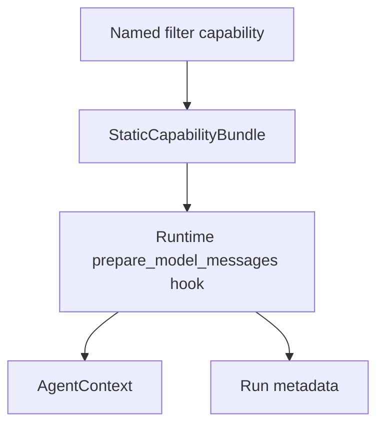
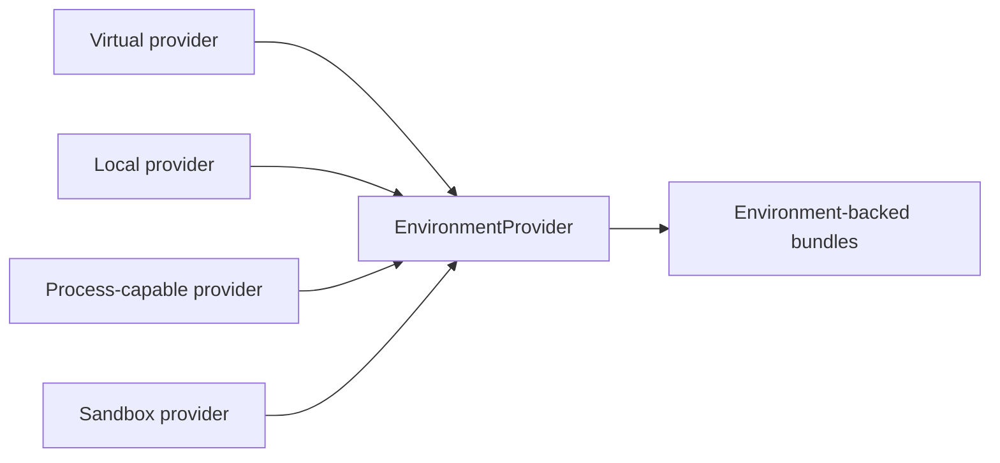

# SDK Integration Map

This spec maps application-facing agent concepts into Starweaver's first-party SDK architecture. It reflects current implementation status after the Starweaver boundary cleanup.

## Integration Principles

- Policy filters are ordered SDK capabilities with explicit hook points and context evidence.
- Environment modules are `EnvironmentProvider` implementations and environment-backed tool bundles.
- Context helpers are `AgentContext` state, notes, messages, tasks, usage, and typed dependencies.
- Subagent configuration is `SubagentSpec`, `SubagentConfig`, registry entries, and delegation tools.
- First-party SDK features remain extensible through traits, capabilities, toolsets, typed dependencies, and host-provided handles.

## Module Map

| Feature family        | Target                                                     | Status         | Spec owner                                | Validation path                |
| --------------------- | ---------------------------------------------------------- | -------------- | ----------------------------------------- | ------------------------------ |
| agent construction    | `AgentBuilder`, `AgentApp`, `AgentSession`                 | landed         | `sdk/01-agent-sdk-app.md`                 | SDK session and builder tests  |
| lifecycle hooks       | runtime hooks and capability lifecycle                     | landed/partial | `core/03-tools-output-capabilities.md`    | capability tests               |
| capability middleware | ordered wrappers, IDs, per-run instances                   | pending        | `core/03-tools-output-capabilities.md`    | capability ordering tests      |
| context compaction    | ordered message-preparation capabilities and context state | partial        | `core/04-context-state-executor.md`       | capability/filter tests        |
| policy guards         | request guards, approval/deferred metadata                 | partial        | `core/03-tools-output-capabilities.md`    | guard/control-flow tests       |
| streaming             | runtime stream records and service/CLI adapters            | partial        | `core/01`, `ops/03`, `ops/04`             | stream/replay tests            |
| context stores        | notes, message bus, state, tasks, usage                    | landed/partial | `core/04-context-state-executor.md`       | context and bundle tests       |
| environment           | provider families and policy                               | partial        | `sdk/02-environment-provider.md`          | fake/local/process tests       |
| filters               | named policy filter capabilities                           | landed/partial | this spec and `ops/07`                    | SDK filter order tests         |
| toolsets              | first-party bundles, MCP, proxy                            | partial        | `sdk/03-first-party-tool-bundles.md`      | toolset/proxy/MCP tests        |
| toolset wrappers      | filtered/prepared/renamed/approval/dynamic/deferred        | landed         | `core/03-tools-output-capabilities.md`    | wrapper tests                  |
| deferred tools        | SDK requests/results and inline handlers                   | partial        | `ops/03`, `core/03`                       | control-flow and service tests |
| subagents             | specs, registry, inherited tools, lifecycle                | partial        | `sdk/04-subagents-skills.md`              | subagent tests                 |
| skills                | fileops-loaded skills and tool summaries                   | partial        | `sdk/04-subagents-skills.md`              | skill tests                    |
| media                 | binary/resource/data-url parts and preflight               | partial        | `sdk/03-first-party-tool-bundles.md`      | media/preflight/provider tests |
| config/specs          | AgentSpec, presets, host handles                           | partial        | `sdk/01-agent-sdk-app.md`                 | spec/profile tests             |
| UI adapters           | AG-UI/Vercel request adapters and sanitizers               | pending        | `ops/04`, future platform spec            | adapter conformance tests      |
| model wrappers        | fallback/concurrency/instrumentation/provider lifecycle    | pending        | `core/05-agent-foundation-feature-map.md` | model wrapper tests            |

## Filters as Capabilities



### Current Filter Status

The first SDK filter capability slice is landed in `crates/starweaver-agent/src/filters.rs`:

- `DEFAULT_FILTER_ORDER`
- `default_filter_bundle()`
- `default_filter_capabilities()`
- `NamedFilterCapability`
- `CacheFriendlyCompactCapability`
- `MediaUploader` seam
- media preflight and upload replacement behavior
- cold-start tool-return trimming
- capability/media support filtering
- compact keep-message behavior
- handoff metadata support
- auto-load/background/bus metadata injection, environment/runtime context injection, and true instruction metadata injection
- system prompt reinjection composition
- tool-call argument repair
- reasoning normalization

Current order:

```text
cold_start -> capability -> media_preflight -> media_compress -> media_upload -> compact -> handoff -> auto_load_files -> background_shell -> bus_message -> environment_context -> runtime_context -> system_prompt -> tool_args -> reasoning_normalize
```

Remaining filter depth:

| Filter family       | Current state                          | Remaining work                                                                                    |
| ------------------- | -------------------------------------- | ------------------------------------------------------------------------------------------------- |
| auto-load files     | metadata-driven injection slice        | provider-backed reads, truncation files, focused request parts, local/virtual tests               |
| background shell    | process provider substrate exists      | completed process injection, output spill files, lifecycle UI evidence                            |
| bus messages        | context message bus exists             | consume-once request pipeline behavior and retry safety tests                                     |
| cold start          | tool-return trimming slice             | idle-window heuristics and cache-friendly compaction evidence                                     |
| environment context | metadata/provider-driven injection     | provider summary, workspace policy, resource state, sandbox evidence                              |
| handoff             | metadata-driven slice                  | restored-history reconstruction with keep tags and steering parts                                 |
| media preflight     | byte sniffing and policy checks landed | compression, alpha compositing, tall splitting, GIF policy, count limits across nested structures |
| media upload        | adapter seam landed                    | S3/resource-store adapters and failure fallback fixtures                                          |
| model switch        | profile presets exist                  | model-switch event normalization and history evidence                                             |
| reasoning normalize | first normalization slice              | provider-specific reasoning/thinking reconstruction fixtures                                      |
| runtime context     | SDK provider-bound injection exists    | refresh-after-tool-return and non-durable provider-message trace fixtures                         |
| system prompt       | landed                                 | preserve coverage as capabilities evolve                                                          |
| tool args           | repair slice landed                    | malformed/truncated argument fixture depth                                                        |

## Environment Integration



Current state:

- Virtual provider and local provider foundations are landed.
- File read/write/list/glob/grep policies are landed.
- Process-capable shell traits, handles, and deterministic tests are landed.
- Sandboxed provider implementation and aligned filesystem/shell path spaces remain active work.

## Skill Integration

Skills load from configured roots through provider file operations. Current SDK support includes:

- `SkillPackage`, `SkillSourceScope`, `SkillRegistry`, `parse_skill_markdown`, and `skill_tools()`.
- Virtual-provider scan tests and metadata preservation.
- Summary toolset generation and activation metadata.

Remaining work:

- CLI startup seeding for bundled skills and subagents.
- Shared `~/.agents` discovery/import options for Starweaver skill and subagent roots.
- Exact precedence tests for shared user, tool-specific user, shared project, and tool-specific project roots.
- Public `list_skills`, `load_skill`, and `reload_skills` tools over the active provider-visible skill cache.
- Hot reload at request boundaries in development profiles.
- Skill tool-requirement materialization and activation telemetry.
- Remote skill registry sync after local/project/global behavior stabilizes.

## Subagent Integration

Current support includes serializable subagent configs, frontmatter parsing, inherited tools, denied tools, optional/required/auto-inherited policies, lifecycle events, trace parent propagation, and nested delegation guardrails.

Remaining work:

- Durable subagent polling through shared sessions/runs.
- Cancellation/resume propagation through service runtime.
- Worker mode behavior in CLI.
- Subagent model/settings/config overrides aligned with Starweaver config.
- Unified subagent tool schema with available-subagent descriptions and `subagent_info` style inspection.
- Self-fork behavior for current-context child agents.
- Lifecycle stream evidence for started, streamed, completed, failed, cancelled, and resumed subagent work.

## Media Processing

Current landed media foundations:

- `ContentPart::Binary`, `ContentPart::ResourceRef`, and `ContentPart::DataUrl`.
- Data URL parsing, content-type detection, media policy, preflight evidence, and corruption evidence.
- Provider mapping tests for multimodal content.
- SDK media preflight processor and upload adapter seam.

Remaining media migration work:

- Base64-budget-aware compression for static images.
- Alpha compositing before JPEG conversion.
- Tall screenshot splitting with overlap.
- Animated GIF retention and support filtering.
- Newest-media count limits across user messages and nested tool returns.
- S3 protocol and provider resource-store upload adapters.
- Binary/resource download integration with `EnvironmentProvider` resource traits.
- Concrete fallback media understanding clients with usage accounting.

## Agent Framework Design Map

| Design area               | Starweaver shape                                                                                                                           |
| ------------------------- | ------------------------------------------------------------------------------------------------------------------------------------------ |
| capability middleware     | `AgentCapability` IDs, ordering, wrappers, per-run instances, deferred/on-demand loading                                                   |
| deferred tools            | SDK request/result records layered over durable approval/deferred storage                                                                  |
| RunContext breadth        | unified run context façade over `AgentContext`, `ToolContext`, run state, trace, usage, approval, available tools, and loaded capabilities |
| toolset combinators       | wrapper toolsets that transform discovery and execution                                                                                    |
| AgentSpec schema          | generated schema, templates, dependency schema, capability specs, host-policy materialization                                              |
| UI adapter trust boundary | sanitize client history, file URLs, dangling tool calls, system prompts, and download modes                                                |
| model wrappers            | fallback, concurrency limit, instrumentation, provider lifecycle                                                                           |
| advanced output           | multiple outputs, native/prompted/image modes, streamed structured output helpers                                                          |

## Review Gate

Before implementing the next SDK batch:

1. Update `spec/alignment/07-gap-matrix-and-roadmap.md` with status, owner, and validation command.
2. Add a focused test for the behavior before broadening public API.
3. Keep docs examples compiling through `make docs-check` when user-facing examples change.
4. Keep capability/toolset additions aligned with durable session and stream contracts.
