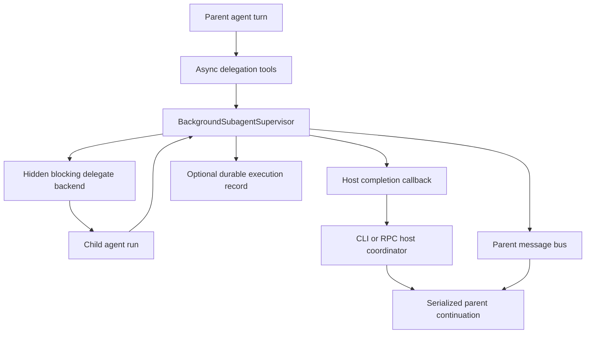
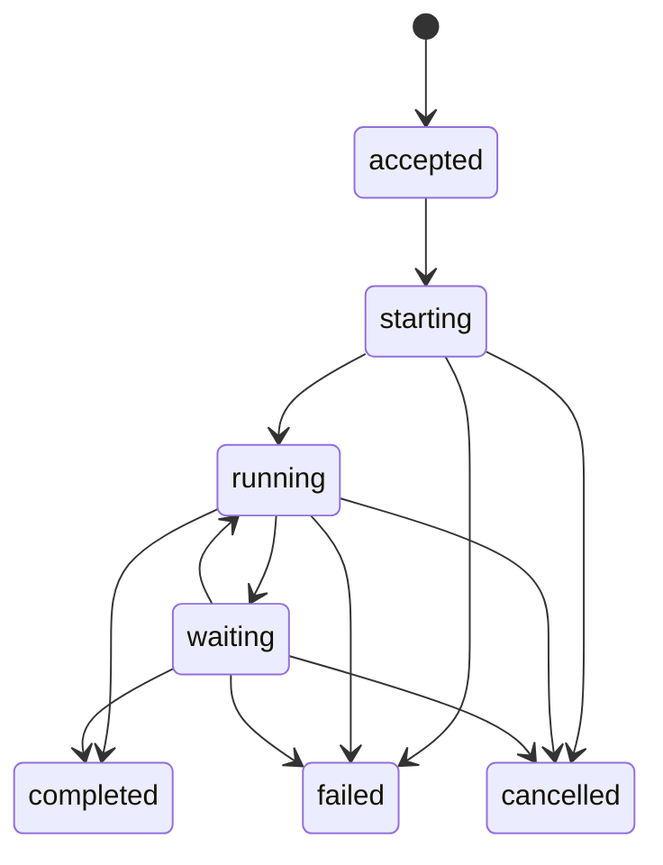
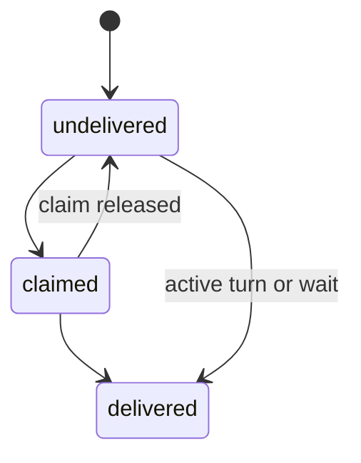

# Asynchronous Subagent Execution

Status: proposed

Revision: 2026-07-14

This spec defines the asynchronous subagent topology used by long-lived Starweaver products. In that topology, the model-visible `delegate` tool accepts work and immediately returns a stable background `agent_id` plus a per-attempt `attempt_id`. The existing blocking delegate remains an internal execution backend and is not model-visible.

This is an SDK execution topology. It is distinct from agent-facing durable session management in `../ops/08-agent-session-management.md`: a subagent is a child execution owned by one parent-agent application scope, while session management queries or controls independent durable sessions and runs through host-granted authority.

## Decision

Long-lived Starweaver products use async-only model-visible delegation:

- `delegate` starts a new attempt and may continue a previously terminal subagent conversation under its `agent_id`, then returns immediately;
- `steer_subagent` sends guidance to an active background subagent attempt;
- `cancel_subagent` requests cooperative cancellation of an active owned attempt;
- `wait_subagent` performs one bounded fan-in when the parent cannot continue without a result;
- `subagent_info` reports the available subagent roster and known background executions;
- the blocking delegate implementation remains available as hidden `__delegate_backend` for the async wrapper;
- `spawn_delegate` is a compatibility surface only for the dual blocking/async SDK mode and is not exposed by async-only product profiles;
- background completion is delivered through the parent message bus and a host completion callback;
- a host serializes parent continuations and owns task cleanup across parent turns.

The SDK keeps blocking delegation as its compatibility default until the async lifecycle contract and product hosts are complete. Product defaults are explicit:

| Product/runtime profile | Delegation topology                        | Reason                                                                  |
| ----------------------- | ------------------------------------------ | ----------------------------------------------------------------------- |
| Interactive CLI/TUI     | async-only `delegate`                      | the process and application supervisor outlive one parent turn          |
| Standalone RPC agent    | async-only `delegate`                      | the host owns durable sessions, background tasks, and continuation runs |
| One-shot headless CLI   | blocking `delegate`                        | process exit cannot honor a fire-and-forget lifetime                    |
| Headless worker         | disabled                                   | a worker must not recursively create unmanaged workers                  |
| Generic SDK app         | blocking by default; explicit async opt-in | the SDK cannot assume a host supervisor or wake-up policy               |

A product must not expose async `delegate` unless it can keep the background owner alive, deliver late results, and shut tasks down deterministically. It must not advertise async behavior and then silently block.

## Goals

- Keep the stable model-facing tool name `delegate` while changing long-lived product semantics from blocking to asynchronous.
- Let the parent continue useful work while independent subagents execute.
- Support targeted steering, bounded fan-in, late-result notification, and deterministic shutdown.
- Preserve the existing subagent registry, inherited-tool policy, child context derivation, lifecycle events, usage accounting, and tracing.
- Prevent polling loops, duplicate result delivery, concurrent parent continuations, and orphaned child tasks.
- Give CLI and RPC independent host implementations over the same SDK lifecycle contract.
- Preserve durable causality between parent work, child work, and any result-triggered continuation.

## Non-goals

- Turning every subagent into an independently user-managed durable session.
- Implementing general session CRUD or cross-session run control; that belongs to `../ops/08-agent-session-management.md`.
- Keeping background work alive after the owning product process exits without a durable worker implementation.
- Allowing nested background delegation by default.
- Making one-shot headless execution wait indefinitely merely to imitate an async surface.
- Replacing the runtime agent loop, message bus, task bundle, or durable session store.
- Exposing `__delegate_backend` to the model.
- Guaranteeing distributed exactly-once execution. Delivery and persistence semantics are stated explicitly below.

## Terminology and Identity

The following identities are separate:

| Identity              | Meaning                                                                                      |
| --------------------- | -------------------------------------------------------------------------------------------- |
| `parent_session_id`   | durable conversation that owns parent turns when a product uses durable sessions             |
| `parent_run_id`       | parent run that accepted the delegation                                                      |
| `attempt_id`          | unique `SubagentAttemptId` for one delegation attempt and its lifecycle/delivery evidence    |
| `agent_id`            | stable background subagent conversation identity returned to the model and reused for resume |
| `linked_task_id`      | optional separate task-bundle record assigned to the delegation attempt                      |
| `child_run_id`        | runtime run identity for one invocation of the child agent                                   |
| `continuation_run_id` | optional new parent run created to process a late child result                               |

`agent_id` is not a durable session id, a process id, or a tool-call id. Reusing an existing known `agent_id` after its prior attempt is terminal continues that subagent's SDK conversation with a new attempt when policy permits. `delegate` does not resume an existing waiting attempt; host/HITL/checkpoint control resumes that same attempt. A new delegation without an `agent_id` allocates one. An unknown caller-supplied id must not silently attach to unrelated history.

`attempt_id`, `agent_id`, and `linked_task_id` are not interchangeable. Every newly delegated conversation turn after a prior terminal attempt receives a new `SubagentAttemptId`, including continuation of an existing `agent_id`. At most one non-terminal attempt for an `agent_id` exists in one supervisor scope. Execution-level continuation from `waiting`, or restart from a supported checkpoint, keeps the same `attempt_id` and acquires a new lease/fencing generation when required. A waiting attempt occupies the active-attempt slot. Per-attempt result, delivery, steering, cancellation, and retention state is keyed by `attempt_id`; it must not reuse a prior attempt's cached result or notification token. A delegated attempt may also link to a distinct task-bundle `linked_task_id`, but a host must not create a task record solely because a subagent is available.

## Current Implementation Baseline

The current SDK already provides:

- `SubagentDelegationMode::{Blocking, Async, BlockingAndAsync}`;
- async model-visible `delegate` backed by hidden `__delegate_backend`;
- `BackgroundSubagentMonitor` with active task and terminal result caches;
- immediate `agent_id` return;
- bounded `wait_subagent`;
- message-bus result delivery with a fallback pending queue;
- child context merge, lifecycle events, stream forwarding, usage accounting, tracing, and inherited tools;
- main-agent-only background delegation guardrails.

The remaining gaps addressed by this spec are:

- no model-visible `steer_subagent` or `cancel_subagent` in the Starweaver SDK;
- active task entries do not own child task/control handles needed for targeted steering, cancellation, bounded abort, panic detection, and shutdown join;
- the monitor is created inside each built runtime rather than owned by a long-lived product supervisor;
- no host completion callback that can schedule a parent continuation;
- no durable background execution/delivery record for RPC restart and audit;
- incomplete task-ownership integration, cancellation policy, shutdown, retention, and quotas;
- CLI and RPC do not yet install the required product topology and lifetime owner;
- RPC currently constructs one agent runtime per run and does not yet register subagents or a result-triggered continuation path.

## Architecture and Ownership



Ownership rules:

- `starweaver-agent` owns the model tools, registry adapter, background supervisor contract, in-process state machine, and SDK lifecycle events.
- `starweaver-context` owns message-bus delivery and parent context synchronization primitives.
- `starweaver-session` owns the proposed durable background execution and delivery projection needed by service hosts; it does not execute subagents.
- `starweaver-storage` owns the concrete durable adapter when persistence is enabled.
- `starweaver-cli` owns its TUI supervisor lifetime, wake-up scheduling, cancellation interaction, and shutdown policy.
- `starweaver-rpc` owns its supervisor lifetime, durable continuation creation, active task registry, authorization/profile selection, restart reconciliation, and shutdown policy.
- CLI and RPC do not share a supervisor, coordinator, config object, or active-task registry.

The supervisor must outlive individual parent `AgentRuntime` values in async products. A monitor allocated inside a per-run runtime is insufficient because dropping that runtime can cancel or lose accepted background work before completion is delivered.

## Tool Topology

### Async `delegate`

Provisional model schema:

```rust
pub struct AsyncDelegateArgs {
    pub subagent_name: String,
    pub prompt: String,
    pub agent_id: Option<String>,
    pub linked_task_id: Option<TaskId>,
}
```

Arbitrary metadata is not part of the model schema. The host may attach typed internal metadata after authorization, but model input cannot set identity, lineage, tracing, ownership, lifecycle, hidden backend, capability, or policy fields. A future labels field must be typed, allowlisted, size-bounded, and semantically inert.

The returned payload includes:

- `status`: `accepted` or `continued`;
- `subagent_name`;
- newly allocated `attempt_id`;
- stable conversation `agent_id`;
- optional `linked_task_id`;
- a concise instruction not to poll and to use one bounded wait only when blocked.

Acceptance is complete only after the supervisor has:

1. validated the selected subagent and inherited-tool requirements;
2. validated conversation-continuation identity, prior terminal state, and nesting policy;
3. reserved quota;
4. registered the background execution before spawning it;
5. recorded durable acceptance when the host requires durability;
6. acquired the resources needed to start the child.

A failure before acceptance is a tool error and returns no usable `attempt_id`. A failure after acceptance becomes terminal child evidence and is delivered through the normal result path. Starting another attempt for an already-active `agent_id` returns a conflict; it never overwrites active metadata.

### Hidden `__delegate_backend`

The hidden backend preserves the existing blocking implementation for:

- registry lookup and dynamic availability;
- child context derivation;
- inherited tools/capabilities/environment;
- resume history;
- runtime and stream execution;
- lifecycle events, usage, notes, and traces.

It must be executable by the async wrapper but omitted from model definitions and tool instructions. Hidden does not mean unaudited: backend calls retain ordinary tool, subagent, and trace evidence.

### `steer_subagent`

Provisional schema:

```rust
pub struct SteerSubagentArgs {
    pub attempt_id: SubagentAttemptId,
    pub message: String,
    pub steering_id: Option<String>,
}
```

Rules:

- only the owning main agent may steer by default;
- the target attempt must be active and owned by the same supervisor scope;
- steering is queued through the child's message/control boundary and is not an immediate model-call interruption;
- the receipt returns `attempt_id`, `agent_id`, stable `steering_id`, and `queued`;
- steering an unknown, terminal, unauthorized, or not-yet-controllable target returns a typed safe error;
- retries with the same steering id are idempotent within the execution retention window;
- message size and queue depth are bounded.

### `cancel_subagent`

Provisional schema:

```rust
pub struct CancelSubagentArgs {
    pub attempt_id: SubagentAttemptId,
    pub reason: Option<String>,
    pub cancellation_id: Option<String>,
}
```

Rules:

- only the owning parent/supervisor scope may cancel the attempt;
- the target is one active attempt, not every historical execution of an `agent_id`;
- the receipt means cooperative cancellation was requested, not that terminal cleanup has completed;
- repeated cancellation ids are idempotent and a terminal race returns the existing terminal state;
- the supervisor uses the child control/cancellation handle, waits through one bounded grace deadline, and may abort the owned task afterward;
- terminal evidence is `cancelled` or a safe failure/interruption category, and later `wait_subagent` observes it;
- cancelling a child does not delete a durable session and does not cancel the parent run.

A host can additionally cascade cancellation along recorded ownership edges when cancelling an entire workflow, deleting its owner session, or shutting down.

### `wait_subagent`

`wait_subagent` is a bounded fan-in primitive, not a polling API.

```rust
pub struct WaitSubagentArgs {
    pub attempt_id: Option<SubagentAttemptId>,
    pub timeout_seconds: f64,
}
```

- `attempt_id` waits for one known attempt; omission waits for the current known set.
- the timeout defaults to 30 seconds, is clamped to a host maximum no greater than 300 seconds, and never resets through retries.
- timeout returns the still-running identities and does not cancel them.
- terminal results are cached for a bounded retention window.
- consuming a result through `wait_subagent` marks the corresponding bus notification delivered so a second empty continuation is not scheduled.
- unknown ids return `not_found` plus a bounded known-attempt summary, not arbitrary supervisor internals.
- the tool is visible only to the owning main agent and only when known background work or retained results exist.

Instructions must explicitly prohibit repeated manual polling. Hosts may rate-limit repeated waits even when the model ignores that instruction. During migration, an `agent_id` compatibility target may resolve only when it identifies exactly one active or latest retained attempt; canonical tools and durable evidence use `attempt_id`.

### `subagent_info`

The information tool reports two bounded views:

- configured subagents, descriptions, and current availability;
- known background executions with `attempt_id`, conversation `agent_id`, subagent name, lifecycle status, waiting-resume/terminal-continuation capability, and safe timestamps.

It does not return full prompts, results, inherited secrets, raw metadata, or unbounded historical records by default.

## Orthogonal Lifecycle State

Execution outcome, result delivery, and content retention are separate state dimensions. Delivery or expiration never overwrites a terminal execution outcome.

### Execution state



Normative execution states:

- `accepted` — identity, quota, ownership, and optional durable queued/admission record exist;
- `starting` — backend invocation is being prepared;
- `running` — child runtime can make progress;
- `waiting` — this same attempt is durably waiting for HITL, deferred completion, or another explicitly resumable condition;
- `completed`, `failed`, `cancelled` — immutable terminal execution outcomes.

A transition from `waiting` back to `running`, or restart from a supported checkpoint, continues the same `attempt_id`; a new lease/fencing generation can protect the resumed owner. A new model delegation after a terminal attempt continues the `agent_id` conversation with a new `attempt_id`. Steering and cancellation requests are operation/effect records, not execution statuses.

### Delivery and retention state



Delivery states are:

- `undelivered` — terminal result exists but no parent consumer owns delivery;
- `claimed` — one consumer/continuation atomically owns delivery under a claim id and deadline;
- `delivered` — the parent turn, explicit wait, or accepted continuation has consumed the logical result.

Content retention is another field such as `inline`, `artifact`, or `expired`. Expiration removes volatile content according to policy while retaining minimal terminal and delivery audit evidence. Execution terminality, delivery acknowledgement, and content retention each transition monotonically under their own compare-and-set/version rules.

## Completion and Parent Continuation

Completion performs two logically separate actions:

1. record the terminal child result;
2. make the result available to the parent and notify the host that parent work may be resumed.

The parent message uses a stable message id derived from `attempt_id`, never the reusable `agent_id`. Terminal execution result is persisted before any delivery becomes claimable.

Delivery rules:

- if the parent is subscribed in an active turn, enqueue directly; the message-bus guard atomically claims and marks delivery before accepting terminal parent output;
- explicit `wait_subagent` uses the same claim protocol and marks the corresponding bus message consumed when it returns the terminal result;
- otherwise place the stable message in the supervisor fallback queue and invoke the host completion callback after terminal and `undelivered` state are visible;
- a continuation scheduler performs transactional `undelivered -> claimed(claim_id, continuation_run_id)` admission keyed by `attempt_id`;
- continuation-run durable admission and claim linkage are one idempotent operation when they share a store, or use a durable outbox/compensation record when they do not;
- after accepted continuation input owns the result, the fallback/bus message is marked consumed and the claim becomes `delivered`;
- failed continuation admission releases an unexpired claim back to `undelivered`, while restart reconciliation can reclaim an expired claim;
- repeated callbacks, waits, active-turn consumption, and restart reconciliation observe the same claim and cannot create duplicate logical delivery or empty continuation turns.

The host serializes parent continuations per session/context. It must never run two parent turns concurrently against the same mutable conversation state.

### CLI/TUI continuation

When the TUI parent is idle and an undelivered result arrives, the CLI schedules one empty-input parent turn whose actual input comes from the message bus. When the parent is already running, it marks a pending bus check and lets the current turn consume or hand off the result.

Cancelling the foreground parent turn does not automatically discard an already accepted child. By default the child continues, but automatic wake-up is suppressed until the cancellation cleanup completes; the result remains pending for the next explicit or policy-approved turn. Closing the TUI cancels all owned background work after a bounded drain period.

### RPC continuation

RPC never mutates a terminal parent run to append late output. If the parent session remains eligible and policy permits automatic continuation, RPC creates a new durable run in the same session with:

- `trigger_type = "async_subagent_result"`;
- causal references to `parent_run_id`, `attempt_id`, `agent_id`, and `child_run_id`;
- the undelivered bus message as host-supplied continuation input;
- the same resolved agent profile unless an explicit durable policy selects another;
- a distinct `continuation_run_id` and ordinary stream/replay evidence.

If the parent session is deleted, archived against continuation, unauthorized, over quota, or shutting down, RPC records/stages the result without creating a new run. A cancelled parent run suppresses automatic continuation by default; an explicit later session run can consume the pending result. Restart reconciliation may schedule a missing continuation only when the durable delivery record proves that none was accepted previously.

## Context, State, and Merge Semantics

Background work cannot hold an exclusive mutable parent `AgentContext` across turns. The child receives a derived snapshot plus explicit shared handles. On completion, merge behavior is constrained:

- usage is accumulated by stable child execution identity so retries do not double count;
- notes, task updates, and messages use their owning stores' merge/idempotency rules;
- child conversation history is stored under `agent_id`;
- mutable parent transcript/history is changed only by a serialized parent continuation;
- arbitrary child snapshots do not replace newer parent state;
- environment handles and capabilities are inherited according to the accepted child grant and remain deny-by-default;
- stream events preserve parent/child source attribution.

Any current implementation that snapshots the parent at spawn and replaces it wholesale at completion must be replaced with field-specific merge operations before product async mode is enabled.

## Task Ownership

Delegation may link to a separate task bundle record:

- if `linked_task_id` is supplied, the host validates that the task exists, is assignable, and belongs to the same authority scope;
- accepted delegation can set that task's owner/worker to the background `agent_id` and status to in progress;
- successful completion can mark the task completed only when the delegated contract explicitly authorizes that transition;
- failed/cancelled execution returns task control to the parent or marks it blocked according to task policy;
- absence of a `linked_task_id` leaves task-bundle storage untouched;
- subagents do not create or claim arbitrary tasks merely because delegation is available.

Task transitions and subagent lifecycle records use separate identities and remain independently auditable.

## Durability and Restart

Interactive in-process SDK apps may use a volatile supervisor. RPC and other durable hosts require a persisted execution projection, tentatively:

```rust
pub struct BackgroundSubagentRecord {
    pub attempt_id: SubagentAttemptId,
    pub agent_id: AgentId,
    pub linked_task_id: Option<TaskId>,
    pub subagent_name: String,
    pub parent_session_id: SessionId,
    pub parent_run_id: RunId,
    pub child_run_id: Option<RunId>,
    pub continuation_run_id: Option<RunId>,
    pub execution_status: BackgroundSubagentExecutionStatus,
    pub result_ref: Option<SubagentResultRef>,
    pub delivery_status: SubagentDeliveryStatus,
    pub delivery_claim: Option<SubagentDeliveryClaim>,
    pub retention_status: SubagentRetentionStatus,
    pub accepted_at: DateTime<Utc>,
    pub updated_at: DateTime<Utc>,
}
```

The exact record may reuse versioned session evidence rather than introduce a new top-level table, but it must support:

- monotonic execution transitions and immutable terminal outcome;
- idempotent acceptance and terminal writes;
- result payload/reference retention separate from minimal audit evidence;
- atomic delivery claim, acknowledgement, and continuation-run linkage;
- independent restart classification for execution, delivery, and content retention;
- cancellation reason and safe failure category;
- trace/span and parent/child run correlation.

A local in-process child cannot be resumed merely because its record says `running` after process loss. Restart reconciliation marks it interrupted/failed unless the configured execution backend provides a durable worker lease and resume contract. It may then notify the parent through the same terminal delivery path.

Retained content is bounded independently from minimal audit evidence. The supervisor keeps a compact result preview inline; oversized successful output moves to a host-owned artifact/result reference with digest and policy-controlled lifetime. Full prompts, results, and errors are not retained indefinitely in supervisor maps or injected repeatedly after delivery.

## Cancellation and Shutdown

Ownership defaults:

- cancelling only the interactive foreground parent turn does not automatically cancel accepted background children; it suppresses immediate auto-wake until cleanup completes;
- cancelling an entire host workflow cascades to its active children, while a product that terminates parent runs before late-result continuations records the children under the longer-lived session/supervisor scope;
- explicit `cancel_subagent`, a fenced parent-session deletion, or host shutdown requests child cancellation;
- session deletion blocks new attempts and continuation claims before cancellation, coordinates all owned attempts through the supervisor, and preserves terminal/pending-delivery audit evidence before tombstone;
- the selected ownership/cascade policy is fixed at acceptance and visible in lifecycle evidence;
- nested child cancellation propagates only along recorded ownership edges;
- cancellation is cooperative first, then bounded forced task abort at the in-process executor boundary;
- forced abort still writes terminal cancellation/interruption evidence when the host remains alive.

Graceful host shutdown order:

1. stop accepting new delegations and continuations;
2. snapshot active child identities;
3. request cooperative cancellation according to shutdown policy;
4. wait for terminal hooks and durable writes up to one absolute deadline;
5. abort remaining in-process tasks;
6. persist interrupted classification and pending delivery state;
7. close callbacks, message queues, and executor resources.

Dropping a Tokio runtime or monitor with detached tasks is not a valid shutdown implementation.

## Concurrency, Quotas, and Backpressure

Each product configures bounded values for:

- active children per parent and per host;
- nested delegation depth, default zero for background children;
- accepted prompt bytes and host-generated metadata bytes;
- steering message bytes and queue depth;
- cached terminal result count/bytes and retention time;
- callback/continuation queue depth;
- per-child timeout and total usage/cost budget;
- shutdown drain timeout.

Quota is reserved before acceptance and released exactly once at terminal transition. Completion callback pressure must not block child finalization indefinitely. If the callback queue is full, durable `undelivered` state plus its independently retained result reference remains the recovery source.

## Security and Capability Policy

- Background delegation is main-agent-only by default.
- Child tools are the intersection of declared inheritance, parent-visible tools, capability grants, and product policy.
- A child does not inherit session-management mutation authority unless explicitly granted; async delegation must not become a privilege-escalation path.
- Resume requires ownership of the existing `agent_id` within the same supervisor/session scope.
- Prompts, results, steering text, and metadata are treated as potentially sensitive and are not logged by default.
- Lifecycle telemetry carries identities, status, timing, usage, and safe error categories rather than raw content.
- Tool definitions and errors do not reveal hidden backend names beyond the documented SDK implementation contract to untrusted model output.

## Product Integration

### Interactive CLI/TUI

The CLI composition root creates one supervisor for the TUI application lifetime and passes it into each parent runtime/turn. The supervisor owns child task handles, pending messages, result cache, and completion callback. `/clear` or durable session selection must either select a new supervisor scope or explicitly retain/rebind pending tasks; it must not accidentally deliver one session's child result into another session.

One-shot headless runs continue to use blocking delegation. Worker mode installs no delegation tools.

### Standalone RPC

RPC registers configured subagents in `RpcAgentCatalog` and creates a host-owned supervisor scoped to the durable service and session. The RPC host/executor, not a per-run `AgentRuntime`, owns task handles. The coordinator persists lifecycle/delivery records and creates serialized continuation runs.

This work depends on explicit RPC runtime/task ownership and graceful shutdown. A detached `tokio::spawn` whose handle is discarded does not satisfy the contract.

Before RPC enables async delegation for externally managed runs, the host must provide an authenticated operator path to inspect and cancel a durable `attempt_id` even when no parent model turn is active. This can begin as an RPC-owned admin/application operation and later graduate to feature-gated `subagent.*` wire methods in the future protocol RFC. It does not use session CRUD, does not reinterpret `run.cancel`, and does not enter the currently implemented v1 method table without conformance coverage.

## Implementation Plan

### Phase 1: Complete the SDK lifecycle

1. Add `steer_subagent`, `cancel_subagent`, and bounded background execution state to `subagent_info`.
2. Introduce `SubagentAttemptId`, allocate a new `attempt_id` for each post-terminal delegation attempt, retain it across waiting/checkpoint resume, reject concurrent attempts for one `agent_id`, and key result/delivery state by attempt.
3. Extract background monitor construction from per-runtime build into an injectable `BackgroundSubagentSupervisor` that owns task and child-control handles.
4. Add a host completion callback and stable per-attempt result message ids with direct-delivery/fallback deduplication.
5. Replace whole-context completion replacement with field-specific delta merge/idempotency behavior.
6. Add bounded result/artifact retention, cancellation, shutdown, quota, and linked-task hooks.
7. Keep `SubagentDelegationMode::Blocking` as SDK compatibility default and preserve hidden backend tests.

### Phase 2: Enable interactive CLI/TUI async-only delegation

1. Create one supervisor per TUI application/session scope.
2. Install async `delegate`, `steer_subagent`, `cancel_subagent`, `wait_subagent`, and `subagent_info`; hide blocking backend.
3. Serialize wake-up turns and integrate pending bus checks with foreground cancellation.
4. Add bounded shutdown drain/cancel behavior.
5. Keep one-shot headless blocking and worker delegation disabled.

### Phase 3: Add durable RPC execution and continuation

1. Refactor RPC host/executor ownership so active and subagent task handles are tracked and joined.
2. Register RPC-configured subagents and inject a service-lifetime supervisor.
3. Add durable background execution/delivery records and storage operations.
4. Create idempotent `async_subagent_result` continuation runs instead of modifying terminal parent runs.
5. Reconcile active/undelivered records after restart and suppress duplicate continuations.
6. Add quotas, authorization/grant intersection, host/operator cancellation by durable attempt identity, and graceful shutdown coverage.

### Phase 4: Retire product-visible synchronous delegation

1. Remove blocking `delegate` from long-lived CLI/TUI and RPC product profiles.
2. Retain the hidden backend and generic SDK blocking mode for compatibility and one-shot hosts.
3. Deprecate product use of `BlockingAndAsync`/`spawn_delegate` once migration fixtures prove async-only behavior.
4. Update user docs and capability status only after implementation and product tests land.

## Acceptance Gates

```bash
cargo test -p starweaver-agent --all-targets --locked
cargo test -p starweaver-context --locked
cargo test -p starweaver-session --locked
cargo test -p starweaver-storage --locked
cargo test -p starweaver-cli --all-targets --locked
cargo test -p starweaver-rpc --all-targets --locked
cargo run -p xtask --locked -- check-architecture
make capability-check
git diff --check
```

Required evidence:

- async `delegate` returns before child completion and the hidden backend is absent from model definitions;
- post-terminal conversation continuation receives a new `attempt_id`, waiting/checkpoint resume retains its attempt, one `agent_id` cannot have concurrent non-terminal attempts, and old cached results cannot satisfy a new wait;
- `steer_subagent` targets only active owned attempts and is idempotent by steering id;
- `cancel_subagent` requests cooperative cancellation, supports bounded abort, and produces observable terminal evidence;
- one bounded wait claims and consumes the per-attempt result notification without causing a duplicate wake-up;
- concurrent wait, active-turn consumption, completion callback, and restart reconciliation admit at most one delivery claim; failed continuation admission releases/retries it safely;
- completion during an active parent turn and completion while idle each deliver exactly one logical result;
- parent continuations are serialized under concurrent child completion;
- foreground cancellation does not trigger an immediate empty wake-up and preserves pending child results;
- TUI application shutdown cancels/joins children without orphan tasks;
- one-shot headless uses blocking delegation and worker mode exposes none;
- RPC late results use one atomic delivery claim to create a new causally linked run and never modify a terminal parent run;
- restart reconciliation recovers expired delivery claims without duplicate delivery and does not claim that a lost in-process child is still running;
- context merge preserves newer parent state and usage/task/message effects are idempotent;
- child authority cannot exceed the accepted inherited capability grant, and model delegate input cannot spoof host metadata, identity, lineage, tracing, or policy fields;
- session deletion fences new attempts/continuations and coordinates owned child terminalization before tombstone;
- CLI and RPC retain no dependency on each other's coordinators or configuration.

## Related Specs

- `04-subagents-skills.md` — subagent configuration, inherited tools, skills, and base delegation lifecycle
- `01-agent-sdk-app.md` — SDK application/session composition
- `../core/04-context-state-executor.md` — context, messages, tasks, usage, and checkpoint contracts
- `../ops/03-durable-service-runtime.md` — durable execution and host coordinator responsibilities
- `../ops/04-cli-product.md` — CLI/TUI application coordination
- `../ops/06-json-rpc-host-protocol.md` — standalone RPC host protocol
- `../ops/08-agent-session-management.md` — separate agent-facing durable session query/control capability
