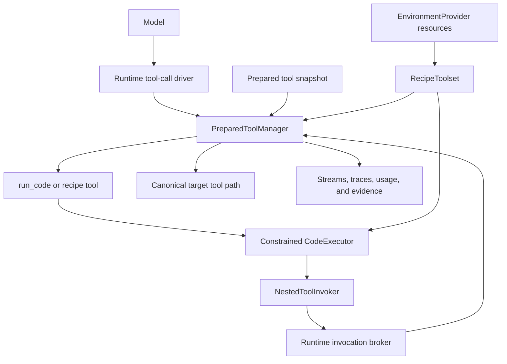
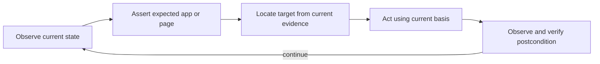

# CodeAct Tool Composition and Reusable Recipes

Status: implemented provisional initial profile; advanced durability and execution phases remain planned

Revision: 2026-07-31

This spec defines how Starweaver agents may compose tools from multiple toolsets by running constrained code, and how a successful composition may be saved and reused as a recipe. Code execution is an orchestration frontend over the ordinary Starweaver tool path. It is not a second dispatcher, an ambient shell, or a way to acquire authority that the invoked tools do not already have.

The design borrows the run-step tool-manager boundary and programmatic nested-call path demonstrated by Pydantic AI, and the brokered host dispatch boundary demonstrated by Codex Code Mode. Starweaver retains its own runtime, capability-grant, evidence, streaming, and durability contracts.

## Decision

Starweaver supports two related but distinct SDK capabilities in the initial profile:

- **CodeAct** executes constrained synchronous JavaScript with a required `main(input)` entrypoint and bounded exact-name `tools.call(name, args)` access to eligible tools from the active run-step tool snapshot.
- **Recipes** save reviewed JavaScript CodeAct source and its declared interface so the composition can be executed again and, when desired, exposed as one higher-level tool.

The implementation must first establish a canonical run-step tool manager used by both model-originated and nested calls. CodeAct must not call `Tool::call` directly, route through the current direct-call path in `ToolProxyToolset`, or reproduce runtime policy inside a language bridge.

A saved recipe contains orchestration logic, not authority. Every recipe execution creates new invocation identities and re-evaluates current tool availability, grants, approval policy, limits, and environment authority. Historical replay is read-only evidence projection and never re-executes effects. Durable continuation of an interrupted language VM is outside the initial profile.

## Goals

- Let one model-visible CodeAct call compose tools from multiple toolsets without returning to the model between every child call.
- Preserve the same target resolution, dependency projection, capability grants, hooks, retry, timeout, cancellation, approval, usage, tracing, and evidence contracts as direct tool calls.
- Use one run-step snapshot as the source of truth for model exposure, CodeAct exposure, schemas, and execution lookup.
- Keep nested calls out of ordinary model history while retaining parent/child stream and trace evidence plus a bounded summary on the outer result; dedicated durable nested checkpoints remain a separate service-runtime gate.
- Let agents save useful programs as workspace resources, promote stable programs into typed recipe tools, and later compose those recipes through the same bounded tool path.
- Make repeated execution explicit and distinguish it from read-only historical replay and from continuation of an interrupted execution.
- Support Computer Use feedback loops without weakening its observation-basis, active-session, geometry, receipt, cancellation, or idempotency contracts.
- Keep the JavaScript executor implementation replaceable while preserving one stable `main(input)` and JSON tool-bridge contract.

## Non-goals

- Treating `shell_exec`, a persistent PTY, or unrestricted Python/Node.js as CodeAct.
- Giving sandboxed code ambient filesystem, network, environment-variable, process, clock, credential, or host-context access.
- Bypassing target-tool approval because the outer `run_code` or recipe call was approved.
- Automatically replaying recorded side effects.
- Persisting or restoring arbitrary VM memory, stacks, futures, or language continuations in the initial profile.
- Automatically rerunning an entire program after approval, deferred execution, process loss, timeout, or ambiguous effects.
- Providing transaction or rollback semantics across multiple independently effectful child tools.
- Making output tools, main-agent-only interaction tools, or every registered tool callable from code.
- Moving model history, output strategy, graph transitions, or batch scheduling into the tool manager.
- Adding a new workspace crate before a concrete sandbox implementation establishes a justified package boundary.

## Terminology

| Term                       | Meaning                                                                                                                                           |
| -------------------------- | ------------------------------------------------------------------------------------------------------------------------------------------------- |
| **prepared tool snapshot** | Immutable run-step view of resolved tools after toolset lifecycle preparation, availability checks, definition preparation, and capability policy |
| **model projection**       | Tools from the prepared snapshot exposed as native function tools to the model                                                                    |
| **code projection**        | Tools from the same snapshot eligible for nested CodeAct invocation and signature/catalog rendering                                               |
| **prepared tool manager**  | Runtime-owned run-step inventory and canonical single-call execution service                                                                      |
| **direct invocation**      | Tool call originating in a model response and projected into ordinary model history                                                               |
| **nested invocation**      | Child tool call originating in a CodeAct or recipe execution and visible to its parent rather than directly to model history                      |
| **code execution**         | One bounded evaluation of fixed JavaScript source plus JSON input through the required `main(input)` entrypoint                                   |
| **recipe**                 | Saved CodeAct source plus a declared input interface, tool requirements, limits, and provenance                                                   |
| **re-execution**           | New execution of source or a recipe, with new identities and potentially new effects                                                              |
| **evidence replay**        | Read-only projection of previously recorded execution evidence, with no tool calls or effects                                                     |
| **continuation**           | Resumption of an interrupted code execution from an internal execution point                                                                      |

`re-execution`, `evidence replay`, and `continuation` are different operations and must not share one ambiguous `replay` API.

## Architecture and Ownership



Ownership rules:

- `starweaver-tools` owns tool definitions, toolsets, tool metadata, protocol-level raw execution primitives, retry/timeout primitives, and result/error types. It must not own agent graph state or CodeAct language execution.
- `starweaver-runtime` owns the prepared tool manager, run-step snapshot preparation, direct and nested invocation policy, the re-entrant invocation broker, runtime capability hooks, usage enforcement, tracing, streaming, checkpoints, and model-history projection.
- `starweaver-context` owns serializable agent/run state and narrow runtime-ephemeral service attachment points. A live manager or broker is not checkpoint state and must not be serialized.
- `starweaver-agent` owns `CodeActBundle`, recipe ergonomics, recipe toolset composition, executor-provider integration, model-facing instructions, and builder APIs.
- `starweaver-environment` remains the authority boundary for provider-visible recipe resources. The sandbox does not gain direct access to an environment provider.
- `starweaver-session`, `starweaver-stream`, and `starweaver-storage` retain their existing ownership of durable evidence, replayable streams, artifacts, and concrete persistence. They do not execute code or tools.
- CLI and standalone RPC independently enable CodeAct and recipe composition by default with `[codeact] enabled = false` as the explicit product-local disable switch. Neither product loops through the other.
- The supervised launch-envelope path used by the frozen Desktop reference explicitly disables CodeAct and recipes; no frozen Desktop source or generated projection is changed.

## Prepared Run-Step Tool Manager

### One prepared snapshot

Each model step produces one immutable prepared snapshot after all effective toolsets have completed the lifecycle and context-aware preparation required for that step. It contains, for every executable tool:

- canonical exact name and source toolset identity;
- prepared `ToolDefinition`;
- execution implementation/router;
- effective retry and timeout policy;
- dependency requirements and effective dependency profile;
- sequential/barrier metadata;
- exposure policy;
- target grant lookup identity;
- stable definition fingerprint material;
- availability and preparation provenance needed for diagnostics.

The snapshot is the only execution lookup for that step. Model definitions and CodeAct definitions are projections over this snapshot, not separately rebuilt registries. A definition removed by step preparation is not callable through CodeAct. Tool-name conflicts across prepared toolsets fail closed rather than using insertion order.

A new step receives a new snapshot. Existing code executions remain pinned to the snapshot with which they started; they do not observe a mid-cell inventory refresh. Dynamic tool discovery may change the next code execution after the runtime prepares a new step or explicitly defined cell boundary, but it must not mutate an active snapshot.

Toolsets retain ownership of their resource lifecycle. The runtime enters run-scoped toolsets before preparing snapshots, requests context-aware refreshes at defined step boundaries, and exits them only after active direct and nested invocations have completed or undergone bounded cancellation cleanup. A manager snapshot does not extend a toolset resource lifetime, and a CodeAct or recipe execution cannot detach from or outlive its owning run in the initial profile.

Snapshot assembly has an explicit order so CodeAct catalog generation does not create a second or circular inventory:

1. Enter or refresh effective toolsets and collect one base inventory, rejecting duplicate canonical names.
2. Evaluate context availability and ordinary definition/capability preparation for that inventory, including any policy that removes the outer CodeAct tool.
3. Apply host/agent exposure policy and derive the eligible code-target set, excluding the CodeAct wrapper and prohibited control/output tools.
4. If the prepared outer CodeAct tool remains present, render the bounded catalog as a dedicated grouped instruction contribution without mutating or cloning any already prepared tool definition.
5. Pass that catalog through the ordinary bounded instruction/message-preparation and redaction pipeline, then freeze the final snapshot and derive both model and code projections from it. If the outer CodeAct tool was removed, omit both the catalog and code projection.

The outer CodeAct tool keeps a fixed prepared definition that refers to the separately prepared catalog. A later hook cannot mutate one projection independently. Any allowed context change that affects definitions, instructions, or exposure requires a new prepared snapshot at a defined boundary before the next model request or code execution.

### Multiple projections

A prepared tool has an effective exposure selected by host/agent policy:

```rust
pub enum ToolExposure {
    ModelOnly,
    CodeOnly,
    ModelAndCode,
    Hidden,
}
```

The final representation may use flags rather than this exact enum. The contract is:

- the model projection contains `ModelOnly` and `ModelAndCode` tools;
- the code projection contains `CodeOnly` and `ModelAndCode` tools;
- `Hidden` tools remain available only to explicit runtime wrappers that were granted access and are never admitted by name from untrusted code;
- execution lookup additionally verifies that the requested invocation source is eligible for the selected projection.

`run_code` and recipe-executor tools are never members of their own code projection. Output tools, hidden execution backends, and `ask_user_question` are excluded. Approval/deferred control tools and delegation/session-control tools are excluded by default and require a future explicit policy rather than inheriting general tool visibility.

Tool authors can independently declare context-aware CodeAct eligibility without changing ordinary model availability:

```rust
pub enum CodeActEligibility {
    Inherit,
    Allow,
    Deny,
}

pub trait Tool {
    fn codeact_eligibility(&self, context: &AgentContext) -> CodeActEligibility {
        CodeActEligibility::Inherit
    }
}
```

Function and typed-function builders provide `.with_codeact(bool)` and `.with_codeact_availability(...)`; wrappers, prefixes, renames, approval/deferred combinators, and proxy-loaded tool wrappers preserve the inner declaration unless an explicit outer security wrapper narrows it. Host hard deny and tool `Deny` take precedence. Tool `Allow` expresses suitability but never bypasses product policy, Strict profile admission, exact grants, or prohibited-tool rules.

The effective code projection requires ordinary `is_available(context)`, a surviving prepared definition, CodeAct eligibility under product policy, and grant-intersected `ToolDependencyProfile::Strict`, including requirements created through `ToolDependencyRequirements::granted_filtered`. `Legacy` and plain `Filtered` targets remain model-only until explicitly migrated; nested dispatch must not silently replace their profile or claim direct/nested dependency parity that current assembly cannot enforce.

CLI and RPC default to an `AllPreparedStrict` policy: every available Strict tool with `Inherit` or `Allow` is included unless explicitly denied. Default first-party bundles migrate their ordinary composable tools to Strict and mark exceptional tools `Deny`. Generic SDK applications still install `CodeActBundle` explicitly and may choose `ExplicitOnly`, allow/deny selectors, tags, or an equivalent policy. A future profile may broaden dependency eligibility only after it provides equivalent exact-target grant intersection and proves that no ambient context handle or ungranted capability is exposed.

### Canonical single-call pipeline

Both direct and nested calls enter the same manager pipeline:

01. Resolve the exact target name in the pinned snapshot and verify source exposure.
02. Allocate or validate invocation identity and parent lineage.
03. Validate raw JSON argument state and apply any argument-validation contract supported by the target.
04. Build a per-call `ToolContext` with run, conversation, step, call, retry, trace, cancellation, and parent invocation identity.
05. Assemble dependencies according to the target's declared profile; nested CodeAct/recipe eligibility requires Strict assembly intersected with the host-installed `ToolCapabilityGrant` for that exact target.
06. Run runtime before-call capability hooks.
07. Re-project dependencies and grants after hooks where the existing capability contract requires it.
08. Run registry/tool execution hooks, target retry/timeout/cancellation, and the registered target implementation/router.
09. Apply target state changes and usage, run runtime after-result hooks, publish child evidence, and enforce run limits.
10. Project the typed outcome according to invocation mode and result visibility.

The manager handles one invocation. The runtime tool-call driver continues to own a model response's batch classification, parallel barriers, deterministic result ordering, output/end strategy, ordinary message-history construction, and graph transitions.

### Raw execution and projection

The current registry path normalizes execution directly into `ToolReturnPart`. CodeAct requires a lower-level typed result so nested failures are not mistaken for model-facing returns. The target shape is conceptually:

```rust
pub enum ToolInvocationMode {
    ModelFacing,
    NestedRaw,
}

pub enum ToolResultVisibility {
    ModelHistory,
    ParentOnly,
}

pub enum ToolInvocationOutcome {
    Success(ToolResult),
    Retryable(ToolInvocationFailure),
    ApprovalRequired(ToolApprovalRequest),
    Deferred(ToolDeferredRequest),
    Denied(ToolDenial),
    Failed(ToolInvocationFailure),
}
```

The exact public/private placement remains an implementation decision, but the distinctions are normative:

- direct calls use `ModelFacing` and `ModelHistory`;
- CodeAct and recipe children use `NestedRaw` and `ParentOnly`;
- registry-level transient retries and target timeouts remain active for the target invocation and retain the same child invocation identity;
- nested validation/tool failures do not consume an outer `run_code` retry counter;
- once source evaluation begins or the broker admits any child request, every outer CodeAct/recipe interruption or failure is non-runtime-retryable; re-running source requires an explicit new execution with new identities;
- only a failure proven to occur before source evaluation and before child admission may ever be classified as safe for automatic outer retry;
- denial, approval, and deferred states remain typed control flow and are never represented to sandbox code as an ordinary successful string.

The bridge may expose a declared target-domain failure proven not to have executed an effect as a catchable language error so code can choose an alternate tool or input. A failure that executed, partially executed, or has uncertain delivery is terminal: the runtime-owned broker latches before replying and rejects every later child request before assigning identity or executing a tool, regardless of executor behavior. Runtime cancellation, exhausted outer deadline, exhausted broker/call budget, lost broker ownership, usage-limit termination, and sandbox-integrity failures are likewise terminal execution signals and cannot be converted by user code into a successful outer result. Whether denial is catchable for branching is executor policy, but it remains a recorded denial and never becomes a successful child outcome.

`ToolRegistry::execute_call` may remain as a compatibility adapter, but canonical runtime work should be factored into a raw execution operation plus explicit model/nested projection rather than decoding metadata after the fact.

## Invocation Identity and Brokered Re-entry

### Identity and lineage

Every execution and child call has a separate stable identity:

| Identity                        | Meaning                                                          |
| ------------------------------- | ---------------------------------------------------------------- |
| `code_execution_id`             | one bounded source evaluation                                    |
| `outer_tool_call_id`            | model-originated call of `run_code` or a recipe tool             |
| `invocation_id`                 | one canonical direct or nested tool invocation                   |
| `parent_invocation_id`          | immediate parent invocation, normally the outer code/recipe call |
| `cell_id`                       | optional executor-local source cell identity within one run      |
| `recipe_id` and revision/digest | saved recipe provenance, not execution identity                  |

Child call IDs are runtime-minted or deterministically derived within the parent execution namespace. Sandbox-supplied IDs are treated as hints at most and cannot select unrelated durable records.

Each invocation records a source such as `Model`, `CodeAct`, or `Recipe`. Source attribution changes projection and policy; it never grants target authority by itself.

### Why a broker is required

The runtime normally awaits an outer tool future without lending mutable `AgentContext` to the tool. A `run_code` tool then needs to request child calls while that outer future is still active. Passing `&mut AgentContext`, a registry clone, or a broad mutable capability into the sandbox would break ownership and policy boundaries.

The runtime therefore creates a narrow, execution-bound `NestedToolInvoker`. The invoker can only submit typed child-call requests against:

- one pinned prepared snapshot;
- one parent invocation;
- one effective code-target allowlist;
- one set of execution budgets;
- the active cancellation and trace lineage.

It exposes no general context mutation, dependency lookup, registry access, or host capability handle. Each child request crosses a runtime-owned broker. While awaiting the outer code tool, the runtime pumps broker requests and executes them through the prepared manager. This preserves runtime state ownership and avoids recursive borrowing or deadlock.

The outer tool's own authority to use `NestedToolInvoker` and each child target's authority are separate checks. The effective child authority is the intersection of:

```text
outer orchestration grant
AND code-target policy
AND pinned code projection
AND exact target ToolCapabilityGrant
AND current host and product policy
```

No broad grant is copied from the outer tool to a child.

`run_code`, `run_recipe`, and generated recipe tools themselves use `ToolDependencyProfile::Strict` with no requested host capability, mutable context capability, or shell-environment projection. Their outer orchestration permission is a runtime-only CodeAct execution admission installed by explicit bundle/product policy, not a dependency-store capability that sandbox code can inspect. After admission, the runtime injects `NestedToolInvoker` through an unforgeable execution-scoped internal attachment after ordinary dependency projection. Because outer wrappers have no Legacy context clone, their completion apply-back cannot overwrite context state, usage, notes, events, or other mutations already committed by children.

## CodeAct Bundle and Executor Contract

### Model-facing surface

The initial bundle exposes one model tool conceptually equivalent to:

```rust
pub struct RunCodeArgs {
    pub source: String,
    pub input: serde_json::Value,
}
```

Source is constrained synchronous JavaScript and must define `function main(input)`. The executor evaluates definitions with an inert lexical bridge, rejects the entire execution if any top-level `tools.call` attempt occurs even when source catches the language error, activates the bridge only after definition evaluation succeeds, and then invokes `main` with JSON input. Top-level external effects are therefore rejected before broker admission. `main` must return a JSON-serializable value. Tool calls use synchronous `tools.call("exact_canonical_name", args)`, which matches the initial sequential broker profile. `async`, promises, imports/modules, timers, host clock, randomness, console, `eval`, `Function`, WebAssembly, dynamic source evaluation, filesystem, network, process, environment variables, credentials, and arbitrary host globals are unavailable.

Arbitrary tool grants, invocation IDs, resource roots, hidden tools, limits above host maxima, or executor configuration are not model-supplied fields. The outer wrapper disables generic unexpected-error retries in the initial profile. Every post-evaluation interruption/failure is projected as a typed non-runtime-retryable outer return rather than retryable `ToolError::Execution`; setting the wrapper's generic retry budget to zero is an additional defense, not the sole classification mechanism. Parse/setup failures that are later proven safe for automatic retry require an explicit pre-evaluation classification.

A later recipe surface may expose `run_recipe` for an authorized resource reference. Mature recipes may instead be registered as named tools through `RecipeToolset`; they still use the same executor and nested invocation path.

The model-facing tool description must explain:

- available language subset;
- exact tool-call syntax;
- JSON input/output boundary;
- call, time, memory, and output limits;
- no ambient host access;
- no dynamic source evaluation;
- which failures can be caught by code;
- that an interrupted cell is not automatically rerun.

### Executor provider

The SDK integrates a replaceable executor behind a contract similar to:

```rust
#[async_trait]
pub trait CodeExecutor: Send + Sync {
    async fn execute(
        &self,
        request: CodeExecutionRequest,
        tools: DynCodeToolBridge,
    ) -> Result<CodeExecutionResult, CodeExecutionError>;
}
```

This shape is provisional. The required semantics are:

- fixed source is parsed/compiled before external effects begin where the language permits;
- source and input are size-bounded;
- executor output is JSON-compatible and bounded;
- tool calls cross only the supplied bridge;
- cancellation and deadlines are enforceable;
- memory and instruction/work budgets are bounded by the provider or containing worker;
- stdout/diagnostics, when supported, are separately bounded and never treated as a host console;
- executor failure cannot leave runtime-owned child requests unaccounted for;
- the executor cannot mint grants or access private tool results;
- production implementations provide deterministic fakes and adversarial limit tests.

The implementation first uses a deterministic fake executor to validate dispatch, authority, evidence, cancellation, and lifecycle, then ships a constrained JavaScript executor behind the same provider contract. The concrete engine must enforce the stated isolation and resource bounds and remain replaceable; unrestricted host Node.js, Python, and shell subprocesses do not satisfy the contract.

A fresh executor instance per code execution is the baseline. A run-scoped REPL may be added later, but its state is runtime-ephemeral, bounded, and never assumed durable. Saved recipe source, not hidden REPL memory, is the reuse mechanism.

### Tool bridge

The universal bridge operation uses canonical exact names:

```python
result = await tools.call("canonical_tool_name", {"argument": "value"})
```

Language-specific generated wrappers are optional ergonomics. A wrapper name must be reversible to one exact canonical name, and alias or sanitization collisions fail closed. The bridge must not silently hide one colliding tool.

The bridge returns only the target's CodeAct-safe result projection. The default is the JSON-compatible public `ToolResult.content` plus bounded typed error information. `private_metadata`, dependencies, host handles, credentials, and unrestricted application values are not exposed to the executor or sandbox. The runtime MAY transfer a recognized complete child evidence bundle directly into the outer orchestration return after the child result is committed, without routing it through the bridge. It MUST NOT flat-merge arbitrary metadata keys: a geometry-bound media bundle binds content parts, prompt, and immutable marker atomically, and only the newest complete bundle replaces the previous bundle. Any richer sandbox-visible projection requires an explicit target-tool contract.

Tool return values are untrusted data. CodeAct source may branch over them but must not evaluate returned strings as code, dynamically import from them, or grant them resource authority.

The CodeAct bundle renders a deterministic, size-bounded catalog from the pinned code projection, including canonical names, descriptions, argument schemas, and public result guidance when available. It must not advertise a wrapper that resolves to a different snapshot entry. If complete return schemas alone exceed the catalog bound, the host MAY retain the exact allowlist by rendering every name, description, and argument schema with an explicit `return_schema_omitted` marker and publishing bounded omission evidence. If that compact catalog still exceeds configured prompt limits, the host must narrow it through explicit selection or an existing discovery step; it must not silently leave unrendered tools callable from arbitrary source. Tool-proxy discovery metadata may be reused, but execution still returns through the manager rather than the proxy's direct wrapped-tool call path.

## Scheduling and Budgets

### Initial profile

The initial CodeAct profile is deliberately sequential:

- `run_code` and recipe tools are sequential outer tools;
- one active code execution pumps one child request at a time;
- recursive `run_code` is denied;
- recipes cannot call themselves, and recipe-to-recipe composition is disabled until cycle/depth policy is implemented;
- maximum nested depth is one;
- a host-configured total child-call count, wall-clock deadline, source size, input size, result size, diagnostic size, and executor memory/work budget apply;
- child-call budget is charged at broker admission, including invalid, denied, and failed attempts, and is not refunded for code-level retries;
- one monotonic outer deadline applies across sandbox work, child calls, and bounded cleanup;
- ordinary run-level usage and tool-call limits also count nested calls so CodeAct cannot bypass them.

Sequential execution is sufficient for the first useful workflows and makes mutable dependency projection, Computer Use, ordering, and partial effects understandable.

### Future parallel profile

A future executor may support concurrent bridge futures. The broker then applies explicit barriers using the pinned target metadata:

- target `sequential` metadata;
- mutable grant-intersected context capabilities;
- repeated calls whose target requires serialization;
- Computer Use input ordering;
- host policy.

Eligible read-only calls may execute concurrently after serial preparation. Completion events may be live, but durable application and the outer result summary must retain deterministic request-sequence attribution. Cancellation or failure drains or cancels sibling work without losing terminal evidence. Parallel execution is not part of the initial acceptance gate.

## Approval, Deferred Calls, and Interruption

Each child target retains its normal approval and deferred policy. Approval of the outer code/recipe call is not transitive.

If the active runtime can resolve a child approval or deferred request inline:

1. the typed request is sent through the existing authorized handler;
2. a denial remains a denial outcome;
3. approved replacement arguments are revalidated and re-run through applicable policy before execution;
4. approval metadata is attached to the child evidence;
5. the sandbox resumes with the typed child outcome.

If no inline handler exists, the initial profile fails closed:

- the current cell is interrupted;
- already completed child calls remain recorded and are not undone;
- the nested control-flow outcome is recorded as non-resumable nested evidence;
- it must not populate the run's ordinary pending approval/deferred collections, transition the run into actionable `Waiting`, or expose an approve/complete operation that claims it can resume the cell;
- deferred external work must not be admitted after the cell is classified non-resumable;
- the outer tool returns a typed, model-safe interruption/failure;
- the runtime does not suspend and later restart the source from its beginning;
- the runtime does not pretend to preserve the language continuation.

Nested requests are offered directly to the authorized inline handler and do not enter the ordinary pending approval/deferred collections. If a durable host reuses common HITL request/result record types for audit, it atomically records a non-actionable request plus terminal inline resolution before publication; it never publishes a pending operation or waiting run. Inline approval, denial, replacement-argument validation, and completion remain child evidence. Once the continuation is gone, approving or completing the historical child request has no execution meaning and is forbidden.

Every checkpoint or evidence commit emitted while a CodeAct execution is active carries `code_execution_id` and an explicit non-resumable execution disposition. Completed child evidence, usage, and target state are committed before the corresponding bridge result is delivered. On process, executor, or broker loss, startup recovery terminalizes the outer invocation as interrupted or effect-ambiguous and never selects a mid-program checkpoint to restart source or a completed child.

A future durable continuation design must define source/snapshot compatibility, VM reconstruction, child-result journaling, idempotency, effect fencing, ambiguous completion, and host lifetime. It cannot be added by serializing opaque VM memory into `AgentContext`.

A code execution is not a transaction. Each successful child result is applied and recorded before it is returned to the sandbox, so a later child observes prior committed state where the target contracts allow it. A later failure does not roll back earlier effects. Recipes that need recovery must use target-provided idempotency, postcondition checks, or explicit compensating operations rather than assume program-level atomicity.

## Results, History, Streams, and Evidence

Nested invocations are first-class evidence but not first-class model-history parts.

- The model response contributes the outer `run_code` or recipe `ToolCallPart`.
- Child calls publish nested invocation stream/trace/evidence records with parent lineage.
- Child returns are delivered to the executor and recorded, but are not appended as independent ordinary `ToolReturnPart` values in the next model request.
- The outer tool contributes one bounded `ToolReturnPart` containing the final public value, safe diagnostics, execution status, child-call summary, source/recipe digest, and evidence/artifact references where configured.
- Only a recognized complete host-private evidence bundle may be transferred to the outer private metadata channel; it never enters sandbox JSON. Arbitrary metadata is not merged, and a newer ordinary media result cannot partially overwrite geometry-bound content, prompt, or marker keys.
- A child failure that may have executed an effect is non-resumable. The runtime-owned broker latches before returning control to the executor and rejects all later child calls before identity allocation or execution; executor-side latches are defense in depth. The outer error return preserves the structured child failure and effect receipt only when that bounded envelope fits the orchestration tool's declared `max_output_bytes`; otherwise it carries a bounded omission marker and never copies the full payload into `app_value`. A budget below the runtime's minimum terminal-marker size fails closed before any child identity allocation or execution. If the failure has no coherent post-effect geometry media, the runtime clears any earlier child geometry bundle rather than presenting a pre-effect screenshot as current evidence.
- Large child payloads are not duplicated into public outer metadata. Existing media admission, artifact-retention, and quota rules apply.
- Successful child calls and the outer call are distinguishable in usage accounting. Nested calls count toward effect/tool-call limits even when they are hidden from model history.
- Child spans use the outer tool span as their parent and preserve the original run/session trace correlation.

The runtime must record enough terminal information to distinguish at least:

- completed;
- failed before any child effect;
- failed after one or more completed children;
- denied;
- cancelled with bounded cleanup;
- timed out;
- interrupted for unresolved approval/deferred control flow;
- executor lost or abandoned with effect status potentially ambiguous.

Safe public projection must not expose source when host policy treats it as private, complete tool payloads, private metadata, credentials, native identifiers, or sandbox internals.

## Recipes

### Product model

CodeAct is the authoring and ad hoc composition mechanism. A recipe is the reuse mechanism. Promotion is explicit:

```text
ad hoc source
-> successful bounded execution
-> save source as an environment resource
-> optionally add a manifest and tests
-> optionally register as one typed recipe tool
```

Saving source never automatically exposes it as a tool. Loading or registering a recipe requires configured roots and ordinary environment/resource authority.

### Storage boundary

The sandbox has no direct filesystem access. Source may be saved by existing filesystem tools through `EnvironmentProvider`, or by a future narrow recipe-management tool with an explicit resource grant. A recipe executor receives resolved source bytes and provenance, not a provider handle or arbitrary host path.

The baseline may execute inline source first. File-backed execution should use provider-visible resource references rather than treating a durable historical path as live authority. A durable resource reference records provenance; the current host must still grant and resolve it for each execution.

A future conventional package may use:

```text
.starweaver/recipes/<recipe-name>/
  recipe.toml
  main.js
  input.schema.json
```

This layout is provisional and is not required for the first runtime milestone.

### Recipe manifest

A versioned manifest should be able to declare:

- stable recipe name and optional description;
- source language and entrypoint;
- source resource and digest;
- JSON input schema and public output expectations;
- the complete recipe-specific maximum allowlist of canonical tool names;
- optional compatible tool-definition fingerprints or constraints;
- default limits no greater than host maxima;
- provenance and revision;
- whether the recipe is eligible for model-tool registration.

It must not contain credentials, live grants, host capability handles, durable-session authority, approval decisions, or an instruction to bypass current policy.

The declared tool set is a complete recipe-specific maximum allowlist, not merely a minimum preflight list. The broker rejects every undeclared target even if that target is otherwise code-visible. The manifest restricts authority but never grants it: declared names are still intersected with the pinned code projection, host policy, and exact target grants. Missing, hidden, ambiguous, incompatible, or unauthorized declarations fail before effects begin.

Recipe source and manifest binding is atomic:

- During `RecipeToolset` preparation, the provider resolves an immutable manifest and exact source bytes, validates their declared digest, input schema, tool allowlist, and limits, and stores that bundle in the prepared recipe entry.
- The model-facing recipe definition and later invocation use the same pinned manifest/source bundle. Resource changes become visible only through a newly prepared run-step snapshot.
- A dynamic `run_recipe` operation resolves and pins its complete manifest/source bundle once before any effect; later provider changes cannot alter that active execution.
- Any digest, manifest, schema, or requirement mismatch observed while pinning fails before effects and requests a new preparation boundary rather than silently executing current bytes under an older definition.

Changing source changes its digest and invalidates any approval or review record bound to the prior digest.

### Recipe toolset

`RecipeToolset` may expose selected recipes as ordinary high-level tools. Its tool definition is derived from the pinned manifest's input schema and description, and its invocation uses the exact source bytes and digest bound into the same prepared entry. The implementation invokes the same CodeAct executor and broker with source attribution `Recipe`; it does not become a second execution engine.

Recipe registration must detect duplicate recipe names and conflicts with ordinary tool names. It must not silently override a tool. A recipe tool cannot invoke itself.

Recipe-to-recipe calls remain disabled in the initial profile, but recipes are designed to become composable tools rather than terminal macros. When enabled, composition occurs by invoking the registered recipe tool through the canonical manager; one recipe never imports or evaluates another recipe's source. The runtime maintains an active recipe-identity stack, rejects direct and indirect cycles, enforces a small host maximum depth, carries one total call/time/effect budget through all nested recipes without resetting it, preserves parent/child provenance, uses each prepared recipe's pinned source bundle, and rechecks current target grants. A host may still expose a recipe only to the model and exclude it from the code projection.

The top-level recipe tool's outer result is model-facing. Calls made by a recipe, including a permitted nested recipe, remain `ParentOnly` relative to the model and retain normal target authority and evidence lineage.

### Re-execution, replay, and continuation

The APIs and documentation must use precise terms:

- **Run recipe / re-execute:** use the registered recipe bundle pinned to the active prepared snapshot, or atomically resolve a dynamic recipe bundle, allocate a new execution, recheck current grants, and perform effects again.
- **Replay evidence:** read a prior bounded display/evidence projection and perform no effects.
- **Resume execution:** continue an interrupted execution; unsupported by the initial profile.

An automatic retry after process loss, timeout, ambiguous tool completion, or unresolved approval is not re-execution unless a caller explicitly starts a new execution. A new execution must not reuse old invocation or idempotency identities as if it were the old attempt.

## Computer Use Composition

Computer Use is a primary recipe use case and also a reason not to implement blind call recording.

A reusable workflow should follow a feedback loop:



Recipes must not treat historical coordinates, native identifiers, screenshot references, session generations, or observation bases as durable authority. Every new execution obtains a current observation and uses the current geometry/basis contract. The Computer Use service remains authoritative for:

- attended active same-user unlocked-session checks;
- permission and lifecycle state;
- observation fingerprint and generation;
- stale-basis and geometry validation;
- sequential pointer/keyboard effects;
- receipts and idempotency;
- cancellation fences and retained-input cleanup;
- execute/close serialization.

A code sandbox does not gain visual understanding merely because it can receive a screenshot reference. Robust recipes should use structured Accessibility evidence, stable selectors, OCR/vision-localization tools, or model-authored plans with explicit postconditions. Screenshot/media payloads remain subject to the existing model/media and artifact projection contracts.

CodeAct does not change the `starweaver-computer-use` crate boundary and does not add environment, runtime, model-native-tool, CLI, RPC, or graphical-product dependencies to that library.

## Security Invariants

The following invariants are release-blocking:

- Code is orchestration data, never authority.
- Every child effect passes through the canonical manager and exact target grant; the initial code projection contains only Strict grant-intersected targets.
- Outer CodeAct/recipe wrappers are Strict, request no ordinary host/context/shell authority, and receive only the runtime-injected execution-scoped invoker.
- The sandbox receives a narrow invocation bridge, never `AgentContext`, `ToolRegistry`, `EnvironmentProvider`, `HostCapabilities`, shell authority, or arbitrary dependencies.
- Code-target exposure is deny-by-default and independent of model visibility.
- `ask_user_question`, output tools, hidden backends, and `run_code` itself cannot be invoked through the bridge.
- Tool/recipe name conflicts and generated-wrapper alias conflicts fail closed.
- Source and tool-return strings cannot be dynamically evaluated as code.
- The production sandbox has no ambient filesystem, network, process, environment-variable, credential, or host-clock access.
- Source, input, output, diagnostics, child-call count, nesting, duration, memory/work, and artifact retention are bounded.
- Nested calls count against run usage and effect limits.
- Target approval is not inherited from outer approval, and unresolved nested HITL never becomes an actionable resumable pending record.
- A recipe's declared tools are its complete maximum target allowlist and never grant authority.
- Every execution verifies the digest of its atomically pinned recipe bundle and rechecks current grants; resource drift cannot change an active prepared recipe.
- Historical paths, observations, results, and approvals do not recreate live authority.
- Source evaluation or child admission crosses an irreversible retry boundary; every later outer failure is non-runtime-retryable.
- Process loss or ambiguous effects never trigger automatic whole-program rerun.
- Cancellation performs bounded child cleanup and records abandonment/ambiguity rather than claiming success.
- Model-visible and public-host errors use safe projections; full internal diagnostics stay private.

## Provisional SDK Shape

The ergonomic surface may converge on:

```rust
let agent = AgentBuilder::new(model)
    .toolsets(toolsets)
    .with_codeact(
        CodeActConfig::new(executor)
            .with_target_policy(target_policy)
            .with_limits(limits),
    )
    .with_recipe_toolset(recipe_toolset)
    .build()?;
```

The stable surface should expose configuration and provider traits from `starweaver_agent::prelude` only after implementation evidence. Runtime manager and broker internals should remain in their owning namespace and should not become general mutable SDK handles.

Potential internal contracts include:

```rust
pub struct ToolInvocationRequest {
    pub call: ToolCallPart,
    pub source: ToolInvocationSource,
    pub parent_invocation_id: Option<ToolInvocationId>,
    pub mode: ToolInvocationMode,
    pub visibility: ToolResultVisibility,
}

pub struct CodeExecutionRequest {
    pub execution_id: CodeExecutionId,
    pub source: String,
    pub source_digest: String,
    pub input: serde_json::Value,
    pub limits: CodeExecutionLimits,
}
```

These names and field layouts are illustrative, not an instruction to publish every type. Identity and evidence types should move to `starweaver-core` only if multiple lower-level owners require a stable product-neutral vocabulary.

## Implemented Initial Profile

The maintained implementation provides:

- context-aware tri-state eligibility plus validated Strict dependency admission in `starweaver-tools`;
- a request-pinned prepared-name execution registry, exact allowlists, and runtime-owned nested broker in `starweaver-runtime`;
- parent-only child history projection with child stream/trace/usage evidence and non-resumable approval/deferred handling;
- fresh QuickJS execution with bounded source, input, output, memory, stack, deadline, cancellation, and host-enforced child-call budgets;
- terminal bridge failures that remain terminal even when JavaScript catches the language exception;
- provider-backed version-1 recipes with contained paths, optional source digest verification, pinned source/schema/allowlist, JSON Schema input validation, and recursion/conflict denial;
- generic SDK opt-in through `codeact_tools` and `recipe_tools`, plus default-enabled CLI and standalone RPC composition pinned in RPC runtime materializations;
- explicit disablement for CLI/RPC and mandatory disablement for supervised launch-envelope hosts.

The later raw invocation outcome refactor, dedicated cross-release invocation identity vocabulary, process-loss ambiguity terminalization, durable VM continuation, recipe-to-recipe composition, parallel calls, and REPL state remain roadmap work. The acceptance gates below describe both the implemented initial profile and those deliberately unimplemented advanced phases; they must not be read as claims that VM continuation or effect reconstruction already exists.

## Implementation Phases

### Phase 1: canonical prepared tool manager

- Build one immutable prepared snapshot per run step.
- Derive model and execution lookup from that snapshot without behavior drift.
- Factor raw execution from model-facing `ToolReturnPart` projection.
- Move direct calls through the manager while preserving existing hooks, grants, retries, timeouts, streams, checkpoints, and history.
- Make prepared name conflicts fail closed.
- Add focused parity tests before introducing CodeAct.

### Phase 2: broker and synthetic nested caller

- Add parent/child invocation identities and source attribution.
- Add narrow `NestedToolInvoker` and runtime broker pumping while an outer tool is active.
- Make every outer CodeAct/recipe wrapper Strict with no requested host/context/shell capability, and admit only Strict grant-intersected targets to the initial code projection.
- Explicitly migrate only the selected first-party targets needed by CodeAct to `strict`/`granted_filtered`; do not auto-convert Legacy or plain-Filtered tools.
- Support sequential `NestedRaw`/`ParentOnly` calls against an explicit allowlist.
- Disable generic outer unexpected-error retries after the pre-evaluation boundary while preserving canonical target-level retries under one child identity.
- Keep unresolved nested approval/deferred outcomes out of ordinary pending durable HITL state and mark active-execution checkpoints non-resumable.
- Enforce child call, time, output, usage, cancellation, and depth limits.
- Use a deterministic synthetic outer tool/fake executor to prove that no target hook, grant, retry, timeout, usage, stream, trace, or apply-back path is bypassed.

### Phase 3: constrained JavaScript executor

- Ship a security- and distribution-reviewed constrained JavaScript engine implementing `main(input)` and synchronous exact-name `tools.call`.
- Expose `run_code` through `CodeActBundle`; generic SDK apps opt in, while CLI and RPC install it by default with explicit disable configuration.
- Render the code projection as an exact-name catalog and optional collision-free stubs.
- Enforce fresh-execution isolation, no ambient host access, bounded diagnostics, cancellation, and adversarial resource tests.
- Keep nested calls sequential and unresolved approval/deferred calls fail-closed.

### Phase 4: file-backed recipes

- Resolve recipe source through authorized `EnvironmentProvider` resources.
- Pin manifest, exact source bytes/digest, input schema, complete target allowlist, limits, and provenance before effects. The initial provider-neutral implementation uses bounded reads followed by exact re-reads before publication; a future provider revision/snapshot API may strengthen this to one storage-level atomic revision.
- Add versioned manifest parsing, input validation, requirement preflight, configured roots, and deterministic virtual-provider tests.
- Add explicit `run_recipe` or equivalent SDK call without granting sandbox filesystem access.

### Phase 5: recipe tools and advanced execution

- Register selected recipes through `RecipeToolset` as typed high-level tools.
- Add review/approval records bound to source digest and declared targets if a concrete host requires them.
- Add cycle-safe, depth-bounded recipe-to-recipe composition only in product profiles that explicitly enable it, with inherited total budgets and provenance.
- Evaluate safe parallel child calls, run-scoped REPL state, and durable reconstruction independently.
- Do not make continuation or parallel execution implicit consequences of recipe support.

### Current implementation boundary

The provisional initial implementation completes the constrained synchronous QuickJS path, canonical broker re-entry, strict exact-grant target admission, prepared catalog snapshot, CLI/RPC default composition, and generated recipe tools. The exact prepared CodeAct catalog is bounded to 32 KiB; overflow clears the nested target allowlist for that step rather than retaining unrendered callable targets. The recipe loader is bounded to 512 inventory entries, 128 recipes, 64 KiB manifests, 256 KiB schemas, 8 KiB descriptions, 64 declared targets, and a 30-second preparation lifecycle timeout. Manifest, source, and schema bytes are exact-compared on a second bounded read before a prepared recipe is published.

Nested execution currently emits attributed stream records and child tool spans, enforces one outer monotonic deadline across broker send/response, child preparation/execution/result hooks, and stream-observer emission, and never inserts children into model history. It does not yet emit a dedicated executor checkpoint for each child or reconcile an in-flight outer execution after host process loss. Process-loss ambiguity, durable nested terminalization, and zero-reexecution startup proof remain deferred Phase 5/service-runtime acceptance gates; they must not be inferred from the in-process cancellation tests.

## Validation Ownership and Commands

The implementation phases use crate-owned tests rather than documentation-only assertions:

| Scope                                                                     | Primary owner                                                   | Required validation command                                                   |
| ------------------------------------------------------------------------- | --------------------------------------------------------------- | ----------------------------------------------------------------------------- |
| Prepared manager, dependency projection, broker, and direct/nested parity | `starweaver-tools`, `starweaver-context`, `starweaver-runtime`  | `cargo test -p starweaver-tools -p starweaver-context -p starweaver-runtime`  |
| CodeAct bundle, fake/production executor adapter, and recipes             | `starweaver-agent`, `starweaver-environment`                    | `cargo test -p starweaver-agent -p starweaver-environment`                    |
| Non-resumable evidence, durable recovery, and read-only replay            | `starweaver-session`, `starweaver-stream`, `starweaver-storage` | `cargo test -p starweaver-session -p starweaver-stream -p starweaver-storage` |
| Workspace dependency and product-boundary rules                           | workspace architecture tooling                                  | `make architecture-check`                                                     |

Before implementation status changes from planned, the owning tests must use deterministic effect counters and named scenarios rather than filtered commands that can silently match zero tests. Maintained aggregate validation remains `make fmt-check`, `make check`, and `make test` after code changes.

## Acceptance Gates

### Manager and direct-call parity

- Model-facing tool definitions and direct execution resolve against the same step snapshot.
- The CodeAct catalog is omitted when `run_code` is removed, and otherwise passes through ordinary bounded instruction/message preparation and redaction before snapshot freeze.
- Dynamic availability changes are visible only at defined step/cell boundaries.
- Toolset name conflicts fail closed.
- Existing direct calls preserve dependency grants, capability hooks, registry hooks, retry, timeout, cancellation, usage, stream, checkpoint, and model-history behavior.
- Raw execution errors can be projected without relying on parsing model-return metadata.

### Nested invocation

- A synthetic outer tool calls targets from at least two toolsets through the broker.
- Legacy and plain-Filtered tools are rejected from the initial code projection without changing their direct-call dependency behavior.
- Each admitted child receives only its own Strict filtered dependencies and exact target grant; a missing target grant exposes none of the requested handles.
- `run_code`, `run_recipe`, and generated recipe wrappers are Strict and receive only the unforgeable execution-scoped invoker after normal projection.
- Direct calls and nested calls execute the same target implementation and hooks.
- Child context, usage, notes, state, and event mutations survive outer completion and are not overwritten by outer apply-back.
- Nested failures are available to the synthetic executor without consuming an outer retry counter.
- A deterministic scenario where child one increments an effect counter and child two fails leaves the counter at one under registry and model retry paths; only an explicit new execution can increment it again.
- Child usage and limits cannot be bypassed by hiding calls under one outer invocation.
- Recursive CodeAct, hidden tools, output tools, and `ask_user_question` are denied.
- Inline approval, denial, and replacement arguments are resolved and revalidated before continuation.
- No-handler approval/deferred outcomes create no actionable pending durable HITL record and never transition the run to resumable `Waiting`.
- Cancellation, timeout, broker loss, and partial child completion have deterministic terminal evidence.

### Sandbox

- Filesystem, network, environment, process, credentials, host clock, dynamic code evaluation, and arbitrary imports are unavailable unless a future separately reviewed capability explicitly supplies an operation through the tool bridge.
- CPU/work, memory, time, source, input, output, diagnostics, and child-call bounds are enforced.
- Tool names with invalid language identifiers remain callable through exact-name `tools.call`; generated alias collisions fail closed.
- Tool results expose no private metadata or handles.
- Malformed code fails before effects where parsing/compilation permits.

### Recipes and durability

- Inline and resource-backed executions record source digests.
- Recipe resources do not recreate environment authority from a historical path or durable record.
- Registered recipe preparation pins the manifest, source bytes/digest, schema, target allowlist, and limits used by both its model definition and invocation; the initial provider-neutral proof uses bounded exact re-reads, while storage-level atomic revision pinning remains future provider work.
- Mutating a recipe resource between preparation and invocation does not alter the active prepared entry; the change appears only after a new snapshot, while any detected fingerprint mismatch fails before effects.
- The declared recipe tool set is a complete maximum allowlist; undeclared calls are denied even when otherwise code-visible.
- Requirement preflight rejects missing, hidden, ambiguous, incompatible, or unauthorized tools before effects where possible.
- Re-execution allocates new identities and rechecks all grants.
- Deferred durability gate: process loss after one committed child effect followed by startup reconciliation executes neither the source nor that child again and terminalizes the outer invocation as interrupted or ambiguous.
- Deferred durability gate: evidence replay through the actual session/stream/storage replay boundary produces a zero effect count.
- Interrupted execution is never automatically restarted from the beginning.
- Recipe registration detects name conflicts; when recipe composition is enabled, direct/indirect cycles are denied and nested recipes inherit rather than reset budgets.

### Computer Use

- Recipe examples observe current state before action and verify postconditions.
- Historical coordinates, observation bases, native identifiers, or session generations cannot authorize a new action.
- Every action still passes through the canonical Computer Use router and backend state machine.
- Input actions remain sequential in the initial profile and preserve receipts, cancellation fences, and stale-basis checks.

## Open Decisions

The following decisions are intentionally deferred until implementation evidence exists:

- the long-term constrained JavaScript engine and whether later versions use an in-process isolate or separately supervised local worker while preserving the stable source contract;
- exact recipe package layout and manifest filename;
- whether `run_recipe` is model-visible or recipes are exposed only as generated tools;
- tool-definition compatibility fingerprint format and evolution rules;
- run-scoped REPL demand and lifecycle;
- safe parallel child scheduling;
- the product profiles and maximum depth that enable the specified cycle-safe recipe-to-recipe composition contract;
- durable deterministic reconstruction using recorded child results;
- host UX for reviewing source and approving a digest-bound recipe.

None of these open decisions blocks Phase 1 or Phase 2.

## Related Specs

- `../core/01-agent-loop.md` owns deterministic graph transitions, tool batches, retries, streams, and checkpoints.
- `../core/03-tools-output-capabilities.md` owns tool schemas, execution primitives, output tools, hooks, approval, and capability bundles.
- `../core/04-context-state-executor.md` owns serializable context and runtime-ephemeral service boundaries.
- `02-environment-provider.md` owns provider-visible resources and live environment authority.
- `03-first-party-tool-bundles.md` owns SDK bundle integration and the existing tool-proxy surface.
- `05-sdk-integration-map.md` owns cross-layer SDK composition.
- `../computer-use/README.md` and its child specs own Computer Use authority and backend behavior.
- `../ops/02-shared-execution-components.md`, `../ops/03-durable-service-runtime.md`, and `../ops/05-observability.md` own durable evidence, replay, service recovery, and tracing.
