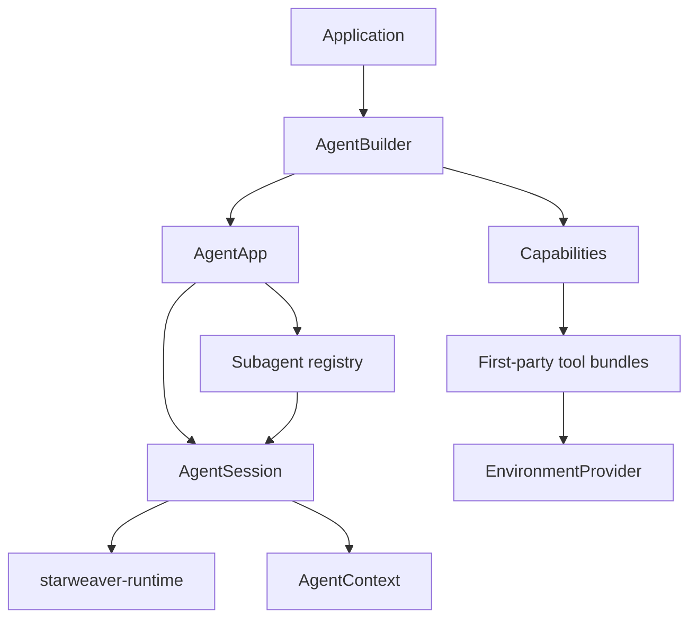

# First-Party Agent SDK

The SDK layer is the application-facing Starweaver product surface. It integrates the core runtime with sessions, presets, environment-backed tool bundles, subagents, skills, media handling, tool proxying, and policy configuration.

The SDK should feel ready to use while remaining extensible for custom models, tools, environments, and service runtimes.

## SDK Layer Shape

## SDK Responsibilities

- Provide ergonomic builders over the core runtime.
- Provide application sessions with context export/restore.
- Provide policy presets for model, tools, approval, output, streaming, observability, and durability.
- Assemble first-party capability bundles and toolsets.
- Bind environment providers to filesystem, shell, process, resource, and sandbox tools.
- Keep environment-backed bundles implementation-neutral so local, virtual,
  envd-backed, sandbox, and composite providers can share the same tool surface.
- Treat envd as a standalone service/protocol consumed through an SDK adapter,
  not as the SDK environment layer itself.
- Load serializable subagent and skill specs.
- Provide unified delegation and lifecycle events.
- Expose docs and examples for application developers.

## Reference Feature Families

| Feature family       | Starweaver SDK target                                     |
| -------------------- | --------------------------------------------------------- |
| agent construction   | `AgentBuilder` and `AgentApp`                             |
| streaming            | `AgentSession::run_stream` and service streams            |
| context              | `starweaver-context::AgentContext`                        |
| resumable state      | `AgentSession::export_state` and `session_from_state`     |
| lifecycle extensions | capabilities and runtime hooks                            |
| policy filters       | capability bundles with context-aware hooks               |
| environment          | `EnvironmentProvider` and environment-backed tool bundles |
| subagents            | `SubagentSpec`, registry, delegation lifecycle            |
| notes/tasks/bus      | context stores and first-party tool bundles               |
| skills               | serializable skill specs and tool bundles                 |
| tool proxy           | first-party proxy toolset features                        |
| Python SDK           | `starweaver-py` in-process bindings and Python tools      |
| observability        | OTel GenAI spans, Langfuse metadata, trace propagation    |

## Python SDK Subspecs

The Python SDK product and architecture contract lives under `python/`:

- `python/README.md` - Python SDK product thesis, current baseline, invariants, and review order
- `python/01-product-boundary.md` - package ownership, dependency rules, provider boundary, and release shape
- `python/02-concept-mapping.md` - public Python API contract and mapping to Rust seams
- `python/03-python-tool-injection.md` - Python tools, callback runtime, schema/result conversion, and cancellation
- `python/04-runtime-session-streaming.md` - agents, sessions, live runs, streams, state restore, HITL, and output
- `python/05-ecosystem-and-claw.md` - composition layer, environments, resources, observability, and Claw path
- `python/06-roadmap-and-validation.md` - current baseline, milestones, acceptance gates, open decisions, and validation
- `python/07-pythonic-control-plane.md` - active-run steering, interruption, message bus, typed HITL, and required Rust seam
- `python/08-session-store-and-state.md` - durable Python session-store contract, state boundaries, record wrappers, and restore
- `python/09-advanced-composition.md` - runtime config, toolsets, tool search/proxy, skills, environments, resources, media, providers, and product adapters
- `python/10-claw-python-runtime-plan.md` - Claw-like Python product runtime plan, Rust-to-Python binding gaps, and execution mapping
- `python/11-python-native-toolsets.md` - Python-native toolset builder design, Rust-backed wrappers, lifecycle, and durability

## SDK Acceptance Gates

- docs examples compile
- SDK session tests pass
- subagent lifecycle tests pass
- environment provider fakes cover file and shell operations
- first-party tool bundles register through capabilities
- runtime kernel behavior remains owned by core crates
