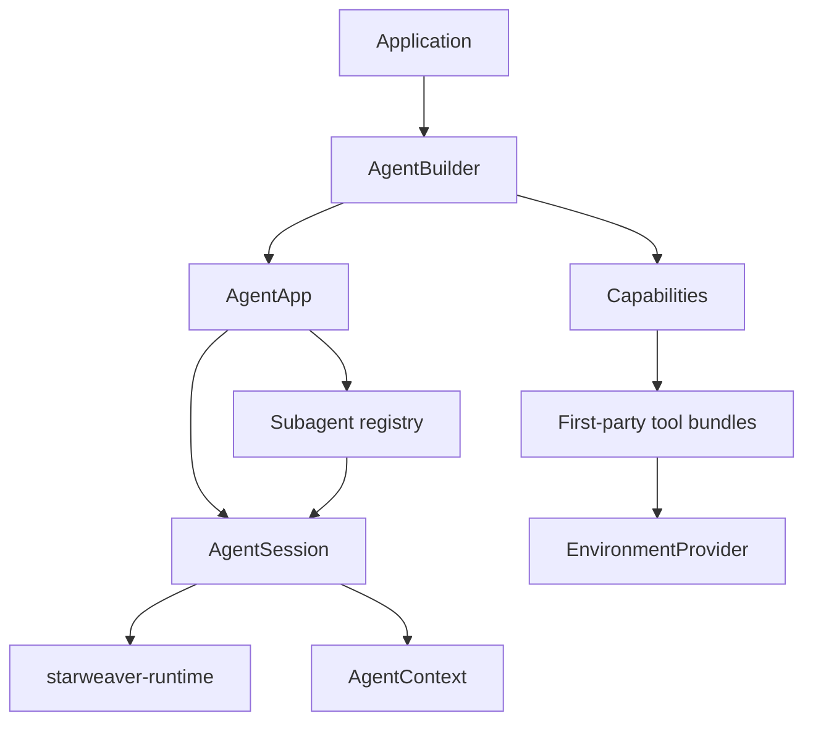

# First-Party Agent SDK

The SDK layer is the application-facing Starweaver product surface. It integrates the core runtime with ya-agent-sdk-style conveniences: sessions, presets, environment-backed tool bundles, subagents, skills, media handling, tool search, and policy configuration.

The SDK should feel ready to use while remaining extensible for custom models, tools, environments, and service runtimes.

## SDK Layer Shape

## SDK Responsibilities

- Provide ergonomic builders over the core runtime.
- Provide application sessions with context export/restore.
- Provide policy presets for model, tools, approval, output, streaming, and durability.
- Assemble first-party capability bundles and toolsets.
- Bind environment providers to filesystem, shell, process, resource, and sandbox tools.
- Load serializable subagent and skill specs.
- Provide unified delegation and lifecycle events.
- Expose docs and examples for application developers.

## Reference Feature Families

The SDK maps ya-agent-sdk concepts into Rust-native surfaces:

| ya-agent-sdk family  | Starweaver SDK target                                     |
| -------------------- | --------------------------------------------------------- |
| `create_agent`       | `AgentBuilder` and `AgentApp`                             |
| `stream_agent`       | `AgentSession::run_stream` and service streams            |
| `AgentContext`       | `starweaver-context::AgentContext`                        |
| resumable state      | `AgentSession::export_state` and `session_from_state`     |
| lifecycle extensions | capabilities and runtime hooks                            |
| filters              | capability bundles with context-aware hooks               |
| environment          | `EnvironmentProvider` and environment-backed tool bundles |
| subagents            | `SubagentSpec`, registry, delegation lifecycle            |
| notes/tasks/bus      | context stores and first-party tool bundles               |
| skills               | serializable skill specs and tool bundles                 |
| tool search/proxy    | first-party toolset features                              |

## SDK Acceptance Gates

- docs examples compile
- SDK session tests pass
- subagent lifecycle tests pass
- environment provider fakes cover file and shell operations
- first-party tool bundles register through capabilities
- runtime kernel behavior remains owned by core crates
