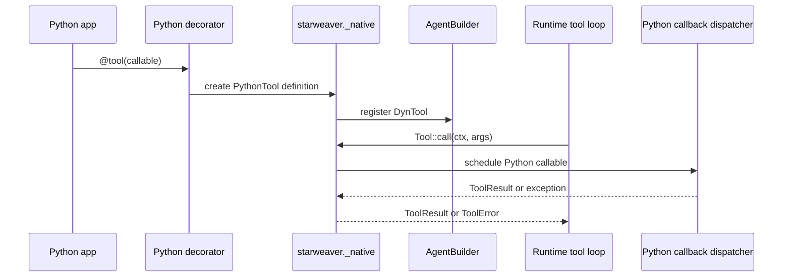

# Python Tool Injection

Python tool injection is the central requirement for `starweaver-py`. A Python
function or class must become a real Rust `Tool` implementation in the same
process.

The runtime must see Python tools exactly as Starweaver tools so retries,
approval, deferred execution, stream events, usage evidence, tracing, and
durable state remain native.

## Tool Adapter Shape

`PythonTool` should implement `starweaver_tools::Tool` and store:

- stable name
- description
- parameters JSON schema
- optional return JSON schema
- metadata
- strict mode
- sequential flag
- timeout and retry metadata
- availability callback
- prepare-definition callback
- user-input preprocessor callback
- Python callable handle
- Python callback dispatcher handle

The implementation should follow the same conceptual shape as `FunctionTool`:
a provider-neutral function definition plus a call path that converts model
arguments into validated input and returns a `ToolResult`.

## Registration Flow



## Schema Extraction

Schema extraction order:

1. Explicit JSON schema supplied to `tool(..., parameters_schema=...)`.
2. Explicit Pydantic `BaseModel` argument schema.
3. Python type hints mapped into JSON schema for simple primitives.
4. Reject registration with a schema error when schema inference is ambiguous.

The P0 implementation should prefer explicit failure over lossy inference. A
tool that accepts `Any`, nested arbitrary objects, or untyped `**kwargs` should
require an explicit schema.

Supported P0 argument shapes:

- `(ctx: ToolContext, args: PydanticModel)`
- `(args: PydanticModel)`
- `(ctx: ToolContext, **json_fields)` only if explicit JSON schema is supplied
- subclassed `BaseTool.call(ctx, args)`

Rejected P0 argument shapes:

- untyped positional varargs
- implicit schema from arbitrary Python classes
- schema derived from docstring text alone
- mixed positional fields without a Pydantic model or explicit schema

## Return Conversion

Return conversion order:

1. `ToolResult`
2. Pydantic model
3. JSON-serializable dict/list/string/number/bool/null
4. Reject with `ToolError::Execution` if the value is not serializable

`ToolResult` should expose Python fields that correspond to the Rust result:

- `content`
- `metadata`
- `app_value`
- `model_content`
- `user_content`
- `private_metadata`

The default conversion should keep user-visible and model-visible content
separate. Python tracebacks and local debug details belong in private metadata,
not in model-visible tool content.

## Exception Mapping

| Python exception                                | Rust `ToolError`   |
| ----------------------------------------------- | ------------------ |
| `InvalidArguments` or Pydantic validation error | `InvalidArguments` |
| `ModelRetry`                                    | `ModelRetry`       |
| `ApprovalRequired`                              | `ApprovalRequired` |
| `CallDeferred`                                  | `CallDeferred`     |
| `asyncio.CancelledError`                        | `Cancelled`        |
| `TimeoutError`                                  | `Timeout`          |
| other `Exception`                               | `Execution`        |

This mapping is required in both directions:

- Python API boundary: Rust errors become Python exceptions.
- Tool-loop boundary: Python tool exceptions become Starweaver `ToolError`
  variants.

## HITL And Deferred Control Flow

Python tools should raise public exceptions for control flow:

```python
from starweaver import ApprovalRequired, CallDeferred


async def deploy(ctx, args):
    raise ApprovalRequired(reason="Production deployment")


async def long_job(ctx, args):
    raise CallDeferred(reason="Job queued", metadata={"queue": "deploy"})
```

The Rust runtime should record the same approval/deferred evidence it records
for Rust tools. Python should not maintain a separate pending-approval store.

## Async Runtime And GIL Strategy

The difficult part is safely moving between Python asyncio, PyO3, and Tokio.

Required constraints:

- Python callers should use `await agent.run(...)` and `async for ...` without
  managing a Tokio runtime directly.
- Rust network/model/runtime work must not hold the GIL.
- Python callables must execute on the Python event loop that owns them.
- Cancellation must flow from `AgentStreamHandle::interrupt()` and
  `ToolContext` cancellation into Python tasks.
- Python exceptions must preserve enough traceback detail for debugging while
  redacting tool-private metadata from model-visible content.

Recommended design:

1. `starweaver-py` owns a Tokio runtime handle or attaches to an existing one
   inside the extension crate.
2. The Python API returns awaitables backed by Rust futures.
3. Each `Agent` captures a Python event loop handle at construction or first
   use.
4. `PythonTool::call` schedules the Python callable onto that loop through a
   dispatcher and awaits the result from Tokio.
5. GIL sections are limited to object conversion, scheduling, and result
   extraction.
6. The dispatcher owns cancellation links between Starweaver cancellation
   tokens and Python tasks.

Open implementation decision:

- Use `pyo3-async-runtimes` for future/awaitable conversion where it fits.
- Still keep a small explicit `PythonCallbackDispatcher` abstraction because
  tool callbacks, cancellation, traceback capture, and event-loop ownership are
  Starweaver-specific.

## Cancellation

Cancellation must be observable from Python tools:

- `ctx.is_cancelled`
- `await ctx.cancelled()`
- cancellation of the Python `asyncio.Task` when Starweaver interrupts a run
- mapping `asyncio.CancelledError` to `ToolError::Cancelled`

P0 should test cancellation with a Python tool that blocks on an asyncio event
and is interrupted by the Starweaver stream/session handle.

## Concurrency Policy

Default policy:

- P0 Python tools default to `sequential=True`.
- Async Python tools may opt into parallel execution only after dispatcher tests
  prove no GIL, event-loop, or state-sharing hazards.

The `sequential` flag should map to the existing Starweaver tool contract so the
runtime can schedule mixed Rust and Python tools consistently.

## Test Matrix

P0 tests should cover:

- async Python tool success
- sync Python tool success
- Pydantic argument validation
- explicit JSON schema registration
- invalid schema rejection
- non-serializable return rejection
- `ToolResult` conversion
- ordinary Python exception to `ToolError::Execution`
- `ModelRetry`
- `ApprovalRequired`
- `CallDeferred`
- timeout
- cancellation
- sequential scheduling
- traceback capture in private metadata

These tests should run against deterministic Starweaver test models and should
not require live provider credentials.
