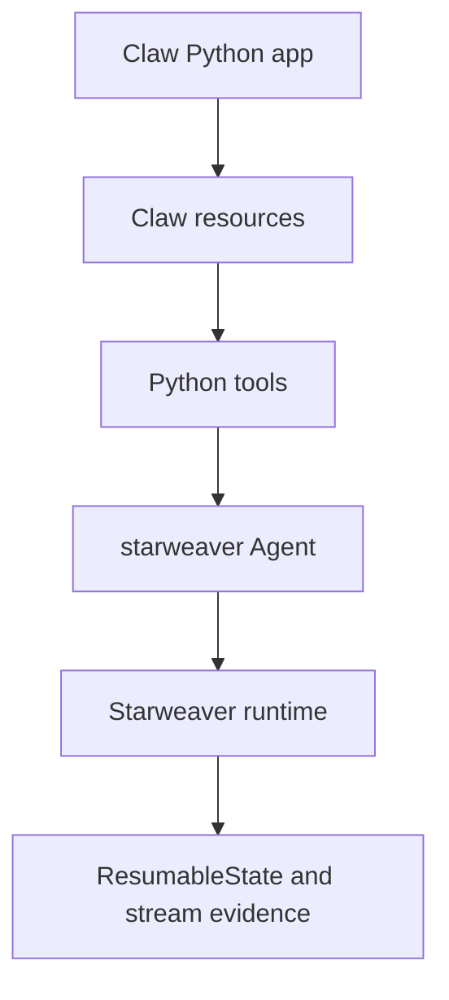

# Ecosystem Integration And Claw

This spec covers the surrounding SDK features that should become visible from
Python after the minimal in-process agent and tool-injection path is stable.

## Toolsets, Hooks, And Dynamic Discovery

P0 should include:

- `Toolset(name, tools=[...], instructions=[...])`
- Python subclassable `BaseToolset`
- static toolset registration on `create_agent(...)`
- per-run extra tools and toolsets through `RunOptions`
- toolset instructions surfaced through the Rust `Toolset` contract

P1 should include:

- `prepare`, `enter`, and `exit` lifecycle methods
- pre-tool and post-tool hooks
- global tool execution hook registration
- tool filtering, renaming, approval, deferred, and proxy wrappers mapped to
  existing Starweaver toolset wrappers
- dynamic tool search helpers over the Starweaver tool proxy surface

Tool hooks should integrate with Starweaver capability and runtime hook
contracts rather than creating a separate Python-only middleware system.

## Subagents

Python should expose Starweaver subagent concepts because Claw will need
composable agents, delegated work, and nested coordination.

P0:

- `SubagentConfig`
- `create_agent(..., subagents=[...])`
- named subagent registration
- inherited tools policy
- default unified delegation tool

P1:

- nested delegation stream evidence
- subagent lifecycle event classes
- child session restore and cancellation propagation
- worker-mode behavior for service runtimes
- subagent model/settings/config overrides aligned with Starweaver config

The Python package should not define a second subagent protocol. It should wrap
`SubagentSpec`, SDK registry behavior, and Starweaver delegation tools.

## Skills

P0:

- list skills from configured provider-visible paths
- load a Starweaver skill package
- expose skill-provided instructions and tool summaries
- attach skill toolsets to an agent

P1:

- skill hot reload at request boundaries
- skill activation telemetry
- exact precedence tests for user/project/tool-specific roots
- remote skill registry sync after local behavior stabilizes

The Python package should not parse a second, incompatible skill format.
Python helpers should wrap Starweaver skill registry behavior.

## Environments

P0 should expose Rust-owned environment providers:

- virtual provider for tests
- local provider for workspace operations
- environment-backed filesystem and shell bundles where policy permits
- resource references in input and tool results

P1 can add Python-defined providers:

- `PythonEnvironmentProvider`
- Python file/resource read/write/list/glob/grep methods
- Python process/shell extension only after cancellation and policy semantics
  are specified
- resumable resource registry integration

Environment-backed bundles should keep using Starweaver policy. Python should
configure provider bindings and policies, not bypass them.

## Resources

For Claw, the first useful integration can be simple:

- Claw owns product resources in Python.
- Claw injects those resources as Python tools and Starweaver resource refs.
- Starweaver runs the agent loop and records native tool/session evidence.

Deeper resource provider integration can follow once Claw's resource lifecycle
and restore requirements are concrete.

Candidate progression:

1. Python tools return JSON and resource refs.
2. Python tools read/write Claw-owned resources through Claw APIs.
3. Starweaver environment providers expose resource refs to model input and
   tool results.
4. Python-defined environment providers implement Starweaver resource contracts.
5. Store-backed resource restore lands after session restore needs are proven.

## Message Bus, Notes, Tasks, And State

Python should provide thin facades over context stores:

- `ctx.state.get/set`
- `ctx.metadata`
- `ctx.notes.add/list`
- `ctx.messages.send/consume`
- `ctx.tasks.create/update/list` where the Rust task manager is available

These APIs should preserve Starweaver idempotency and run/session scoping. The
Python facade should not bypass `AgentContext` to store hidden process-local
state unless the value is explicitly registered as a non-serializable
dependency.

## Observability And Usage

P0:

- expose run id, session id, conversation id, and trace context
- expose usage snapshots on results and stream events
- include Python tool traceback details in private/debug metadata

P1:

- Python logging bridge
- OTel exporter convenience configuration
- Langfuse-friendly metadata helpers
- redaction policy for Python exception details and tool private metadata

## Claw Integration Path

The first Claw integration should be intentionally narrow:

P0 Claw scenario:

- Claw imports `starweaver`.
- Claw creates an agent with Starweaver test or registry model.
- Claw injects one or more Python tools.
- Starweaver runs the tool loop in process.
- Claw stores exported state.

P1 Claw scenario:

- Claw streams events into its UI.
- Claw handles approvals through `resume_after_hitl`.
- Claw exposes product resources as resource refs.
- Claw uses subagents for delegated workflows.

P2 Claw scenario:

- Claw connects store-backed sessions and stream archives.
- Claw integrates environment providers or sandbox resources.
- Claw exposes observability and usage from Starweaver records.

## Integration Risks

- Python resource lifetimes may not match Starweaver resumable state lifetimes.
- Python callbacks can hide process-local state that cannot be restored.
- Claw approval UI must preserve Starweaver approval ids and decisions.
- Resource refs need clear trust and access policies before model-visible use.
- Observability must avoid leaking private Python traceback content.
