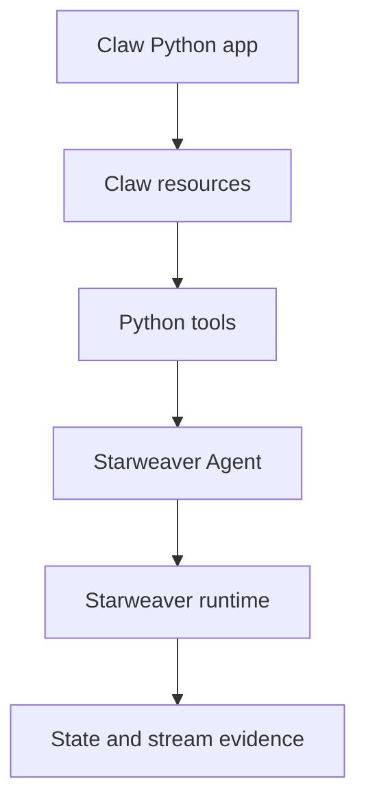

# Composition, Ecosystem, And Claw Integration

This spec covers Python SDK features around the core agent/tool/session path:
capability bundles, toolsets, subagents, skills, environments, resources,
message bus, observability, and Claw integration.

## Current Baseline

The current package already includes:

- `CapabilityBundle`
- static bundle instructions
- bundle tools
- bundle model settings
- bundle request params
- bundle output validators
- bundle output functions
- `Subagent`
- native delegation tools from Starweaver subagent registration
- provider model helpers
- deterministic test models

The next work should deepen composition without inventing Python-only
equivalents of Starweaver SDK contracts.

`09-advanced-composition.md` is the general contract for the advanced facades in
this area: runtime config, toolsets, tool library/search/proxy, skills,
environments, resources, media upload, stream adapters, provider auth, and
product runtime adapters.

`10-claw-python-runtime-plan.md` is the implementation plan for a Claw-like
Python product runtime on top of `starweaver-py`.

`11-python-native-toolsets.md` is the detailed contract for the next Pythonic
toolset authoring layer.

## Capability Bundles

`CapabilityBundle` is the current Python composition primitive.

It packages:

- instructions
- tools
- model settings
- request params
- output validators
- output functions

Rules:

- Bundles are static composition objects.
- They should map to SDK capability bundle contracts.
- Python callbacks inside bundles follow the same callback runtime rules as
  tools and output functions.
- Hook-level capabilities should not become public until there is a typed
  Python hook contract.

## Toolsets

Python has the initial static toolset layer. The next layer should make toolset
authoring feel native to Python without creating a Python-only tool runtime.

Target surface:

```python
toolset = Toolset(
    "workspace",
    tools=[read_file, write_file],
    instructions=["Use workspace paths exactly."],
)

agent = create_agent(model=model, toolsets=[toolset])
```

P0 toolset scope:

- name
- tools
- instructions
- static registration
- per-run toolsets
- conversion into Starweaver `Toolset`

Later scope:

- async enter/exit lifecycle
- prepare hooks
- dynamic discovery
- tool filtering and renaming
- approval/deferred wrappers
- proxy wrappers
- environment-backed toolsets

Toolsets should integrate with Starweaver capability/runtime hook contracts,
not a Python-only middleware stack.

The detailed builder, wrapper, lifecycle, dynamic-factory, and durability rules
live in `11-python-native-toolsets.md`.

Tool search and tool proxy are separate follow-on surfaces. Search mutates the
visible tool set by loading selected tools or namespaces. Proxy keeps the model
surface stable and routes calls to hidden tools. Both persist IDs/namespaces in
session state, not Python object references.

## Subagents

Python `Subagent` currently wraps Starweaver subagent specs and exposes native
delegation tools through the parent agent.

Rules:

- Python should not define a second subagent protocol.
- Child agents stay normal Python `Agent` facades backed by native runtime
  agents.
- Delegation evidence should remain Starweaver stream/session evidence.
- Inherited tools, nested delegation, denied tools, and capability inheritance
  should map to Starweaver SDK subagent policy.

Future additions:

- child stream attribution helpers
- typed subagent lifecycle stream events
- nested session restore
- cancellation propagation helpers
- service/worker mode helpers for product runtimes

## Skills

Python skill helpers should wrap Starweaver skill behavior.

Target P0:

- list configured skills
- load a skill package
- inspect skill instructions and provided tool summaries
- attach skill-provided toolsets or bundles to an agent

Later:

- request-boundary hot reload
- activation telemetry
- precedence tests for user/project/tool roots
- remote registry sync after local semantics stabilize

Do not parse a second skill format in Python.

## Environments

Environment support should start as wrappers over Rust-owned providers:

- virtual provider for deterministic tests
- local provider for trusted workspace operations
- envd-backed provider where configured
- environment-backed filesystem/shell bundles
- resource refs in input and tool results

Python-defined providers can come later:

- `PythonEnvironmentProvider`
- Python file/resource operations
- Python process/shell extension traits
- resumable resource registry integration

Rules:

- Starweaver policy controls access.
- Python configures provider bindings and policies; it does not bypass them.
- `allowed_paths` is a capability boundary.
- `instructions_paths` is a model-context/file-tree boundary.
- Model-facing paths should be virtual POSIX paths.
- Process handles and local resources must not be represented as portable
  session state unless the Rust environment contract supports it.

## Resources

Resource integration should progress from simple to durable:

1. Python tools return JSON and Starweaver resource refs.
2. Python tools read/write product resources through product APIs.
3. Environment providers expose resource refs to model input and tool results.
4. Python-defined providers implement Starweaver resource contracts.
5. Store-backed resource restore lands when product requirements are concrete.

Claw should be able to start with Python tools over Claw-owned resources before
waiting for a full provider abstraction.

Resource lifecycle belongs to the environment/provider. Agent context stores
references and resumable records only when a resource explicitly supports
restore through a provider/factory contract.

## Message Bus

The message bus is coordination state, not a generic UI event stream.

Python should expose:

- `BusMessage`
- `MessageBus.send`
- `MessageBus.steer`
- `MessageBus.peek`
- `MessageBus.consume`
- `MessageBus.subscribe`
- `MessageBus.unsubscribe`

Semantics must preserve:

- stable message ids
- idempotent sends
- source
- target
- topic metadata
- template
- metadata
- subscriber cursors
- bounded retention

Idle session message writes can mutate stored session context. Active run
writes must go through the active run control handle described in
`07-pythonic-control-plane.md`.

## Observability And Usage

Python should expose observability as typed evidence, not ad hoc logs.

Current useful fields:

- run id
- conversation id
- run step
- status
- metadata
- raw state
- raw stream records

Target helpers:

- usage snapshots on results and stream events
- trace ids
- span correlation ids
- Python logging bridge
- OTel exporter convenience configuration
- Langfuse-friendly metadata helpers
- redaction policy for traceback/private metadata
- stream replay/display adapter helpers

Private Python traceback content must not appear in model-visible content,
stream previews intended for users, or provider requests.

## Claw Integration Path

First useful Claw shape:



P0 scenario:

- Claw imports `starweaver`.
- Claw creates an agent with a deterministic or provider model.
- Claw injects Python tools over product resources.
- Starweaver runs the tool loop in process.
- Claw stores exported session state.

P1 scenario:

- Claw streams events into its UI.
- Claw handles approvals through typed HITL helpers.
- Claw steers and interrupts active runs through SDK objects.
- Claw exposes product resources as tool returns or resource refs.
- Claw uses subagents for delegated workflows.

P2 scenario:

- Claw connects store-backed sessions and stream archives.
- Claw integrates environment providers or sandbox resources.
- Claw exposes usage and trace evidence in product analytics.

Full Claw parity is a product runtime, not an SDK feature. The detailed plan is
`10-claw-python-runtime-plan.md`; the short rule is:

- `starweaver-py` owns Python facade quality and Rust binding coverage;
- the Claw-like product owns API, database, queue, workflow, schedule, memory,
  agency, bridge, UI, and Docker retention policy;
- canonical restore and replay evidence should come from Starweaver session and
  stream records whenever native bindings exist.

## Host Boundary

`starweaver-rpc` and CLI host control remain important for external hosts,
Desktop, TUI, and process boundaries. They should not be used as the core
Python library path.

When a behavior is useful to both Python and host control, factor it into a
neutral Rust SDK/runtime seam and let both surfaces call it.

Examples:

- active interruption
- active steering
- message-bus injection
- HITL decisions
- recoverable state
- stream replay projection

## Integration Risks

- Python resource lifetimes may not match resumable session lifetimes.
- Python callbacks can hide process-local state that cannot be restored.
- Approval UIs must preserve canonical approval ids and decisions.
- Resource refs need clear trust policy before model-visible use.
- Observability must redact Python tracebacks and private metadata.
- Toolset/environment helpers can grow too broad without concrete call sites.
