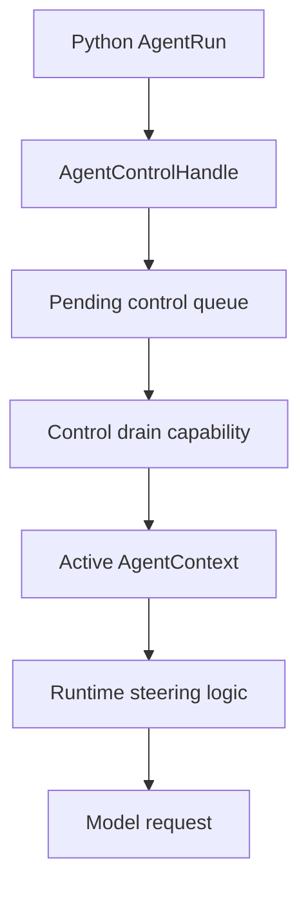

# Pythonic Active-Run Control Plane

This spec defines the Python-facing control plane for live Starweaver runs:
steering, interruption, message-bus writes, typed HITL, and recoverable state.

The goal is not to invent a Python runtime. The goal is to expose Starweaver's
existing and planned control primitives through normal Python async objects.

## Problem

The earlier Python package could stream, interrupt, export recoverable state, and
resume raw HITL, but it did not provide a polished live control API. This spec
captures the implemented control-plane shape and the remaining migration seams.

Implemented product-facing shape:

- `AgentRun` as the public live-run object
- `async with agent.session()`
- `async with session.run_stream(...) as run`
- `await run.steer(...)`
- `await run.messages.send(...)`
- `run.hitl()` typed helper
- `session.messages` facade
- active message injection that reaches the running `AgentContext`

The runtime already has steering semantics through `AgentContext.messages`, and
the CLI already has active-run steering channels. Python needs a neutral SDK
control seam instead of a Python-only workaround.

## Current Evidence

Current seams:

- Python `AgentRun` wraps native `AgentStreamHandle`.
- `AgentRun` is an async iterator and async context manager.
- `AgentStream` remains a compatibility alias for `AgentRun`.
- Exceptional stream exit and Python task cancellation request interruption.
- Native `AgentStreamController` supports interruption and recoverable state.
- `PySession` protects a session with one active operation at a time.
- Result helpers expose pending approval/deferred records as raw dicts and typed
  `PendingApproval`, `PendingDeferred`, `HitlSnapshot`, `ApprovalDecision`, and
  `DeferredResult` helpers.
- `starweaver-context::MessageBus` supports idempotent send, target, source,
  template, metadata, subscriber cursors, consume, and peek.
- Runtime steering consumes bus messages with topic `steering` before model
  requests and before final output completion. `source="user"` is audit
  metadata only and does not trigger steering by itself.
- CLI and RPC each own an independent pending queue and active-run registry; both can drain control messages through the same product-neutral runtime seam.

Implemented seam:

- `starweaver-agent::AgentControlHandle`
- `AgentControlReceipt`
- pending active-control queue
- control drain capability installed on live stream startup
- `steering_submitted` sideband event when queued steering reaches context

Remaining migration work: CLI and RPC active steering can independently adopt the shared drain seam without sharing coordinators, queues, handlers, or product state.

## Target User Shape

```python
async with create_agent(model=model, tools=[deploy]) as agent:
    async with agent.session() as session:
        async with session.run_stream("Deploy api to staging") as run:
            await run.steer("Use the safe rollout path.", id="ui-1")

            async for event in run:
                if event.kind == "suspended":
                    hitl = await run.hitl().snapshot()
                    approvals = [
                        item.approve(decided_by="web-ui")
                        for item in hitl.approvals
                    ]
                    continuation = await run.hitl().resume(approvals=approvals)
                    result = await continuation.result()
                    break

            assert result.output
```

One-off usage remains concise:

```python
async with create_agent(model=model) as agent:
    async with agent.run_stream("Research") as run:
        await run.steer("Prefer code evidence.")
        async for event in run:
            ...
```

## Public Objects

### AgentRun

`AgentRun` is the primary live handle.

```python
class AgentRun:
    async def __aenter__(self) -> AgentRun: ...
    async def __aexit__(self, exc_type, exc, tb) -> None: ...

    def __aiter__(self) -> AsyncIterator[StreamEvent]: ...
    async def recv(self) -> StreamEvent | None: ...
    async def join(self) -> StreamRunResult: ...
    async def result(self) -> RunResult: ...

    async def steer(self, text: str, **options) -> ControlReceipt: ...
    async def send_message(self, message: BusMessage | dict[str, object]) -> ControlReceipt: ...
    def interrupt(self, reason: str | None = None) -> None: ...

    def status(self) -> RunStatusSnapshot: ...
    async def recoverable_state(self) -> dict[str, object]: ...

    @property
    def messages(self) -> MessageBus: ...
    def hitl(self) -> RunHitl: ...
```

`AgentStream` remains as a compatibility alias.

### AgentSession Control

```python
class AgentSession:
    async def steer(self, text: str, **options) -> ControlReceipt: ...
    def interrupt(self, reason: str | None = None) -> None: ...

    @property
    def messages(self) -> MessageBus: ...
    @property
    def active_run(self) -> AgentRun | None: ...
```

Rules:

- `session.steer(...)` targets the active run for that session.
- If no active run exists, default behavior is `StateError`.
- Optional `when_idle="queue"` may enqueue into idle session state.
- Reads from `session.messages` may use stored state or a safe snapshot.
- Writes during an active run must go through the active control handle.

### Agent Convenience

`agent.steer(...)` is optional. If present, it must only work when exactly one
direct active run belongs to that `Agent`. Ambiguity raises `StateError`.

The preferred API is always `run.steer(...)`.

## Message Bus Facade

Python object:

```python
@dataclass(frozen=True)
class BusMessage:
    id: str
    content: object
    source: str = "application"
    target: str | None = None
    topic: str | None = None
    template: str | None = None
    metadata: dict[str, object] = field(default_factory=dict)
```

```python
@dataclass(frozen=True)
class MessageDelivery:
    message: BusMessage
    receipt: ControlReceipt | None = None

    @property
    def active(self) -> bool: ...

    @property
    def queued(self) -> bool: ...
```

Facade:

```python
class MessageBus:
    async def send(
        self,
        content: object,
        *,
        topic: str | None = None,
        source: str = "application",
        target: str | None = None,
        id: str | None = None,
        template: str | None = None,
        metadata: Mapping[str, object] | None = None,
    ) -> MessageDelivery: ...

    async def steer(self, text: str, **options) -> MessageDelivery: ...

    def peek(self, agent_id: str | None = None) -> list[BusMessage]: ...
    def consume(self, agent_id: str | None = None) -> list[BusMessage]: ...
    def subscribe(self, agent_id: str | None = None) -> None: ...
    def unsubscribe(self, agent_id: str | None = None) -> None: ...
```

Return behavior:

- idle session mutation returns `MessageDelivery(message=stored, receipt=None)`
- active run mutation returns `MessageDelivery` with the accepted
  `ControlReceipt`
- generic `send(...)` defaults to `source="application"` so it does not become
  runtime steering by accident
- `peek(...)`, `consume(...)`, `subscribe(...)`, and `unsubscribe(...)` operate
  on the session message-bus snapshot; active-run buses use `send(...)` and
  `steer(...)` for live writes, then inspect messages after the run yields state

`topic` maps to the Rust `starweaver.topic` metadata key unless the core bus
contract grows a first-class topic field.

## Control Receipt

```python
@dataclass(frozen=True)
class ControlReceipt:
    id: str
    kind: Literal["message", "steering", "interrupt"]
    pending_delivery: bool
    delivery_state: Literal["applied", "pending_delivery"]
    run_id: str | None
    session_id: str | None
```

The receipt means the control input was accepted. It does not mean the runtime
has consumed it into a model request. Terminal, suspended, and finalizing runs
must reject new control messages instead of returning `pending_delivery=True`.

Stream evidence should show later consumption:

- optional `steering_submitted` when the control queue drains into context
- existing `steering_received` when runtime consumes steering for the request
- existing `steering_guard` when late steering prevents final completion

## Steering Semantics

Steering flow:

1. Python calls `run.steer(...)`, `session.steer(...)`, or
   `messages.steer(...)`.
2. Python builds a `BusMessage` with topic `steering`, source `user`, and text
   content. The topic is the steering contract; the source is metadata.
3. Native active control queues the message without taking the session busy
   lock.
4. A Rust capability drains queued control messages into the active
   `AgentContext` at request-preparation boundaries and after accepted output
   validation before the final steering guard check.
5. Runtime steering logic consumes the bus message.
6. The model request receives a user prompt named `steering`.
7. Runtime publishes `steering_received`.
8. If final output was already pending, the steering guard schedules another
   model turn.

Steering is append-only context. It does not rewrite prior prompts or provider
request history.

## Required Rust Seam

Add a neutral control primitive in `starweaver-agent` or an equivalent SDK
module:

```rust
pub struct AgentControlHandle {
    // Cloneable and thread-safe.
}

impl AgentControlHandle {
    pub fn interrupt(&self, reason: Option<String>);
    pub fn send_message(&self, message: BusMessage) -> AgentControlReceipt;
    pub fn steer(&self, id: String, text: String) -> AgentControlReceipt;
    pub async fn recoverable_state(&self) -> ResumableState;
}
```

Shape:



The handle integrates with `AgentStreamController`:

- `interrupt` continues to use the cancellation token.
- `recoverable_state` continues to read latest observed context.
- `send_message` and `steer` enqueue active control messages.
- stream startup installs the drain capability.

The drain capability must remain product-neutral. CLI active-run and display state stay in `starweaver-cli`; RPC active-run state and payload mapping belong to `starweaver-rpc` and `starweaver-rpc-core`. Only the control queue/drain runtime contract is shared.

## Why Snapshot Mutation Is Wrong

During a live stream, Rust runs with an active context owned by the producer
task. The stream observer keeps a latest-context snapshot for recovery.

Mutating `PySession.inner` or the latest snapshot would not guarantee that the
running loop observes a new message. It can also fight the session busy lease.

Therefore live control must enter the active loop through a queue drained with
access to the active `&mut AgentContext`.

## HITL Facade

Typed objects:

```python
@dataclass(frozen=True)
class PendingApproval:
    id: str
    tool_call_id: str
    tool_name: str
    arguments: dict[str, object]
    metadata: dict[str, object]

    def approve(self, **metadata) -> ApprovalDecision: ...
    def deny(self, reason: str, **metadata) -> ApprovalDecision: ...


@dataclass(frozen=True)
class PendingDeferred:
    id: str
    tool_call_id: str
    tool_name: str
    metadata: dict[str, object]

    def complete(self, value: object, **metadata) -> DeferredResult: ...
    def fail(self, error: str, **metadata) -> DeferredResult: ...
    def cancel(self, reason: str | None = None, **metadata) -> DeferredResult: ...
```

`RunResult` exposes both raw and typed views:

- `pending_approvals`
- `pending_deferred`
- `approvals`
- `deferred`
- `hitl`

`RunHitl` should bind to the owning run/session:

```python
hitl = await run.hitl().snapshot()
continuation = await run.hitl().resume(approvals=[hitl.approvals[0].approve()])
result = await continuation.result()
```

`run.hitl().snapshot()` is only valid after the stream has yielded a
`suspended` event. It may join that already-suspended stream to obtain the
canonical waiting result; it should not silently consume an arbitrary active
stream just to inspect speculative HITL state.

`run.hitl().resume(...)` resumes through the owning session and returns a live
continuation `AgentRun` only while that session is still alive in the current
process. The original suspended run remains the evidence for the suspended
stream. `run.hitl().resume_collected(...)` keeps the compatibility shape for
callers that need a collected `RunResult`; in that mode `run.join().events`
remains the original suspended stream record list because the resumed execution
is not the same stream handle.

Durable recovery must not depend on the live run object. Product runtimes should
store the HITL decision evidence and resume by `session_id` and `run_id` through
the durable runtime/store contract.

Explicit resume remains visible. Helper methods build decisions; they should
not secretly resume work as a side effect.

## Concurrency Rules

- One `AgentSession` has at most one active run by default.
- Multiple concurrent conversations use multiple sessions.
- `Agent.run_stream(...)` may allow concurrent ephemeral sessions.
- `agent.steer(...)` rejects ambiguous active runs.
- `run.steer(...)` is safe from any Python task while the run is active.
- Message order follows enqueue order per run.
- Duplicate message ids preserve MessageBus idempotency after drain.
- Terminal, suspended, and finalizing runs reject new control input.
- Idle session steering raises unless explicitly queued.

## Error Rules

Control APIs raise:

- `StateError` for no active run, ambiguous run, terminal run, unknown HITL
  item, duplicate decision, or missing decision
- `StreamError` for producer failure, join failure, or receiver closure
- `Cancelled` or `asyncio.CancelledError` when the caller cancelled the run
  depending on API boundary
- `AgentError`, `ModelError`, or `ToolError` for runtime failures

Accepted control input returns `ControlReceipt`. Important failures should not
be represented as `False` or `None`.

## Validation Plan

Rust tests:

- control handle queues steering without session lock
- drain capability injects messages before the next model request
- late steering triggers steering guard
- late steering during output validation drains before finalization
- suspended streams reject new control input
- duplicate steering ids are idempotent after drain
- interruption cancels model streaming and running tools
- recoverable state includes repaired dangling tool calls
- CLI can migrate to shared drain semantics without behavior change

Python tests:

- `async with agent.session()` creates and closes a session cleanly
- `async with session.run_stream(...) as run` joins on normal exit
- exceptional run context exit interrupts
- cancelling `recv`, `join`, or `result` interrupts
- `await run.steer("...")` returns `ControlReceipt`
- stream later yields steering evidence
- custom stream events expose `sideband_kind` without raw JSON parsing
- `await session.steer("...")` targets active session run
- `await session.steer("...", when_idle="queue")` stores idle session steering
- `await agent.steer("...")` targets exactly one direct active run and rejects
  zero-run or ambiguous states
- `session.messages.send(...)` preserves message fields in exported state
- `run.messages.steer(...)` reaches active runtime context
- typed approval resume works
- typed deferred resume works
- raw dict HITL resume remains supported

Repository gates:

```bash
cargo test -p starweaver-agent --locked
cargo test -p starweaver-runtime --test context --locked
uv run pytest packages/starweaver-py/tests
make py-check
make fmt-check
make check
make test
git diff --check
```

## Acceptance Criteria

This control plane is complete when:

- Python can steer an active stream from another task.
- Steering reaches the active runtime context.
- Python can interrupt live model streaming or a running Python tool.
- Recoverable state is available after interruption.
- Python applications can send and inspect message-bus records without parsing
  raw state.
- HITL can be resolved through typed helper objects.
- Raw state, raw stream records, and raw HITL dicts remain available.
- The implementation uses Starweaver-native Rust contracts.
- The in-process Python path does not depend on `sw`, `starweaver-rpc`,
  JSON-RPC host control, or MCP.
