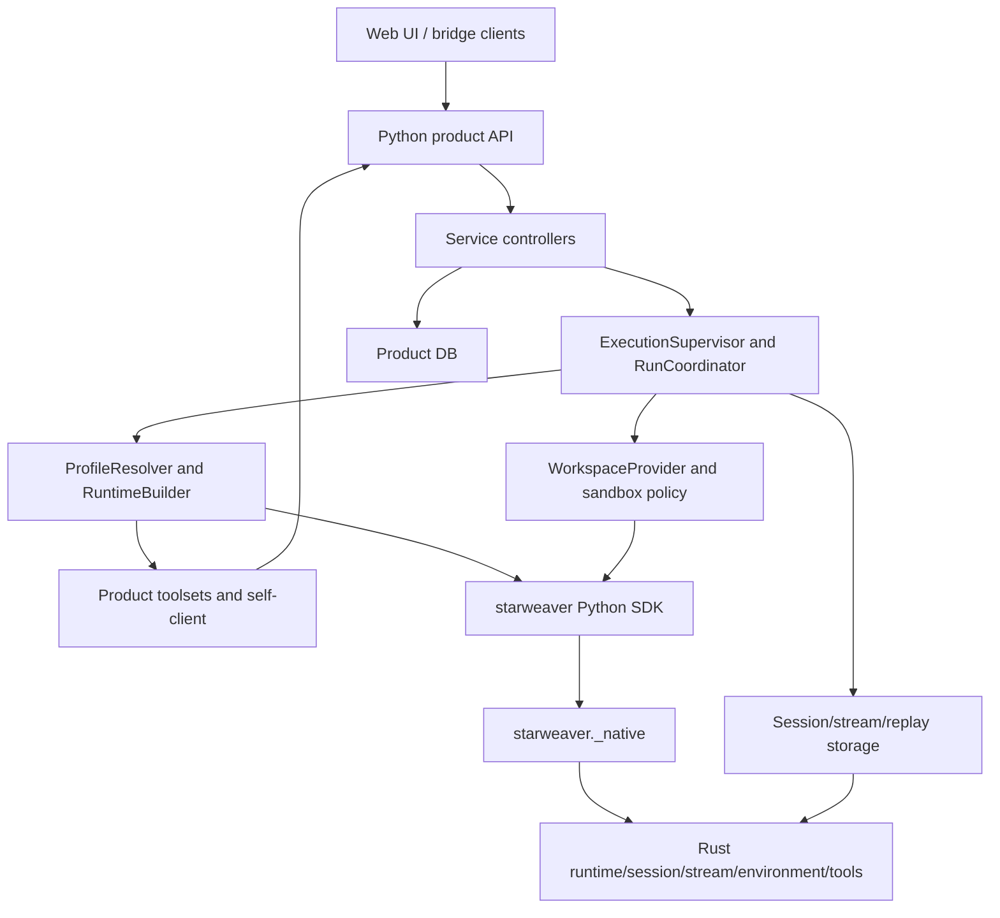

# Claw Runtime Replication With Starweaver Python

This spec turns the source review of `ya-mono/packages/ya-claw` into an
implementation plan for a Claw-like Python product built on `starweaver-py`.

It is intentionally placed under the Python SDK specs because the product
runtime depends on the Python binding quality. The product code still belongs
above `starweaver-py`: service API, database schema, scheduler, workflow,
memory, agency, bridge, web UI, and Docker retention policy must not become
SDK behavior.

## Verdict

Current `starweaver-py` can replicate the agent execution kernel, but it cannot
replicate all of ya-claw by itself.

Directly usable today:

- `create_agent(...)`
- `Agent`, `AgentSession`, and `AgentRun`
- `AgentSession.run_stream(...)`
- `AgentRun.steer(...)`
- `AgentRun.send_message(...)`
- `AgentRun.interrupt(...)`
- `AgentRun.recoverable_state()`
- `AgentSession.export_full_state()`
- `Agent.session_from_state(...)`
- typed HITL approval and deferred-result helpers
- Python tools and first-party toolsets
- `Toolset`, `ToolLibrary`, `ToolSearchToolset`, and `ToolProxyToolset`
- local and virtual `EnvironmentProvider`
- in-memory and JSON session-store facades

Required before a faithful product replica:

- native SQLite storage and replay bindings;
- product database schema and migrations;
- Python service coordinator and durable queue semantics;
- runtime instance claim and recovery semantics;
- Claw-compatible API and SSE event replay;
- workspace binding and sandbox lifecycle;
- profile resolver and runtime builder;
- product toolsets over a service self-client;
- memory, agency, schedule, workflow, heartbeat, bridge, and web UI product
  layers.

## Reviewed Source Map

The plan is based on the ya-claw source structure below. The implementation
does not copy code directly; it maps behavior to Starweaver-owned contracts.

| Ya-claw area          | Main source shape                                               | Starweaver mapping                                                                                 |
| --------------------- | --------------------------------------------------------------- | -------------------------------------------------------------------------------------------------- |
| app lifecycle         | FastAPI app factory, lifespan, auth, static UI, dispatchers     | Python product service over `starweaver-py`                                                        |
| settings              | Pydantic settings, data dirs, DB URL, workspace backend, bridge | product config, not SDK config                                                                     |
| ORM schema            | profiles, sessions, runs, schedules, workflows, bridge, HITL    | product tables plus native session/stream blobs                                                    |
| run store             | `state.json` and `message.json` artifacts                       | native full `ResumableState`, stream archive, replay log, plus compatibility projections if needed |
| profile resolver      | DB/YAML profile to model, tools, MCP, subagents, policy         | Python resolver that builds `ProviderModel`, `Toolset`, `Subagent`, `EnvironmentProvider`          |
| runtime builder       | `create_agent(...)`, context kwargs, self-client, system prompt | `starweaver.create_agent(...)`, runtime config, toolsets, resources, injected instructions         |
| execution supervisor  | queued claim, active handles, startup recovery, shutdown        | Python product coordinator using `AgentSession` and native store bindings                          |
| run coordinator       | environment, restore, stream loop, checkpoint, HITL, commit     | Python coordinator over `AgentRun`, `recoverable_state`, HITL helpers, stream adapter              |
| session controller    | idle/queued/running submit semantics and fork                   | product state machine over session/run records                                                     |
| workspace provider    | local/docker binding, virtual paths, sandbox metadata           | product workspace model plus Rust environment providers                                            |
| toolsets              | self-client, background, async tasks, session, schedule         | Python `FunctionToolset`/native toolsets that call product services                                |
| memory and agency     | internal sessions, fire queues, workspace memory files          | product state machines using Starweaver sessions                                                   |
| schedule and workflow | timer dispatchers and DAG executor                              | product dispatchers and run orchestration                                                          |
| bridge and web UI     | Lark adapter, HITL actions, web console                         | product adapters over the same API/event contract                                                  |

## Target Architecture



The product layer owns:

- HTTP routes and DTOs;
- SQLAlchemy or equivalent product tables;
- service authentication and CORS;
- runtime instance records;
- scheduler loops;
- workflow, memory, agency, and bridge behavior;
- workspace policy, Docker retention, and UI-specific event projections.

`starweaver-py` owns:

- Python facade objects;
- callback registration;
- native tool/toolset conversion;
- native session and stream storage bindings;
- typed state, stream, HITL, and environment helper objects;
- adapters that project canonical Starweaver evidence without changing it.

Rust owns:

- model request preparation;
- tool scheduling and retries;
- tool approval/deferred control flow;
- session state serialization;
- stream and replay record contracts;
- environment policy enforcement;
- usage and trace primitives.

## Required Rust To Python Bindings

### Storage And Replay

Expose native storage as Python facade classes:

```python
store = SqliteSessionStore("claw.db")
replay = SqliteReplayEventLog("claw.db")
archive = SqliteStreamArchive("claw.db")
await store.migrate()
```

Required APIs:

- open by path or URL;
- run migrations and report migration status;
- save/load sessions and runs;
- append/load checkpoints;
- append/replay stream records by cursor;
- append/replay display messages;
- append/load approvals and deferred tool records;
- expose raw record dictionaries for forward compatibility;
- map storage errors to stable Python exceptions.

Rules:

- Python does not duplicate Rust migrations.
- Python can add product tables in its own Alembic migration chain.
- Native session/stream records remain canonical evidence.
- AG-UI compatibility, if required, is a projection over canonical records.

### Session Records And Input Parts

Expose typed wrappers around Rust-owned records:

- `InputPart`
- `SessionRecord`
- `RunRecord`
- `CheckpointRef`
- `ApprovalRecord`
- `DeferredToolRecord`
- `SessionResumeSnapshot`
- session/run status enums

The Python product may add fields such as `session_type`, `source_session_id`,
`trigger_type`, `profile_name`, and `workspace_snapshot` in product tables. It
must not require those fields to become generic SDK session fields.

### Stream Adapters

Expose adapters over `starweaver-stream`:

- raw stream record adapter;
- display-message adapter;
- SSE cursor adapter;
- AG-UI-style adapter;
- replay buffer helper.

Rules:

- raw records are always available;
- cursor order is stable and monotonic;
- unknown record kinds pass through;
- adapters never invent alternate run status.

### Environment Providers

Expose enough environment constructors for Claw-style workspace binding:

- `EnvironmentProvider.local(...)` already exists;
- `EnvironmentProvider.virtual(...)` already exists;
- add `EnvironmentProvider.envd(...)`;
- add composite or switchable providers when Rust supports the policy;
- add `WorkspaceBinding`, `WorkspaceMount`, `VirtualPath`, and `VirtualMount`
  Python value objects;
- expose environment state export/import.

Docker container creation and TTL policy remain product code. The environment
provider binding only gives the product a safe executable environment.

### Toolset And MCP Bindings

Expose Rust toolset wrappers through Python:

- prefix;
- filter;
- rename;
- approval-required;
- deferred;
- prepared;
- lazy or dynamic inventory;
- MCP toolset construction from typed config;
- lifecycle policy and lifecycle reports.

Python product toolsets can be written in Python, but the inventory and
execution path should still be registered as native Starweaver toolsets.

### Runtime Context And Lifecycle

Claw uses context extensions and run lifecycle hooks. The Python binding needs
safe equivalents:

- read-only `ToolsetContext` or `AgentContextView`;
- run/session/profile/source metadata;
- injected instruction tags;
- lifecycle callbacks for run start, model request, HITL suspension, run
  commit, failure, and checkpoint;
- resource reference access;
- current environment access;
- usage and trace snapshots.

The context object must not be a mutable live `AgentContext` escape hatch. It
should expose deliberate operations that map to Rust-owned contracts.

## Python Product Modules

A Claw-like Python product can use this module layout:

```text
starweaver_claw/
  app.py
  config.py
  api/
  controller/
  execution/
  orm/
  workspace/
  toolsets/
  memory/
  agency/
  bridge/
  web/
```

`starweaver-py` should not import this package. The product imports
`starweaver`.

## Service Startup Contract

The product app should provide:

- FastAPI application factory;
- lifespan startup and shutdown;
- API token middleware;
- CORS policy;
- static web fallback;
- database engine/session factory;
- migration command;
- ready/doctor payloads;
- notification hub;
- supervisor startup and shutdown;
- startup recovery before accepting new runs;
- optional bridge supervisor.

Startup order:

01. Load settings and ensure data directories.
02. Open product database and run migrations when configured.
03. Open native session/stream/replay stores.
04. Build in-memory runtime state and notification hub.
05. Build workspace provider and environment factory.
06. Build profile resolver and runtime builder.
07. Register runtime instance.
08. Start execution supervisor and run startup recovery.
09. Start schedule, workflow, heartbeat, memory, agency, and bridge dispatchers.
10. Mark service ready.

Shutdown order reverses startup and interrupts or drains active runs according
to product policy.

## Product Database Contract

Product tables should stay product-owned:

- profiles;
- sessions with `session_type`, profile, source, and workspace metadata;
- runs with trigger type, dispatch mode, status, restore source, claim fields;
- runtime instances;
- HITL batches and interactions;
- async tasks;
- memory state;
- agency fires;
- schedules and schedule fires;
- workflow definitions, runs, node runs, and events;
- heartbeat fires;
- bridge conversations, bridge events, and bridge HITL messages.

Native storage should hold:

- full `ResumableState`;
- stream records;
- display messages;
- replay events;
- approval and deferred records;
- checkpoint references.

The product DB can keep denormalized summaries for listing and filtering, but
canonical replay and restore evidence should stay in Starweaver record shapes.

## Runtime Builder Mapping

The product runtime builder resolves a profile into Starweaver objects.

```python
profile = await resolver.resolve(profile_name)
environment = await workspace_factory.environment_for(session, run, profile)
agent = create_agent(
    model=profile.model,
    instructions=profile.instructions,
    model_settings=profile.model_settings,
    request_params=profile.request_params,
    runtime_config=profile.runtime_config,
    tools=profile.inline_tools,
    toolsets=profile.toolsets,
    subagents=profile.subagents,
    skills=profile.skills,
    environment=environment,
)
session_handle = agent.session_from_state(restore_state, environment=environment)
```

Profile resolution owns:

- model constructor;
- model settings and request params;
- runtime config;
- system and dynamic instructions;
- built-in toolset selection;
- product toolset selection;
- MCP toolsets;
- subagents;
- approval and deferred policy;
- workspace backend hint;
- stream resume policy;
- source-kind policy for schedule, workflow, memory, agency, and bridge runs.

## Execution Coordinator

The coordinator is product code. It wraps `AgentSession` and `AgentRun`.

Main algorithm:

01. Open a DB transaction and atomically claim a queued run.
02. Register an active run handle in process memory.
03. Resolve profile, workspace, trigger source, and restore source.
04. Load native resume state or create a new Starweaver session.
05. Build the Starweaver agent and attach the environment.
06. Start `session.run_stream(...)`.
07. For each stream event:
    - append raw record to native replay/archive;
    - append display or AG-UI projection if required;
    - publish SSE notification;
    - checkpoint recoverable state at model boundaries and on suspension.
08. On HITL suspension:
    - persist pending approvals/deferred tools;
    - expose interactions through API;
    - resume with typed decisions or deferred results.
09. On steering:
    - use `AgentRun.steer(...)` or `AgentRun.send_message(...)`;
    - record accepted receipts;
    - let stream evidence prove runtime consumption.
10. On terminal completion:
    - save full state;
    - update product run/session summaries;
    - dispatch memory, agency, async-task, schedule, or workflow follow-ups.
11. On failure or interruption:
    - save recoverable state when available;
    - update terminal status without erasing prior interrupt/cancel reason.
12. Clear the active handle and notify subscribers.

The service must not mutate exported state dictionaries to fake runtime
progress. Runtime progress enters through Starweaver APIs.

## Session Submit State Machine

The product session controller should preserve the ya-claw behavior:

| Session state               | Submit behavior                                     |
| --------------------------- | --------------------------------------------------- |
| no active run               | create a queued run                                 |
| active queued run           | merge input parts and metadata into that queued run |
| active running run          | append input as steering through the active run     |
| active waiting-for-HITL run | create deferred input or HITL response per endpoint |
| terminal run with restore   | create new queued run from selected restore point   |
| fork request                | create child session with explicit restore source   |

The session lock is a product lock. It prevents concurrent submit decisions
from creating two active runs for the same conversation.

## Workspace Contract

Workspace binding is a product model over environment providers.

Required value objects:

- workspace binding spec;
- mount spec;
- mount binding;
- virtual path;
- default cwd;
- read-only/read-write policy;
- backend hint;
- sandbox state snapshot;
- generation/fingerprint.

Rules:

- mount IDs are stable;
- default cwd is within a mounted virtual path;
- model-facing paths are virtual POSIX paths;
- host paths do not enter provider requests or durable model semantics;
- workspace snapshots persist on each run;
- Docker container IDs and TTL metadata are product runtime metadata;
- run-scoped containers are used for schedule, workflow, heartbeat, memory, and
  agency internal runs when product policy requires isolation;
- session-scoped containers are used for interactive sessions when policy
  allows reuse.

## Product Toolsets

Each product toolset should be a Python-native toolset registered with
Starweaver:

- self-client toolset;
- session trace and turn tools;
- background delegate tools;
- durable async subagent tools;
- schedule tools;
- workflow tools;
- agency handoff tools;
- memory tools;
- bridge-aware HITL tools where needed.

Rules:

- product tools call product controllers through an in-process client when
  running in the same service;
- HTTP self-client is only required when the toolset crosses a process boundary;
- tool call IDs, approval IDs, and deferred IDs remain canonical;
- product toolsets expose stable IDs for durable execution;
- product toolsets avoid importing web UI concepts.

## Feature Implementation Order

### Phase 0: Binding Prerequisites

Implement and test the missing `starweaver-py` bindings:

1. native SQLite store/replay/archive;
2. typed session/run/input/stream records;
3. stream/display/SSE/AG-UI adapters;
4. envd/composite environment constructors;
5. Python-native function toolset builder and wrappers;
6. MCP toolset config binding;
7. lifecycle/context view binding;
8. usage and trace evidence helpers.

### Phase 1: Minimal Service Runtime

Build the service with:

- settings;
- database;
- app lifecycle;
- auth;
- profiles;
- sessions;
- runs;
- runtime builder;
- execution supervisor;
- stream API;
- HITL API;
- local workspace.

Exit criteria: one interactive session can start, stream, steer, suspend for
approval, resume, complete, and restore after process restart.

### Phase 2: Workspace And Storage Parity

Add:

- native store integration;
- replay archive;
- workspace binding snapshots;
- envd or Docker-backed execution;
- sandbox status endpoints;
- TTL cleanup;
- startup recovery.

Exit criteria: queued and running runs recover deterministically after service
restart, and workspace state is visible in run details.

### Phase 3: Product Toolsets And Async Tasks

Add:

- self-client;
- session and trace tools;
- background delegate tools;
- durable async subagent sessions;
- parent wake policy;
- product toolset tests.

Exit criteria: an agent can spawn, inspect, steer, and cancel a durable async
subagent through Starweaver tool calls.

### Phase 4: Schedule, Workflow, Heartbeat

Add:

- schedules and fire records;
- heartbeat runs;
- workflow definitions and DAG executor;
- workflow toolset;
- run/session planning modes.

Exit criteria: scheduled and workflow-triggered runs use the same run
coordinator as interactive sessions.

### Phase 5: Memory, Agency, Bridge, Web

Add:

- workspace memory store;
- memory extraction and summary sessions;
- agency singleton session and fire queue;
- bridge controller and Lark adapter;
- web console compatibility.

Exit criteria: UI and bridge clients observe the same canonical run state and
stream evidence as API clients.

## Validation Plan

Port ya-claw tests by behavior, not by implementation detail.

Initial tests:

- config and app startup;
- profile seed/resolve;
- input part normalization;
- run queue state machine;
- run store and restore;
- execution success/failure/interruption;
- startup recovery;
- stream/SSE replay;
- steering and terminal steering guard;
- HITL approval/deferred resume;
- session submit merge/steer/create decisions;
- workspace binding validation;
- local environment execution.

Later tests:

- Docker/envd sandbox lifecycle;
- async task parent wake;
- schedule dispatch;
- workflow DAG execution;
- memory lifecycle;
- agency fires;
- bridge inbound/HITL/recovery;
- web build and API client compatibility.

Required Starweaver gates for binding changes:

```bash
cargo test -p starweaver-session --locked
cargo test -p starweaver-stream --locked
cargo test -p starweaver-storage --locked
cargo test -p starweaver-tools --locked
cargo test -p starweaver-agent --locked
uv run pytest packages/starweaver-py/tests
make py-check
```

Spec-only changes should use:

```bash
uv run --with mdformat==1.0.0 --with mdformat-gfm --with mdformat-front-matters --with mdformat-footnote mdformat spec/sdk/python
git diff --check -- spec/sdk/python
```

## Completion Checklist

A Claw-like Python product is not complete until:

- service startup and shutdown are deterministic;
- product migrations are repeatable;
- native Starweaver state and stream records are canonical;
- session submit behavior matches idle, queued, running, HITL, restore, and
  fork cases;
- active steering reaches the running Starweaver context;
- HITL decisions preserve canonical IDs;
- startup recovery handles queued and orphan running runs;
- workspace snapshots are persisted and enforced;
- product toolsets call product controllers without bypassing Starweaver tool
  control flow;
- schedules, workflows, memory, agency, and bridges reuse the same run
  coordinator;
- UI replay can be rebuilt from stored stream/display records;
- no Claw product policy leaks into core `starweaver-py`.
