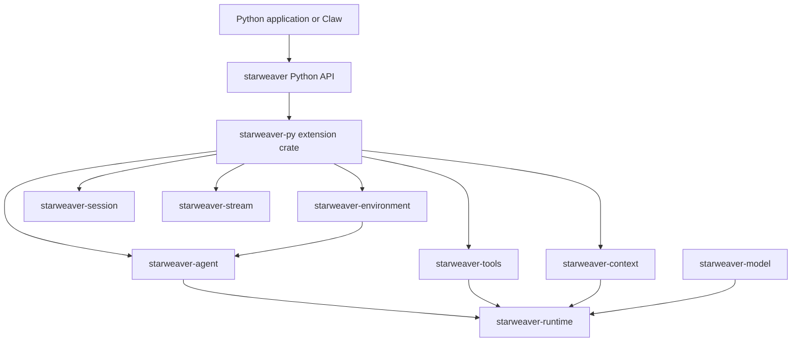

# Starweaver Python SDK

This folder owns the planning specs for `starweaver-py`, the in-process Python
SDK and binding layer for Starweaver.

The Python SDK should let Python applications build Starweaver agents, inject
Python tools and toolsets, stream runs, persist state, and compose subagents
without going through the `sw` binary, `starweaver-rpc`, JSON-RPC host control,
or MCP.

The target product shape is a Python library that feels close to
`ya-agent-sdk` for application authors while preserving Starweaver-native
runtime, tool, context, model, environment, usage, and stream contracts
underneath.

## Spec Index

| Spec                              | Scope                                                                                                  |
| --------------------------------- | ------------------------------------------------------------------------------------------------------ |
| `01-product-boundary.md`          | Product goals, non-goals, package layout, binding ownership, and FFI/lint boundary                     |
| `02-concept-mapping.md`           | Mapping from Python SDK concepts to existing Starweaver Rust seams                                     |
| `03-python-tool-injection.md`     | In-process Python tools, schema extraction, result conversion, error mapping, async/GIL strategy       |
| `04-runtime-session-streaming.md` | Agent construction, model support, sessions, state, HITL, streaming, output, and errors                |
| `05-ecosystem-and-claw.md`        | Toolsets, subagents, skills, environments, resources, message bus, observability, and Claw integration |
| `06-roadmap-and-validation.md`    | Implementation phases, acceptance gates, open decisions, and review checklist                          |

## Ownership Shape

## Review Order

1. Review `01-product-boundary.md` to confirm that the Python SDK is a binding
   and ergonomics layer, not a new runtime or a host-control transport.
2. Review `02-concept-mapping.md` to confirm the concept set that should be
   exposed to Python.
3. Review `03-python-tool-injection.md` before implementation. This is the
   critical technical risk because it bridges Python callables, PyO3, Tokio,
   Starweaver tools, cancellation, and HITL control flow.
4. Review `04-runtime-session-streaming.md` for API shape and runtime behavior.
5. Review `05-ecosystem-and-claw.md` for the Claw integration path and future
   SDK breadth.
6. Review `06-roadmap-and-validation.md` before creating the binding crate.

## Cross-Cutting Invariants

- Python agent execution is in process with the Rust runtime.
- Python tool injection uses the Starweaver `Tool` trait, not MCP.
- The Python SDK does not shell out to `sw`, `starweaver-cli`, or
  `starweaver-rpc` for the P0 agent/tool/session path.
- Core Starweaver crates stay Python-free.
- Python ergonomics can differ from Rust ergonomics, but Rust-owned contracts
  remain Starweaver-native.
- Claw-specific product policy lives above `starweaver-py`.
- Public user docs should wait until the reviewed API shape is stable enough
  for application developers.
