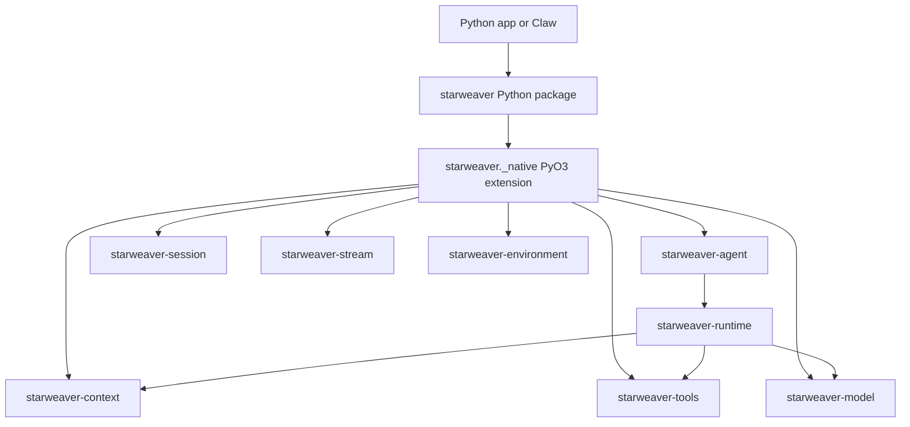

# Starweaver Python SDK Specs

This folder owns the product and architecture contract for `starweaver-py`, the
in-process Python SDK for Starweaver.

The package already exists under `packages/starweaver-py`. These specs are not
a greenfield proposal. They describe the intended Python product shape, the
Rust contracts it must preserve, the current baseline, and the next layer that
should make the Python SDK valuable beyond a thin binding.

## Product Thesis

Python applications should be able to use Starweaver as a native Python library:
define tools, compose agents, stream runs, resume HITL, export state, and steer
live work without starting `sw`, speaking JSON-RPC, or wrapping an MCP server.

The Python layer is valuable when it exposes Starweaver's advanced primitives in
normal Python forms:

```python
async with create_agent(model=model, tools=[deploy]) as agent:
    async with agent.session() as session:
        async with session.run_stream("Deploy api") as run:
            await run.steer("Use the safe rollout path.")

            async for event in run:
                if event.kind == "suspended":
                    waiting = await run.hitl().snapshot()
                    decisions = [item.approve(decided_by="ui") for item in waiting.approvals]
                    await run.hitl().resume_collected(approvals=decisions)

            result = await run.result()
```

The Rust runtime still owns model requests, tool scheduling, retries, stream
records, message bus semantics, session state, usage, and durable evidence.
Python owns ergonomic names, decorators, context managers, dataclasses, Pydantic
helpers, callback dispatch, and application-facing composition.

## Document Map

| Spec                              | Purpose                                                                                                              |
| --------------------------------- | -------------------------------------------------------------------------------------------------------------------- |
| `01-product-boundary.md`          | Product boundary, package ownership, dependency rules, and release shape                                             |
| `02-concept-mapping.md`           | Public Python API contract and mapping to Rust seams                                                                 |
| `03-python-tool-injection.md`     | Python tool adapters, schema/result conversion, callback runtime, and cancellation                                   |
| `04-runtime-session-streaming.md` | Agents, sessions, streams, state restore, HITL, output, and error semantics                                          |
| `05-ecosystem-and-claw.md`        | Composition layer, subagents, environments, resources, observability, and Claw path                                  |
| `06-roadmap-and-validation.md`    | Current baseline, milestones, acceptance gates, open decisions, and validation                                       |
| `07-pythonic-control-plane.md`    | Active-run steering, interruption, message bus, typed HITL, and required Rust seam                                   |
| `08-session-store-and-state.md`   | Durable Python session-store contract, state boundaries, record wrappers, and restore                                |
| `09-advanced-composition.md`      | Runtime config, toolsets, tool search/proxy, skills, environments, resources, media, providers, and product adapters |
| `10-claw-python-runtime-plan.md`  | Claw-like Python product runtime plan, Rust-to-Python binding gaps, storage/API/workspace execution mapping          |
| `11-python-native-toolsets.md`    | Python `AbstractToolset` contract, dynamic toolset bridge, builders, Rust-backed wrappers, lifecycle, durability     |

## Ownership Shape



## Current Baseline

The package currently provides:

- `create_agent`, `Agent`, `AgentSession`, live `AgentRun`, and `AgentStream`
  as a compatibility alias
- deterministic `TestModel` and callback-backed `FunctionModel`
- provider model helpers through Starweaver Rust provider adapters
- Python `@tool`, `BaseTool`, `ToolContext`, and `ToolResult`
- sync and async Python tool execution in the Starweaver tool loop
- Pydantic and type-hint schema extraction
- default parallel tool scheduling with explicit `sequential=True`
- private traceback metadata for Python tool failures
- output schemas, output validators, and output functions
- capability bundles and SDK subagent registration
- stream records with raw JSON preservation
- stream interruption and cancellation propagation into Python tools
- session state export/restore
- raw HITL approval/deferred resume helpers
- typed HITL approval/deferred helpers
- Python message bus facade for idle session messages and active-run writes
- active steering through a neutral Rust control handle and drain capability

The main remaining layers are the advanced application facades now specified in
root-level Python SDK specs: session-store records, toolsets, environment and
resource wrappers, skill helpers, stream adapters, media/provider helpers,
usage/trace helpers, and product adapter seams. Claw-specific workflow,
schedule, memory, UI, database, and Docker-retention policy remain above
`starweaver-py`.

## Cross-Cutting Invariants

- The Python SDK runs in process with the Rust runtime.
- The Python tool path uses the Starweaver `Tool` trait, not MCP.
- The core library path does not shell out to `sw`, `starweaver-cli`, or
  `starweaver-rpc`.
- Core Starweaver crates stay Python-free.
- Python convenience must map to Starweaver-owned contracts.
- Raw state, raw stream records, and raw result payloads remain available.
- Provider affinity and provider-specific headers stay in typed model/provider
  settings, not generic Python metadata.
- Message bus APIs must preserve MQ-like coordination semantics.
- Live steering must enter the active run through a Rust control queue, not by
  mutating a stale context snapshot.
- Durable persistence uses JSON-compatible Starweaver records and full
  `ResumableState`; Python callables, process-local dependencies, live
  environment handles, and provider connections are re-registered by the current
  process.
- `allowed_paths` is a capability boundary. `instructions_paths` is a
  model-context/file-tree boundary. Python environment helpers must not collapse
  them.
- Claw-specific product policy lives above `starweaver-py`.

## Review Order

01. Read `01-product-boundary.md` to confirm the product boundary.
02. Read `02-concept-mapping.md` to review the public Python API contract.
03. Read `03-python-tool-injection.md` before changing callback, schema, GIL,
    cancellation, or exception behavior.
04. Read `04-runtime-session-streaming.md` before changing sessions, streams,
    state, output, or HITL.
05. Read `07-pythonic-control-plane.md` before adding steering, interruption,
    active message-bus writes, or typed live HITL helpers.
06. Read `05-ecosystem-and-claw.md` before adding toolsets, environments,
    resource providers, skills, observability, or Claw integration.
07. Read `08-session-store-and-state.md` before changing durable state,
    archive/store APIs, record wrappers, or restore behavior.
08. Read `09-advanced-composition.md` before designing runtime config,
    toolsets, tool library/search/proxy, skill helpers, environment/resource
    facades, media adapters, provider/OAuth helpers, stream adapters, or product
    runtime adapters.
09. Read `10-claw-python-runtime-plan.md` before implementing a Claw-like Python
    service, API, durable run coordinator, workspace binding, product toolsets,
    or product database integration on top of `starweaver-py`.
10. Read `11-python-native-toolsets.md` before changing Python `Toolset`,
    adding `AbstractToolset`, `PythonDynamicToolset`, `FunctionToolset`,
    exposing Rust toolset wrappers, or designing context-aware dynamic toolset
    callbacks.
11. Read `06-roadmap-and-validation.md` before claiming a milestone is complete.
